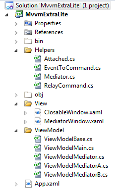

# VERY Easy MVVM "MVVMExtraLite" (MVVMXL) - Free and tiny source code
## Requires
- Visual Studio 2010
## License
- Apache License, Version 2.0
## Technologies
- WPF
- XAML
## Topics
- ViewModel pattern (MVVM)
- MVVM
- Messaging
- Message Routing
- WPF Commanding
- Model View ViewModel
- Model Binding
- Attached Properties
- AttachedProperties
- Relay Commands
- Mediator
- The Mediator Pattern
- Command Pattern
- EventToCommand
- RoutedEvent
- WPF Toolkit
- MVVM Toolkit
## Updated
- 09/19/2012
## Description

<h1>Introduction</h1>

This sample project contains all you need to develop MVVM applications. RelayCommand, Mediator, EventToCommand and an example of an AttachedProperty (CloseWindow from ViewModel).

Make the code your own and throw away&nbsp;those 3rd party DLLs :D

&nbsp;

<h1>Building the Sample</h1>

Just download, unzip, open and run! (please don't forget to rate this sample, thanks!)

&nbsp;

<h1>Description</h1>

As an experienced MVVM developer, I offer you this collection of classes, which cover almost all you need, to develop MVVM style applications. This project includes&nbsp;easy MVVM examples to show how it's done.

&nbsp;

<strong>This project offers four of the most common solutions to MVVM development issues.
</strong>

Just take what you need ;)

&nbsp;

<h2><strong>1. Attached Property&nbsp;&#43; ViewModelBase = CloseWindow from ViewModel</strong></h2>

One of the first question a developer asks when detaching from the code-behind is &quot;How do&nbsp;I invoke UI methods like Window.Close()&quot;

The answer is Attached Properties. This project includes an example Attached Property that invokes the Window's Close method, if the property changes. This acts like a trigger to close the window. It is bound to a property in the ViewModelBase, where we
 also have a method called CloseWindow that we can call from any ViewModel that inherits the ViewModelBase.

&nbsp;

<h2><strong>2. RelayCommand</strong></h2>

The RelayCommand is the simplest way to add commands to your ViewModels. It also has a CommandParameter and CanExecute delegate. This is simply copied from MSDN, but an essential class to have.

&nbsp;

The example shows using it to close the window in the previous example. The CanExecute is controlled by the IsChecked state of a CheckBox.

&nbsp;

<h2><strong>3. Mediator</strong></h2>

An essential class which helps shuttle messages around to any corner of your application.

In this example, it sends messages between two ViewModels.

&nbsp;

<h2><strong>4. EventToCommand</strong></h2>

Another missing link in MVVM is executing Commands from RoutedEvents.&nbsp;

Some 3rd party&nbsp;DLL options are <a class="libraryLink" href="http://msdn.microsoft.com/en-US/library/System.Windows.Interactivity.aspx" target="_blank" title="Auto generated link to System.Windows.Interactivity">System.Windows.Interactivity</a> (Expression Blend) or MVVMLite.

If you prefer to keep your application light, here is a simple solution to add your own EventToCommands.

This method simply uses three Attached Properties.

XAML

Edit|Remove

xaml

<pre class="js">&lt;TextBlock&nbsp;Text=&quot;Click&nbsp;me,&nbsp;EventToCommand,&nbsp;pass&nbsp;param&quot;&nbsp;FontSize=&quot;16&quot;&nbsp;FontWeight=&quot;Bold&quot;&nbsp;TextWrapping=&quot;Wrap&quot;&nbsp;Width=&quot;150&quot;&nbsp;
&nbsp;&nbsp;&nbsp;&nbsp;&nbsp;&nbsp;&nbsp;&nbsp;&nbsp;&nbsp;&nbsp;&nbsp;HorizontalAlignment=&quot;Center&quot;&nbsp;VerticalAlignment=&quot;Center&quot;&nbsp;Cursor=&quot;Hand&quot;&nbsp;Background=&quot;AliceBlue&quot;&nbsp;
&nbsp;&nbsp;&nbsp;&nbsp;&nbsp;&nbsp;&nbsp;&nbsp;<strong>helper:EventToCommand.Event=&quot;UIElement.MouseLeftButtonDown&quot;&nbsp;
&nbsp;&nbsp;&nbsp;&nbsp;&nbsp;&nbsp;&nbsp;&nbsp;helper:EventToCommand.CommandParameter=&quot;{Binding&nbsp;Text,&nbsp;ElementName=textboxB}&quot;&nbsp;
&nbsp;&nbsp;&nbsp;&nbsp;&nbsp;&nbsp;&nbsp;&nbsp;helper:EventToCommand.Command=&quot;{Binding&nbsp;EventedCommand1}&quot;&nbsp;/&gt;</strong></pre>

Event is the RoutedEvent to trigger on

Command is the ICommand to execute

CommandParameter is optional. If not included, the EventArgs will be passed.

<h2 class="endscriptcode"><strong>Solution Map</strong></h2>

&nbsp;

&nbsp;

&nbsp;

<strong>Please help yourself to these essential MVVM tools.
</strong>

<strong>I hope they give you as much help as they give me.</strong>

&nbsp;

&nbsp;

