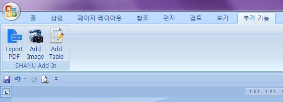
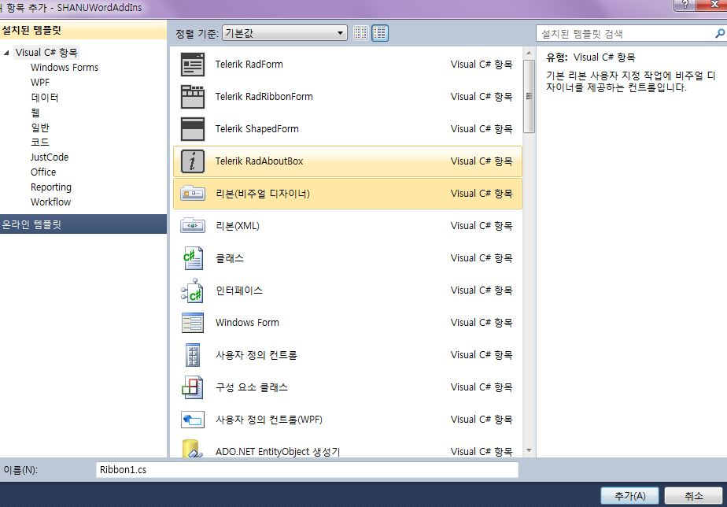
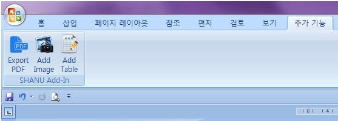

# VSTO Excel and Word Add-In C#
## Requires
- Visual Studio 2010
## License
- MIT
## Technologies
- C#
- VSTO
- Windows Forms
## Topics
- C#
- VSTO
- Windows Forms
- VSTO Application
## Updated
- 08/17/2015
## Description

<h1>Introduction</h1>

<em></em>

<em>The main purpose
 of this article is to explain how to create simple Excel and Microsoft Word Add-Ins using<strong style="outline:0px; color:#333333; text-transform:none; line-height:21px; text-indent:0px; letter-spacing:normal; font-family:Roboto,sans-serif; font-size:14px; font-style:normal; font-variant:normal; word-spacing:0px; white-space:normal; widows:1; background-color:#ffffff">Visual
 Studio Tools for Office</strong>&nbsp;(VSTO).
 VSTO is available as an add-in tool with Microsoft Visual Studio. Using Visual Studio we can develop our own custom controls for Office tools like Excel, Word and and so on. 
 
In my demo program I have
 used Visual Studio 2010 and Office 2007.</em>

<em></em>&nbsp;

<h1>Building the Sample</h1>

<em>This article
 explains a few basic things to create our own Custom Add-Ins for Excel and Word as follows.</em>

<strong style="outline:0px">1. Excel Add-Ins</strong>

<ul style="font:14px/21px Roboto,sans-serif; outline:0px; color:#333333; text-transform:none; text-indent:0px; letter-spacing:normal; word-spacing:0px; white-space:normal; widows:1; background-color:#ffffff">
<li style="outline:0px">Add text to any Excel selected active Excel cell. </li><li style="outline:0px">Add an image to Excel from our Custom Control. </li><li style="outline:0px">Load data from a database and display the search result data in Excel.
</li></ul>

<strong style="outline:0px">2. Word Add-Ins</strong>

<ul style="font:14px/21px Roboto,sans-serif; outline:0px; color:#333333; text-transform:none; text-indent:0px; letter-spacing:normal; word-spacing:0px; white-space:normal; widows:1; background-color:#ffffff">
<li style="outline:0px">Export Word to PDF. </li><li style="outline:0px">Add Image to Word Document. </li><li style="outline:0px">Add Table to Word document. </li></ul>

Description

<strong style="outline:0px">Creating Excel Add-Ins 
</strong> 
In my example I have used Visual Studio 2010 and Office 2007. 
 
To create our own Custom Control Add-Ins for Excel. 
 
<strong style="outline:0px">Step 1</strong>

Create a new project and select Office 2007 Excel AddIn as in the following Image. Select your Project Folder and enter your Project Name.

<strong style="outline:0px">Step 2</strong>

Now we can see that the Excel&nbsp;<strong style="outline:0px">ThisAddIn.Cs</strong>&nbsp;file has been created in our project folder and we can find two default methods
 in this class as in the following image. &ldquo;<strong style="outline:0px">ThisAddIn_Startup</strong>&rdquo; In this event we can display our own custom Control Add-Ins to Excel. We can see the details in the code part.

&nbsp;

<strong style="outline:0px">Step 3</strong>

Add a new UserControl to your project to create your own Custom Excel Control Add-In. 
 
Right-click your project-&gt;Click Add New Item-&gt;Add User Control and Name the control as you wish. Add all your Controls and design your user control depending on your requirement.

In my example, I am performing 3 types of actions in User Controls.

<ol style="font:14px/21px Roboto,sans-serif; outline:0px; color:#333333; text-transform:none; text-indent:0px; letter-spacing:normal; word-spacing:0px; white-space:normal; widows:1; background-color:#ffffff">
<li style="outline:0px"><strong style="outline:0px">Add Text:</strong>&nbsp;In this button click event I will insert the text from the Text box to the Active Selected Excel Cell. Using &ldquo;<strong style="outline:0px">Globals.ThisAddIn.Application.ActiveCell</strong>&rdquo;
 we can get the current active Excel cell. We store the result in an Excel range and now using the range, value&nbsp;and color we can set our own text and colors to the active Excel Cell.
</li></ol>

C#

Edit|Remove

csharp

<pre class="csharp">private&nbsp;void&nbsp;btnAddText_Click(object&nbsp;sender,&nbsp;EventArgs&nbsp;e)&nbsp;&nbsp;&nbsp;
{&nbsp;&nbsp;&nbsp;
&nbsp;&nbsp;&nbsp;&nbsp;Excel.Range&nbsp;objRange&nbsp;=&nbsp;Globals.ThisAddIn.Application.ActiveCell;&nbsp;&nbsp;&nbsp;
&nbsp;&nbsp;&nbsp;&nbsp;objRange.Interior.Color&nbsp;=&nbsp;Color.Pink;&nbsp;//Active&nbsp;Cell&nbsp;back&nbsp;Color&nbsp;&nbsp;&nbsp;
&nbsp;&nbsp;&nbsp;&nbsp;objRange.Borders.Color&nbsp;=&nbsp;Color.Red;//&nbsp;Active&nbsp;Cell&nbsp;border&nbsp;Color&nbsp;&nbsp;&nbsp;
&nbsp;&nbsp;&nbsp;&nbsp;objRange.Borders.LineStyle&nbsp;=&nbsp;Excel.XlLineStyle.xlContinuous;&nbsp;&nbsp;&nbsp;
&nbsp;&nbsp;&nbsp;&nbsp;objRange.Value&nbsp;=&nbsp;txtActiveCellText.Text;&nbsp;//Active&nbsp;Cell&nbsp;Text&nbsp;Add&nbsp;&nbsp;&nbsp;
&nbsp;&nbsp;&nbsp;
&nbsp;&nbsp;&nbsp;&nbsp;objRange.Columns.AutoFit();&nbsp;&nbsp;&nbsp;&nbsp;
}&nbsp;&nbsp;</pre>

&nbsp;2. &nbsp;<strong style="outline:0px; text-align:left; color:#333333; text-transform:none; line-height:21px; text-indent:0px; letter-spacing:normal; font-family:Roboto,sans-serif; font-size:14px; font-style:normal; font-variant:normal; word-spacing:0px; white-space:normal; widows:1; background-color:#ffffff">Add
 Image:</strong>&nbsp;using
 the Open File Dialog we can select our own image that needs to be added to the Excel file. Using the Excel.Shape we can add our selected image to the Excel file.

C#

Edit|Remove

csharp

<pre class="csharp">private&nbsp;void&nbsp;btnAddImage_Click(object&nbsp;sender,&nbsp;EventArgs&nbsp;e)&nbsp;&nbsp;&nbsp;
&nbsp;&nbsp;&nbsp;&nbsp;&nbsp;&nbsp;&nbsp;&nbsp;{&nbsp;&nbsp;&nbsp;
&nbsp;&nbsp;&nbsp;&nbsp;&nbsp;&nbsp;&nbsp;&nbsp;&nbsp;&nbsp;&nbsp;&nbsp;OpenFileDialog&nbsp;dlg&nbsp;=&nbsp;new&nbsp;OpenFileDialog();&nbsp;&nbsp;&nbsp;
&nbsp;&nbsp;&nbsp;&nbsp;&nbsp;&nbsp;&nbsp;&nbsp;&nbsp;&nbsp;&nbsp;&nbsp;dlg.FileName&nbsp;=&nbsp;&quot;*&quot;;&nbsp;&nbsp;&nbsp;
&nbsp;&nbsp;&nbsp;&nbsp;&nbsp;&nbsp;&nbsp;&nbsp;&nbsp;&nbsp;&nbsp;&nbsp;dlg.DefaultExt&nbsp;=&nbsp;&quot;bmp&quot;;&nbsp;&nbsp;&nbsp;
&nbsp;&nbsp;&nbsp;&nbsp;&nbsp;&nbsp;&nbsp;&nbsp;&nbsp;&nbsp;&nbsp;&nbsp;dlg.ValidateNames&nbsp;=&nbsp;true;&nbsp;&nbsp;&nbsp;
&nbsp;&nbsp;&nbsp;
&nbsp;&nbsp;&nbsp;&nbsp;&nbsp;&nbsp;&nbsp;&nbsp;&nbsp;&nbsp;&nbsp;&nbsp;dlg.Filter&nbsp;=&nbsp;&quot;Bitmap&nbsp;Image&nbsp;(.bmp)|*.bmp|Gif&nbsp;Image&nbsp;(.gif)|*.gif|JPEG&nbsp;Image&nbsp;(.jpeg)|*.jpeg|Png&nbsp;Image&nbsp;(.png)|*.png&quot;;&nbsp;&nbsp;&nbsp;
&nbsp;&nbsp;&nbsp;&nbsp;&nbsp;&nbsp;&nbsp;&nbsp;&nbsp;&nbsp;&nbsp;&nbsp;if&nbsp;(dlg.ShowDialog()&nbsp;==&nbsp;System.Windows.Forms.DialogResult.OK)&nbsp;&nbsp;&nbsp;
&nbsp;&nbsp;&nbsp;&nbsp;&nbsp;&nbsp;&nbsp;&nbsp;&nbsp;&nbsp;&nbsp;&nbsp;{&nbsp;&nbsp;&nbsp;
&nbsp;&nbsp;&nbsp;
&nbsp;&nbsp;&nbsp;&nbsp;&nbsp;&nbsp;&nbsp;&nbsp;&nbsp;&nbsp;&nbsp;&nbsp;&nbsp;&nbsp;&nbsp;&nbsp;Bitmap&nbsp;dImg&nbsp;=&nbsp;new&nbsp;Bitmap(dlg.FileName);&nbsp;&nbsp;&nbsp;
&nbsp;&nbsp;&nbsp;&nbsp;&nbsp;&nbsp;&nbsp;&nbsp;&nbsp;&nbsp;&nbsp;&nbsp;&nbsp;&nbsp;&nbsp;&nbsp;&nbsp;&nbsp;Excel.Shape&nbsp;IamgeAdd&nbsp;=&nbsp;Globals.ThisAddIn.Application.ActiveSheet.Shapes.AddPicture(dlg.FileName,&nbsp;&nbsp;&nbsp;
&nbsp;&nbsp;&nbsp;&nbsp;&nbsp;&nbsp;Microsoft.Office.Core.MsoTriState.msoFalse,&nbsp;&nbsp;&nbsp;&nbsp;&nbsp;&nbsp;&nbsp;&nbsp;&nbsp;&nbsp;&nbsp;&nbsp;Microsoft.Office.Core.MsoTriState.msoCTrue,&nbsp;&nbsp;&nbsp;
&nbsp;&nbsp;&nbsp;&nbsp;&nbsp;&nbsp;&nbsp;&nbsp;&nbsp;&nbsp;20,&nbsp;30,&nbsp;dImg.Width,&nbsp;dImg.Height);&nbsp;&nbsp;&nbsp;
&nbsp;&nbsp;&nbsp;&nbsp;&nbsp;&nbsp;&nbsp;&nbsp;&nbsp;&nbsp;&nbsp;&nbsp;}&nbsp;&nbsp;&nbsp;
&nbsp;&nbsp;&nbsp;&nbsp;&nbsp;&nbsp;&nbsp;&nbsp;&nbsp;&nbsp;&nbsp;&nbsp;<a class="libraryLink" href="https://msdn.microsoft.com/en-US/library/System.Windows.Forms.Clipboard.Clear.aspx" target="_blank" title="Auto generated link to System.Windows.Forms.Clipboard.Clear">System.Windows.Forms.Clipboard.Clear</a>();&nbsp;&nbsp;&nbsp;
&nbsp;&nbsp;&nbsp;&nbsp;&nbsp;&nbsp;&nbsp;&nbsp;}&nbsp;&nbsp;&nbsp;&nbsp;&nbsp;&nbsp;&nbsp;&nbsp;&nbsp;</pre>

&nbsp;<strong style="outline:0px; text-align:left; color:#333333; text-transform:none; line-height:21px; text-indent:0px; letter-spacing:normal; font-family:Roboto,sans-serif; font-size:14px; font-style:normal; font-variant:normal; word-spacing:0px; white-space:normal; widows:1; background-color:#ffffff">Search
 and bind Db Data to Excel:&nbsp;</strong>Now
 we can create our own Custom Search control to be used in Excel to search our data from the database and bind the result to the Excel file. 
 
<strong style="outline:0px; text-align:left; color:#333333; text-transform:none; line-height:21px; text-indent:0px; letter-spacing:normal; font-family:Roboto,sans-serif; font-size:14px; font-style:normal; font-variant:normal; word-spacing:0px; white-space:normal; widows:1; background-color:#ffffff">Creating
 the table</strong>

SQL

Edit|Remove

mysql

<pre class="mysql">--&nbsp;Create&nbsp;Table&nbsp;ItemMaster&nbsp;in&nbsp;your&nbsp;SQL&nbsp;Server&nbsp;-&nbsp;This&nbsp;table&nbsp;will&nbsp;be&nbsp;used&nbsp;for&nbsp;search&nbsp;and&nbsp;bind&nbsp;result&nbsp;to&nbsp;excel.&nbsp;&nbsp;&nbsp;
&nbsp;&nbsp;&nbsp;
CREATE&nbsp;TABLE&nbsp;[dbo].[ItemMasters](&nbsp;&nbsp;&nbsp;
[Item_Code]&nbsp;[varchar](20)&nbsp;NOT&nbsp;NULL,&nbsp;&nbsp;&nbsp;
[Item_Name]&nbsp;[varchar](100)&nbsp;NOT&nbsp;NULL)&nbsp;&nbsp;&nbsp;
&nbsp;&nbsp;&nbsp;
--&nbsp;insert&nbsp;sample&nbsp;data&nbsp;to&nbsp;Item&nbsp;Master&nbsp;table&nbsp;&nbsp;&nbsp;
INSERT&nbsp;INTO&nbsp;[ItemMasters]&nbsp;([Item_Code],[Item_Name])&nbsp;&nbsp;&nbsp;
VALUES&nbsp;('Item001','Coke')&nbsp;&nbsp;&nbsp;
&nbsp;&nbsp;&nbsp;
INSERT&nbsp;INTO&nbsp;[ItemMasters]&nbsp;([Item_Code],[Item_Name])&nbsp;&nbsp;&nbsp;
VALUES&nbsp;('Item002','Coffee')&nbsp;&nbsp;&nbsp;
&nbsp;&nbsp;&nbsp;
INSERT&nbsp;INTO&nbsp;[ItemMasters]&nbsp;([Item_Code],[Item_Name])&nbsp;&nbsp;&nbsp;
VALUES&nbsp;('Item003','Chiken&nbsp;Burger')&nbsp;&nbsp;&nbsp;
&nbsp;&nbsp;&nbsp;
INSERT&nbsp;INTO&nbsp;[ItemMasters]&nbsp;([Item_Code],[Item_Name])&nbsp;&nbsp;&nbsp;
VALUES&nbsp;('Item004','Potato&nbsp;Fry')&nbsp;</pre>

&nbsp;In
 the button search click event we search for the data from the database and bind the result to an Excel cell using&nbsp;<strong style="outline:0px; text-align:left; color:#333333; text-transform:none; line-height:21px; text-indent:0px; letter-spacing:normal; font-family:Roboto,sans-serif; font-size:14px; font-style:normal; font-variant:normal; word-spacing:0px; white-space:normal; widows:1; background-color:#ffffff">&ldquo;Globals.ThisAddIn.Application.ActiveSheet.Cells</strong>&rdquo;.
 This will add the result to the active Excel sheet.

C#

Edit|Remove

csharp

<pre class="js">private&nbsp;void&nbsp;btnSearch_Click(object&nbsp;sender,&nbsp;EventArgs&nbsp;e)&nbsp;&nbsp;&nbsp;
{try{&nbsp;&nbsp;&nbsp;
&nbsp;&nbsp;&nbsp;&nbsp;&nbsp;&nbsp;&nbsp;&nbsp;System.Data.DataTable&nbsp;dt&nbsp;=&nbsp;new&nbsp;<a class="libraryLink" href="https://msdn.microsoft.com/en-US/library/System.Data.DataTable.aspx" target="_blank" title="Auto generated link to System.Data.DataTable">System.Data.DataTable</a>();&nbsp;&nbsp;&nbsp;
&nbsp;&nbsp;&nbsp;
&nbsp;&nbsp;&nbsp;&nbsp;&nbsp;&nbsp;&nbsp;&nbsp;String&nbsp;ConnectionString&nbsp;=&nbsp;&quot;Data&nbsp;Source=YOURDATASOURCE;Initial&nbsp;Catalog=YOURDATABASENAME;User&nbsp;id&nbsp;=&nbsp;UID;password=password&quot;;&nbsp;&nbsp;&nbsp;
&nbsp;&nbsp;&nbsp;&nbsp;&nbsp;&nbsp;&nbsp;&nbsp;SqlConnection&nbsp;con&nbsp;=&nbsp;new&nbsp;SqlConnection(ConnectionString);&nbsp;&nbsp;&nbsp;
&nbsp;&nbsp;&nbsp;&nbsp;&nbsp;&nbsp;&nbsp;&nbsp;String&nbsp;Query&nbsp;=&nbsp;&quot;&nbsp;Select&nbsp;Item_Code,Item_Name&nbsp;FROM&nbsp;ItemMasters&nbsp;Where&nbsp;Item_Name&nbsp;LIKE&nbsp;'&quot;&nbsp;&#43;&nbsp;txtItemName.Text.Trim()&nbsp;&#43;&nbsp;&quot;%'&quot;;&nbsp;&nbsp;&nbsp;
&nbsp;&nbsp;&nbsp;&nbsp;&nbsp;&nbsp;&nbsp;&nbsp;SqlCommand&nbsp;cmd&nbsp;=&nbsp;new&nbsp;SqlCommand(Query,&nbsp;con);&nbsp;&nbsp;&nbsp;
&nbsp;&nbsp;&nbsp;&nbsp;&nbsp;&nbsp;&nbsp;&nbsp;cmd.CommandType&nbsp;=&nbsp;System.Data.CommandType.Text;&nbsp;&nbsp;&nbsp;
&nbsp;&nbsp;&nbsp;&nbsp;&nbsp;&nbsp;&nbsp;&nbsp;System.Data.SqlClient.SqlDataAdapter&nbsp;sda&nbsp;=&nbsp;new&nbsp;<a class="libraryLink" href="https://msdn.microsoft.com/en-US/library/System.Data.SqlClient.SqlDataAdapter.aspx" target="_blank" title="Auto generated link to System.Data.SqlClient.SqlDataAdapter">System.Data.SqlClient.SqlDataAdapter</a>(cmd);&nbsp;&nbsp;&nbsp;
&nbsp;&nbsp;&nbsp;&nbsp;&nbsp;&nbsp;&nbsp;&nbsp;sda.Fill(dt);&nbsp;&nbsp;&nbsp;
&nbsp;&nbsp;&nbsp;
&nbsp;&nbsp;&nbsp;&nbsp;&nbsp;&nbsp;&nbsp;&nbsp;if&nbsp;(dt.Rows.Count&nbsp;&lt;=&nbsp;0)&nbsp;&nbsp;&nbsp;
&nbsp;&nbsp;&nbsp;&nbsp;&nbsp;&nbsp;&nbsp;&nbsp;{return;&nbsp;&nbsp;&nbsp;
&nbsp;&nbsp;&nbsp;&nbsp;&nbsp;&nbsp;&nbsp;&nbsp;}&nbsp;&nbsp;&nbsp;
&nbsp;&nbsp;&nbsp;
&nbsp;&nbsp;&nbsp;&nbsp;&nbsp;&nbsp;&nbsp;&nbsp;Globals.ThisAddIn.Application.ActiveSheet.Cells.ClearContents();&nbsp;&nbsp;&nbsp;
&nbsp;&nbsp;&nbsp;
&nbsp;&nbsp;&nbsp;&nbsp;&nbsp;&nbsp;&nbsp;&nbsp;Globals.ThisAddIn.Application.ActiveSheet.Cells[1,&nbsp;1].Value2&nbsp;=&nbsp;&quot;Item&nbsp;Code&quot;;&nbsp;&nbsp;&nbsp;
&nbsp;&nbsp;&nbsp;
&nbsp;&nbsp;&nbsp;&nbsp;&nbsp;&nbsp;&nbsp;&nbsp;Globals.ThisAddIn.Application.ActiveSheet.Cells[1,&nbsp;2].Value2&nbsp;=&nbsp;&quot;Item&nbsp;Name&quot;;&nbsp;&nbsp;&nbsp;
&nbsp;&nbsp;&nbsp;
&nbsp;&nbsp;&nbsp;&nbsp;&nbsp;&nbsp;&nbsp;&nbsp;for&nbsp;(int&nbsp;i&nbsp;=&nbsp;0;&nbsp;i&nbsp;&lt;=&nbsp;dt.Rows.Count&nbsp;-&nbsp;1;&nbsp;i&#43;&#43;)&nbsp;&nbsp;&nbsp;
&nbsp;&nbsp;&nbsp;&nbsp;&nbsp;&nbsp;&nbsp;&nbsp;{&nbsp;&nbsp;&nbsp;
&nbsp;&nbsp;&nbsp;
&nbsp;&nbsp;&nbsp;&nbsp;&nbsp;&nbsp;&nbsp;&nbsp;&nbsp;&nbsp;&nbsp;&nbsp;Globals.ThisAddIn.Application.ActiveSheet.Cells[i&nbsp;&#43;&nbsp;2,&nbsp;1].Value2&nbsp;=&nbsp;dt.Rows[i][0].ToString();&nbsp;&nbsp;&nbsp;
&nbsp;&nbsp;&nbsp;
&nbsp;&nbsp;&nbsp;
&nbsp;&nbsp;&nbsp;&nbsp;&nbsp;&nbsp;&nbsp;&nbsp;&nbsp;&nbsp;&nbsp;&nbsp;Globals.ThisAddIn.Application.ActiveSheet.Cells[i&nbsp;&#43;&nbsp;2,&nbsp;2].Value2&nbsp;=&nbsp;dt.Rows[i][1].ToString();&nbsp;&nbsp;&nbsp;
&nbsp;&nbsp;&nbsp;&nbsp;&nbsp;&nbsp;&nbsp;&nbsp;}}catch&nbsp;(Exception&nbsp;ex)&nbsp;&nbsp;&nbsp;
&nbsp;&nbsp;&nbsp;&nbsp;{}}</pre>

<strong style="outline:0px">Step 4</strong>

Now we have created our own User Control to be added to our Excel Add-Ins. To add this user control to our Excel Add-In as we have already seen that the Excel Addin class &ldquo;<strong style="outline:0px">ThisAddIn.Cs</strong>&rdquo; has start and stop events.
 Using the Office &ldquo;<strong style="outline:0px">CustomTaskpane</strong>&rdquo; we can add our usercontrol to Excel as an Add-In as in the following.

C#

Edit|Remove

csharp

<pre class="js">private&nbsp;Microsoft.Office.Tools.CustomTaskPane&nbsp;customPane;&nbsp;&nbsp;&nbsp;
&nbsp;&nbsp;&nbsp;
private&nbsp;void&nbsp;ThisAddIn_Startup(object&nbsp;sender,&nbsp;System.EventArgs&nbsp;e)&nbsp;&nbsp;&nbsp;
{&nbsp;&nbsp;&nbsp;
&nbsp;&nbsp;&nbsp;&nbsp;ShowShanuControl();&nbsp;&nbsp;&nbsp;
}&nbsp;&nbsp;&nbsp;
public&nbsp;void&nbsp;ShowShanuControl()&nbsp;&nbsp;&nbsp;
{var&nbsp;txtObject&nbsp;=&nbsp;new&nbsp;ShanuExcelADDIn();&nbsp;&nbsp;&nbsp;
&nbsp;&nbsp;&nbsp;&nbsp;customPane&nbsp;=&nbsp;this.CustomTaskPanes.Add(txtObject,&nbsp;&quot;Enter&nbsp;Text&quot;);&nbsp;&nbsp;&nbsp;
&nbsp;&nbsp;&nbsp;&nbsp;customPane.Width&nbsp;=&nbsp;txtObject.Width;&nbsp;&nbsp;&nbsp;
&nbsp;&nbsp;&nbsp;&nbsp;customPane.Visible&nbsp;=&nbsp;true;&nbsp;&nbsp;&nbsp;
}</pre>

<strong style="outline:0px">Step 5</strong>

Run your program and now we can see our user control has been added in the Excel File as an Add-In. 
 
Next we will see how to create Add-Ins for Word Documents using a Ribbon Control. 
 
<strong style="outline:0px">Creating Word Add-Ins:&nbsp; 
</strong> 
In my example I have used Visual Studio 2010 and Office 2007. 
 
The following describes how to create our own Custom Control Add-Ins for Word. 
 
<strong style="outline:0px">Step 1</strong>

Create a new project and select Office 2007 Word AddIn as in the following Image. Select your Project Folder and enter your Project Name.

<strong style="outline:0px">Step 2</strong>

Add a new Ribbon Control to your project to create your own Word Control Add-In. 
 
Right-click your project then click Add New Item -&gt; Add Ribbon Control and name the control as you wish.&nbsp;

Add all your controls
 and design your user control depending on your requirements. By default in our Ribbon Control we can see a &ldquo;<strong style="outline:0px; color:#333333; text-transform:none; line-height:21px; text-indent:0px; letter-spacing:normal; font-family:Roboto,sans-serif; font-size:14px; font-style:normal; font-variant:normal; word-spacing:0px; white-space:normal; widows:1; background-color:#ffffff">RibbonGroup</strong>&rdquo;.
 We can add all our controls to the Ribbon Group. Here in my example I have changed the Group Label Text to &ldquo;SHANU Add-In&rdquo;. I have added three Ribbon Button Controls to the group. We can add an image to the Ribbon Button Controls and set the properties
 of the Button Control Size as &ldquo;<strong style="outline:0px; color:#333333; text-transform:none; line-height:21px; text-indent:0px; letter-spacing:normal; font-family:Roboto,sans-serif; font-size:14px; font-style:normal; font-variant:normal; word-spacing:0px; white-space:normal; widows:1; background-color:#ffffff">RibbobControlSizeLarge</strong>&rdquo;.&nbsp;

Here I have added three Button Controls for export the Word as a PDF, add an image to Word and add a table to the Word file. 
 
<strong style="outline:0px">Step 3</strong>

Export to PDF File Button Click. 
 
Using the &ldquo;<strong style="outline:0px">Globals.ThisAddIn.Application.ActiveDocument.ExportAsFixedFormat</strong>&rdquo; we can save the Word document to the PDF file. I have used the Save file dialog to save the PDF file into our selected path.

C#

Edit|Remove

csharp

<pre class="js">private&nbsp;void&nbsp;btnPDF_Click(object&nbsp;sender,&nbsp;RibbonControlEventArgs&nbsp;e)&nbsp;&nbsp;&nbsp;
{&nbsp;&nbsp;&nbsp;
&nbsp;&nbsp;&nbsp;&nbsp;SaveFileDialog&nbsp;dlg&nbsp;=&nbsp;new&nbsp;SaveFileDialog();&nbsp;&nbsp;&nbsp;
&nbsp;&nbsp;&nbsp;&nbsp;dlg.FileName&nbsp;=&nbsp;&quot;*&quot;;&nbsp;&nbsp;&nbsp;
&nbsp;&nbsp;&nbsp;&nbsp;dlg.DefaultExt&nbsp;=&nbsp;&quot;pdf&quot;;&nbsp;&nbsp;&nbsp;
&nbsp;&nbsp;&nbsp;&nbsp;dlg.ValidateNames&nbsp;=&nbsp;true;&nbsp;&nbsp;&nbsp;
&nbsp;&nbsp;&nbsp;&nbsp;if&nbsp;(dlg.ShowDialog()&nbsp;==&nbsp;System.Windows.Forms.DialogResult.OK)&nbsp;&nbsp;&nbsp;
&nbsp;&nbsp;&nbsp;&nbsp;{&nbsp;&nbsp;&nbsp;
&nbsp;&nbsp;&nbsp;&nbsp;&nbsp;&nbsp;&nbsp;&nbsp;Globals.ThisAddIn.Application.ActiveDocument.ExportAsFixedFormat(dlg.FileName,&nbsp;word.WdExportFormat.wdExportFormatPDF,&nbsp;OpenAfterExport:&nbsp;true);&nbsp;&nbsp;&nbsp;
&nbsp;&nbsp;&nbsp;&nbsp;}}</pre>

<strong style="outline:0px">Step 4</strong>

Here we will add an image to Word. Using the Open File Dialog we can select our own image to be added to the Word file. Using the &ldquo;<strong style="outline:0px">Globals.ThisAddIn.Application.ActiveDocument.Shapes.AddPicture</strong>&rdquo; method we can
 add our selected image to the Word file.

C#

Edit|Remove

csharp

<pre class="js">private&nbsp;void&nbsp;btnImage_Click(object&nbsp;sender,&nbsp;RibbonControlEventArgs&nbsp;e)&nbsp;&nbsp;&nbsp;
{&nbsp;&nbsp;&nbsp;
&nbsp;&nbsp;&nbsp;&nbsp;OpenFileDialog&nbsp;dlg&nbsp;=&nbsp;new&nbsp;OpenFileDialog();&nbsp;&nbsp;&nbsp;
&nbsp;&nbsp;&nbsp;&nbsp;dlg.FileName&nbsp;=&nbsp;&quot;*&quot;;&nbsp;&nbsp;&nbsp;
&nbsp;&nbsp;&nbsp;&nbsp;dlg.DefaultExt&nbsp;=&nbsp;&quot;bmp&quot;;&nbsp;&nbsp;&nbsp;
&nbsp;&nbsp;&nbsp;&nbsp;dlg.ValidateNames&nbsp;=&nbsp;true;&nbsp;&nbsp;&nbsp;
&nbsp;&nbsp;&nbsp;
&nbsp;&nbsp;&nbsp;&nbsp;dlg.Filter&nbsp;=&nbsp;&quot;Bitmap&nbsp;Image&nbsp;(.bmp)|*.bmp|Gif&nbsp;Image&nbsp;(.gif)|*.gif|JPEG&nbsp;Image&nbsp;(.jpeg)|*.jpeg|Png&nbsp;Image&nbsp;(.png)|*.png&quot;;&nbsp;&nbsp;&nbsp;
&nbsp;&nbsp;&nbsp;&nbsp;if&nbsp;(dlg.ShowDialog()&nbsp;==&nbsp;System.Windows.Forms.DialogResult.OK)&nbsp;&nbsp;&nbsp;
&nbsp;&nbsp;&nbsp;&nbsp;{&nbsp;&nbsp;&nbsp;
&nbsp;&nbsp;&nbsp;&nbsp;&nbsp;&nbsp;&nbsp;&nbsp;Globals.ThisAddIn.Application.ActiveDocument.Shapes.AddPicture(dlg.FileName);&nbsp;&nbsp;&nbsp;
&nbsp;&nbsp;&nbsp;&nbsp;}}</pre>

<strong style="outline:0px">Step 5</strong>

Here we will add a table to Word. Using the &ldquo;<strong style="outline:0px">Globals.ThisAddIn.Application.ActiveDocument.Tables</strong>&rdquo; method we can add a table to the Word file. In my example I have created a table with 4 columns and 3 rows.

C#

Edit|Remove

csharp

<pre class="js">private&nbsp;void&nbsp;button1_Click(object&nbsp;sender,&nbsp;RibbonControlEventArgs&nbsp;e)&nbsp;&nbsp;&nbsp;
{&nbsp;&nbsp;&nbsp;
&nbsp;&nbsp;&nbsp;&nbsp;Globals.ThisAddIn.Application.ActiveDocument.Tables.Add(Globals.ThisAddIn.Application.ActiveDocument.Range(0,&nbsp;0),&nbsp;3,&nbsp;4);&nbsp;&nbsp;&nbsp;
.ThisAddIn.Application.ActiveDocument.Tables[1].Range.Shading.BackgroundPatternColor&nbsp;=&nbsp;Microsoft.Office.Interop.Word.WdColor.wdColorSeaGreen;&nbsp;&nbsp;&nbsp;
&nbsp;&nbsp;&nbsp;&nbsp;Globals.ThisAddIn.Application.ActiveDocument.Tables[1].Range.Font.Size&nbsp;=&nbsp;12;&nbsp;&nbsp;&nbsp;
&nbsp;&nbsp;&nbsp;
&nbsp;&nbsp;&nbsp;&nbsp;Globals.ThisAddIn.Application.ActiveDocument.Tables[1].Rows.Borders.Enable&nbsp;=&nbsp;1;&nbsp;&nbsp;&nbsp;
}</pre>

<strong style="outline:0px">Step 6</strong>

Run your program and now you will see your own Ribbon Control has been added to the Word file as an Add-In.

&nbsp;

<h1>Source Code Files</h1>
<ul>
<li>ShanuWordAddIns.zip<em><em></em></em> </li></ul>
<h1>More Information</h1>

<em>The Zip folder contains both Word and Excel Example.</em>

