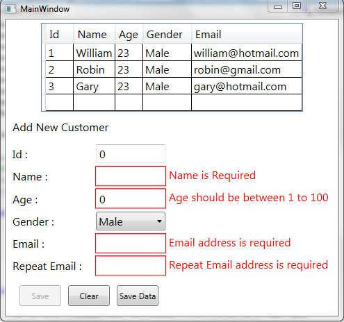

# Validation in MVVM using Data Annotations
## Requires
- Visual Studio 2012
## License
- Apache License, Version 2.0
## Technologies
- C#
- WPF
- XAML
## Topics
- Data Binding
- User Interface
- Data Access
- XAML
- MVVM
## Updated
- 02/02/2014
## Description

<strong>Introduction</strong> 
 
Validation is more important if are working on Data entry applications or any kind of form based application. But if the application also follows MVVM pattern there are a lot of ways to do validation in a more cleaner and effective
 way. 
 
Even though there are a lot of ways to do the Validation. Data Annotations seems to be more effective compared to another ways.&nbsp; 
 
A simple Example of Data Annotations 

C#

Edit|Remove

csharp

<pre class="csharp">[Required(ErrorMessage&nbsp;=&nbsp;&quot;Email&nbsp;address&nbsp;is&nbsp;required&quot;)]&nbsp;
[EmailAddress(ErrorMessage&nbsp;=&nbsp;&quot;Email&nbsp;Address&nbsp;is&nbsp;Invalid&quot;)]&nbsp;
public&nbsp;string&nbsp;Email&nbsp;
{&nbsp;
&nbsp;&nbsp;&nbsp;&nbsp;get&nbsp;{&nbsp;return&nbsp;GetValue(()&nbsp;=&gt;&nbsp;Email);&nbsp;}&nbsp;
&nbsp;&nbsp;&nbsp;&nbsp;set&nbsp;{&nbsp;SetValue(()&nbsp;=&gt;&nbsp;Email,&nbsp;value);&nbsp;}&nbsp;
}</pre>

 
Through Data Annotations it&rsquo;s very simple to mention the validation rule and appropriate error message.&nbsp; 
 
We can even create custom validation attributes if the built in Validation attribute like EmailAddress, MaxLength, MinLength doesn&rsquo;t satisfy our needs. For Example if we want to validate the Name by not allowing special characters
 like *, #, @ there is no built-in attributes to do this. So we can define a custom attribute. 
 
<strong>Adding Data Annotations to the Model 
</strong> 
1.) Add a reference to&nbsp;<strong><a class="libraryLink" href="http://msdn.microsoft.com/en-US/library/System.ComponentModel.DataAnnotations.aspx" target="_blank" title="Auto generated link to System.ComponentModel.DataAnnotations">System.ComponentModel.DataAnnotations</a> 
 
</strong>

C#

Edit|Remove

csharp

<pre class="csharp">[Required(ErrorMessage&nbsp;=&nbsp;&quot;Email&nbsp;address&nbsp;is&nbsp;required&quot;)]&nbsp;
[EmailAddress(ErrorMessage&nbsp;=&nbsp;&quot;Email&nbsp;Address&nbsp;is&nbsp;Invalid&quot;)]&nbsp;
public&nbsp;string&nbsp;Email&nbsp;
{&nbsp;
&nbsp;&nbsp;&nbsp;&nbsp;get&nbsp;{&nbsp;return&nbsp;GetValue(()&nbsp;=&gt;&nbsp;Email);&nbsp;}&nbsp;
&nbsp;&nbsp;&nbsp;&nbsp;set&nbsp;{&nbsp;SetValue(()&nbsp;=&gt;&nbsp;Email,&nbsp;value);&nbsp;}&nbsp;
}</pre>

 
2.) Refer&nbsp;<strong><a class="libraryLink" href="http://msdn.microsoft.com/en-US/library/System.ComponentModel.DataAnnotations.aspx" target="_blank" title="Auto generated link to System.ComponentModel.DataAnnotations">System.ComponentModel.DataAnnotations</a></strong>&nbsp;in your Model. 
 

C#

Edit|Remove

csharp

<pre class="csharp">using&nbsp;<a class="libraryLink" href="http://msdn.microsoft.com/en-US/library/System.ComponentModel.DataAnnotations.aspx" target="_blank" title="Auto generated link to System.ComponentModel.DataAnnotations">System.ComponentModel.DataAnnotations</a>;</pre>

 
3.) Annotate the properties of the Model with Validation Attributes

&nbsp;

C#

Edit|Remove

csharp

<pre class="csharp">[Unqiue(ErrorMessage&nbsp;=&nbsp;&quot;Duplicate&nbsp;Id.&nbsp;Id&nbsp;already&nbsp;exists&quot;)]&nbsp;
[Required(ErrorMessage&nbsp;=&nbsp;&quot;Id&nbsp;is&nbsp;Required&quot;)]&nbsp;
public&nbsp;int&nbsp;Id&nbsp;
{&nbsp;
&nbsp;&nbsp;&nbsp;&nbsp;get&nbsp;{&nbsp;return&nbsp;GetValue(()&nbsp;=&gt;&nbsp;Id);&nbsp;}&nbsp;
&nbsp;&nbsp;&nbsp;&nbsp;set&nbsp;{&nbsp;SetValue(()&nbsp;=&gt;&nbsp;Id,&nbsp;value);&nbsp;}&nbsp;
}&nbsp;
&nbsp;&nbsp;
[Required(ErrorMessage&nbsp;=&nbsp;&quot;Name&nbsp;is&nbsp;Required&quot;)]&nbsp;
[MaxLength(50,&nbsp;ErrorMessage&nbsp;=&nbsp;&quot;Name&nbsp;exceeded&nbsp;50&nbsp;letters&quot;)]&nbsp;
[ExcludeChar(&quot;/.,!@#$%&quot;,&nbsp;ErrorMessage&nbsp;=&nbsp;&quot;Name&nbsp;contains&nbsp;invalid&nbsp;letters&quot;)]&nbsp;
public&nbsp;string&nbsp;Name&nbsp;
{&nbsp;
&nbsp;&nbsp;&nbsp;&nbsp;get&nbsp;{&nbsp;return&nbsp;GetValue(()&nbsp;=&gt;&nbsp;Name);&nbsp;}&nbsp;
&nbsp;&nbsp;&nbsp;&nbsp;set&nbsp;{&nbsp;SetValue(()&nbsp;=&gt;&nbsp;Name,&nbsp;value);&nbsp;}&nbsp;
}&nbsp;
&nbsp;&nbsp;
[Range(1,&nbsp;100,&nbsp;ErrorMessage&nbsp;=&nbsp;&quot;Age&nbsp;should&nbsp;be&nbsp;between&nbsp;1&nbsp;to&nbsp;100&quot;)]&nbsp;
public&nbsp;int&nbsp;Age&nbsp;
{&nbsp;
&nbsp;&nbsp;&nbsp;&nbsp;get&nbsp;{&nbsp;return&nbsp;GetValue(()&nbsp;=&gt;&nbsp;Age);&nbsp;}&nbsp;
&nbsp;&nbsp;&nbsp;&nbsp;set&nbsp;{&nbsp;SetValue(()&nbsp;=&gt;&nbsp;Age,&nbsp;value);&nbsp;}&nbsp;
}&nbsp;
&nbsp;&nbsp;
public&nbsp;Gender&nbsp;Gender&nbsp;
{&nbsp;
&nbsp;&nbsp;&nbsp;&nbsp;get&nbsp;{&nbsp;return&nbsp;GetValue(()&nbsp;=&gt;&nbsp;Gender);&nbsp;}&nbsp;
&nbsp;&nbsp;&nbsp;&nbsp;set&nbsp;{&nbsp;SetValue(()&nbsp;=&gt;&nbsp;Gender,&nbsp;value);&nbsp;}&nbsp;
}&nbsp;
&nbsp;&nbsp;
[Required(ErrorMessage&nbsp;=&nbsp;&quot;Email&nbsp;address&nbsp;is&nbsp;required&quot;)]&nbsp;
[EmailAddress(ErrorMessage&nbsp;=&nbsp;&quot;Email&nbsp;Address&nbsp;is&nbsp;Invalid&quot;)]&nbsp;
public&nbsp;string&nbsp;Email&nbsp;
{&nbsp;
&nbsp;&nbsp;&nbsp;&nbsp;get&nbsp;{&nbsp;return&nbsp;GetValue(()&nbsp;=&gt;&nbsp;Email);&nbsp;}&nbsp;
&nbsp;&nbsp;&nbsp;&nbsp;set&nbsp;{&nbsp;SetValue(()&nbsp;=&gt;&nbsp;Email,&nbsp;value);&nbsp;}&nbsp;
}&nbsp;
&nbsp;&nbsp;
[Required(ErrorMessage&nbsp;=&nbsp;&quot;Repeat&nbsp;Email&nbsp;address&nbsp;is&nbsp;required&quot;)]&nbsp;
[Compare(&quot;Email&quot;,&nbsp;ErrorMessage&nbsp;=&nbsp;&quot;Email&nbsp;Address&nbsp;does&nbsp;not&nbsp;match&quot;)]&nbsp;
public&nbsp;string&nbsp;RepeatEmail&nbsp;
{&nbsp;
&nbsp;&nbsp;&nbsp;&nbsp;get&nbsp;{&nbsp;return&nbsp;GetValue(()&nbsp;=&gt;&nbsp;RepeatEmail);&nbsp;}&nbsp;
&nbsp;&nbsp;&nbsp;&nbsp;set&nbsp;{&nbsp;SetValue(()&nbsp;=&gt;&nbsp;RepeatEmail,&nbsp;value);&nbsp;}&nbsp;
}</pre>

&nbsp;

 
4.) In the above code there are validation attributes named&nbsp;<strong>ExculdeChar</strong>, Unique which are Custom Validation Attributes. ExcludeChar is used to check whether the name has any special characters like @,*, #
 etc.&nbsp;<strong>Unique&nbsp;</strong>is used to check whether the Id is unique just like a primary key in table to prevent the duplicate entries.&nbsp;

&nbsp;

C#

Edit|Remove

csharp

<pre class="csharp">[Required(ErrorMessage&nbsp;=&nbsp;&quot;Name&nbsp;is&nbsp;Required&quot;)]&nbsp;
[MaxLength(50,&nbsp;ErrorMessage&nbsp;=&nbsp;&quot;Name&nbsp;exceeded&nbsp;50&nbsp;letters&quot;)]&nbsp;
[ExcludeChar(&quot;/.,!@#$%&quot;,&nbsp;ErrorMessage&nbsp;=&nbsp;&quot;Name&nbsp;contains&nbsp;invalid&nbsp;letters&quot;)]&nbsp;
public&nbsp;string&nbsp;Name&nbsp;
{&nbsp;
&nbsp;&nbsp;&nbsp;&nbsp;get&nbsp;{&nbsp;return&nbsp;GetValue(()&nbsp;=&gt;&nbsp;Name);&nbsp;}&nbsp;
&nbsp;&nbsp;&nbsp;&nbsp;set&nbsp;{&nbsp;SetValue(()&nbsp;=&gt;&nbsp;Name,&nbsp;value);&nbsp;}&nbsp;
}&nbsp;
&nbsp;
&nbsp;
[Unqiue(ErrorMessage&nbsp;=&nbsp;&quot;Duplicate&nbsp;Id.&nbsp;Id&nbsp;already&nbsp;exists&quot;)]&nbsp;
[Required(ErrorMessage&nbsp;=&nbsp;&quot;Id&nbsp;is&nbsp;Required&quot;)]&nbsp;
public&nbsp;int&nbsp;Id&nbsp;
{&nbsp;
&nbsp;&nbsp;&nbsp;&nbsp;get&nbsp;{&nbsp;return&nbsp;GetValue(()&nbsp;=&gt;&nbsp;Id);&nbsp;}&nbsp;
&nbsp;&nbsp;&nbsp;&nbsp;set&nbsp;{&nbsp;SetValue(()&nbsp;=&gt;&nbsp;Id,&nbsp;value);&nbsp;}&nbsp;
}&nbsp;&nbsp;</pre>

&nbsp;

5.) To create a Custom Validation attribute. Create a class named ExcludeChar with a parameterized constructor to accept the Invalid characters and derive it from ValidationAttribute class.

&nbsp;

C#

Edit|Remove

csharp

<pre class="csharp">public&nbsp;class&nbsp;ExcludeChar&nbsp;:&nbsp;ValidationAttribute&nbsp;
&nbsp;&nbsp;&nbsp;&nbsp;{&nbsp;
&nbsp;&nbsp;&nbsp;&nbsp;&nbsp;&nbsp;&nbsp;&nbsp;string&nbsp;_characters;&nbsp;
&nbsp;&nbsp;&nbsp;&nbsp;&nbsp;&nbsp;&nbsp;&nbsp;public&nbsp;ExcludeChar(string&nbsp;characters)&nbsp;
&nbsp;&nbsp;&nbsp;&nbsp;&nbsp;&nbsp;&nbsp;&nbsp;{&nbsp;
&nbsp;&nbsp;&nbsp;&nbsp;&nbsp;&nbsp;&nbsp;&nbsp;&nbsp;&nbsp;&nbsp;&nbsp;_characters&nbsp;=&nbsp;characters;&nbsp;
&nbsp;&nbsp;&nbsp;&nbsp;&nbsp;&nbsp;&nbsp;&nbsp;}&nbsp;
&nbsp;&nbsp;&nbsp;&nbsp;}</pre>

&nbsp;

 
6.) Override the&nbsp;<strong>IsValid&nbsp;</strong>method of the ValidationAttribute Class to implement your validation Logic

&nbsp;

C#

Edit|Remove

csharp

<pre class="csharp">public&nbsp;class&nbsp;ExcludeChar&nbsp;:&nbsp;ValidationAttribute&nbsp;
&nbsp;&nbsp;&nbsp;{&nbsp;
&nbsp;&nbsp;&nbsp;&nbsp;&nbsp;&nbsp;&nbsp;string&nbsp;_characters;&nbsp;
&nbsp;&nbsp;&nbsp;&nbsp;&nbsp;&nbsp;&nbsp;public&nbsp;ExcludeChar(string&nbsp;characters)&nbsp;
&nbsp;&nbsp;&nbsp;&nbsp;&nbsp;&nbsp;&nbsp;{&nbsp;
&nbsp;&nbsp;&nbsp;&nbsp;&nbsp;&nbsp;&nbsp;&nbsp;&nbsp;&nbsp;&nbsp;_characters&nbsp;=&nbsp;characters;&nbsp;
&nbsp;&nbsp;&nbsp;&nbsp;&nbsp;&nbsp;&nbsp;}&nbsp;
&nbsp;&nbsp;&nbsp;&nbsp;&nbsp;&nbsp;&nbsp;protected&nbsp;override&nbsp;ValidationResult&nbsp;IsValid(object&nbsp;value,&nbsp;System.ComponentModel.DataAnnotations.ValidationContext&nbsp;validationContext)&nbsp;
&nbsp;&nbsp;&nbsp;&nbsp;&nbsp;&nbsp;&nbsp;{&nbsp;
&nbsp;&nbsp;&nbsp;&nbsp;&nbsp;&nbsp;&nbsp;&nbsp;&nbsp;&nbsp;&nbsp;if&nbsp;(value&nbsp;!=&nbsp;null)&nbsp;
&nbsp;&nbsp;&nbsp;&nbsp;&nbsp;&nbsp;&nbsp;&nbsp;&nbsp;&nbsp;&nbsp;{&nbsp;
&nbsp;&nbsp;&nbsp;&nbsp;&nbsp;&nbsp;&nbsp;&nbsp;&nbsp;&nbsp;&nbsp;&nbsp;&nbsp;&nbsp;&nbsp;for&nbsp;(int&nbsp;i&nbsp;=&nbsp;0;&nbsp;i&nbsp;&lt;&nbsp;_characters.Length;&nbsp;i&#43;&#43;)&nbsp;
&nbsp;&nbsp;&nbsp;&nbsp;&nbsp;&nbsp;&nbsp;&nbsp;&nbsp;&nbsp;&nbsp;&nbsp;&nbsp;&nbsp;&nbsp;{&nbsp;
&nbsp;&nbsp;&nbsp;&nbsp;&nbsp;&nbsp;&nbsp;&nbsp;&nbsp;&nbsp;&nbsp;&nbsp;&nbsp;&nbsp;&nbsp;&nbsp;&nbsp;&nbsp;&nbsp;var&nbsp;valueAsString&nbsp;=&nbsp;value.ToString();&nbsp;
&nbsp;&nbsp;&nbsp;&nbsp;&nbsp;&nbsp;&nbsp;&nbsp;&nbsp;&nbsp;&nbsp;&nbsp;&nbsp;&nbsp;&nbsp;&nbsp;&nbsp;&nbsp;&nbsp;if&nbsp;(valueAsString.Contains(_characters[i]))&nbsp;
&nbsp;&nbsp;&nbsp;&nbsp;&nbsp;&nbsp;&nbsp;&nbsp;&nbsp;&nbsp;&nbsp;&nbsp;&nbsp;&nbsp;&nbsp;&nbsp;&nbsp;&nbsp;&nbsp;{&nbsp;
&nbsp;&nbsp;&nbsp;&nbsp;&nbsp;&nbsp;&nbsp;&nbsp;&nbsp;&nbsp;&nbsp;&nbsp;&nbsp;&nbsp;&nbsp;&nbsp;&nbsp;&nbsp;&nbsp;&nbsp;&nbsp;&nbsp;&nbsp;var&nbsp;errorMessage&nbsp;=&nbsp;FormatErrorMessage(validationContext.DisplayName);&nbsp;
&nbsp;&nbsp;&nbsp;&nbsp;&nbsp;&nbsp;&nbsp;&nbsp;&nbsp;&nbsp;&nbsp;&nbsp;&nbsp;&nbsp;&nbsp;&nbsp;&nbsp;&nbsp;&nbsp;&nbsp;&nbsp;&nbsp;&nbsp;return&nbsp;new&nbsp;ValidationResult(errorMessage);&nbsp;
&nbsp;&nbsp;&nbsp;&nbsp;&nbsp;&nbsp;&nbsp;&nbsp;&nbsp;&nbsp;&nbsp;&nbsp;&nbsp;&nbsp;&nbsp;&nbsp;&nbsp;&nbsp;&nbsp;}&nbsp;
&nbsp;&nbsp;&nbsp;&nbsp;&nbsp;&nbsp;&nbsp;&nbsp;&nbsp;&nbsp;&nbsp;&nbsp;&nbsp;&nbsp;&nbsp;}&nbsp;
&nbsp;&nbsp;&nbsp;&nbsp;&nbsp;&nbsp;&nbsp;&nbsp;&nbsp;&nbsp;&nbsp;}&nbsp;
&nbsp;&nbsp;&nbsp;&nbsp;&nbsp;&nbsp;&nbsp;&nbsp;&nbsp;&nbsp;&nbsp;return&nbsp;ValidationResult.Success;&nbsp;
&nbsp;&nbsp;&nbsp;&nbsp;&nbsp;&nbsp;&nbsp;}&nbsp;
&nbsp;&nbsp;&nbsp;}</pre>

&nbsp;

&nbsp;

 
7.) Similarly for Unique validation attribute. 
 

C#

Edit|Remove

csharp

<pre class="csharp">public&nbsp;class&nbsp;Unqiue&nbsp;:&nbsp;ValidationAttribute&nbsp;
&nbsp;&nbsp;&nbsp;&nbsp;{&nbsp;
&nbsp;&nbsp;&nbsp;&nbsp;&nbsp;&nbsp;&nbsp;&nbsp;protected&nbsp;override&nbsp;ValidationResult&nbsp;IsValid(object&nbsp;value,&nbsp;ValidationContext&nbsp;validationContext)&nbsp;
&nbsp;&nbsp;&nbsp;&nbsp;&nbsp;&nbsp;&nbsp;&nbsp;{&nbsp;
&nbsp;&nbsp;&nbsp;&nbsp;&nbsp;&nbsp;&nbsp;&nbsp;&nbsp;&nbsp;&nbsp;var&nbsp;contains&nbsp;=&nbsp;CustomerViewModel.SharedViewModel().Customers.Select(x&nbsp;=&gt;&nbsp;x.Id).Contains(int.Parse(value.ToString()));&nbsp;
&nbsp;&nbsp;&nbsp;&nbsp;&nbsp;&nbsp;&nbsp;&nbsp;&nbsp;&nbsp;&nbsp;&nbsp;&nbsp;
&nbsp;&nbsp;&nbsp;&nbsp;&nbsp;&nbsp;&nbsp;&nbsp;&nbsp;&nbsp;&nbsp;if&nbsp;(contains)&nbsp;
&nbsp;&nbsp;&nbsp;&nbsp;&nbsp;&nbsp;&nbsp;&nbsp;&nbsp;&nbsp;&nbsp;&nbsp;&nbsp;&nbsp;&nbsp;return&nbsp;newValidationResult(FormatErrorMessage(validationContext.DisplayName));&nbsp;
&nbsp;&nbsp;&nbsp;&nbsp;&nbsp;&nbsp;&nbsp;&nbsp;&nbsp;&nbsp;&nbsp;else&nbsp;
&nbsp;&nbsp;&nbsp;&nbsp;&nbsp;&nbsp;&nbsp;&nbsp;&nbsp;&nbsp;&nbsp;&nbsp;&nbsp;&nbsp;&nbsp;return&nbsp;ValidationResult.Success;&nbsp;
&nbsp;&nbsp;&nbsp;&nbsp;&nbsp;&nbsp;&nbsp;&nbsp;}&nbsp;
&nbsp;&nbsp;&nbsp;&nbsp;}</pre>

 
8.) The Whole Model Code with Data Annotations 
 

C#

Edit|Remove

csharp

<pre class="csharp">public&nbsp;class&nbsp;Customer&nbsp;:&nbsp;PropertyChangedNotification&nbsp;
&nbsp;&nbsp;&nbsp;&nbsp;{&nbsp;
&nbsp;&nbsp;&nbsp;&nbsp;&nbsp;&nbsp;&nbsp;&nbsp;[Unqiue(ErrorMessage&nbsp;=&nbsp;&quot;Duplicate&nbsp;Id.&nbsp;Id&nbsp;already&nbsp;exists&quot;)]&nbsp;
&nbsp;&nbsp;&nbsp;&nbsp;&nbsp;&nbsp;&nbsp;&nbsp;[Required(ErrorMessage&nbsp;=&nbsp;&quot;Id&nbsp;is&nbsp;Required&quot;)]&nbsp;
&nbsp;&nbsp;&nbsp;&nbsp;&nbsp;&nbsp;&nbsp;&nbsp;public&nbsp;int&nbsp;Id&nbsp;
&nbsp;&nbsp;&nbsp;&nbsp;&nbsp;&nbsp;&nbsp;&nbsp;{&nbsp;
&nbsp;&nbsp;&nbsp;&nbsp;&nbsp;&nbsp;&nbsp;&nbsp;&nbsp;&nbsp;&nbsp;&nbsp;get&nbsp;{&nbsp;return&nbsp;GetValue(()&nbsp;=&gt;&nbsp;Id);&nbsp;}&nbsp;
&nbsp;&nbsp;&nbsp;&nbsp;&nbsp;&nbsp;&nbsp;&nbsp;&nbsp;&nbsp;&nbsp;&nbsp;set&nbsp;{&nbsp;SetValue(()&nbsp;=&gt;&nbsp;Id,&nbsp;value);&nbsp;}&nbsp;
&nbsp;&nbsp;&nbsp;&nbsp;&nbsp;&nbsp;&nbsp;&nbsp;}&nbsp;
&nbsp;&nbsp;
&nbsp;&nbsp;&nbsp;&nbsp;&nbsp;&nbsp;&nbsp;&nbsp;[Required(ErrorMessage&nbsp;=&nbsp;&quot;Name&nbsp;is&nbsp;Required&quot;)]&nbsp;
&nbsp;&nbsp;&nbsp;&nbsp;&nbsp;&nbsp;&nbsp;&nbsp;[MaxLength(50,&nbsp;ErrorMessage&nbsp;=&nbsp;&quot;Name&nbsp;exceeded&nbsp;50&nbsp;letters&quot;)]&nbsp;
&nbsp;&nbsp;&nbsp;&nbsp;&nbsp;&nbsp;&nbsp;&nbsp;[ExcludeChar(&quot;/.,!@#$%&quot;,&nbsp;ErrorMessage&nbsp;=&nbsp;&quot;Name&nbsp;contains&nbsp;invalid&nbsp;letters&quot;)]&nbsp;
&nbsp;&nbsp;&nbsp;&nbsp;&nbsp;&nbsp;&nbsp;&nbsp;public&nbsp;string&nbsp;Name&nbsp;
&nbsp;&nbsp;&nbsp;&nbsp;&nbsp;&nbsp;&nbsp;&nbsp;{&nbsp;
&nbsp;&nbsp;&nbsp;&nbsp;&nbsp;&nbsp;&nbsp;&nbsp;&nbsp;&nbsp;&nbsp;&nbsp;get&nbsp;{&nbsp;return&nbsp;GetValue(()&nbsp;=&gt;&nbsp;Name);&nbsp;}&nbsp;
&nbsp;&nbsp;&nbsp;&nbsp;&nbsp;&nbsp;&nbsp;&nbsp;&nbsp;&nbsp;&nbsp;&nbsp;set&nbsp;{&nbsp;SetValue(()&nbsp;=&gt;&nbsp;Name,&nbsp;value);&nbsp;}&nbsp;
&nbsp;&nbsp;&nbsp;&nbsp;&nbsp;&nbsp;&nbsp;&nbsp;}&nbsp;
&nbsp;&nbsp;
&nbsp;&nbsp;&nbsp;&nbsp;&nbsp;&nbsp;&nbsp;&nbsp;[Range(1,&nbsp;100,&nbsp;ErrorMessage&nbsp;=&nbsp;&quot;Age&nbsp;should&nbsp;be&nbsp;between&nbsp;1&nbsp;to&nbsp;100&quot;)]&nbsp;
&nbsp;&nbsp;&nbsp;&nbsp;&nbsp;&nbsp;&nbsp;&nbsp;public&nbsp;int&nbsp;Age&nbsp;
&nbsp;&nbsp;&nbsp;&nbsp;&nbsp;&nbsp;&nbsp;&nbsp;{&nbsp;
&nbsp;&nbsp;&nbsp;&nbsp;&nbsp;&nbsp;&nbsp;&nbsp;&nbsp;&nbsp;&nbsp;&nbsp;get&nbsp;{&nbsp;return&nbsp;GetValue(()&nbsp;=&gt;&nbsp;Age);&nbsp;}&nbsp;
&nbsp;&nbsp;&nbsp;&nbsp;&nbsp;&nbsp;&nbsp;&nbsp;&nbsp;&nbsp;&nbsp;&nbsp;set&nbsp;{&nbsp;SetValue(()&nbsp;=&gt;&nbsp;Age,&nbsp;value);&nbsp;}&nbsp;
&nbsp;&nbsp;&nbsp;&nbsp;&nbsp;&nbsp;&nbsp;&nbsp;}&nbsp;
&nbsp;&nbsp;
&nbsp;&nbsp;&nbsp;&nbsp;&nbsp;&nbsp;&nbsp;&nbsp;public&nbsp;Gender&nbsp;Gender&nbsp;
&nbsp;&nbsp;&nbsp;&nbsp;&nbsp;&nbsp;&nbsp;&nbsp;{&nbsp;
&nbsp;&nbsp;&nbsp;&nbsp;&nbsp;&nbsp;&nbsp;&nbsp;&nbsp;&nbsp;&nbsp;&nbsp;get&nbsp;{&nbsp;return&nbsp;GetValue(()&nbsp;=&gt;&nbsp;Gender);&nbsp;}&nbsp;
&nbsp;&nbsp;&nbsp;&nbsp;&nbsp;&nbsp;&nbsp;&nbsp;&nbsp;&nbsp;&nbsp;&nbsp;set&nbsp;{&nbsp;SetValue(()&nbsp;=&gt;&nbsp;Gender,&nbsp;value);&nbsp;}&nbsp;
&nbsp;&nbsp;&nbsp;&nbsp;&nbsp;&nbsp;&nbsp;&nbsp;}&nbsp;
&nbsp;&nbsp;
&nbsp;&nbsp;&nbsp;&nbsp;&nbsp;&nbsp;&nbsp;&nbsp;[Required(ErrorMessage&nbsp;=&nbsp;&quot;Email&nbsp;address&nbsp;is&nbsp;required&quot;)]&nbsp;
&nbsp;&nbsp;&nbsp;&nbsp;&nbsp;&nbsp;&nbsp;&nbsp;[EmailAddress(ErrorMessage&nbsp;=&nbsp;&quot;Email&nbsp;Address&nbsp;is&nbsp;Invalid&quot;)]&nbsp;
&nbsp;&nbsp;&nbsp;&nbsp;&nbsp;&nbsp;&nbsp;&nbsp;public&nbsp;string&nbsp;Email&nbsp;
&nbsp;&nbsp;&nbsp;&nbsp;&nbsp;&nbsp;&nbsp;&nbsp;{&nbsp;
&nbsp;&nbsp;&nbsp;&nbsp;&nbsp;&nbsp;&nbsp;&nbsp;&nbsp;&nbsp;&nbsp;&nbsp;get&nbsp;{&nbsp;return&nbsp;GetValue(()&nbsp;=&gt;&nbsp;Email);&nbsp;}&nbsp;
&nbsp;&nbsp;&nbsp;&nbsp;&nbsp;&nbsp;&nbsp;&nbsp;&nbsp;&nbsp;&nbsp;&nbsp;set&nbsp;{&nbsp;SetValue(()&nbsp;=&gt;&nbsp;Email,&nbsp;value);&nbsp;}&nbsp;
&nbsp;&nbsp;&nbsp;&nbsp;&nbsp;&nbsp;&nbsp;&nbsp;}&nbsp;
&nbsp;&nbsp;
&nbsp;&nbsp;&nbsp;&nbsp;&nbsp;&nbsp;&nbsp;&nbsp;[Required(ErrorMessage&nbsp;=&nbsp;&quot;Repeat&nbsp;Email&nbsp;address&nbsp;is&nbsp;required&quot;)]&nbsp;
&nbsp;&nbsp;&nbsp;&nbsp;&nbsp;&nbsp;&nbsp;&nbsp;[Compare(&quot;Email&quot;,&nbsp;ErrorMessage&nbsp;=&nbsp;&quot;Email&nbsp;Address&nbsp;does&nbsp;not&nbsp;match&quot;)]&nbsp;
&nbsp;&nbsp;&nbsp;&nbsp;&nbsp;&nbsp;&nbsp;&nbsp;public&nbsp;string&nbsp;RepeatEmail&nbsp;
&nbsp;&nbsp;&nbsp;&nbsp;&nbsp;&nbsp;&nbsp;&nbsp;{&nbsp;
&nbsp;&nbsp;&nbsp;&nbsp;&nbsp;&nbsp;&nbsp;&nbsp;&nbsp;&nbsp;&nbsp;&nbsp;get&nbsp;{&nbsp;return&nbsp;GetValue(()&nbsp;=&gt;&nbsp;RepeatEmail);&nbsp;}&nbsp;
&nbsp;&nbsp;&nbsp;&nbsp;&nbsp;&nbsp;&nbsp;&nbsp;&nbsp;&nbsp;&nbsp;&nbsp;set&nbsp;{&nbsp;SetValue(()&nbsp;=&gt;&nbsp;RepeatEmail,&nbsp;value);&nbsp;}&nbsp;
&nbsp;&nbsp;&nbsp;&nbsp;&nbsp;&nbsp;&nbsp;&nbsp;}&nbsp;
&nbsp;&nbsp;&nbsp;&nbsp;}&nbsp;
&nbsp;&nbsp;
&nbsp;&nbsp;&nbsp;&nbsp;public&nbsp;enum&nbsp;Gender&nbsp;
&nbsp;&nbsp;&nbsp;&nbsp;{&nbsp;
&nbsp;&nbsp;&nbsp;&nbsp;&nbsp;&nbsp;&nbsp;&nbsp;Male,&nbsp;
&nbsp;&nbsp;&nbsp;&nbsp;&nbsp;&nbsp;&nbsp;&nbsp;Female&nbsp;
&nbsp;&nbsp;&nbsp;&nbsp;}&nbsp;
</pre>

&nbsp;

The rest of the article is found here

http://social.technet.microsoft.com/wiki/contents/articles/22660.data-validation-in-mvvm.aspx

&nbsp;

<strong>Output</strong>

