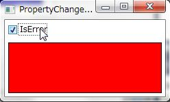

# ViewModelのプロパティの変更を監視してアクションを実行する方法
## Requires
- Visual Studio 2010
## License
- Apache License, Version 2.0
## Technologies
- ViewModel pattern (MVVM)
## Topics
- ViewModel pattern (MVVM)
## Updated
- 05/06/2011
## Description

<h1>Introduction</h1>

Model View ViewModelパターンで、ViewModelのプロパティの変更を監視してView側でアクションを実行する方法をExpression Blend SDKのBehaviorを使用して記述する例を示します。

<h1>Building the Sample</h1>

解凍したソリューションを開いてビルドして実行できます。Expressの場合はVisual C# 2010 Expressを使用してください。

Description

サンプルプログラムの作成手順を示します。ここでは、ViewModelのIsErrorプロパティを監視して、Trueの場合には、Rectangleの背景色を赤に、Falseの場合には、背景色を青にするプログラムを作成します。

<h2>下準備</h2>

ViewModelの基本クラスとして以下のコードを準備します。

&nbsp;

C#

スクリプトの編集

csharp

<pre class="csharp">namespace&nbsp;PropertyChangedTriggerSample.Commons&nbsp;
{&nbsp;
&nbsp;&nbsp;&nbsp;&nbsp;using&nbsp;<a class="libraryLink" href="http://msdn.microsoft.com/ja-JP/library/System.ComponentModel.aspx" target="_blank" title="Auto generated link to System.ComponentModel">System.ComponentModel</a>;&nbsp;
&nbsp;
&nbsp;&nbsp;&nbsp;&nbsp;///&nbsp;&lt;summary&gt;&nbsp;
&nbsp;&nbsp;&nbsp;&nbsp;///&nbsp;ViewModelの基本クラス&nbsp;
&nbsp;&nbsp;&nbsp;&nbsp;///&nbsp;&lt;/summary&gt;&nbsp;
&nbsp;&nbsp;&nbsp;&nbsp;public&nbsp;class&nbsp;ViewModelBase&nbsp;:&nbsp;INotifyPropertyChanged&nbsp;
&nbsp;&nbsp;&nbsp;&nbsp;{&nbsp;
&nbsp;&nbsp;&nbsp;&nbsp;&nbsp;&nbsp;&nbsp;&nbsp;public&nbsp;event&nbsp;PropertyChangedEventHandler&nbsp;PropertyChanged;&nbsp;
&nbsp;
&nbsp;&nbsp;&nbsp;&nbsp;&nbsp;&nbsp;&nbsp;&nbsp;protected&nbsp;virtual&nbsp;void&nbsp;RaisePropertyChanged(string&nbsp;propertyName)&nbsp;
&nbsp;&nbsp;&nbsp;&nbsp;&nbsp;&nbsp;&nbsp;&nbsp;{&nbsp;
&nbsp;&nbsp;&nbsp;&nbsp;&nbsp;&nbsp;&nbsp;&nbsp;&nbsp;&nbsp;&nbsp;&nbsp;var&nbsp;h&nbsp;=&nbsp;this.PropertyChanged;&nbsp;
&nbsp;&nbsp;&nbsp;&nbsp;&nbsp;&nbsp;&nbsp;&nbsp;&nbsp;&nbsp;&nbsp;&nbsp;if&nbsp;(h&nbsp;!=&nbsp;null)&nbsp;
&nbsp;&nbsp;&nbsp;&nbsp;&nbsp;&nbsp;&nbsp;&nbsp;&nbsp;&nbsp;&nbsp;&nbsp;{&nbsp;
&nbsp;&nbsp;&nbsp;&nbsp;&nbsp;&nbsp;&nbsp;&nbsp;&nbsp;&nbsp;&nbsp;&nbsp;&nbsp;&nbsp;&nbsp;&nbsp;h(this,&nbsp;new&nbsp;PropertyChangedEventArgs(propertyName));&nbsp;
&nbsp;&nbsp;&nbsp;&nbsp;&nbsp;&nbsp;&nbsp;&nbsp;&nbsp;&nbsp;&nbsp;&nbsp;}&nbsp;
&nbsp;&nbsp;&nbsp;&nbsp;&nbsp;&nbsp;&nbsp;&nbsp;}&nbsp;
&nbsp;&nbsp;&nbsp;&nbsp;}&nbsp;
}&nbsp;
&nbsp;
&nbsp;
</pre>

&nbsp;

&nbsp;そして、ViewModelBaseを継承して、MainWindowのViewModelを作成します。このクラスには、Viewから監視するためのプロパティとしてIsErrorプロパティを定義しています。

&nbsp;

C#

スクリプトの編集

csharp

<pre class="csharp">using&nbsp;System;&nbsp;
using&nbsp;<a class="libraryLink" href="http://msdn.microsoft.com/ja-JP/library/System.Collections.Generic.aspx" target="_blank" title="Auto generated link to System.Collections.Generic">System.Collections.Generic</a>;&nbsp;
using&nbsp;<a class="libraryLink" href="http://msdn.microsoft.com/ja-JP/library/System.Linq.aspx" target="_blank" title="Auto generated link to System.Linq">System.Linq</a>;&nbsp;
using&nbsp;<a class="libraryLink" href="http://msdn.microsoft.com/ja-JP/library/System.Text.aspx" target="_blank" title="Auto generated link to System.Text">System.Text</a>;&nbsp;
using&nbsp;PropertyChangedTriggerSample.Commons;&nbsp;
&nbsp;
namespace&nbsp;PropertyChangedTriggerSample&nbsp;
{&nbsp;
&nbsp;&nbsp;&nbsp;&nbsp;public&nbsp;class&nbsp;MainWindowViewModel&nbsp;:&nbsp;ViewModelBase&nbsp;
&nbsp;&nbsp;&nbsp;&nbsp;{&nbsp;
&nbsp;&nbsp;&nbsp;&nbsp;&nbsp;&nbsp;&nbsp;&nbsp;private&nbsp;bool&nbsp;isError;&nbsp;
&nbsp;
&nbsp;&nbsp;&nbsp;&nbsp;&nbsp;&nbsp;&nbsp;&nbsp;public&nbsp;bool&nbsp;IsError&nbsp;
&nbsp;&nbsp;&nbsp;&nbsp;&nbsp;&nbsp;&nbsp;&nbsp;{&nbsp;
&nbsp;&nbsp;&nbsp;&nbsp;&nbsp;&nbsp;&nbsp;&nbsp;&nbsp;&nbsp;&nbsp;&nbsp;get&nbsp;
&nbsp;&nbsp;&nbsp;&nbsp;&nbsp;&nbsp;&nbsp;&nbsp;&nbsp;&nbsp;&nbsp;&nbsp;{&nbsp;
&nbsp;&nbsp;&nbsp;&nbsp;&nbsp;&nbsp;&nbsp;&nbsp;&nbsp;&nbsp;&nbsp;&nbsp;&nbsp;&nbsp;&nbsp;&nbsp;return&nbsp;this.isError;&nbsp;
&nbsp;&nbsp;&nbsp;&nbsp;&nbsp;&nbsp;&nbsp;&nbsp;&nbsp;&nbsp;&nbsp;&nbsp;}&nbsp;
&nbsp;
&nbsp;&nbsp;&nbsp;&nbsp;&nbsp;&nbsp;&nbsp;&nbsp;&nbsp;&nbsp;&nbsp;&nbsp;set&nbsp;
&nbsp;&nbsp;&nbsp;&nbsp;&nbsp;&nbsp;&nbsp;&nbsp;&nbsp;&nbsp;&nbsp;&nbsp;{&nbsp;
&nbsp;&nbsp;&nbsp;&nbsp;&nbsp;&nbsp;&nbsp;&nbsp;&nbsp;&nbsp;&nbsp;&nbsp;&nbsp;&nbsp;&nbsp;&nbsp;this.isError&nbsp;=&nbsp;value;&nbsp;
&nbsp;&nbsp;&nbsp;&nbsp;&nbsp;&nbsp;&nbsp;&nbsp;&nbsp;&nbsp;&nbsp;&nbsp;&nbsp;&nbsp;&nbsp;&nbsp;this.RaisePropertyChanged(&quot;IsError&quot;);&nbsp;
&nbsp;&nbsp;&nbsp;&nbsp;&nbsp;&nbsp;&nbsp;&nbsp;&nbsp;&nbsp;&nbsp;&nbsp;}&nbsp;
&nbsp;&nbsp;&nbsp;&nbsp;&nbsp;&nbsp;&nbsp;&nbsp;}&nbsp;
&nbsp;&nbsp;&nbsp;&nbsp;}&nbsp;
}&nbsp;
&nbsp;
&nbsp;
</pre>

MainWindow.xamlのDataContextに上述のMainWindowViewModelを追加します。

<h2 class="scriptcode">

XAML

スクリプトの編集

xaml

<pre class="xaml">&lt;!--&nbsp;Windowタグに名前空間の定義&nbsp;--&gt;&nbsp;
xmlns:l=&quot;clr-namespace:PropertyChangedTriggerSample&quot;&nbsp;
&nbsp;
&lt;!--&nbsp;DataContextにViewModelを設定する&nbsp;--&gt;&nbsp;
&lt;Window.DataContext&gt;&nbsp;
&nbsp;&nbsp;&nbsp;&nbsp;&lt;l:MainWindowViewModel&nbsp;/&gt;&nbsp;
&lt;/Window.DataContext&gt;&nbsp;
&nbsp;
&nbsp;
</pre>

</h2>

&nbsp;

次に画面のレイアウトを定義します。画面はViewModelのIsErrorプロパティとバインドするためのCheckBoxと、ViewModelのプロパティの変更に応じて背景色を変える(この操作をBehaviorで記述します）Rectangleを配置します。

&nbsp;

XAML

スクリプトの編集

xaml

<pre class="js">&lt;Window&nbsp;x:Class=&quot;PropertyChangedTriggerSample.MainWindow&quot;&nbsp;
&nbsp;&nbsp;&nbsp;&nbsp;&nbsp;&nbsp;&nbsp;&nbsp;xmlns=&quot;http://schemas.microsoft.com/winfx/2006/xaml/presentation&quot;&nbsp;
&nbsp;&nbsp;&nbsp;&nbsp;&nbsp;&nbsp;&nbsp;&nbsp;xmlns:x=&quot;http://schemas.microsoft.com/winfx/2006/xaml&quot;&nbsp;
&nbsp;&nbsp;&nbsp;&nbsp;&nbsp;&nbsp;&nbsp;&nbsp;xmlns:l=&quot;clr-namespace:PropertyChangedTriggerSample&quot;&nbsp;
&nbsp;&nbsp;&nbsp;&nbsp;&nbsp;&nbsp;&nbsp;&nbsp;Title=&quot;PropertyChangedTrigger&nbsp;Sample&quot;&nbsp;&nbsp;
&nbsp;&nbsp;&nbsp;&nbsp;&nbsp;&nbsp;&nbsp;&nbsp;Height=&quot;150&quot;&nbsp;&nbsp;
&nbsp;&nbsp;&nbsp;&nbsp;&nbsp;&nbsp;&nbsp;&nbsp;Width=&quot;250&quot;&gt;&nbsp;
&nbsp;&nbsp;&nbsp;&nbsp;&lt;Window.DataContext&gt;&nbsp;
&nbsp;&nbsp;&nbsp;&nbsp;&nbsp;&nbsp;&nbsp;&nbsp;&lt;l:MainWindowViewModel&nbsp;/&gt;&nbsp;
&nbsp;&nbsp;&nbsp;&nbsp;&lt;/Window.DataContext&gt;&nbsp;
&nbsp;&nbsp;&nbsp;&nbsp;&lt;Grid&gt;&nbsp;
&nbsp;&nbsp;&nbsp;&nbsp;&nbsp;&nbsp;&nbsp;&nbsp;&lt;Grid.RowDefinitions&gt;&nbsp;
&nbsp;&nbsp;&nbsp;&nbsp;&nbsp;&nbsp;&nbsp;&nbsp;&nbsp;&nbsp;&nbsp;&nbsp;&lt;RowDefinition&nbsp;Height=&quot;Auto&quot;&nbsp;/&gt;&nbsp;
&nbsp;&nbsp;&nbsp;&nbsp;&nbsp;&nbsp;&nbsp;&nbsp;&nbsp;&nbsp;&nbsp;&nbsp;&lt;RowDefinition&nbsp;Height=&quot;277*&quot;&nbsp;/&gt;&nbsp;
&nbsp;&nbsp;&nbsp;&nbsp;&nbsp;&nbsp;&nbsp;&nbsp;&lt;/Grid.RowDefinitions&gt;&nbsp;
&nbsp;&nbsp;&nbsp;&nbsp;&nbsp;&nbsp;&nbsp;&nbsp;&lt;CheckBox&nbsp;Content=&quot;IsError&quot;&nbsp;IsChecked=&quot;{Binding&nbsp;Path=IsError}&quot;&nbsp;Margin=&quot;5&quot;&nbsp;HorizontalAlignment=&quot;Left&quot;&nbsp;/&gt;&nbsp;
&nbsp;&nbsp;&nbsp;&nbsp;&nbsp;&nbsp;&nbsp;&nbsp;&lt;Rectangle&nbsp;Name=&quot;rectangle&quot;&nbsp;Stroke=&quot;Black&quot;&nbsp;Fill=&quot;Blue&quot;&nbsp;Grid.Row=&quot;1&quot;&nbsp;Margin=&quot;5&quot;&nbsp;/&gt;&nbsp;
&nbsp;&nbsp;&nbsp;&nbsp;&lt;/Grid&gt;&nbsp;
&lt;/Window&gt;&nbsp;
&nbsp;
</pre>

&nbsp;

以上で、下準備は完了です。ここからViewModelのプロパティの変更を監視してアクションを実行するXAMLを記述します。

&nbsp;

&nbsp;

<h2 class="endscriptcode">PropertyChangedTriggerの適用</h2>

ViewModel（ViewModelに限らず適用は可能）のプロパティの変更を監視して、アクションを実行するにはPropertyChangedTriggerを使います。これはExpressionBlend SDKに入っています。入っているアセンブリは、System.Windows.InteractivityではなくMicrosoft.Expression.Interactionsのほうなので、プロジェクトには両方のアセンブリを追加します。

まず、PropertyChangedTriggerを使えるようにするため、以下の名前空間をWindowタグに追加します。

XAML

スクリプトの編集

xaml

<pre class="js">xmlns:i=&quot;http://schemas.microsoft.com/expression/2010/interactivity&quot;&nbsp;&nbsp;
xmlns:ei=&quot;http://schemas.microsoft.com/expression/2010/interactions&quot;&nbsp;
&nbsp;
&nbsp;
</pre>

&nbsp;

名前空間を定義したので、PropertyChangedTriggerをGridに指定します。

&nbsp;

&nbsp;

&nbsp;

&nbsp;

XAML

スクリプトの編集

xaml

<pre class="xaml">&lt;i:Interaction.Triggers&gt;&nbsp;
&nbsp;&nbsp;&nbsp;&nbsp;&lt;ei:PropertyChangedTrigger&nbsp;Binding=&quot;{Binding&nbsp;Path=IsError}&quot;&gt;&nbsp;
&nbsp;&nbsp;&nbsp;&nbsp;&nbsp;&nbsp;&nbsp;&nbsp;&lt;ei:ChangePropertyAction&nbsp;TargetObject=&quot;{Binding&nbsp;ElementName=rectangle}&quot;&nbsp;PropertyName=&quot;Fill&quot;&nbsp;Value=&quot;Red&quot;&nbsp;/&gt;&nbsp;
&nbsp;&nbsp;&nbsp;&nbsp;&lt;/ei:PropertyChangedTrigger&gt;&nbsp;
&lt;/i:Interaction.Triggers&gt;&nbsp;
&nbsp;
&nbsp;
</pre>

&nbsp;

&nbsp;

PropertyChangedTriggerのBindingプロパティで、どのプロパティの値の変更を監視するか指定します。そして、値に変更があったときに実行するアクションをPropertyChangedTriggerの下に指定します。この例ではrectangleオブジェクトのFillプロパティをRedに指定しています。この状態では、プロパティに変更があったら、必ずRectangleが赤色に指定してしまうのでTrueの場合という条件を指定します。条件の指定は、PropertyChangedTriggerのプロパティではなく、ConditionBehaviorというビヘイビアをPropertyChangedTriggerに指定して行います。

ConditionBehaviorはTriggerの実行可否を判定するためのビヘイビアです。ConditionBehaviorの中には、条件式を表すComparisonConditionを指定します。IsErrorプロパティがTrueの場合にActionを実行するようにXAMLを記述します。

&nbsp;

XAML

スクリプトの編集

xaml

<pre class="xaml">&lt;ei:PropertyChangedTrigger&nbsp;Binding=&quot;{Binding&nbsp;Path=IsError}&quot;&gt;&nbsp;
&nbsp;&nbsp;&nbsp;&nbsp;&lt;i:Interaction.Behaviors&gt;&nbsp;
&nbsp;&nbsp;&nbsp;&nbsp;&nbsp;&nbsp;&nbsp;&nbsp;&lt;ei:ConditionBehavior&gt;&nbsp;
&nbsp;&nbsp;&nbsp;&nbsp;&nbsp;&nbsp;&nbsp;&nbsp;&nbsp;&nbsp;&nbsp;&nbsp;&lt;ei:ConditionalExpression&gt;&nbsp;
&nbsp;&nbsp;&nbsp;&nbsp;&nbsp;&nbsp;&nbsp;&nbsp;&nbsp;&nbsp;&nbsp;&nbsp;&nbsp;&nbsp;&nbsp;&nbsp;&lt;ei:ComparisonCondition&nbsp;LeftOperand=&quot;{Binding&nbsp;Path=IsError}&quot;&nbsp;RightOperand=&quot;True&quot;&nbsp;/&gt;&nbsp;
&nbsp;&nbsp;&nbsp;&nbsp;&nbsp;&nbsp;&nbsp;&nbsp;&nbsp;&nbsp;&nbsp;&nbsp;&lt;/ei:ConditionalExpression&gt;&nbsp;
&nbsp;&nbsp;&nbsp;&nbsp;&nbsp;&nbsp;&nbsp;&nbsp;&lt;/ei:ConditionBehavior&gt;&nbsp;
&nbsp;&nbsp;&nbsp;&nbsp;&lt;/i:Interaction.Behaviors&gt;&nbsp;
&nbsp;&nbsp;&nbsp;&nbsp;&lt;ei:ChangePropertyAction&nbsp;TargetObject=&quot;{Binding&nbsp;ElementName=rectangle}&quot;&nbsp;PropertyName=&quot;Fill&quot;&nbsp;Value=&quot;Red&quot;&nbsp;/&gt;&nbsp;
&lt;/ei:PropertyChangedTrigger&gt;&nbsp;
&nbsp;
&nbsp;
</pre>

&nbsp;PropertyChangedTriggerにInteraction.Behaviorsを使用してConditionBehaviorを設定して、ComparisonCondigionで左辺値をIsErrorプロパティの値、RightOperandをTrueに指定します。これでIsErrorがTrueの時にPropertyChangedTriggerの配下のActionが実行されます。同様にFalseの時にはBlueにするPropertyChangedTriggerも追加します。

XAML

スクリプトの編集

xaml

<pre class="js">&lt;ei:PropertyChangedTrigger&nbsp;Binding=&quot;{Binding&nbsp;Path=IsError}&quot;&gt;&nbsp;
&nbsp;&nbsp;&nbsp;&nbsp;&lt;i:Interaction.Behaviors&gt;&nbsp;
&nbsp;&nbsp;&nbsp;&nbsp;&nbsp;&nbsp;&nbsp;&nbsp;&lt;ei:ConditionBehavior&gt;&nbsp;
&nbsp;&nbsp;&nbsp;&nbsp;&nbsp;&nbsp;&nbsp;&nbsp;&nbsp;&nbsp;&nbsp;&nbsp;&lt;ei:ConditionalExpression&gt;&nbsp;
&nbsp;&nbsp;&nbsp;&nbsp;&nbsp;&nbsp;&nbsp;&nbsp;&nbsp;&nbsp;&nbsp;&nbsp;&nbsp;&nbsp;&nbsp;&nbsp;&lt;ei:ComparisonCondition&nbsp;LeftOperand=&quot;{Binding&nbsp;Path=IsError}&quot;&nbsp;RightOperand=&quot;False&quot;&nbsp;/&gt;&nbsp;
&nbsp;&nbsp;&nbsp;&nbsp;&nbsp;&nbsp;&nbsp;&nbsp;&nbsp;&nbsp;&nbsp;&nbsp;&lt;/ei:ConditionalExpression&gt;&nbsp;
&nbsp;&nbsp;&nbsp;&nbsp;&nbsp;&nbsp;&nbsp;&nbsp;&lt;/ei:ConditionBehavior&gt;&nbsp;
&nbsp;&nbsp;&nbsp;&nbsp;&lt;/i:Interaction.Behaviors&gt;&nbsp;
&nbsp;&nbsp;&nbsp;&nbsp;&lt;ei:ChangePropertyAction&nbsp;TargetObject=&quot;{Binding&nbsp;ElementName=rectangle}&quot;&nbsp;PropertyName=&quot;Fill&quot;&nbsp;Value=&quot;Blue&quot;&nbsp;/&gt;&nbsp;
&lt;/ei:PropertyChangedTrigger&gt;&nbsp;
&nbsp;
&nbsp;
</pre>

&nbsp;

以上で完成です。MainWindow.xaml全体を以下に示します。

<h2 class="scriptcode">

XAML

スクリプトの編集

xaml

<pre class="xaml">&lt;Window&nbsp;x:Class=&quot;PropertyChangedTriggerSample.MainWindow&quot;&nbsp;
&nbsp;&nbsp;&nbsp;&nbsp;&nbsp;&nbsp;&nbsp;&nbsp;xmlns=&quot;http://schemas.microsoft.com/winfx/2006/xaml/presentation&quot;&nbsp;
&nbsp;&nbsp;&nbsp;&nbsp;&nbsp;&nbsp;&nbsp;&nbsp;xmlns:x=&quot;http://schemas.microsoft.com/winfx/2006/xaml&quot;&nbsp;
&nbsp;&nbsp;&nbsp;&nbsp;&nbsp;&nbsp;&nbsp;&nbsp;xmlns:l=&quot;clr-namespace:PropertyChangedTriggerSample&quot;&nbsp;
&nbsp;&nbsp;&nbsp;&nbsp;&nbsp;&nbsp;&nbsp;&nbsp;xmlns:i=&quot;http://schemas.microsoft.com/expression/2010/interactivity&quot;&nbsp;&nbsp;
&nbsp;&nbsp;&nbsp;&nbsp;&nbsp;&nbsp;&nbsp;&nbsp;xmlns:ei=&quot;http://schemas.microsoft.com/expression/2010/interactions&quot;&nbsp;
&nbsp;&nbsp;&nbsp;&nbsp;&nbsp;&nbsp;&nbsp;&nbsp;Title=&quot;PropertyChangedTrigger&nbsp;Sample&quot;&nbsp;&nbsp;
&nbsp;&nbsp;&nbsp;&nbsp;&nbsp;&nbsp;&nbsp;&nbsp;Height=&quot;150&quot;&nbsp;&nbsp;
&nbsp;&nbsp;&nbsp;&nbsp;&nbsp;&nbsp;&nbsp;&nbsp;Width=&quot;250&quot;&gt;&nbsp;
&nbsp;&nbsp;&nbsp;&nbsp;&lt;Window.DataContext&gt;&nbsp;
&nbsp;&nbsp;&nbsp;&nbsp;&nbsp;&nbsp;&nbsp;&nbsp;&lt;l:MainWindowViewModel&nbsp;/&gt;&nbsp;
&nbsp;&nbsp;&nbsp;&nbsp;&lt;/Window.DataContext&gt;&nbsp;
&nbsp;&nbsp;&nbsp;&nbsp;&lt;Grid&gt;&nbsp;
&nbsp;&nbsp;&nbsp;&nbsp;&nbsp;&nbsp;&nbsp;&nbsp;&lt;Grid.RowDefinitions&gt;&nbsp;
&nbsp;&nbsp;&nbsp;&nbsp;&nbsp;&nbsp;&nbsp;&nbsp;&nbsp;&nbsp;&nbsp;&nbsp;&lt;RowDefinition&nbsp;Height=&quot;Auto&quot;&nbsp;/&gt;&nbsp;
&nbsp;&nbsp;&nbsp;&nbsp;&nbsp;&nbsp;&nbsp;&nbsp;&nbsp;&nbsp;&nbsp;&nbsp;&lt;RowDefinition&nbsp;Height=&quot;277*&quot;&nbsp;/&gt;&nbsp;
&nbsp;&nbsp;&nbsp;&nbsp;&nbsp;&nbsp;&nbsp;&nbsp;&lt;/Grid.RowDefinitions&gt;&nbsp;
&nbsp;&nbsp;&nbsp;&nbsp;&nbsp;&nbsp;&nbsp;&nbsp;&lt;i:Interaction.Triggers&gt;&nbsp;
&nbsp;&nbsp;&nbsp;&nbsp;&nbsp;&nbsp;&nbsp;&nbsp;&nbsp;&nbsp;&nbsp;&nbsp;&lt;ei:PropertyChangedTrigger&nbsp;Binding=&quot;{Binding&nbsp;Path=IsError}&quot;&gt;&nbsp;
&nbsp;&nbsp;&nbsp;&nbsp;&nbsp;&nbsp;&nbsp;&nbsp;&nbsp;&nbsp;&nbsp;&nbsp;&nbsp;&nbsp;&nbsp;&nbsp;&lt;i:Interaction.Behaviors&gt;&nbsp;
&nbsp;&nbsp;&nbsp;&nbsp;&nbsp;&nbsp;&nbsp;&nbsp;&nbsp;&nbsp;&nbsp;&nbsp;&nbsp;&nbsp;&nbsp;&nbsp;&nbsp;&nbsp;&nbsp;&nbsp;&lt;ei:ConditionBehavior&gt;&nbsp;
&nbsp;&nbsp;&nbsp;&nbsp;&nbsp;&nbsp;&nbsp;&nbsp;&nbsp;&nbsp;&nbsp;&nbsp;&nbsp;&nbsp;&nbsp;&nbsp;&nbsp;&nbsp;&nbsp;&nbsp;&nbsp;&nbsp;&nbsp;&nbsp;&lt;ei:ConditionalExpression&gt;&nbsp;
&nbsp;&nbsp;&nbsp;&nbsp;&nbsp;&nbsp;&nbsp;&nbsp;&nbsp;&nbsp;&nbsp;&nbsp;&nbsp;&nbsp;&nbsp;&nbsp;&nbsp;&nbsp;&nbsp;&nbsp;&nbsp;&nbsp;&nbsp;&nbsp;&nbsp;&nbsp;&nbsp;&nbsp;&lt;ei:ComparisonCondition&nbsp;LeftOperand=&quot;{Binding&nbsp;Path=IsError}&quot;&nbsp;RightOperand=&quot;True&quot;&nbsp;/&gt;&nbsp;
&nbsp;&nbsp;&nbsp;&nbsp;&nbsp;&nbsp;&nbsp;&nbsp;&nbsp;&nbsp;&nbsp;&nbsp;&nbsp;&nbsp;&nbsp;&nbsp;&nbsp;&nbsp;&nbsp;&nbsp;&nbsp;&nbsp;&nbsp;&nbsp;&lt;/ei:ConditionalExpression&gt;&nbsp;
&nbsp;&nbsp;&nbsp;&nbsp;&nbsp;&nbsp;&nbsp;&nbsp;&nbsp;&nbsp;&nbsp;&nbsp;&nbsp;&nbsp;&nbsp;&nbsp;&nbsp;&nbsp;&nbsp;&nbsp;&lt;/ei:ConditionBehavior&gt;&nbsp;
&nbsp;&nbsp;&nbsp;&nbsp;&nbsp;&nbsp;&nbsp;&nbsp;&nbsp;&nbsp;&nbsp;&nbsp;&nbsp;&nbsp;&nbsp;&nbsp;&lt;/i:Interaction.Behaviors&gt;&nbsp;
&nbsp;&nbsp;&nbsp;&nbsp;&nbsp;&nbsp;&nbsp;&nbsp;&nbsp;&nbsp;&nbsp;&nbsp;&nbsp;&nbsp;&nbsp;&nbsp;&lt;ei:ChangePropertyAction&nbsp;TargetObject=&quot;{Binding&nbsp;ElementName=rectangle}&quot;&nbsp;PropertyName=&quot;Fill&quot;&nbsp;Value=&quot;Red&quot;&nbsp;/&gt;&nbsp;
&nbsp;&nbsp;&nbsp;&nbsp;&nbsp;&nbsp;&nbsp;&nbsp;&nbsp;&nbsp;&nbsp;&nbsp;&lt;/ei:PropertyChangedTrigger&gt;&nbsp;
&nbsp;&nbsp;&nbsp;&nbsp;&nbsp;&nbsp;&nbsp;&nbsp;&nbsp;&nbsp;&nbsp;&nbsp;&lt;ei:PropertyChangedTrigger&nbsp;Binding=&quot;{Binding&nbsp;Path=IsError}&quot;&gt;&nbsp;
&nbsp;&nbsp;&nbsp;&nbsp;&nbsp;&nbsp;&nbsp;&nbsp;&nbsp;&nbsp;&nbsp;&nbsp;&nbsp;&nbsp;&nbsp;&nbsp;&lt;i:Interaction.Behaviors&gt;&nbsp;
&nbsp;&nbsp;&nbsp;&nbsp;&nbsp;&nbsp;&nbsp;&nbsp;&nbsp;&nbsp;&nbsp;&nbsp;&nbsp;&nbsp;&nbsp;&nbsp;&nbsp;&nbsp;&nbsp;&nbsp;&lt;ei:ConditionBehavior&gt;&nbsp;
&nbsp;&nbsp;&nbsp;&nbsp;&nbsp;&nbsp;&nbsp;&nbsp;&nbsp;&nbsp;&nbsp;&nbsp;&nbsp;&nbsp;&nbsp;&nbsp;&nbsp;&nbsp;&nbsp;&nbsp;&nbsp;&nbsp;&nbsp;&nbsp;&lt;ei:ConditionalExpression&gt;&nbsp;
&nbsp;&nbsp;&nbsp;&nbsp;&nbsp;&nbsp;&nbsp;&nbsp;&nbsp;&nbsp;&nbsp;&nbsp;&nbsp;&nbsp;&nbsp;&nbsp;&nbsp;&nbsp;&nbsp;&nbsp;&nbsp;&nbsp;&nbsp;&nbsp;&nbsp;&nbsp;&nbsp;&nbsp;&lt;ei:ComparisonCondition&nbsp;LeftOperand=&quot;{Binding&nbsp;Path=IsError}&quot;&nbsp;RightOperand=&quot;False&quot;&nbsp;/&gt;&nbsp;
&nbsp;&nbsp;&nbsp;&nbsp;&nbsp;&nbsp;&nbsp;&nbsp;&nbsp;&nbsp;&nbsp;&nbsp;&nbsp;&nbsp;&nbsp;&nbsp;&nbsp;&nbsp;&nbsp;&nbsp;&nbsp;&nbsp;&nbsp;&nbsp;&lt;/ei:ConditionalExpression&gt;&nbsp;
&nbsp;&nbsp;&nbsp;&nbsp;&nbsp;&nbsp;&nbsp;&nbsp;&nbsp;&nbsp;&nbsp;&nbsp;&nbsp;&nbsp;&nbsp;&nbsp;&nbsp;&nbsp;&nbsp;&nbsp;&lt;/ei:ConditionBehavior&gt;&nbsp;
&nbsp;&nbsp;&nbsp;&nbsp;&nbsp;&nbsp;&nbsp;&nbsp;&nbsp;&nbsp;&nbsp;&nbsp;&nbsp;&nbsp;&nbsp;&nbsp;&lt;/i:Interaction.Behaviors&gt;&nbsp;
&nbsp;&nbsp;&nbsp;&nbsp;&nbsp;&nbsp;&nbsp;&nbsp;&nbsp;&nbsp;&nbsp;&nbsp;&nbsp;&nbsp;&nbsp;&nbsp;&lt;ei:ChangePropertyAction&nbsp;TargetObject=&quot;{Binding&nbsp;ElementName=rectangle}&quot;&nbsp;PropertyName=&quot;Fill&quot;&nbsp;Value=&quot;Blue&quot;&nbsp;/&gt;&nbsp;
&nbsp;&nbsp;&nbsp;&nbsp;&nbsp;&nbsp;&nbsp;&nbsp;&nbsp;&nbsp;&nbsp;&nbsp;&lt;/ei:PropertyChangedTrigger&gt;&nbsp;
&nbsp;&nbsp;&nbsp;&nbsp;&nbsp;&nbsp;&nbsp;&nbsp;&lt;/i:Interaction.Triggers&gt;&nbsp;
&nbsp;&nbsp;&nbsp;&nbsp;&nbsp;&nbsp;&nbsp;&nbsp;&lt;CheckBox&nbsp;Content=&quot;IsError&quot;&nbsp;IsChecked=&quot;{Binding&nbsp;Path=IsError}&quot;&nbsp;Margin=&quot;5&quot;&nbsp;HorizontalAlignment=&quot;Left&quot;&nbsp;/&gt;&nbsp;
&nbsp;&nbsp;&nbsp;&nbsp;&nbsp;&nbsp;&nbsp;&nbsp;&lt;Rectangle&nbsp;Name=&quot;rectangle&quot;&nbsp;Stroke=&quot;Black&quot;&nbsp;Fill=&quot;Blue&quot;&nbsp;Grid.Row=&quot;1&quot;&nbsp;Margin=&quot;5&quot;&nbsp;/&gt;&nbsp;
&nbsp;&nbsp;&nbsp;&nbsp;&lt;/Grid&gt;&nbsp;
&lt;/Window&gt;&nbsp;
&nbsp;
&nbsp;
</pre>

</h2>

<h2 class="endscriptcode">動作確認</h2>

プロジェクトを実行すると以下のようになります。CheckBoxにチェックを入れる(ViewModelのIsErrorプロパティをTrueにする）とRectangleが青から赤色になります。

CheckBoxのチェックを外すと青色に戻ります。

