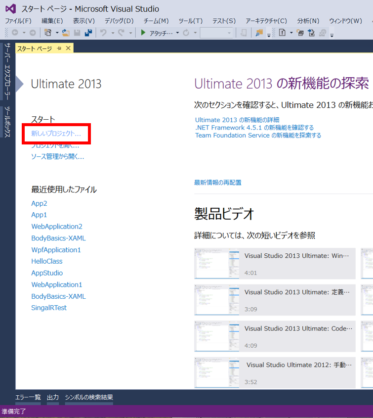
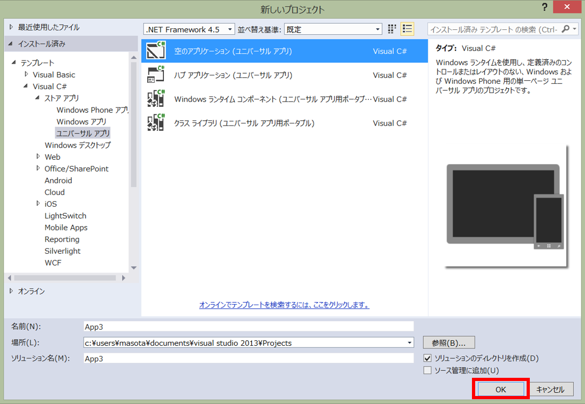
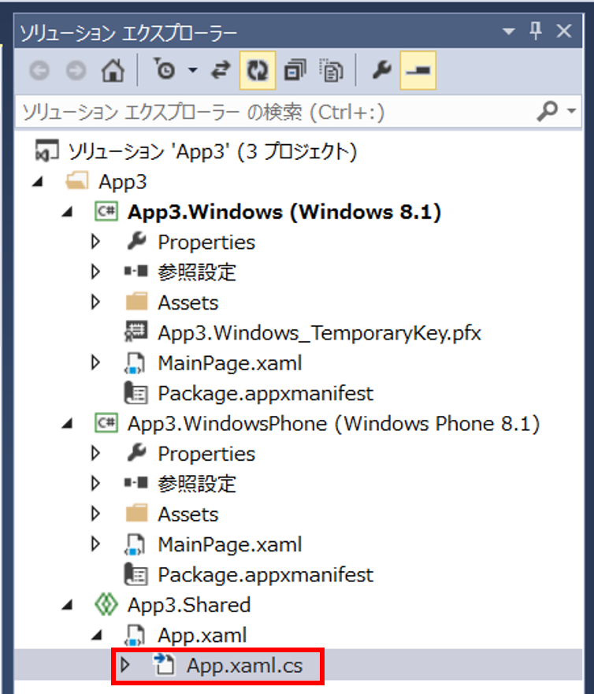
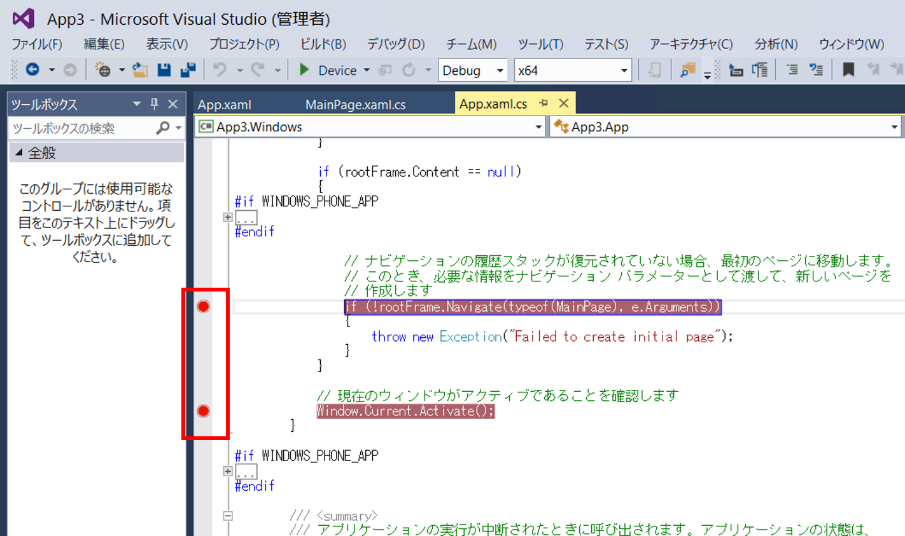
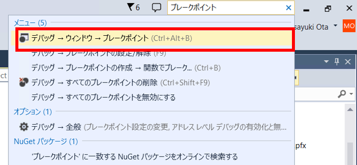
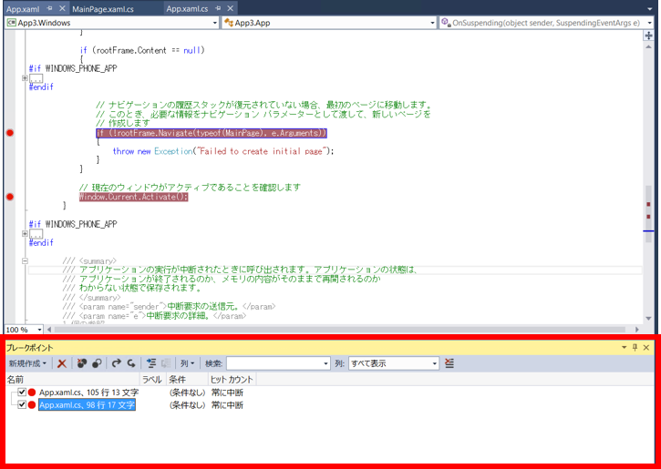
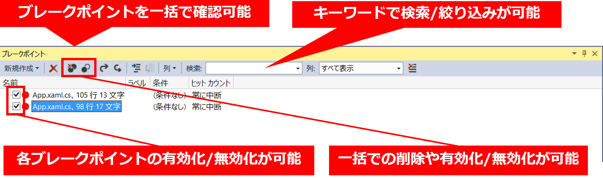

# Visual Studio 2013 の機能: ブレーク ポイントの一括操作
## Requires
- 
## License
- Apache License, Version 2.0
## Technologies
- Visual Studio 2013
## Topics
- Tips
## Updated
- 10/22/2014
## Description

複雑なコードの検&#35388;時にはブレークポイントの数が多くなり、その全てを把握することが難しくなることがあります。しかし、[ブレークポイント] ウィンドウを利用することで、ブレークポイントを一括で管理できるようになります。それぞれのブレークポイントの有効化/無効化や、検索・一括操作を行うことができるので、デバッグ時の生産性を高めることができます。

&nbsp;

<strong>具体的な手順</strong>

<ol>
<li>Visual Studio 2013 を起動します。 </li><li>[新しいプロジェクト] をクリックします。 
&nbsp; 
&nbsp; </li><li>[テンプレート]-[Visual C#]-[ストアアプリ]-[ユニバーサル アプリ] を選択後、&ldquo;空のアプリケーション (ユニバーサル アプリ)&rdquo; を選択後、[OK] ボタンをクリックします。 
&nbsp; 
&nbsp; </li><li>任意の .cs ファイルを開きます。今回のソリューションは &ldquo;App3&rdquo; という名称で作成したので、例として [ソリューション &lsquo;App3&rsquo;]-[App3]-[App3.Shared] の &ldquo;App.xaml.cs&ldquo; をダブルクリックして開きます。 
&nbsp; 
&nbsp; </li><li>ソースコードの任意の場所にブレークポイントを複数設置します。 
&nbsp; 
&nbsp; </li><li>Visual Studio 右上の [クイック起動] テキストボックスに &ldquo;ブレークポイント&rdquo; と入力後、[デバッグ &rarr; ウィンドウ &rarr; ブレークポイント] をクリックします。 
&nbsp; 
&nbsp; </li><li>[ブレークポイント] ウィンドウが表示されます。&nbsp; 
&nbsp; 
&nbsp; </li><li>このウィンドウでは以下の図のような操作を行うことができ、複数のブレークポイントに対して一括して操作を行うことが可能です。 
&nbsp;
</li></ol>

&nbsp;

参考) <a href="http://msdn.microsoft.com/ja-jp/library/vstudio/02ckd1z7(v=vs.110).aspx" target="_blank">
MSDN ライブラリ: [ブレークポイント] ウィンドウを使用する (Visual Studio 2012)</a>

&nbsp;

&nbsp;

＝＝＝＝＝＝＝＝＝＝＝＝＝＝＝＝＝＝＝＝＝＝＝＝＝＝＝＝＝＝＝＝＝＝＝＝＝＝＝＝＝＝＝＝＝＝＝＝＝＝＝＝＝＝＝＝＝＝＝＝＝＝＝＝＝＝＝＝＝＝＝＝＝＝＝＝＝＝＝＝＝＝＝＝＝＝＝＝＝＝＝＝＝＝＝＝＝＝＝＝＝＝＝＝＝＝＝＝＝＝＝＝＝＝＝＝＝＝＝＝＝＝＝＝＝＝＝＝＝＝＝＝＝＝＝＝＝＝＝＝＝＝＝＝＝＝＝＝＝＝＝＝＝＝＝＝＝＝＝＝＝＝＝＝＝＝＝＝＝＝＝＝＝＝＝＝＝＝＝＝＝＝＝＝＝＝＝＝＝＝＝＝＝＝＝＝＝＝＝＝＝＝＝＝＝＝＝＝＝＝＝＝＝＝＝＝＝＝＝＝＝＝＝＝＝＝＝＝＝＝＝＝＝＝＝＝＝＝＝＝＝＝＝＝＝＝＝＝＝＝＝＝＝＝＝＝＝＝＝＝＝＝＝＝＝＝＝＝＝＝＝＝＝＝＝＝＝＝＝＝＝＝＝＝＝＝＝＝＝＝＝＝＝＝＝＝＝＝＝＝＝＝＝＝＝＝＝＝＝＝＝＝＝＝＝＝＝＝＝＝＝＝＝＝＝＝＝＝＝＝＝＝＝＝＝＝＝＝＝＝＝＝＝＝＝＝＝＝＝＝＝＝＝＝＝＝＝＝＝＝＝＝＝＝＝＝＝＝＝＝＝＝＝＝＝＝＝＝＝＝＝＝＝＝＝＝＝＝＝＝＝＝＝＝＝＝＝＝＝＝＝＝＝＝＝＝＝＝＝＝＝＝＝＝＝＝＝＝＝＝＝＝＝＝＝＝＝＝＝＝＝＝＝＝＝＝＝＝＝＝＝＝＝＝＝＝＝＝＝＝＝＝＝＝＝＝＝＝＝＝＝＝＝＝＝＝＝＝＝＝＝＝＝＝＝＝＝＝＝＝＝＝＝＝＝＝＝＝＝＝＝＝＝＝＝＝＝＝＝＝＝＝＝＝＝＝＝＝＝＝＝＝＝＝＝＝＝＝＝＝＝＝＝＝＝＝＝＝＝＝＝＝＝＝＝＝＝＝＝＝＝＝＝＝＝＝＝＝＝＝＝＝＝＝＝＝＝＝＝＝＝＝＝＝＝＝＝＝＝＝＝＝＝＝＝＝＝＝＝＝＝＝＝＝＝＝＝＝＝＝＝＝＝＝＝＝＝＝＝＝＝＝＝＝＝＝＝＝＝＝＝＝＝＝＝＝＝＝＝＝＝＝＝＝＝＝＝＝＝＝＝＝＝＝＝＝＝＝＝＝＝＝＝＝＝＝＝＝＝＝＝＝＝＝＝＝＝＝＝＝＝＝＝＝＝＝＝＝＝＝＝＝＝＝＝＝＝＝＝＝＝＝＝＝＝＝＝＝＝＝＝＝＝＝＝＝＝＝＝＝＝＝＝＝＝＝＝＝＝＝＝＝＝＝＝＝＝＝＝＝＝＝＝＝＝＝＝＝＝＝＝＝＝＝＝＝＝＝＝＝＝＝＝＝＝＝＝＝＝＝＝＝＝＝＝＝＝＝＝＝＝＝＝＝＝＝＝＝＝＝＝＝＝＝＝＝＝＝＝＝＝＝＝＝＝＝＝＝＝＝＝＝＝＝＝＝＝＝＝＝＝＝＝＝＝＝＝＝＝＝＝＝＝＝＝＝＝＝＝＝＝＝＝＝＝＝＝＝＝＝＝＝＝＝＝＝＝＝＝＝＝＝＝＝＝＝＝＝＝＝＝＝＝＝＝＝＝＝＝＝＝＝＝＝＝＝＝＝＝＝＝＝＝＝＝＝＝＝＝＝＝＝＝＝＝＝＝＝＝＝＝＝＝＝＝＝＝＝＝＝＝＝＝＝＝＝＝＝＝＝＝＝＝＝＝＝＝＝＝＝＝＝＝＝＝＝＝＝＝＝＝＝＝＝＝＝＝＝＝＝＝＝＝＝＝＝＝＝＝＝＝＝＝＝＝＝＝＝＝＝＝＝＝＝＝＝＝＝＝＝＝＝＝＝＝＝＝＝＝＝＝＝＝＝＝＝＝＝＝＝

