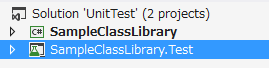
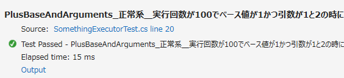

# Visual Studio 2017・2015・2013 や VSTS・TFSで動作するFakesやデータベースを使った単体テストの作り方
## Requires
- Visual Studio 2013
## License
- MIT
## Technologies
- SQL Server
- Visual Studio
- Unit Test
- Team Foundation Server (TFS)
- Visual Studio Online
- Visual Studio Team Services
## Topics
- ALM
- 単体テスト
- 自動ビルド
- 自動テスト
- 継続的インテグレーション
## Updated
- 03/08/2017
## Description

※旧題「TFS・VSTS・ローカルで動作するデータベースを使った単体テストの作り方・量産方法」から変更しました。<strong></strong><em></em>

<h1>概要</h1>

プロジェクトを作成して開発を開始するとき、まず最初にやるべき事がいくつかあります。特に 単体テスト をどうするか？を後回しにして「とりあえず」開発を始めてしまうと、後で取り返しがつかなくなることがあります（例えば、単体テストを作るのに時間がかかったり、後から単体テストを作ることがそもそも不可能、など）。

これを解決するために、「単体テストの基本的な作り方」と「量産方法」をサンプルとしてまとめました。

これを先に意識した上で、目的のメソッドを設計・実装することで、単体テストを作りやすい開発を行うことが出来ます。また、これを意識せずに開発してしまったメソッドについても、Fakes を使って無理矢理単体テストを行う方法も示しています。

最も頭を悩ませる、データベースへの接続を単体テスト時に切り替える方法も示しています。

これらのテストは全て ローカルの Visual Studio 2017, 
2015, 2013<strong></strong><em></em>, Team Foundation Server, Visual Studio
Team Services <strong></strong><em></em>上で動作します。ビルド定義を作成して、「手動」あるいは「日次」で自動ビルド・自動テストを行う方法も解説します。これにより、チームの誰かがある日突然ソースコードを壊しても、すぐに発見することが出来るようになります。

このサンプルと同様に実際の案件のプロジェクトを構成することで、効率的に単体テストの「保守」を行うことが出来ます。

<h1>サンプルの使い方</h1>

サンプルは テスト対象のプロジェクト（ SampleClassLibrary）と、単体テストのサンプルのプロジェクト（ SampleClassLibrary.Test ）の二つで構成されています。

Test で終わる名称は、TFS/VSTS <strong></strong><em></em>の自動ビルド・自動テストのために必要な命名規則です（変更も可能ですが、面倒です）。単体テストプロジェクトは必ず、対象の名前 .Test という名前をつけるようにします。

Visual Studio 2017（あるいは 2015 や 2013）でソリューションを開き、[ テスト(S) &gt; 実行(R) &gt; 全てのテスト(A) ] を実行してください。[ テスト(S) &gt; ウィンドウ(W) &gt; テスト エクスプローラー(T) ] にテスト結果が表示されます。全ての結果が成功（緑のチェックマークのアイコン）になれば動作成功です。

テスト結果を選択して [出力] を押すと、標準出力に詳細な情報が出力されているのが確認できます。

このテストではコンストラクタ引数、プロパティ、テストしたメソッドの引数、期待値と結果がすべて表示されてます。

一見、冗長に感じるかもしれませんが、実際に日次・週次・月次で単体テストを自動実行させるときには、最低限これらの情報を出力しておかないと、いざテストが失敗になった時になぜ失敗になったのか？すぐにはわかりません。

この出力を簡単にするためのライブラリをサンプルでは使用しています。

<h1>サンプルの説明</h1>

ソリューションに含まれるサンプルの内容は次の通りです。順に参照することで、単体テストの基礎・量産方法・Fakes の使用方法（あるいはFakesしなくてもいいクラスの設計）・DBを使ったテストの方法が学べるようになっています。

<h2>Simpleフォルダ</h2>

基本的な単体テストの例です。

<ul>
<li>Static メソッドのテストの例（単体テストの基本・量産方法） </li><li>インスタンスのメソッドのテストの例 </li></ul>
<h3>サンプルで使用する拡張機能 ( Visual Studio ギャラリー )</h3>

単体テストの量産には EditorPlus 拡張機能の Format Text 機能を使用しています。

<h4>EditorPlus</h4>

<a href="https://visualstudiogallery.msdn.microsoft.com/af8f350c-b992-464f-b9f3-580b51545f67" target="_blank">https://visualstudiogallery.msdn.microsoft.com/af8f350c-b992-464f-b9f3-580b51545f67</a>

使い方説明とテンプレートファイルを Simple/TestCodeTemplate に用意しました。

<h2>SystemFakes フォルダ</h2>

Microsoft Fakes フレームワークを使う単体テストの例です。

<ul>
<li>日付を指定できるメソッドのテストの例（Fakes は未使用） </li><li>Fakes で <a class="libraryLink" href="https://msdn.microsoft.com/ja-JP/library/System.DateTime.Now.aspx" target="_blank" title="Auto generated link to System.DateTime.Now">System.DateTime.Now</a> を置き換えなければならないテストの例（Fakes 使用） </li></ul>

Microsoft Fakes は Visual Studio 2017, 
2015 Enterprise あるいは Visual Studio <strong></strong><em></em>2013 Premium 以上でしか使用できません。Fakes を使用するか、使用しなくても動作するクラスを実装するか？（後者をおすすめしますが）最初に検討する必要があるでしょう。

<h2>UseDatabaseフォルダ</h2>

データベースを使ったテストの例です。

<ul>
<li>DB接続文字列を指定できるメソッドのテストの例（Fakesは未使用） </li><li>接続文字列を App.config から参照するメソッドのテストの例（Fakesを使用） </li></ul>

データベースは mdfファイル のアタッチ、DACPAC、BACPAC からのインポートの3種類の方法で初期化しています。初期データが入っているべきか？それともスキーマだけで良いのか？また、テスト時の実行速度は mdf が最高速で、対してDACPAC,　BACPAC はそれぞれ遅く、Visual Studio
Team Services <strong></strong><em></em>のビルド時間を多く消費してしまいます。それらを考慮した上で、データベースをどのように使用するか？検討します。

<h3>サンプルで使用するライブラリ(NuGet)</h3>

このテストのサンプルには、Surviveplus.UnitTestPlus というライブラリを使用しています。

<h4>Surviveplus.UnitTestPlus</h4>

<a href="https://www.nuget.org/packages/Surviveplus.UnitTestPlus/" target="_blank">https://www.nuget.org/packages/Surviveplus.UnitTestPlus/</a>

このライブラリの役割は以下の点です。

<ul>
<li>標準出力に出力する内容の標準化 </li><li>テスト実行時の DB の切り替え（MDF、DACPAC、BACPAC の自動アタッチ・インポート） </li></ul>
<h1>TFS・VSTS <strong></strong><em></em>自動ビルドの構成</h1>

単体テストを Team Foundation Server/Visual Studio 
Team Services <strong></strong><em></em>で実行するには、TFSプロジェクトを作成して、サンプルをソース管理に追加してください。

チェックイン後、TFS・VSTSの Build &amp; Release
<strong></strong><em></em>を開きます。

Builds の [New definition]<strong></strong><em></em> を押すとビルド定義を作成出来ます。

「Visual Studioビルド」を選択して作成すると、既定で全てのソースがビルドされ、
*test*.dll という名称でビルドされるプロジェクトのテストが実行されます。

ひとつだけ注意しなければならないのは「Visual Studio Version」をプロジェクトに合わせて変更することです。[Save] を押して保存します。名前を適切に指定して保存してください。
<strong></strong><em></em>

保存したビルド定義の [Queue new build...] をクリックするか、Builds画面の一覧で [...]をクリックして表示されるメニューから [Queue new build...] を右クリックして、キューに追加することで新しいビルドを TFS/VSTS で実行できます。

ローカルでは数秒で終わるこのサンプルのテストですが、Visual Studio Online での実行にはおおよそ10分程度かかります。キューに積まれてから実際に実行されるまで時間がかかる場合があります。

テストが成功するとこのように確認することが出来ます。

 

ビルドの成功率が VSTS の最初の画面の Activity （右中央）に表示されます。

 

また HOME Overview（ホーム・概要）にタイルとして「Chart for Build History」や「Test results tend」を追加して表示しておくことが出来ます。

 

ビルド定義の Triggers を変更すると、毎日自動ビルド・自動テストを行うように出来ます。（BUILD には無料時間枠がありますが、それを超えると有料になるか、ビルドが出来なくなるので注意が必要してください）<strong></strong><em></em>

<h1>ステップアップのための練習課題</h1>
<ul>
<li>実際の運用をイメージして、テストが失敗するようにメソッドを変更してみましょう。出力 から内容を確認することが出来るでしょうか。 </li><li>ローカルでDBテストに失敗したとき、テストフォルダに MDF ファイルが残ったままになります。ログにファイルのパスが書かれているので、参照し、SQL Server Management Studio などでアタッチして内容を確認することが出来るでしょうか。
</li><li>Visual Studio Team Services 
<strong></strong><em></em>で失敗したときも、詳細に内容が表示されます。Visual Studio 
Team Services <strong></strong><em></em>の日次ビルドを構成して、ホーム画面にピンしましょう。 </li><li>DBを使った単体テストを EditorPlus を使って量産してみましょう。 </li><li>サンプルを参考に、Surviveplus.UnitTestPlus を使って新しい単体テストを作成してみましょう。 </li></ul>
