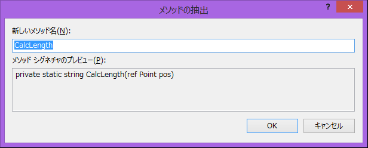

# Visual Studio でのコードのリファクタリング(関数の抽出）
## Requires
- 
## License
- Apache License, Version 2.0
## Technologies
- Visual Studio 2013
## Topics
- Visual Studio
- Visual Studio 2013
## Updated
- 10/27/2014
## Description

<h3>Introduction</h3>

特定の処理を再利用したり、ソースコードの可読性を上げるために関数化することはよくあります。この場合は、Visual Studio のリファクタリングの機能の一つ、メソッドの抽出機能を使うと簡単に関数化を行うことができます。

メソッドを抽出する場合メソッドとして抽出したいロジックの部分を単体で選択し、このリファクタリングの処理を行うと選択した部分だけを切りだして新しい関数として作成するだけでなく、処理が正しく行われるように呼び出し処理も自動的に追加されます。もしかんずうの外で定義されている変数を処理内で使っている場合は引数として定義されて正しく呼び出されるように自動的に処理がなされます。

子の関数の抽出つ昨日は、今回紹介するサンプルのように、UIに依存しない処理だけをビジネスロジックとして抽出することで、コードの再利用性や可読性を高めることができます。

リファクタリングの機能確認のためのサンプルですので、コードは必ずご自身の手で入力することをお勧めします。

<h3>Building the Sample</h3>

本手順を試すには、Visual Studio 2013 Update 3 以降が必要です

<h3>Description</h3>

手順 :

<ol>
<li>Visual Studio を起動します。 </li><li>Visual Studio のメニューの [ファイル]を選択し、[新規作成]、[プロジェクト] の順に選択します。 </li><li>[新しいプロジェクト] ダイアログが表示されたら、左ペインの [Visual C#] とその下の [Windows ストアアプリ]さらにその下の[Windowsアプリ] を選択し、中央ペインの [からのアプリケーション(Windows)]を選び、[OK] ボタンをクリックします。
</li><li>アプリケーションのひな形が生成されたら、ソリューション エクスプローラー上の [ MainPage.xaml ] をダブルクリックし、画面を表示します。 </li><li>以下のコードを実装します。

XAML

スクリプトの編集|Remove

xaml
<pre class="hidden">&lt;Grid Background=&quot;{ThemeResource ApplicationPageBackgroundThemeBrush}&quot;
    PointerReleased=&quot;Grid_PointerReleased&quot;&gt;
    &lt;TextBlock x:Name=&quot;txtResult&quot; HorizontalAlignment=&quot;Center&quot; TextWrapping=&quot;Wrap&quot; 
        VerticalAlignment=&quot;Bottom&quot; FontSize=&quot;100&quot;/&gt;
    &lt;TextBlock HorizontalAlignment=&quot;Center&quot; TextWrapping=&quot;Wrap&quot; VerticalAlignment=&quot;Top&quot; 
        FontSize=&quot;48&quot; Text=&quot;画面の中心をクリック/タッチしてください&quot;/&gt;
&lt;/Grid&gt;
</pre>

<pre class="js">&lt;Grid&nbsp;Background=&quot;{ThemeResource&nbsp;ApplicationPageBackgroundThemeBrush}&quot;&nbsp;
&nbsp;&nbsp;&nbsp;&nbsp;PointerReleased=&quot;Grid_PointerReleased&quot;&gt;&nbsp;
&nbsp;&nbsp;&nbsp;&nbsp;&lt;TextBlock&nbsp;x:Name=&quot;txtResult&quot;&nbsp;HorizontalAlignment=&quot;Center&quot;&nbsp;TextWrapping=&quot;Wrap&quot;&nbsp;&nbsp;
&nbsp;&nbsp;&nbsp;&nbsp;&nbsp;&nbsp;&nbsp;&nbsp;VerticalAlignment=&quot;Bottom&quot;&nbsp;FontSize=&quot;100&quot;/&gt;&nbsp;
&nbsp;&nbsp;&nbsp;&nbsp;&lt;TextBlock&nbsp;HorizontalAlignment=&quot;Center&quot;&nbsp;TextWrapping=&quot;Wrap&quot;&nbsp;VerticalAlignment=&quot;Top&quot;&nbsp;&nbsp;
&nbsp;&nbsp;&nbsp;&nbsp;&nbsp;&nbsp;&nbsp;&nbsp;FontSize=&quot;48&quot;&nbsp;Text=&quot;画面の中心をクリック/タッチしてください&quot;/&gt;&nbsp;
&lt;/Grid&gt;&nbsp;</pre>

</li><li>[CTRL-S] を押して保存します。 </li><li>ソリューション エクスプローラー上の [ MainPage.xaml ] を右クリックし[コードの表示]で、MainPage.xaml.cs を表示します。
</li><li>以下のメソッドを追加します。

C#

スクリプトの編集|Remove

csharp
<pre class="hidden">private void Grid_PointerReleased(object sender, PointerRoutedEventArgs e)
{
	//タッチ位置の取得
	Point pos = e.GetCurrentPoint(this).Position;
	pos.X -= this.ActualWidth / 2;
	pos.Y -= this.ActualHeight / 2;
	
	//距離計算とメッセージ作成
	//距離計算
	int length = (int)(Math.Sqrt(pos.X * pos.X &#43; pos.Y &#43; pos.Y));
	//判定とメッセージ
	String message = String.Format(&quot;あと {0} くらい&quot;, length);
	if (length &lt; 10)
	    message = &quot;Bingo !&quot;;
	
	//メッセージ表示
	txtResult.Text = message;
}</pre>

<pre class="js">private&nbsp;void&nbsp;Grid_PointerReleased(object&nbsp;sender,&nbsp;PointerRoutedEventArgs&nbsp;e)&nbsp;
{&nbsp;
&nbsp;&nbsp;&nbsp;&nbsp;//タッチ位置の取得&nbsp;
&nbsp;&nbsp;&nbsp;&nbsp;Point&nbsp;pos&nbsp;=&nbsp;e.GetCurrentPoint(this).Position;&nbsp;
&nbsp;&nbsp;&nbsp;&nbsp;pos.X&nbsp;-=&nbsp;this.ActualWidth&nbsp;/&nbsp;2;&nbsp;
&nbsp;&nbsp;&nbsp;&nbsp;pos.Y&nbsp;-=&nbsp;this.ActualHeight&nbsp;/&nbsp;2;&nbsp;
&nbsp;&nbsp;&nbsp;&nbsp;&nbsp;
&nbsp;&nbsp;&nbsp;&nbsp;//距離計算とメッセージ作成&nbsp;
&nbsp;&nbsp;&nbsp;&nbsp;//距離計算&nbsp;
&nbsp;&nbsp;&nbsp;&nbsp;int&nbsp;length&nbsp;=&nbsp;(int)(Math.Sqrt(pos.X&nbsp;*&nbsp;pos.X&nbsp;&#43;&nbsp;pos.Y&nbsp;&#43;&nbsp;pos.Y));&nbsp;
&nbsp;&nbsp;&nbsp;&nbsp;//判定とメッセージ&nbsp;
&nbsp;&nbsp;&nbsp;&nbsp;String&nbsp;message&nbsp;=&nbsp;String.Format(&quot;あと&nbsp;{0}&nbsp;くらい&quot;,&nbsp;length);&nbsp;
&nbsp;&nbsp;&nbsp;&nbsp;if&nbsp;(length&nbsp;&lt;&nbsp;10)&nbsp;
&nbsp;&nbsp;&nbsp;&nbsp;&nbsp;&nbsp;&nbsp;&nbsp;message&nbsp;=&nbsp;&quot;Bingo&nbsp;!&quot;;&nbsp;
&nbsp;&nbsp;&nbsp;&nbsp;&nbsp;
&nbsp;&nbsp;&nbsp;&nbsp;//メッセージ表示&nbsp;
&nbsp;&nbsp;&nbsp;&nbsp;txtResult.Text&nbsp;=&nbsp;message;&nbsp;
}</pre>

</li><li>//距離計算から6行分を選択して、右クリックでコンテキストメニューを開き、[リファクター] [メソッドの抽出] でこの部分を単体メソッドに切り離します。 

</li><li>ダイアログが表示されたら[CalcLength]と関数名をつけてOKを押します。処理部分が関数化され、合わせて関数の呼び出し処理が追加されています。 
 

C#

スクリプトの編集|Remove

csharp
<pre class="hidden">private void Grid_PointerReleased(object sender, PointerRoutedEventArgs e)
{
	//タッチ位置の取得
	Point pos = e.GetCurrentPoint(this).Position;
	pos.X -= this.ActualWidth / 2;
	pos.Y -= this.ActualHeight / 2;
	
	//距離計算とメッセージ作成
	String message = CalcLength(ref pos);
	
	//メッセージ表示
	txtResult.Text = message;
}
	
private static string CalcLength(ref Point pos)
{
	//距離計算
	int length = (int)(Math.Sqrt(pos.X * pos.X &#43; pos.Y &#43; pos.Y));
	//判定とメッセージ
	String message = String.Format(&quot;あと {0} くらい&quot;, length);
	if (length &lt; 10)
	    message = &quot;Bingo !&quot;;
	return message;
}</pre>

<pre class="js">private&nbsp;void&nbsp;Grid_PointerReleased(object&nbsp;sender,&nbsp;PointerRoutedEventArgs&nbsp;e)&nbsp;
{&nbsp;
&nbsp;&nbsp;&nbsp;&nbsp;//タッチ位置の取得&nbsp;
&nbsp;&nbsp;&nbsp;&nbsp;Point&nbsp;pos&nbsp;=&nbsp;e.GetCurrentPoint(this).Position;&nbsp;
&nbsp;&nbsp;&nbsp;&nbsp;pos.X&nbsp;-=&nbsp;this.ActualWidth&nbsp;/&nbsp;2;&nbsp;
&nbsp;&nbsp;&nbsp;&nbsp;pos.Y&nbsp;-=&nbsp;this.ActualHeight&nbsp;/&nbsp;2;&nbsp;
&nbsp;&nbsp;&nbsp;&nbsp;&nbsp;
&nbsp;&nbsp;&nbsp;&nbsp;//距離計算とメッセージ作成&nbsp;
&nbsp;&nbsp;&nbsp;&nbsp;String&nbsp;message&nbsp;=&nbsp;CalcLength(ref&nbsp;pos);&nbsp;
&nbsp;&nbsp;&nbsp;&nbsp;&nbsp;
&nbsp;&nbsp;&nbsp;&nbsp;//メッセージ表示&nbsp;
&nbsp;&nbsp;&nbsp;&nbsp;txtResult.Text&nbsp;=&nbsp;message;&nbsp;
}&nbsp;
&nbsp;&nbsp;&nbsp;&nbsp;&nbsp;
private&nbsp;static&nbsp;string&nbsp;CalcLength(ref&nbsp;Point&nbsp;pos)&nbsp;
{&nbsp;
&nbsp;&nbsp;&nbsp;&nbsp;//距離計算&nbsp;
&nbsp;&nbsp;&nbsp;&nbsp;int&nbsp;length&nbsp;=&nbsp;(int)(Math.Sqrt(pos.X&nbsp;*&nbsp;pos.X&nbsp;&#43;&nbsp;pos.Y&nbsp;&#43;&nbsp;pos.Y));&nbsp;
&nbsp;&nbsp;&nbsp;&nbsp;//判定とメッセージ&nbsp;
&nbsp;&nbsp;&nbsp;&nbsp;String&nbsp;message&nbsp;=&nbsp;String.Format(&quot;あと&nbsp;{0}&nbsp;くらい&quot;,&nbsp;length);&nbsp;
&nbsp;&nbsp;&nbsp;&nbsp;if&nbsp;(length&nbsp;&lt;&nbsp;10)&nbsp;
&nbsp;&nbsp;&nbsp;&nbsp;&nbsp;&nbsp;&nbsp;&nbsp;message&nbsp;=&nbsp;&quot;Bingo&nbsp;!&quot;;&nbsp;
&nbsp;&nbsp;&nbsp;&nbsp;return&nbsp;message;&nbsp;
}</pre>

</li><li>[F5]キーを押して実行します。中心を狙って画面をタップしてみてください。 </li></ol>
<h3>More Information</h3>
