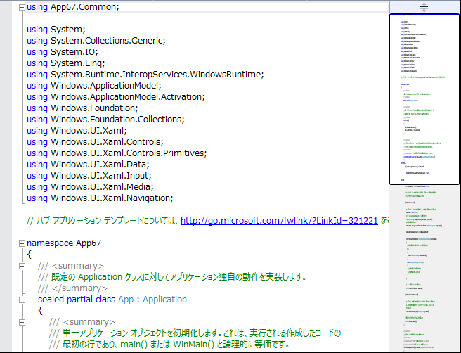
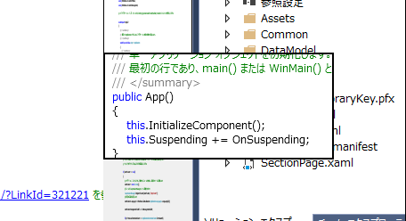

# Visual Studio でのソースコードのマップ表示とコードプレビュー
## License
- Apache License, Version 2.0
## Technologies
- Visual Studio 2013
## Topics
- Visual Studio
- Visual Studio 2013
## Updated
- 10/27/2014
## Description

<h3>Introduction</h3>

Visual Stuidio 2013 ではソースコード全体を俯瞰しながら必要なコードを探すための機能、マップ表示とコードプレビューが実装されています。デベロッパーがコードを書く場合コードが長くなった場合に、そのブログラムの全体像を把握しにくくなります。Visual Studio の機能の一つである、関数の表示を閉じてコンパクトに表示することもできますが、逆にコードが表示されなくなってしまうことで必要なコードがどこに記述されていたのが探し難くなってしまうというデメリットも出てきます。

そんな場合にはコードのマップ表示を使うとよいでしょう。コードのマップ表示を使うと、縮小表示されたソースコードの全体像が拡張されたスクロールバー上に表示されます。仮にエディタ上で関数や特定領域の表示をたたんでいたとしても、コードのマップ表示にはすべて展開された状態で表示されます。この場合も、エディタ上で通常表示されている場所は白い背景、多端で表示されていない場所はグレーの背景で表示するなど、エディタ画面との整合性が取れた形で表示がされています。

勿論ソースコードのマップ表示ではコードは縮小表示されているため、細かい関数名などを確認することはできません。しかし、マウスを該当するソースコード付近にホバーすることでポップアップウィンドウが表示され、そこにマウスで刺し師s♀

<h3>Building the Sample</h3>

本手順を試すには、Visual Studio 2013 Update 3 以降が必要です

<h3>Description</h3>

手順 :

<ol>
<li>Visual Studio を起動します。 </li><li>Visual Studio のメニューの [ファイル]を選択し、[新規作成]、[プロジェクト] の順に選択します。 </li><li>[新しいプロジェクト] ダイアログが表示されたら、左ペインの [Visual C#] とその下の [Windows ストアアプリ]さらにその下の[Windowsアプリ] を選択し、中央ペインの [ハブ アプリケーション(Windows)]を選び、[OK] ボタンをクリックします。
</li><li>アプリケーションのひな形が生成されたら、ソースコードペインの右端のスクロールバーを右クリックし、コンテキストメニューから「スクロールバーオプション」を選択します。
</li><li>オプションダイアログの下にある「動作」から「垂直スクロールバーでのマップモードの使用」を選択し、「OK」を押します。 
 

</li><li>ソースコードの右側にコードが縮小されて表示されています。白い部分が今表示されている部分になります。 
 

</li><li>また、マウスをホバーすると該当箇所のソースコードがプレビュー表示されることがわかります。これによって必要なコードを探しやすくなります。 </li><li>最後に[F5]キーを押して実行します。 
 

</li></ol>
<h3>More Information</h3>
