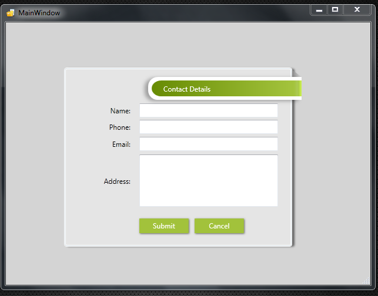

# WPF GroupBox Style
## Requires
- Visual Studio 2010
## License
- Apache License, Version 2.0
## Technologies
- WPF
## Topics
- WPF
- XAML
## Updated
- 03/04/2013
## Description

<h1>Introduction</h1>

<em>WPF Group box style
</em>

<em> 
</em>

Description

Recently one of my client asked me to show a good looking group box for our application, so that after a 15 min research i decided to create a group box which will contains a banner at right corner of group box with nice appearance.I
 thought it may be useful for others, so i have added this sample in Expression&rsquo;s Gallery, if you like and wish to use that, download the style and use in your project.This example is open for all, you can modify the style if you required, and please
 provide your valuable feedback, so i can improve more.

For more xaml related samples and articles please visit my blog:

&nbsp;

<a href="http://xamltag.wordpress.com/" target="_blank">http://xamltag.wordpress.com/</a>

&nbsp;

&nbsp;

This example is open for all, you can modify the style if you required, and please provide your valuable feedback, so i can improve more.

&nbsp;

&nbsp;

This example is open for all, you can modify the style if you required, and please provide your valuable feedback, so i can improve more.

Recently one of my client asked me to show a good looking group box for our application, so that after a 15 min research i decided to create a group box which will contains a banner at right corner of group box with nice appearance.I
 thought it may be useful for others, so i have added this sample in Expression&rsquo;s Gallery, if you like and wish to use that, download the style and use in your project.This example is open for all, you can modify the style if you required, and please
 provide your valuable feedback, so i can improve more.

