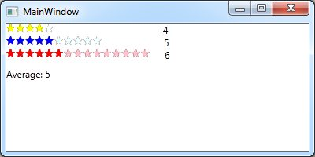

# WPF Rating User Control
## Requires
- Visual Studio 2012
## License
- MS-LPL
## Technologies
- C#
- WPF
- XAML
- .NET Framework
## Topics
- Controls
- WPF
- UserControls
## Updated
- 10/28/2012
## Description

<h1>Introduction</h1>

<em>This sample shows how you can build WPF User controls. This sample show how to build lightweight and simple rating control with another user control. 
</em>

<h1>Building the Sample</h1>

<em>There is no additional requirements other than that sample is created with Visual Studio 2012 and uses .NET Framework 4.5. To use control in your own project, just build the sample and reference MasaSam.Controls library or copy code to your own project. 
</em>

Description

<em>This sample contains two user controls a Star and Rating. </em>

<em>Star is just an simple UI control that draws star with two states: On or Off. It also has two color properties OfColor and OnColor that match the state of the star and are used to fill star depending on its state. It also has one additional event beside
 UserControl events and that is StateChanged event that notifies when state of the star is changed. State change occurs whenever left mouse button is release over the star. What's implemented in Star is the state change and setting appropriate color and mouse
 hover by changing the color. 
</em>

<em>Rating is the main user control of this sample and it uses the Star control to create the rating stars so familiar from several applications or web sites. Rating has few properties like Minimum, the non-rated value, Maximum, how many stars there is,
 Value, the current rating and On and Off colors of the stars. What's implemented in Rating is the indication of how many stars is currently selected, the drawing the required amount of stars, changing the star states if rating already set changes, and one
 additional event RatingChanged that notifies when the value of the Value property has changed. 
</em>

&nbsp;

<em>Sample application Windows is in following screenshot.</em>

<em> 
</em>

Using the control is simple as following snippet from MainWindow XAML shows.

XAML

Edit|Remove

xaml

<pre class="xaml">&lt;StackPanel&nbsp;Orientation=&quot;Horizontal&quot;&gt;&nbsp;
&nbsp;&nbsp;&nbsp;&nbsp;&nbsp;&nbsp;&lt;local:Rating&nbsp;Maximum=&quot;15&quot;&nbsp;x:Name=&quot;rtFifteen&quot;&nbsp;StarOffColor=&quot;Pink&quot;&nbsp;StarOnColor=&quot;Red&quot;&nbsp;RatingChanged=&quot;rtFifteen_RatingChanged&quot;/&gt;&nbsp;
&nbsp;&nbsp;&nbsp;&nbsp;&nbsp;&nbsp;&lt;TextBlock&nbsp;Text=&quot;{Binding&nbsp;ElementName=rtFifteen,&nbsp;Path=Value}&quot;&nbsp;Margin=&quot;18,0,0,0&quot;/&gt;&nbsp;
&lt;/StackPanel&gt;</pre>

&nbsp;

&nbsp;

<h1>Source Code Files</h1>
<ul>
<li><em>Star.xaml and Star.xaml.cs contains the classes and enumeration used by Star user control. 
</em></li><li><em><em>Rating.xaml and Rating.xaml.cs contains the classes used by Rating user control.</em></em>
</li><li><em>MainWindow.xaml and MainWindow.xaml.cs contains small windows demonstrating the usage.</em>
</li></ul>

&nbsp;

