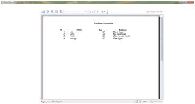

# WPF SAP Crystal report
## Requires
- Visual Studio 2010
## License
- Apache License, Version 2.0
## Technologies
- WPF
## Topics
- integrating SAP
## Updated
- 01/22/2013
## Description

There is no doubt that we fall a great problem that the VS2010 is not intregated crystal report. Initially it seems to be a big problem. Hare is some step for SAP crystal report that we can use in our WPF application.

<strong>Software Requirement</strong>

1.Download&nbsp; Crystal report from this Link:

<a href="http://downloads.businessobjects.com/akdlm/cr4vs2010/CRforVS_13_0.exe%20%0d2">http://downloads.businessobjects.com/akdlm/cr4vs2010/CRforVS_13_0.exe&nbsp;</a>

<a href="http://downloads.businessobjects.com/akdlm/cr4vs2010/CRforVS_13_0.exe%20%0d2">2</a>. Remove Crystal report if any exist.

3. Close your VS-2010 and install the new downloaded <strong>CRforVS_13_0 </strong>
.

4. Take a new WPF project

<strong>One report viewer window will display all crystal report</strong>

<pre><code style="color:black; word-wrap:normal">using <a class="libraryLink" href="http://msdn.microsoft.com/en-US/library/System.Windows.aspx" target="_blank" title="Auto generated link to System.Windows">System.Windows</a>;  
 using <a class="libraryLink" href="http://msdn.microsoft.com/en-US/library/System.Windows.Controls.Primitives.aspx" target="_blank" title="Auto generated link to System.Windows.Controls.Primitives">System.Windows.Controls.Primitives</a>;  
 namespace WPFReportTest  
 {  
   public partial class ReportViewerUI : Window  
   {  
     public ReportViewerUI()  
     {  
       InitializeComponent();  
       var sidepanel = crystalReportsViewer.FindName(&quot;btnToggleSidePanel&quot;) as ToggleButton;  
       if (sidepanel != null)  
       {  
         crystalReportsViewer.ViewChange &#43;= (x, y) =&gt; sidepanel.IsChecked = false;  
       }  
     }  
     public void setReportSource(CrystalDecisions.CrystalReports.Engine.ReportDocument aReport)  
     {  
       this.crystalReportsViewer.ViewerCore.ReportSource = aReport;  
     }  
   }  
 }    <strong>We will see the report</strong> </code></pre>

<h1>More Information</h1>

<em>&nbsp;</em><a title="http://atikpassion.blogspot.com.br/2011/02/wpf-crystal-report-viewer-using-sap.html" href="http://atikpassion.blogspot.com.br/2011/02/wpf-crystal-report-viewer-using-sap.html" target="_blank">http://atikpassion.blogspot.com.br/2011/02/wpf-crystal-report-viewer-using-sap.html</a>

