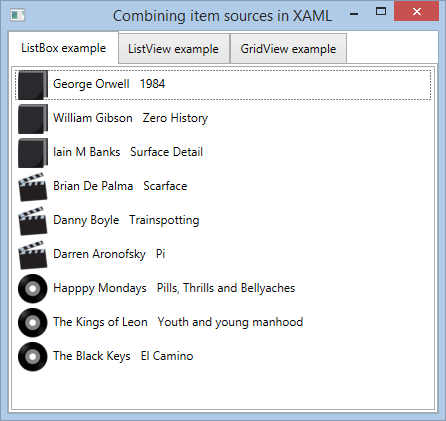

# WPF combining different data sources into a single item source in XAML
## Requires
- Visual Studio 2013
## License
- Apache License, Version 2.0
## Technologies
- C#
- WPF
- XAML
- WPF Data Binding
## Topics
- User Interface
- WPF
- XAML
- WPF Basics
- WPF Data Binding
- WPF Binding
## Updated
- 05/20/2015
## Description

<h3>Introduction</h3>

This sample shows how to combine separate collections of unrelated&nbsp;types into a single CompositeCollection of CollectionViewSources&nbsp;that can then be bound to an items control (ListBox, ListView etc.). It also shows how to use data templates to
 allow a control to display items of different types.

This approach is XAML based, making it a good option if you are worried about sticking to MVVM and keeping all presentation logic in the view.<em> 
</em>

<h3>Description</h3>

In the sample there are 3 ObservableCollections in the MainWindowViewModel. Each of these is for a different class (Movie, Book and Album).

C#

Edit|Remove

csharp
<pre class="hidden">        public ObservableCollection&lt;Movie&gt; Movies { get; set; }

        public ObservableCollection&lt;Book&gt; Books { get; set; }

        public ObservableCollection&lt;Album&gt; Albums { get; set; }</pre>

<pre class="csharp">&nbsp;&nbsp;&nbsp;&nbsp;&nbsp;&nbsp;&nbsp;&nbsp;public&nbsp;ObservableCollection&lt;Movie&gt;&nbsp;Movies&nbsp;{&nbsp;get;&nbsp;set;&nbsp;}&nbsp;
&nbsp;
&nbsp;&nbsp;&nbsp;&nbsp;&nbsp;&nbsp;&nbsp;&nbsp;public&nbsp;ObservableCollection&lt;Book&gt;&nbsp;Books&nbsp;{&nbsp;get;&nbsp;set;&nbsp;}&nbsp;
&nbsp;
&nbsp;&nbsp;&nbsp;&nbsp;&nbsp;&nbsp;&nbsp;&nbsp;public&nbsp;ObservableCollection&lt;Album&gt;&nbsp;Albums&nbsp;{&nbsp;get;&nbsp;set;&nbsp;}</pre>

The observable collections are declared as&nbsp;<a href="http://msdn.microsoft.com/en-us/library/system.windows.data.collectionviewsource(v=vs.110).aspx" target="_blank">CollectionViewSources</a>&nbsp;as a window level resource in the MainWindow. They are
 combined into a <a href="http://msdn.microsoft.com/en-us/library/system.windows.data.compositecollection(v=vs.110).aspx">
CompositeCollection</a>,&nbsp;which can be used as an item source for any items control you want.

XAML

Edit|Remove

xaml
<pre class="hidden">&lt;Window.Resources&gt;
    &lt;!--Collection views for the ObservableCollections in the view model or code behind.--&gt;
    &lt;CollectionViewSource x:Key=&quot;BooksViewSource&quot; Source=&quot;{Binding Books}&quot;/&gt;
    &lt;CollectionViewSource x:Key=&quot;MoviesViewSource&quot; Source=&quot;{Binding Movies}&quot;/&gt;
    &lt;CollectionViewSource x:Key=&quot;AlbumsViewSource&quot; Source=&quot;{Binding Albums}&quot;/&gt;
        
    &lt;!--Combine the collection views into a single composite collection--&gt;
    &lt;CompositeCollection x:Key=&quot;CombinedCollection&quot;&gt;            
        &lt;CollectionContainer Collection=&quot;{Binding Source={StaticResource BooksViewSource}}&quot; /&gt;
        &lt;CollectionContainer Collection=&quot;{Binding Source={StaticResource MoviesViewSource}}&quot; /&gt;
        &lt;CollectionContainer Collection=&quot;{Binding Source={StaticResource AlbumsViewSource}}&quot; /&gt;
    &lt;/CompositeCollection&gt;             
&lt;/Window.Resources&gt;</pre>

<pre class="xaml">&lt;Window.Resources&gt;&nbsp;
&nbsp;&nbsp;&nbsp;&nbsp;&lt;!--Collection&nbsp;views&nbsp;for&nbsp;the&nbsp;ObservableCollections&nbsp;in&nbsp;the&nbsp;view&nbsp;model&nbsp;or&nbsp;code&nbsp;behind.--&gt;&nbsp;
&nbsp;&nbsp;&nbsp;&nbsp;&lt;CollectionViewSource&nbsp;x:Key=&quot;BooksViewSource&quot;&nbsp;Source=&quot;{Binding&nbsp;Books}&quot;/&gt;&nbsp;
&nbsp;&nbsp;&nbsp;&nbsp;&lt;CollectionViewSource&nbsp;x:Key=&quot;MoviesViewSource&quot;&nbsp;Source=&quot;{Binding&nbsp;Movies}&quot;/&gt;&nbsp;
&nbsp;&nbsp;&nbsp;&nbsp;&lt;CollectionViewSource&nbsp;x:Key=&quot;AlbumsViewSource&quot;&nbsp;Source=&quot;{Binding&nbsp;Albums}&quot;/&gt;&nbsp;
&nbsp;&nbsp;&nbsp;&nbsp;&nbsp;&nbsp;&nbsp;&nbsp;&nbsp;
&nbsp;&nbsp;&nbsp;&nbsp;&lt;!--Combine&nbsp;the&nbsp;collection&nbsp;views&nbsp;into&nbsp;a&nbsp;single&nbsp;composite&nbsp;collection--&gt;&nbsp;
&nbsp;&nbsp;&nbsp;&nbsp;&lt;CompositeCollection&nbsp;x:Key=&quot;CombinedCollection&quot;&gt;&nbsp;&nbsp;&nbsp;&nbsp;&nbsp;&nbsp;&nbsp;&nbsp;&nbsp;&nbsp;&nbsp;&nbsp;&nbsp;
&nbsp;&nbsp;&nbsp;&nbsp;&nbsp;&nbsp;&nbsp;&nbsp;&lt;CollectionContainer&nbsp;Collection=&quot;{Binding&nbsp;Source={StaticResource&nbsp;BooksViewSource}}&quot;&nbsp;/&gt;&nbsp;
&nbsp;&nbsp;&nbsp;&nbsp;&nbsp;&nbsp;&nbsp;&nbsp;&lt;CollectionContainer&nbsp;Collection=&quot;{Binding&nbsp;Source={StaticResource&nbsp;MoviesViewSource}}&quot;&nbsp;/&gt;&nbsp;
&nbsp;&nbsp;&nbsp;&nbsp;&nbsp;&nbsp;&nbsp;&nbsp;&lt;CollectionContainer&nbsp;Collection=&quot;{Binding&nbsp;Source={StaticResource&nbsp;AlbumsViewSource}}&quot;&nbsp;/&gt;&nbsp;
&nbsp;&nbsp;&nbsp;&nbsp;&lt;/CompositeCollection&gt;&nbsp;&nbsp;&nbsp;&nbsp;&nbsp;&nbsp;&nbsp;&nbsp;&nbsp;&nbsp;&nbsp;&nbsp;&nbsp;&nbsp;
&lt;/Window.Resources&gt;</pre>

MainWindow has a TabControl containing 3 examples of how to use the combined collection with different item controls:

<h4>Listbox example</h4>
<h4 class="scriptcode">

XAML

Edit|Remove

xaml
<pre class="hidden">&lt;ListBox ItemsSource=&quot;{StaticResource CombinedCollection}&quot;&gt;
    &lt;ListBox.Resources&gt;
        &lt;!-- data templates which will be applied by type (Album,Movie,Book) --&gt;
        &lt;DataTemplate DataType=&quot;{x:Type local:Album}&quot;&gt;
            &lt;StackPanel Orientation=&quot;Horizontal&quot;&gt;
                &lt;Image Source=&quot;{StaticResource AlbumImg}&quot;/&gt;
                &lt;TextBlock Text=&quot;{Binding Path=Artist}&quot;/&gt;
                &lt;TextBlock Text=&quot;{Binding Path=Title}&quot;/&gt;
            &lt;/StackPanel&gt;
        &lt;/DataTemplate&gt;
        &lt;DataTemplate DataType=&quot;{x:Type local:Movie}&quot;&gt;
            &lt;StackPanel Orientation=&quot;Horizontal&quot;&gt;
                &lt;Image Source=&quot;{StaticResource MovieImg}&quot;/&gt;
                &lt;TextBlock Text=&quot;{Binding Path=Director}&quot;/&gt;
                &lt;TextBlock Text=&quot;{Binding Path=Title}&quot;/&gt;
            &lt;/StackPanel&gt;
        &lt;/DataTemplate&gt;
        &lt;DataTemplate DataType=&quot;{x:Type local:Book}&quot;&gt;
            &lt;StackPanel Orientation=&quot;Horizontal&quot;&gt;
                &lt;Image Source=&quot;{StaticResource BookImg}&quot;/&gt;
                &lt;TextBlock Text=&quot;{Binding Path=Author}&quot;/&gt;
                &lt;TextBlock Text=&quot;{Binding Path=Title}&quot;/&gt;
            &lt;/StackPanel&gt;
        &lt;/DataTemplate&gt;
    &lt;/ListBox.Resources&gt;
&lt;/ListBox&gt;</pre>

<pre class="xaml">&lt;ListBox&nbsp;ItemsSource=&quot;{StaticResource&nbsp;CombinedCollection}&quot;&gt;&nbsp;
&nbsp;&nbsp;&nbsp;&nbsp;&lt;ListBox.Resources&gt;&nbsp;
&nbsp;&nbsp;&nbsp;&nbsp;&nbsp;&nbsp;&nbsp;&nbsp;&lt;!--&nbsp;data&nbsp;templates&nbsp;which&nbsp;will&nbsp;be&nbsp;applied&nbsp;by&nbsp;type&nbsp;(Album,Movie,Book)&nbsp;--&gt;&nbsp;
&nbsp;&nbsp;&nbsp;&nbsp;&nbsp;&nbsp;&nbsp;&nbsp;&lt;DataTemplate&nbsp;DataType=&quot;{x:Type&nbsp;local:Album}&quot;&gt;&nbsp;
&nbsp;&nbsp;&nbsp;&nbsp;&nbsp;&nbsp;&nbsp;&nbsp;&nbsp;&nbsp;&nbsp;&nbsp;&lt;StackPanel&nbsp;Orientation=&quot;Horizontal&quot;&gt;&nbsp;
&nbsp;&nbsp;&nbsp;&nbsp;&nbsp;&nbsp;&nbsp;&nbsp;&nbsp;&nbsp;&nbsp;&nbsp;&nbsp;&nbsp;&nbsp;&nbsp;&lt;Image&nbsp;Source=&quot;{StaticResource&nbsp;AlbumImg}&quot;/&gt;&nbsp;
&nbsp;&nbsp;&nbsp;&nbsp;&nbsp;&nbsp;&nbsp;&nbsp;&nbsp;&nbsp;&nbsp;&nbsp;&nbsp;&nbsp;&nbsp;&nbsp;&lt;TextBlock&nbsp;Text=&quot;{Binding&nbsp;Path=Artist}&quot;/&gt;&nbsp;
&nbsp;&nbsp;&nbsp;&nbsp;&nbsp;&nbsp;&nbsp;&nbsp;&nbsp;&nbsp;&nbsp;&nbsp;&nbsp;&nbsp;&nbsp;&nbsp;&lt;TextBlock&nbsp;Text=&quot;{Binding&nbsp;Path=Title}&quot;/&gt;&nbsp;
&nbsp;&nbsp;&nbsp;&nbsp;&nbsp;&nbsp;&nbsp;&nbsp;&nbsp;&nbsp;&nbsp;&nbsp;&lt;/StackPanel&gt;&nbsp;
&nbsp;&nbsp;&nbsp;&nbsp;&nbsp;&nbsp;&nbsp;&nbsp;&lt;/DataTemplate&gt;&nbsp;
&nbsp;&nbsp;&nbsp;&nbsp;&nbsp;&nbsp;&nbsp;&nbsp;&lt;DataTemplate&nbsp;DataType=&quot;{x:Type&nbsp;local:Movie}&quot;&gt;&nbsp;
&nbsp;&nbsp;&nbsp;&nbsp;&nbsp;&nbsp;&nbsp;&nbsp;&nbsp;&nbsp;&nbsp;&nbsp;&lt;StackPanel&nbsp;Orientation=&quot;Horizontal&quot;&gt;&nbsp;
&nbsp;&nbsp;&nbsp;&nbsp;&nbsp;&nbsp;&nbsp;&nbsp;&nbsp;&nbsp;&nbsp;&nbsp;&nbsp;&nbsp;&nbsp;&nbsp;&lt;Image&nbsp;Source=&quot;{StaticResource&nbsp;MovieImg}&quot;/&gt;&nbsp;
&nbsp;&nbsp;&nbsp;&nbsp;&nbsp;&nbsp;&nbsp;&nbsp;&nbsp;&nbsp;&nbsp;&nbsp;&nbsp;&nbsp;&nbsp;&nbsp;&lt;TextBlock&nbsp;Text=&quot;{Binding&nbsp;Path=Director}&quot;/&gt;&nbsp;
&nbsp;&nbsp;&nbsp;&nbsp;&nbsp;&nbsp;&nbsp;&nbsp;&nbsp;&nbsp;&nbsp;&nbsp;&nbsp;&nbsp;&nbsp;&nbsp;&lt;TextBlock&nbsp;Text=&quot;{Binding&nbsp;Path=Title}&quot;/&gt;&nbsp;
&nbsp;&nbsp;&nbsp;&nbsp;&nbsp;&nbsp;&nbsp;&nbsp;&nbsp;&nbsp;&nbsp;&nbsp;&lt;/StackPanel&gt;&nbsp;
&nbsp;&nbsp;&nbsp;&nbsp;&nbsp;&nbsp;&nbsp;&nbsp;&lt;/DataTemplate&gt;&nbsp;
&nbsp;&nbsp;&nbsp;&nbsp;&nbsp;&nbsp;&nbsp;&nbsp;&lt;DataTemplate&nbsp;DataType=&quot;{x:Type&nbsp;local:Book}&quot;&gt;&nbsp;
&nbsp;&nbsp;&nbsp;&nbsp;&nbsp;&nbsp;&nbsp;&nbsp;&nbsp;&nbsp;&nbsp;&nbsp;&lt;StackPanel&nbsp;Orientation=&quot;Horizontal&quot;&gt;&nbsp;
&nbsp;&nbsp;&nbsp;&nbsp;&nbsp;&nbsp;&nbsp;&nbsp;&nbsp;&nbsp;&nbsp;&nbsp;&nbsp;&nbsp;&nbsp;&nbsp;&lt;Image&nbsp;Source=&quot;{StaticResource&nbsp;BookImg}&quot;/&gt;&nbsp;
&nbsp;&nbsp;&nbsp;&nbsp;&nbsp;&nbsp;&nbsp;&nbsp;&nbsp;&nbsp;&nbsp;&nbsp;&nbsp;&nbsp;&nbsp;&nbsp;&lt;TextBlock&nbsp;Text=&quot;{Binding&nbsp;Path=Author}&quot;/&gt;&nbsp;
&nbsp;&nbsp;&nbsp;&nbsp;&nbsp;&nbsp;&nbsp;&nbsp;&nbsp;&nbsp;&nbsp;&nbsp;&nbsp;&nbsp;&nbsp;&nbsp;&lt;TextBlock&nbsp;Text=&quot;{Binding&nbsp;Path=Title}&quot;/&gt;&nbsp;
&nbsp;&nbsp;&nbsp;&nbsp;&nbsp;&nbsp;&nbsp;&nbsp;&nbsp;&nbsp;&nbsp;&nbsp;&lt;/StackPanel&gt;&nbsp;
&nbsp;&nbsp;&nbsp;&nbsp;&nbsp;&nbsp;&nbsp;&nbsp;&lt;/DataTemplate&gt;&nbsp;
&nbsp;&nbsp;&nbsp;&nbsp;&lt;/ListBox.Resources&gt;&nbsp;
&lt;/ListBox&gt;</pre>

</h4>
<h4>&nbsp;ListView example</h4>
<h4 class="scriptcode">

XAML

Edit|Remove

xaml
<pre class="hidden">&lt;ListView ItemsSource=&quot;{StaticResource CombinedCollection}&quot;&gt;
    &lt;ListView.Resources&gt;
        &lt;!-- data templates which will be applied by type (Album,Movie,Book) --&gt;
        &lt;DataTemplate DataType=&quot;{x:Type local:Album}&quot;&gt;
            &lt;StackPanel Orientation=&quot;Horizontal&quot;&gt;
                &lt;Image Source=&quot;{StaticResource AlbumImg}&quot;/&gt;
                &lt;TextBlock Text=&quot;{Binding Path=Artist}&quot;/&gt;
                &lt;TextBlock Text=&quot;{Binding Path=Title}&quot;/&gt;
            &lt;/StackPanel&gt;
        &lt;/DataTemplate&gt;
        &lt;DataTemplate DataType=&quot;{x:Type local:Movie}&quot;&gt;
            &lt;StackPanel Orientation=&quot;Horizontal&quot;&gt;
                &lt;Image Source=&quot;{StaticResource MovieImg}&quot;/&gt;
                &lt;TextBlock Text=&quot;{Binding Path=Director}&quot;/&gt;
                &lt;TextBlock Text=&quot;{Binding Path=Title}&quot;/&gt;
            &lt;/StackPanel&gt;
        &lt;/DataTemplate&gt;
        &lt;DataTemplate DataType=&quot;{x:Type local:Book}&quot;&gt;
            &lt;StackPanel Orientation=&quot;Horizontal&quot;&gt;
                &lt;Image Source=&quot;{StaticResource BookImg}&quot;/&gt;
                &lt;TextBlock Text=&quot;{Binding Path=Author}&quot;/&gt;
                &lt;TextBlock Text=&quot;{Binding Path=Title}&quot;/&gt;
            &lt;/StackPanel&gt;
        &lt;/DataTemplate&gt;
    &lt;/ListView.Resources&gt;
&lt;/ListView&gt;</pre>

<pre class="xaml">&lt;ListView&nbsp;ItemsSource=&quot;{StaticResource&nbsp;CombinedCollection}&quot;&gt;&nbsp;
&nbsp;&nbsp;&nbsp;&nbsp;&lt;ListView.Resources&gt;&nbsp;
&nbsp;&nbsp;&nbsp;&nbsp;&nbsp;&nbsp;&nbsp;&nbsp;&lt;!--&nbsp;data&nbsp;templates&nbsp;which&nbsp;will&nbsp;be&nbsp;applied&nbsp;by&nbsp;type&nbsp;(Album,Movie,Book)&nbsp;--&gt;&nbsp;
&nbsp;&nbsp;&nbsp;&nbsp;&nbsp;&nbsp;&nbsp;&nbsp;&lt;DataTemplate&nbsp;DataType=&quot;{x:Type&nbsp;local:Album}&quot;&gt;&nbsp;
&nbsp;&nbsp;&nbsp;&nbsp;&nbsp;&nbsp;&nbsp;&nbsp;&nbsp;&nbsp;&nbsp;&nbsp;&lt;StackPanel&nbsp;Orientation=&quot;Horizontal&quot;&gt;&nbsp;
&nbsp;&nbsp;&nbsp;&nbsp;&nbsp;&nbsp;&nbsp;&nbsp;&nbsp;&nbsp;&nbsp;&nbsp;&nbsp;&nbsp;&nbsp;&nbsp;&lt;Image&nbsp;Source=&quot;{StaticResource&nbsp;AlbumImg}&quot;/&gt;&nbsp;
&nbsp;&nbsp;&nbsp;&nbsp;&nbsp;&nbsp;&nbsp;&nbsp;&nbsp;&nbsp;&nbsp;&nbsp;&nbsp;&nbsp;&nbsp;&nbsp;&lt;TextBlock&nbsp;Text=&quot;{Binding&nbsp;Path=Artist}&quot;/&gt;&nbsp;
&nbsp;&nbsp;&nbsp;&nbsp;&nbsp;&nbsp;&nbsp;&nbsp;&nbsp;&nbsp;&nbsp;&nbsp;&nbsp;&nbsp;&nbsp;&nbsp;&lt;TextBlock&nbsp;Text=&quot;{Binding&nbsp;Path=Title}&quot;/&gt;&nbsp;
&nbsp;&nbsp;&nbsp;&nbsp;&nbsp;&nbsp;&nbsp;&nbsp;&nbsp;&nbsp;&nbsp;&nbsp;&lt;/StackPanel&gt;&nbsp;
&nbsp;&nbsp;&nbsp;&nbsp;&nbsp;&nbsp;&nbsp;&nbsp;&lt;/DataTemplate&gt;&nbsp;
&nbsp;&nbsp;&nbsp;&nbsp;&nbsp;&nbsp;&nbsp;&nbsp;&lt;DataTemplate&nbsp;DataType=&quot;{x:Type&nbsp;local:Movie}&quot;&gt;&nbsp;
&nbsp;&nbsp;&nbsp;&nbsp;&nbsp;&nbsp;&nbsp;&nbsp;&nbsp;&nbsp;&nbsp;&nbsp;&lt;StackPanel&nbsp;Orientation=&quot;Horizontal&quot;&gt;&nbsp;
&nbsp;&nbsp;&nbsp;&nbsp;&nbsp;&nbsp;&nbsp;&nbsp;&nbsp;&nbsp;&nbsp;&nbsp;&nbsp;&nbsp;&nbsp;&nbsp;&lt;Image&nbsp;Source=&quot;{StaticResource&nbsp;MovieImg}&quot;/&gt;&nbsp;
&nbsp;&nbsp;&nbsp;&nbsp;&nbsp;&nbsp;&nbsp;&nbsp;&nbsp;&nbsp;&nbsp;&nbsp;&nbsp;&nbsp;&nbsp;&nbsp;&lt;TextBlock&nbsp;Text=&quot;{Binding&nbsp;Path=Director}&quot;/&gt;&nbsp;
&nbsp;&nbsp;&nbsp;&nbsp;&nbsp;&nbsp;&nbsp;&nbsp;&nbsp;&nbsp;&nbsp;&nbsp;&nbsp;&nbsp;&nbsp;&nbsp;&lt;TextBlock&nbsp;Text=&quot;{Binding&nbsp;Path=Title}&quot;/&gt;&nbsp;
&nbsp;&nbsp;&nbsp;&nbsp;&nbsp;&nbsp;&nbsp;&nbsp;&nbsp;&nbsp;&nbsp;&nbsp;&lt;/StackPanel&gt;&nbsp;
&nbsp;&nbsp;&nbsp;&nbsp;&nbsp;&nbsp;&nbsp;&nbsp;&lt;/DataTemplate&gt;&nbsp;
&nbsp;&nbsp;&nbsp;&nbsp;&nbsp;&nbsp;&nbsp;&nbsp;&lt;DataTemplate&nbsp;DataType=&quot;{x:Type&nbsp;local:Book}&quot;&gt;&nbsp;
&nbsp;&nbsp;&nbsp;&nbsp;&nbsp;&nbsp;&nbsp;&nbsp;&nbsp;&nbsp;&nbsp;&nbsp;&lt;StackPanel&nbsp;Orientation=&quot;Horizontal&quot;&gt;&nbsp;
&nbsp;&nbsp;&nbsp;&nbsp;&nbsp;&nbsp;&nbsp;&nbsp;&nbsp;&nbsp;&nbsp;&nbsp;&nbsp;&nbsp;&nbsp;&nbsp;&lt;Image&nbsp;Source=&quot;{StaticResource&nbsp;BookImg}&quot;/&gt;&nbsp;
&nbsp;&nbsp;&nbsp;&nbsp;&nbsp;&nbsp;&nbsp;&nbsp;&nbsp;&nbsp;&nbsp;&nbsp;&nbsp;&nbsp;&nbsp;&nbsp;&lt;TextBlock&nbsp;Text=&quot;{Binding&nbsp;Path=Author}&quot;/&gt;&nbsp;
&nbsp;&nbsp;&nbsp;&nbsp;&nbsp;&nbsp;&nbsp;&nbsp;&nbsp;&nbsp;&nbsp;&nbsp;&nbsp;&nbsp;&nbsp;&nbsp;&lt;TextBlock&nbsp;Text=&quot;{Binding&nbsp;Path=Title}&quot;/&gt;&nbsp;
&nbsp;&nbsp;&nbsp;&nbsp;&nbsp;&nbsp;&nbsp;&nbsp;&nbsp;&nbsp;&nbsp;&nbsp;&lt;/StackPanel&gt;&nbsp;
&nbsp;&nbsp;&nbsp;&nbsp;&nbsp;&nbsp;&nbsp;&nbsp;&lt;/DataTemplate&gt;&nbsp;
&nbsp;&nbsp;&nbsp;&nbsp;&lt;/ListView.Resources&gt;&nbsp;
&lt;/ListView&gt;</pre>

</h4>
<h4>GridView example</h4>

The final tab shows how to use a ListView with a GridView. In this case a CellTemplateSeletor (<strong>ByDataTemplateSelector</strong>)&nbsp;is required to handle the property names which are not shared between the classes (Author, Director and Artist).

<h3 class="scriptcode">

XAML

Edit|Remove

xaml
<pre class="hidden">&lt;ListView ItemsSource=&quot;{StaticResource CombinedCollection}&quot;&gt;                                        
    &lt;ListView.Resources&gt;
        &lt;!-- data templates which will be applied by type (Album,Movie,Book) to show the icon --&gt;
        &lt;DataTemplate DataType=&quot;{x:Type local:Album}&quot;&gt;
            &lt;Image Source=&quot;{StaticResource AlbumImg}&quot;/&gt;
        &lt;/DataTemplate&gt;
        &lt;DataTemplate DataType=&quot;{x:Type local:Book}&quot;&gt;
            &lt;Image Source=&quot;{StaticResource BookImg}&quot;/&gt;
        &lt;/DataTemplate&gt;
        &lt;DataTemplate DataType=&quot;{x:Type local:Movie}&quot;&gt;
            &lt;Image Source=&quot;{StaticResource MovieImg}&quot;/&gt;
        &lt;/DataTemplate&gt;

        &lt;!--the cell template selector to choose the template to use when displaying: Artist, Author or Director--&gt;
        &lt;local:ByDataTemplateSelector x:Key=&quot;ByDataTemplateSelector&quot;/&gt;

        &lt;!--the cell templates to select from--&gt;
        &lt;DataTemplate x:Key=&quot;AuthorTemplate&quot;&gt;
            &lt;TextBlock Text=&quot;{Binding Author}&quot;/&gt;
        &lt;/DataTemplate&gt;
        &lt;DataTemplate x:Key=&quot;DirectorTemplate&quot;&gt;
            &lt;TextBlock Text=&quot;{Binding Director}&quot;/&gt;
        &lt;/DataTemplate&gt;
        &lt;DataTemplate x:Key=&quot;ArtistTemplate&quot;&gt;
            &lt;TextBlock Text=&quot;{Binding Artist}&quot;/&gt;
        &lt;/DataTemplate&gt;
    &lt;/ListView.Resources&gt;
    &lt;ListView.View&gt;                    
        &lt;GridView&gt;                
            &lt;GridViewColumn/&gt;
            &lt;GridViewColumn Header=&quot;Title&quot;&gt;
                &lt;GridViewColumn.CellTemplate&gt;
                    &lt;DataTemplate&gt;
                        &lt;TextBlock Text=&quot;{Binding Title}&quot;/&gt;
                    &lt;/DataTemplate&gt;
                &lt;/GridViewColumn.CellTemplate&gt;
            &lt;/GridViewColumn&gt;
            &lt;GridViewColumn Header=&quot;By&quot; CellTemplateSelector=&quot;{StaticResource ByDataTemplateSelector}&quot;/&gt;
        &lt;/GridView&gt;                
    &lt;/ListView.View&gt;
&lt;/ListView&gt;</pre>

<pre class="xaml">&lt;ListView&nbsp;ItemsSource=&quot;{StaticResource&nbsp;CombinedCollection}&quot;&gt;&nbsp;&nbsp;&nbsp;&nbsp;&nbsp;&nbsp;&nbsp;&nbsp;&nbsp;&nbsp;&nbsp;&nbsp;&nbsp;&nbsp;&nbsp;&nbsp;&nbsp;&nbsp;&nbsp;&nbsp;&nbsp;&nbsp;&nbsp;&nbsp;&nbsp;&nbsp;&nbsp;&nbsp;&nbsp;&nbsp;&nbsp;&nbsp;&nbsp;&nbsp;&nbsp;&nbsp;&nbsp;&nbsp;&nbsp;&nbsp;&nbsp;
&nbsp;&nbsp;&nbsp;&nbsp;&lt;ListView.Resources&gt;&nbsp;
&nbsp;&nbsp;&nbsp;&nbsp;&nbsp;&nbsp;&nbsp;&nbsp;&lt;!--&nbsp;data&nbsp;templates&nbsp;which&nbsp;will&nbsp;be&nbsp;applied&nbsp;by&nbsp;type&nbsp;(Album,Movie,Book)&nbsp;to&nbsp;show&nbsp;the&nbsp;icon&nbsp;--&gt;&nbsp;
&nbsp;&nbsp;&nbsp;&nbsp;&nbsp;&nbsp;&nbsp;&nbsp;&lt;DataTemplate&nbsp;DataType=&quot;{x:Type&nbsp;local:Album}&quot;&gt;&nbsp;
&nbsp;&nbsp;&nbsp;&nbsp;&nbsp;&nbsp;&nbsp;&nbsp;&nbsp;&nbsp;&nbsp;&nbsp;&lt;Image&nbsp;Source=&quot;{StaticResource&nbsp;AlbumImg}&quot;/&gt;&nbsp;
&nbsp;&nbsp;&nbsp;&nbsp;&nbsp;&nbsp;&nbsp;&nbsp;&lt;/DataTemplate&gt;&nbsp;
&nbsp;&nbsp;&nbsp;&nbsp;&nbsp;&nbsp;&nbsp;&nbsp;&lt;DataTemplate&nbsp;DataType=&quot;{x:Type&nbsp;local:Book}&quot;&gt;&nbsp;
&nbsp;&nbsp;&nbsp;&nbsp;&nbsp;&nbsp;&nbsp;&nbsp;&nbsp;&nbsp;&nbsp;&nbsp;&lt;Image&nbsp;Source=&quot;{StaticResource&nbsp;BookImg}&quot;/&gt;&nbsp;
&nbsp;&nbsp;&nbsp;&nbsp;&nbsp;&nbsp;&nbsp;&nbsp;&lt;/DataTemplate&gt;&nbsp;
&nbsp;&nbsp;&nbsp;&nbsp;&nbsp;&nbsp;&nbsp;&nbsp;&lt;DataTemplate&nbsp;DataType=&quot;{x:Type&nbsp;local:Movie}&quot;&gt;&nbsp;
&nbsp;&nbsp;&nbsp;&nbsp;&nbsp;&nbsp;&nbsp;&nbsp;&nbsp;&nbsp;&nbsp;&nbsp;&lt;Image&nbsp;Source=&quot;{StaticResource&nbsp;MovieImg}&quot;/&gt;&nbsp;
&nbsp;&nbsp;&nbsp;&nbsp;&nbsp;&nbsp;&nbsp;&nbsp;&lt;/DataTemplate&gt;&nbsp;
&nbsp;
&nbsp;&nbsp;&nbsp;&nbsp;&nbsp;&nbsp;&nbsp;&nbsp;&lt;!--the&nbsp;cell&nbsp;template&nbsp;selector&nbsp;to&nbsp;choose&nbsp;the&nbsp;template&nbsp;to&nbsp;use&nbsp;when&nbsp;displaying:&nbsp;Artist,&nbsp;Author&nbsp;or&nbsp;Director--&gt;&nbsp;
&nbsp;&nbsp;&nbsp;&nbsp;&nbsp;&nbsp;&nbsp;&nbsp;&lt;local:ByDataTemplateSelector&nbsp;x:Key=&quot;ByDataTemplateSelector&quot;/&gt;&nbsp;
&nbsp;
&nbsp;&nbsp;&nbsp;&nbsp;&nbsp;&nbsp;&nbsp;&nbsp;&lt;!--the&nbsp;cell&nbsp;templates&nbsp;to&nbsp;select&nbsp;from--&gt;&nbsp;
&nbsp;&nbsp;&nbsp;&nbsp;&nbsp;&nbsp;&nbsp;&nbsp;&lt;DataTemplate&nbsp;x:Key=&quot;AuthorTemplate&quot;&gt;&nbsp;
&nbsp;&nbsp;&nbsp;&nbsp;&nbsp;&nbsp;&nbsp;&nbsp;&nbsp;&nbsp;&nbsp;&nbsp;&lt;TextBlock&nbsp;Text=&quot;{Binding&nbsp;Author}&quot;/&gt;&nbsp;
&nbsp;&nbsp;&nbsp;&nbsp;&nbsp;&nbsp;&nbsp;&nbsp;&lt;/DataTemplate&gt;&nbsp;
&nbsp;&nbsp;&nbsp;&nbsp;&nbsp;&nbsp;&nbsp;&nbsp;&lt;DataTemplate&nbsp;x:Key=&quot;DirectorTemplate&quot;&gt;&nbsp;
&nbsp;&nbsp;&nbsp;&nbsp;&nbsp;&nbsp;&nbsp;&nbsp;&nbsp;&nbsp;&nbsp;&nbsp;&lt;TextBlock&nbsp;Text=&quot;{Binding&nbsp;Director}&quot;/&gt;&nbsp;
&nbsp;&nbsp;&nbsp;&nbsp;&nbsp;&nbsp;&nbsp;&nbsp;&lt;/DataTemplate&gt;&nbsp;
&nbsp;&nbsp;&nbsp;&nbsp;&nbsp;&nbsp;&nbsp;&nbsp;&lt;DataTemplate&nbsp;x:Key=&quot;ArtistTemplate&quot;&gt;&nbsp;
&nbsp;&nbsp;&nbsp;&nbsp;&nbsp;&nbsp;&nbsp;&nbsp;&nbsp;&nbsp;&nbsp;&nbsp;&lt;TextBlock&nbsp;Text=&quot;{Binding&nbsp;Artist}&quot;/&gt;&nbsp;
&nbsp;&nbsp;&nbsp;&nbsp;&nbsp;&nbsp;&nbsp;&nbsp;&lt;/DataTemplate&gt;&nbsp;
&nbsp;&nbsp;&nbsp;&nbsp;&lt;/ListView.Resources&gt;&nbsp;
&nbsp;&nbsp;&nbsp;&nbsp;&lt;ListView.View&gt;&nbsp;&nbsp;&nbsp;&nbsp;&nbsp;&nbsp;&nbsp;&nbsp;&nbsp;&nbsp;&nbsp;&nbsp;&nbsp;&nbsp;&nbsp;&nbsp;&nbsp;&nbsp;&nbsp;&nbsp;&nbsp;
&nbsp;&nbsp;&nbsp;&nbsp;&nbsp;&nbsp;&nbsp;&nbsp;&lt;GridView&gt;&nbsp;&nbsp;&nbsp;&nbsp;&nbsp;&nbsp;&nbsp;&nbsp;&nbsp;&nbsp;&nbsp;&nbsp;&nbsp;&nbsp;&nbsp;&nbsp;&nbsp;
&nbsp;&nbsp;&nbsp;&nbsp;&nbsp;&nbsp;&nbsp;&nbsp;&nbsp;&nbsp;&nbsp;&nbsp;&lt;GridViewColumn/&gt;&nbsp;
&nbsp;&nbsp;&nbsp;&nbsp;&nbsp;&nbsp;&nbsp;&nbsp;&nbsp;&nbsp;&nbsp;&nbsp;&lt;GridViewColumn&nbsp;Header=&quot;Title&quot;&gt;&nbsp;
&nbsp;&nbsp;&nbsp;&nbsp;&nbsp;&nbsp;&nbsp;&nbsp;&nbsp;&nbsp;&nbsp;&nbsp;&nbsp;&nbsp;&nbsp;&nbsp;&lt;GridViewColumn.CellTemplate&gt;&nbsp;
&nbsp;&nbsp;&nbsp;&nbsp;&nbsp;&nbsp;&nbsp;&nbsp;&nbsp;&nbsp;&nbsp;&nbsp;&nbsp;&nbsp;&nbsp;&nbsp;&nbsp;&nbsp;&nbsp;&nbsp;&lt;DataTemplate&gt;&nbsp;
&nbsp;&nbsp;&nbsp;&nbsp;&nbsp;&nbsp;&nbsp;&nbsp;&nbsp;&nbsp;&nbsp;&nbsp;&nbsp;&nbsp;&nbsp;&nbsp;&nbsp;&nbsp;&nbsp;&nbsp;&nbsp;&nbsp;&nbsp;&nbsp;&lt;TextBlock&nbsp;Text=&quot;{Binding&nbsp;Title}&quot;/&gt;&nbsp;
&nbsp;&nbsp;&nbsp;&nbsp;&nbsp;&nbsp;&nbsp;&nbsp;&nbsp;&nbsp;&nbsp;&nbsp;&nbsp;&nbsp;&nbsp;&nbsp;&nbsp;&nbsp;&nbsp;&nbsp;&lt;/DataTemplate&gt;&nbsp;
&nbsp;&nbsp;&nbsp;&nbsp;&nbsp;&nbsp;&nbsp;&nbsp;&nbsp;&nbsp;&nbsp;&nbsp;&nbsp;&nbsp;&nbsp;&nbsp;&lt;/GridViewColumn.CellTemplate&gt;&nbsp;
&nbsp;&nbsp;&nbsp;&nbsp;&nbsp;&nbsp;&nbsp;&nbsp;&nbsp;&nbsp;&nbsp;&nbsp;&lt;/GridViewColumn&gt;&nbsp;
&nbsp;&nbsp;&nbsp;&nbsp;&nbsp;&nbsp;&nbsp;&nbsp;&nbsp;&nbsp;&nbsp;&nbsp;&lt;GridViewColumn&nbsp;Header=&quot;By&quot;&nbsp;CellTemplateSelector=&quot;{StaticResource&nbsp;ByDataTemplateSelector}&quot;/&gt;&nbsp;
&nbsp;&nbsp;&nbsp;&nbsp;&nbsp;&nbsp;&nbsp;&nbsp;&lt;/GridView&gt;&nbsp;&nbsp;&nbsp;&nbsp;&nbsp;&nbsp;&nbsp;&nbsp;&nbsp;&nbsp;&nbsp;&nbsp;&nbsp;&nbsp;&nbsp;&nbsp;&nbsp;
&nbsp;&nbsp;&nbsp;&nbsp;&lt;/ListView.View&gt;&nbsp;
&lt;/ListView&gt;</pre>

</h3>
<h3>Summary</h3>

If you have any questions or suggestions for improvement regarding this sample please feel free to leave them in the Q and A section.

