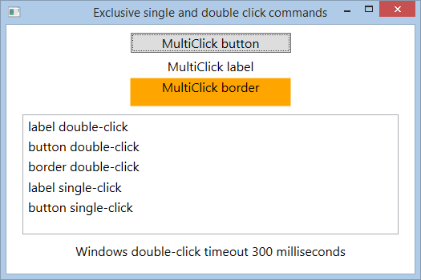

# WPF multi-click behavior: execute single and double-click commands exclusively
## Requires
- Visual Studio 2013
## License
- Apache License, Version 2.0
## Technologies
- C#
- WPF
- XAML
- WPF controls
## Topics
- User Interface
- WPF
- XAML
- WPF Basics
- WPF Commanding
- click
- WPF CustomControl
- Attached Behaviours
- WPF Binding
- double click
- doubleclick
## Updated
- 02/01/2015
## Description

<h1>Introduction</h1>

This sample shows how to exclusively execute a command dependent on whether an element was clicked once or double-clicked.&nbsp;It uses an attached behavior to specify a single-click and double-click command for a UIElement. If the element is clicked twice
 within the system double-click timeout then the double-click command will be executed if the element is only clicked once the single-click command will be executed.

&nbsp;

Description

The&nbsp;<strong>MultiClickBehavior</strong>&nbsp;has public dependency properties for both the commands (<strong>SingleClickCommand</strong> and&nbsp;<strong>DoubleClickCommand</strong>) and also optional parameters (<strong>SingleClickCommandParameter</strong>&nbsp;and&nbsp;<strong>DoubleClickCommandParameter</strong>).

XAML

Edit|Remove

xaml
<pre class="hidden">&lt;Button local:MultiClickBehavior.SingleClickCommand=&quot;{Binding clickedOnceCommand}&quot;
local:MultiClickBehavior.DoubleClickCommand=&quot;{Binding clickedTwiceCommand}&quot;&gt;MultiClick&lt;/Button&gt;</pre>

<pre class="xaml">&lt;Button&nbsp;local:MultiClickBehavior.SingleClickCommand=&quot;{Binding&nbsp;clickedOnceCommand}&quot;&nbsp;
local:MultiClickBehavior.DoubleClickCommand=&quot;{Binding&nbsp;clickedTwiceCommand}&quot;&gt;MultiClick&lt;/Button&gt;</pre>

Whenever a command is set&nbsp;<strong>CommandChanged</strong>&nbsp;is called.&nbsp;This sets up&nbsp;<strong>element_MouseLeftButtonDown</strong>&nbsp;(below)&nbsp;as a handler for the element's&nbsp;<strong>MouseLeftButtonDown&nbsp;</strong>event. Note
<a href="http://msdn.microsoft.com/en-us/library/ms598899(v=vs.110).aspx" target="_blank">
AddHandler</a> is called with&nbsp;handledEventsToo set true so the handler will be invoked even if the event has already been marked as handled.&nbsp;It also sets the private dependency property called&nbsp;<strong>ClickWaitTimer</strong>&nbsp;to a new instance
 of a&nbsp;<a href="http://msdn.microsoft.com/en-us/library/system.windows.threading.dispatchertimer(v=vs.110).aspx" target="_blank">DispatcherTimer</a>&nbsp;with the interval set to the system double-click time.&nbsp;

C#

Edit|Remove

csharp
<pre class="hidden">private static void CommandChanged(object sender, DependencyPropertyChangedEventArgs e)
{
    var targetElement = sender as UIElement;

    if (targetElement != null)
    {
        //remove any existing handlers
        targetElement.RemoveHandler(UIElement.MouseLeftButtonDownEvent, new MouseButtonEventHandler(element_MouseLeftButtonDown));
        //use AddHandler to be able to listen to handled events
        targetElement.AddHandler(UIElement.MouseLeftButtonDownEvent, new MouseButtonEventHandler(element_MouseLeftButtonDown), true);

        //if the timer has not been created then do so
        var timer = GetClickWaitTimer(targetElement);

        if (timer == null)
        {
            timer = new DispatcherTimer() { IsEnabled = false };                    
            timer.Interval = new TimeSpan(0, 0, 0, 0, winForms.SystemInformation.DoubleClickTime);                    
            timer.Tick &#43;= (s, args) =&gt; 
            {
                //interval reached without a second click execute the SingleClickCommand 
                timer.Stop();

                var command = targetElement.GetValue(SingleClickCommand) as ICommand;
                var commandParameter = targetElement.GetValue(SingleClickCommandParameter);

                if (command != null)
                {
                    if (command.CanExecute(e))
                    {
                        command.Execute(commandParameter);
                    }
                }
            };

            SetClickWaitTimer(targetElement, timer);
        }
    }
}</pre>

<pre class="csharp">private&nbsp;static&nbsp;void&nbsp;CommandChanged(object&nbsp;sender,&nbsp;DependencyPropertyChangedEventArgs&nbsp;e)&nbsp;
{&nbsp;
&nbsp;&nbsp;&nbsp;&nbsp;var&nbsp;targetElement&nbsp;=&nbsp;sender&nbsp;as&nbsp;UIElement;&nbsp;
&nbsp;
&nbsp;&nbsp;&nbsp;&nbsp;if&nbsp;(targetElement&nbsp;!=&nbsp;null)&nbsp;
&nbsp;&nbsp;&nbsp;&nbsp;{&nbsp;
&nbsp;&nbsp;&nbsp;&nbsp;&nbsp;&nbsp;&nbsp;&nbsp;//remove&nbsp;any&nbsp;existing&nbsp;handlers&nbsp;
&nbsp;&nbsp;&nbsp;&nbsp;&nbsp;&nbsp;&nbsp;&nbsp;targetElement.RemoveHandler(UIElement.MouseLeftButtonDownEvent,&nbsp;new&nbsp;MouseButtonEventHandler(element_MouseLeftButtonDown));&nbsp;
&nbsp;&nbsp;&nbsp;&nbsp;&nbsp;&nbsp;&nbsp;&nbsp;//use&nbsp;AddHandler&nbsp;to&nbsp;be&nbsp;able&nbsp;to&nbsp;listen&nbsp;to&nbsp;handled&nbsp;events&nbsp;
&nbsp;&nbsp;&nbsp;&nbsp;&nbsp;&nbsp;&nbsp;&nbsp;targetElement.AddHandler(UIElement.MouseLeftButtonDownEvent,&nbsp;new&nbsp;MouseButtonEventHandler(element_MouseLeftButtonDown),&nbsp;true);&nbsp;
&nbsp;
&nbsp;&nbsp;&nbsp;&nbsp;&nbsp;&nbsp;&nbsp;&nbsp;//if&nbsp;the&nbsp;timer&nbsp;has&nbsp;not&nbsp;been&nbsp;created&nbsp;then&nbsp;do&nbsp;so&nbsp;
&nbsp;&nbsp;&nbsp;&nbsp;&nbsp;&nbsp;&nbsp;&nbsp;var&nbsp;timer&nbsp;=&nbsp;GetClickWaitTimer(targetElement);&nbsp;
&nbsp;
&nbsp;&nbsp;&nbsp;&nbsp;&nbsp;&nbsp;&nbsp;&nbsp;if&nbsp;(timer&nbsp;==&nbsp;null)&nbsp;
&nbsp;&nbsp;&nbsp;&nbsp;&nbsp;&nbsp;&nbsp;&nbsp;{&nbsp;
&nbsp;&nbsp;&nbsp;&nbsp;&nbsp;&nbsp;&nbsp;&nbsp;&nbsp;&nbsp;&nbsp;&nbsp;timer&nbsp;=&nbsp;new&nbsp;DispatcherTimer()&nbsp;{&nbsp;IsEnabled&nbsp;=&nbsp;false&nbsp;};&nbsp;&nbsp;&nbsp;&nbsp;&nbsp;&nbsp;&nbsp;&nbsp;&nbsp;&nbsp;&nbsp;&nbsp;&nbsp;&nbsp;&nbsp;&nbsp;&nbsp;&nbsp;&nbsp;&nbsp;&nbsp;
&nbsp;&nbsp;&nbsp;&nbsp;&nbsp;&nbsp;&nbsp;&nbsp;&nbsp;&nbsp;&nbsp;&nbsp;timer.Interval&nbsp;=&nbsp;new&nbsp;TimeSpan(0,&nbsp;0,&nbsp;0,&nbsp;0,&nbsp;winForms.SystemInformation.DoubleClickTime);&nbsp;&nbsp;&nbsp;&nbsp;&nbsp;&nbsp;&nbsp;&nbsp;&nbsp;&nbsp;&nbsp;&nbsp;&nbsp;&nbsp;&nbsp;&nbsp;&nbsp;&nbsp;&nbsp;&nbsp;&nbsp;
&nbsp;&nbsp;&nbsp;&nbsp;&nbsp;&nbsp;&nbsp;&nbsp;&nbsp;&nbsp;&nbsp;&nbsp;timer.Tick&nbsp;&#43;=&nbsp;(s,&nbsp;args)&nbsp;=&gt;&nbsp;&nbsp;
&nbsp;&nbsp;&nbsp;&nbsp;&nbsp;&nbsp;&nbsp;&nbsp;&nbsp;&nbsp;&nbsp;&nbsp;{&nbsp;
&nbsp;&nbsp;&nbsp;&nbsp;&nbsp;&nbsp;&nbsp;&nbsp;&nbsp;&nbsp;&nbsp;&nbsp;&nbsp;&nbsp;&nbsp;&nbsp;//interval&nbsp;reached&nbsp;without&nbsp;a&nbsp;second&nbsp;click&nbsp;execute&nbsp;the&nbsp;SingleClickCommand&nbsp;&nbsp;
&nbsp;&nbsp;&nbsp;&nbsp;&nbsp;&nbsp;&nbsp;&nbsp;&nbsp;&nbsp;&nbsp;&nbsp;&nbsp;&nbsp;&nbsp;&nbsp;timer.Stop();&nbsp;
&nbsp;
&nbsp;&nbsp;&nbsp;&nbsp;&nbsp;&nbsp;&nbsp;&nbsp;&nbsp;&nbsp;&nbsp;&nbsp;&nbsp;&nbsp;&nbsp;&nbsp;var&nbsp;command&nbsp;=&nbsp;targetElement.GetValue(SingleClickCommand)&nbsp;as&nbsp;ICommand;&nbsp;
&nbsp;&nbsp;&nbsp;&nbsp;&nbsp;&nbsp;&nbsp;&nbsp;&nbsp;&nbsp;&nbsp;&nbsp;&nbsp;&nbsp;&nbsp;&nbsp;var&nbsp;commandParameter&nbsp;=&nbsp;targetElement.GetValue(SingleClickCommandParameter);&nbsp;
&nbsp;
&nbsp;&nbsp;&nbsp;&nbsp;&nbsp;&nbsp;&nbsp;&nbsp;&nbsp;&nbsp;&nbsp;&nbsp;&nbsp;&nbsp;&nbsp;&nbsp;if&nbsp;(command&nbsp;!=&nbsp;null)&nbsp;
&nbsp;&nbsp;&nbsp;&nbsp;&nbsp;&nbsp;&nbsp;&nbsp;&nbsp;&nbsp;&nbsp;&nbsp;&nbsp;&nbsp;&nbsp;&nbsp;{&nbsp;
&nbsp;&nbsp;&nbsp;&nbsp;&nbsp;&nbsp;&nbsp;&nbsp;&nbsp;&nbsp;&nbsp;&nbsp;&nbsp;&nbsp;&nbsp;&nbsp;&nbsp;&nbsp;&nbsp;&nbsp;if&nbsp;(command.CanExecute(e))&nbsp;
&nbsp;&nbsp;&nbsp;&nbsp;&nbsp;&nbsp;&nbsp;&nbsp;&nbsp;&nbsp;&nbsp;&nbsp;&nbsp;&nbsp;&nbsp;&nbsp;&nbsp;&nbsp;&nbsp;&nbsp;{&nbsp;
&nbsp;&nbsp;&nbsp;&nbsp;&nbsp;&nbsp;&nbsp;&nbsp;&nbsp;&nbsp;&nbsp;&nbsp;&nbsp;&nbsp;&nbsp;&nbsp;&nbsp;&nbsp;&nbsp;&nbsp;&nbsp;&nbsp;&nbsp;&nbsp;command.Execute(commandParameter);&nbsp;
&nbsp;&nbsp;&nbsp;&nbsp;&nbsp;&nbsp;&nbsp;&nbsp;&nbsp;&nbsp;&nbsp;&nbsp;&nbsp;&nbsp;&nbsp;&nbsp;&nbsp;&nbsp;&nbsp;&nbsp;}&nbsp;
&nbsp;&nbsp;&nbsp;&nbsp;&nbsp;&nbsp;&nbsp;&nbsp;&nbsp;&nbsp;&nbsp;&nbsp;&nbsp;&nbsp;&nbsp;&nbsp;}&nbsp;
&nbsp;&nbsp;&nbsp;&nbsp;&nbsp;&nbsp;&nbsp;&nbsp;&nbsp;&nbsp;&nbsp;&nbsp;};&nbsp;
&nbsp;
&nbsp;&nbsp;&nbsp;&nbsp;&nbsp;&nbsp;&nbsp;&nbsp;&nbsp;&nbsp;&nbsp;&nbsp;SetClickWaitTimer(targetElement,&nbsp;timer);&nbsp;
&nbsp;&nbsp;&nbsp;&nbsp;&nbsp;&nbsp;&nbsp;&nbsp;}&nbsp;
&nbsp;&nbsp;&nbsp;&nbsp;}&nbsp;
}</pre>

The timer is used in the&nbsp;MouseLeftButtonDown event handler <strong>element_MouseLeftButtonDown</strong>&nbsp;to monitor whether the element is clicked more than once within the interval. On the first click if the timer is not running it is started.

C#

Edit|Remove

csharp
<pre class="hidden">private static void element_MouseLeftButtonDown(object sender, MouseButtonEventArgs e)
{
    var targetElement = sender as UIElement;            

    if (targetElement != null)
    {
        var timer = GetClickWaitTimer(targetElement);

        //timer is enabled there has already been one click and this is a second click. 
        //Stop the timer and execute the DoubleClickCommand
        if (timer.IsEnabled)
        {
            timer.Stop();

            var command = targetElement.GetValue(DoubleClickCommand) as ICommand;
            var commandParameter = targetElement.GetValue(DoubleClickCommandParameter);

            if (command != null)
            {
                if (command.CanExecute(e))
                {
                    command.Execute(commandParameter);
                }
            }
        }
        else
        {
            timer.Start();
        }
    }            
}</pre>

<pre class="csharp">private&nbsp;static&nbsp;void&nbsp;element_MouseLeftButtonDown(object&nbsp;sender,&nbsp;MouseButtonEventArgs&nbsp;e)&nbsp;
{&nbsp;
&nbsp;&nbsp;&nbsp;&nbsp;var&nbsp;targetElement&nbsp;=&nbsp;sender&nbsp;as&nbsp;UIElement;&nbsp;&nbsp;&nbsp;&nbsp;&nbsp;&nbsp;&nbsp;&nbsp;&nbsp;&nbsp;&nbsp;&nbsp;&nbsp;
&nbsp;
&nbsp;&nbsp;&nbsp;&nbsp;if&nbsp;(targetElement&nbsp;!=&nbsp;null)&nbsp;
&nbsp;&nbsp;&nbsp;&nbsp;{&nbsp;
&nbsp;&nbsp;&nbsp;&nbsp;&nbsp;&nbsp;&nbsp;&nbsp;var&nbsp;timer&nbsp;=&nbsp;GetClickWaitTimer(targetElement);&nbsp;
&nbsp;
&nbsp;&nbsp;&nbsp;&nbsp;&nbsp;&nbsp;&nbsp;&nbsp;//timer&nbsp;is&nbsp;enabled&nbsp;there&nbsp;has&nbsp;already&nbsp;been&nbsp;one&nbsp;click&nbsp;and&nbsp;this&nbsp;is&nbsp;a&nbsp;second&nbsp;click.&nbsp;&nbsp;
&nbsp;&nbsp;&nbsp;&nbsp;&nbsp;&nbsp;&nbsp;&nbsp;//Stop&nbsp;the&nbsp;timer&nbsp;and&nbsp;execute&nbsp;the&nbsp;DoubleClickCommand&nbsp;
&nbsp;&nbsp;&nbsp;&nbsp;&nbsp;&nbsp;&nbsp;&nbsp;if&nbsp;(timer.IsEnabled)&nbsp;
&nbsp;&nbsp;&nbsp;&nbsp;&nbsp;&nbsp;&nbsp;&nbsp;{&nbsp;
&nbsp;&nbsp;&nbsp;&nbsp;&nbsp;&nbsp;&nbsp;&nbsp;&nbsp;&nbsp;&nbsp;&nbsp;timer.Stop();&nbsp;
&nbsp;
&nbsp;&nbsp;&nbsp;&nbsp;&nbsp;&nbsp;&nbsp;&nbsp;&nbsp;&nbsp;&nbsp;&nbsp;var&nbsp;command&nbsp;=&nbsp;targetElement.GetValue(DoubleClickCommand)&nbsp;as&nbsp;ICommand;&nbsp;
&nbsp;&nbsp;&nbsp;&nbsp;&nbsp;&nbsp;&nbsp;&nbsp;&nbsp;&nbsp;&nbsp;&nbsp;var&nbsp;commandParameter&nbsp;=&nbsp;targetElement.GetValue(DoubleClickCommandParameter);&nbsp;
&nbsp;
&nbsp;&nbsp;&nbsp;&nbsp;&nbsp;&nbsp;&nbsp;&nbsp;&nbsp;&nbsp;&nbsp;&nbsp;if&nbsp;(command&nbsp;!=&nbsp;null)&nbsp;
&nbsp;&nbsp;&nbsp;&nbsp;&nbsp;&nbsp;&nbsp;&nbsp;&nbsp;&nbsp;&nbsp;&nbsp;{&nbsp;
&nbsp;&nbsp;&nbsp;&nbsp;&nbsp;&nbsp;&nbsp;&nbsp;&nbsp;&nbsp;&nbsp;&nbsp;&nbsp;&nbsp;&nbsp;&nbsp;if&nbsp;(command.CanExecute(e))&nbsp;
&nbsp;&nbsp;&nbsp;&nbsp;&nbsp;&nbsp;&nbsp;&nbsp;&nbsp;&nbsp;&nbsp;&nbsp;&nbsp;&nbsp;&nbsp;&nbsp;{&nbsp;
&nbsp;&nbsp;&nbsp;&nbsp;&nbsp;&nbsp;&nbsp;&nbsp;&nbsp;&nbsp;&nbsp;&nbsp;&nbsp;&nbsp;&nbsp;&nbsp;&nbsp;&nbsp;&nbsp;&nbsp;command.Execute(commandParameter);&nbsp;
&nbsp;&nbsp;&nbsp;&nbsp;&nbsp;&nbsp;&nbsp;&nbsp;&nbsp;&nbsp;&nbsp;&nbsp;&nbsp;&nbsp;&nbsp;&nbsp;}&nbsp;
&nbsp;&nbsp;&nbsp;&nbsp;&nbsp;&nbsp;&nbsp;&nbsp;&nbsp;&nbsp;&nbsp;&nbsp;}&nbsp;
&nbsp;&nbsp;&nbsp;&nbsp;&nbsp;&nbsp;&nbsp;&nbsp;}&nbsp;
&nbsp;&nbsp;&nbsp;&nbsp;&nbsp;&nbsp;&nbsp;&nbsp;else&nbsp;
&nbsp;&nbsp;&nbsp;&nbsp;&nbsp;&nbsp;&nbsp;&nbsp;{&nbsp;
&nbsp;&nbsp;&nbsp;&nbsp;&nbsp;&nbsp;&nbsp;&nbsp;&nbsp;&nbsp;&nbsp;&nbsp;timer.Start();&nbsp;
&nbsp;&nbsp;&nbsp;&nbsp;&nbsp;&nbsp;&nbsp;&nbsp;}&nbsp;
&nbsp;&nbsp;&nbsp;&nbsp;}&nbsp;&nbsp;&nbsp;&nbsp;&nbsp;&nbsp;&nbsp;&nbsp;&nbsp;&nbsp;&nbsp;&nbsp;&nbsp;
}</pre>

If another click occurs within the interval (a doubleclick) the timer is stopped and the
<strong>DoubleClickCommand</strong>&nbsp;is invoked. If no click occurs the timer interval will be reached and the timer will call the
<strong>Tick</strong>&nbsp;callback (invoking the single-click command) that was set in
<strong>CommandChanged</strong>.

C#

Edit|Remove

csharp
<pre class="hidden">timer.Tick &#43;= (s, args) =&gt; 
{
    //if the interval has been reached without a second click then execute the SingleClickCommand 
    timer.Stop();

    var command = targetElement.GetValue(SingleClickCommand) as ICommand;
    var commandParameter = targetElement.GetValue(SingleClickCommandParameter);

    if (command != null)
    {
        if (command.CanExecute(e))
        {
            command.Execute(commandParameter);
        }
    }
};</pre>

<pre class="csharp">timer.Tick&nbsp;&#43;=&nbsp;(s,&nbsp;args)&nbsp;=&gt;&nbsp;&nbsp;
{&nbsp;
&nbsp;&nbsp;&nbsp;&nbsp;//if&nbsp;the&nbsp;interval&nbsp;has&nbsp;been&nbsp;reached&nbsp;without&nbsp;a&nbsp;second&nbsp;click&nbsp;then&nbsp;execute&nbsp;the&nbsp;SingleClickCommand&nbsp;&nbsp;
&nbsp;&nbsp;&nbsp;&nbsp;timer.Stop();&nbsp;
&nbsp;
&nbsp;&nbsp;&nbsp;&nbsp;var&nbsp;command&nbsp;=&nbsp;targetElement.GetValue(SingleClickCommand)&nbsp;as&nbsp;ICommand;&nbsp;
&nbsp;&nbsp;&nbsp;&nbsp;var&nbsp;commandParameter&nbsp;=&nbsp;targetElement.GetValue(SingleClickCommandParameter);&nbsp;
&nbsp;
&nbsp;&nbsp;&nbsp;&nbsp;if&nbsp;(command&nbsp;!=&nbsp;null)&nbsp;
&nbsp;&nbsp;&nbsp;&nbsp;{&nbsp;
&nbsp;&nbsp;&nbsp;&nbsp;&nbsp;&nbsp;&nbsp;&nbsp;if&nbsp;(command.CanExecute(e))&nbsp;
&nbsp;&nbsp;&nbsp;&nbsp;&nbsp;&nbsp;&nbsp;&nbsp;{&nbsp;
&nbsp;&nbsp;&nbsp;&nbsp;&nbsp;&nbsp;&nbsp;&nbsp;&nbsp;&nbsp;&nbsp;&nbsp;command.Execute(commandParameter);&nbsp;
&nbsp;&nbsp;&nbsp;&nbsp;&nbsp;&nbsp;&nbsp;&nbsp;}&nbsp;
&nbsp;&nbsp;&nbsp;&nbsp;}&nbsp;
};</pre>

<h2>Summary</h2>

The easiest way to understand the code is to step through it. If you have any questions or suggestions for improvement regarding this sample please feel free to leave them in the Q and A section.

doubleclick double click

<em> 
</em>

