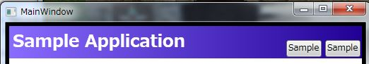

# WPFでWindowの見た目を共通化する方法
## Requires
- Visual Studio 2010
## License
- Apache License, Version 2.0
## Technologies
- WPF
## Topics
- WPF アプリケーション
## Updated
- 12/03/2011
## Description

<h1>概要</h1>

Windows Formsで提供されていた基本フォーム（フォームを継承することで、基本的な共通機能などを派生先のフォームで再実装しなくて済むようにする手法）と同等のことをWPFでやる例を示します。ここでは基本フォームを下記の目的で使用しているという前提で説明を行います。

<ul>
<li>ヘッダーなど共通の見た目を定義する </li><li>共通の見た目の中に共通のボタンを定義する
<ul>
<li>このヘッダーに定義されたボタンの動作はウィンドウ毎にカスタマイズできる </li></ul>
</li></ul>

なお、基本フォーム自体のやり方については、下記の記事を参照してください。

<ul>
<li><a href="http://msdn.microsoft.com/ja-jp/library/bx1155fz(v=vs.80).aspx">MSDN : Windows フォームのビジュアルの継承</a>
</li><li><a href="http://www.atmarkit.co.jp/fdotnet/dotnettips/324winbaseform/winbaseform.html">＠IT : 各フォームの共通要素を基本フォームにまとめるには？</a>
</li></ul>
<h1>見た目のカスタマイズと共通化</h1>

WPFでは、見た目をカスタマイズして複数の要素で共有する機能としてStyleが提供されています。見た目のカスタマイズはこれを使用して行います。Styleの中で、Templateプロパティを設定することで、Windowの見た目自体をカスタマイズが可能です。ここでは、下記のように画面上部にアプリケーション名と２つのボタンを持ったWindowを定義するStyleのXAMLを示します。

XAML

スクリプトの編集|Remove

xaml

<pre class="xaml">&lt;!--&nbsp;Windowの共通の見た目のカスタマイズ&nbsp;--&gt;&nbsp;
&lt;Style&nbsp;x:Key=&quot;DefaultWindowStyle&quot;&nbsp;TargetType=&quot;Window&quot;&gt;&nbsp;
&nbsp;&nbsp;&nbsp;&nbsp;&lt;!--&nbsp;Templateを差し替えて見た目をごっそり差し替える&nbsp;--&gt;&nbsp;
&nbsp;&nbsp;&nbsp;&nbsp;&lt;Setter&nbsp;Property=&quot;Template&quot;&gt;&nbsp;
&nbsp;&nbsp;&nbsp;&nbsp;&nbsp;&nbsp;&nbsp;&nbsp;&lt;Setter.Value&gt;&nbsp;
&nbsp;&nbsp;&nbsp;&nbsp;&nbsp;&nbsp;&nbsp;&nbsp;&nbsp;&nbsp;&nbsp;&nbsp;&lt;ControlTemplate&nbsp;TargetType=&quot;Window&quot;&gt;&nbsp;
&nbsp;&nbsp;&nbsp;&nbsp;&nbsp;&nbsp;&nbsp;&nbsp;&nbsp;&nbsp;&nbsp;&nbsp;&nbsp;&nbsp;&nbsp;&nbsp;&lt;Grid&nbsp;Margin=&quot;5&quot;&gt;&nbsp;
&nbsp;&nbsp;&nbsp;&nbsp;&nbsp;&nbsp;&nbsp;&nbsp;&nbsp;&nbsp;&nbsp;&nbsp;&nbsp;&nbsp;&nbsp;&nbsp;&nbsp;&nbsp;&nbsp;&nbsp;&lt;Grid.RowDefinitions&gt;&nbsp;
&nbsp;&nbsp;&nbsp;&nbsp;&nbsp;&nbsp;&nbsp;&nbsp;&nbsp;&nbsp;&nbsp;&nbsp;&nbsp;&nbsp;&nbsp;&nbsp;&nbsp;&nbsp;&nbsp;&nbsp;&nbsp;&nbsp;&nbsp;&nbsp;&lt;RowDefinition&nbsp;Height=&quot;Auto&quot;/&gt;&nbsp;
&nbsp;&nbsp;&nbsp;&nbsp;&nbsp;&nbsp;&nbsp;&nbsp;&nbsp;&nbsp;&nbsp;&nbsp;&nbsp;&nbsp;&nbsp;&nbsp;&nbsp;&nbsp;&nbsp;&nbsp;&nbsp;&nbsp;&nbsp;&nbsp;&lt;RowDefinition&nbsp;Height=&quot;*&quot;/&gt;&nbsp;
&nbsp;&nbsp;&nbsp;&nbsp;&nbsp;&nbsp;&nbsp;&nbsp;&nbsp;&nbsp;&nbsp;&nbsp;&nbsp;&nbsp;&nbsp;&nbsp;&nbsp;&nbsp;&nbsp;&nbsp;&lt;/Grid.RowDefinitions&gt;&nbsp;
&nbsp;&nbsp;&nbsp;&nbsp;&nbsp;&nbsp;&nbsp;&nbsp;&nbsp;&nbsp;&nbsp;&nbsp;&nbsp;&nbsp;&nbsp;&nbsp;&nbsp;&nbsp;&nbsp;&nbsp;&lt;!--&nbsp;ヘッダー部&nbsp;--&gt;&nbsp;
&nbsp;&nbsp;&nbsp;&nbsp;&nbsp;&nbsp;&nbsp;&nbsp;&nbsp;&nbsp;&nbsp;&nbsp;&nbsp;&nbsp;&nbsp;&nbsp;&nbsp;&nbsp;&nbsp;&nbsp;&lt;Grid&nbsp;Grid.Row=&quot;0&quot;&gt;&nbsp;
&nbsp;&nbsp;&nbsp;&nbsp;&nbsp;&nbsp;&nbsp;&nbsp;&nbsp;&nbsp;&nbsp;&nbsp;&nbsp;&nbsp;&nbsp;&nbsp;&nbsp;&nbsp;&nbsp;&nbsp;&nbsp;&nbsp;&nbsp;&nbsp;&lt;Grid.Background&gt;&nbsp;
&nbsp;&nbsp;&nbsp;&nbsp;&nbsp;&nbsp;&nbsp;&nbsp;&nbsp;&nbsp;&nbsp;&nbsp;&nbsp;&nbsp;&nbsp;&nbsp;&nbsp;&nbsp;&nbsp;&nbsp;&nbsp;&nbsp;&nbsp;&nbsp;&nbsp;&nbsp;&nbsp;&nbsp;&lt;LinearGradientBrush&nbsp;EndPoint=&quot;1,0.5&quot;&nbsp;StartPoint=&quot;0,0.5&quot;&gt;&nbsp;
&nbsp;&nbsp;&nbsp;&nbsp;&nbsp;&nbsp;&nbsp;&nbsp;&nbsp;&nbsp;&nbsp;&nbsp;&nbsp;&nbsp;&nbsp;&nbsp;&nbsp;&nbsp;&nbsp;&nbsp;&nbsp;&nbsp;&nbsp;&nbsp;&nbsp;&nbsp;&nbsp;&nbsp;&nbsp;&nbsp;&nbsp;&nbsp;&lt;GradientStop&nbsp;Color=&quot;#FF896CFF&quot;&nbsp;Offset=&quot;0&quot;&nbsp;/&gt;&nbsp;
&nbsp;&nbsp;&nbsp;&nbsp;&nbsp;&nbsp;&nbsp;&nbsp;&nbsp;&nbsp;&nbsp;&nbsp;&nbsp;&nbsp;&nbsp;&nbsp;&nbsp;&nbsp;&nbsp;&nbsp;&nbsp;&nbsp;&nbsp;&nbsp;&nbsp;&nbsp;&nbsp;&nbsp;&nbsp;&nbsp;&nbsp;&nbsp;&lt;GradientStop&nbsp;Color=&quot;#FF210096&quot;&nbsp;Offset=&quot;1&quot;&nbsp;/&gt;&nbsp;
&nbsp;&nbsp;&nbsp;&nbsp;&nbsp;&nbsp;&nbsp;&nbsp;&nbsp;&nbsp;&nbsp;&nbsp;&nbsp;&nbsp;&nbsp;&nbsp;&nbsp;&nbsp;&nbsp;&nbsp;&nbsp;&nbsp;&nbsp;&nbsp;&nbsp;&nbsp;&nbsp;&nbsp;&lt;/LinearGradientBrush&gt;&nbsp;
&nbsp;&nbsp;&nbsp;&nbsp;&nbsp;&nbsp;&nbsp;&nbsp;&nbsp;&nbsp;&nbsp;&nbsp;&nbsp;&nbsp;&nbsp;&nbsp;&nbsp;&nbsp;&nbsp;&nbsp;&nbsp;&nbsp;&nbsp;&nbsp;&lt;/Grid.Background&gt;&nbsp;
&nbsp;&nbsp;&nbsp;&nbsp;&nbsp;&nbsp;&nbsp;&nbsp;&nbsp;&nbsp;&nbsp;&nbsp;&nbsp;&nbsp;&nbsp;&nbsp;&nbsp;&nbsp;&nbsp;&nbsp;&nbsp;&nbsp;&nbsp;&nbsp;&lt;!--&nbsp;アプリケーションのタイトルと&nbsp;--&gt;&nbsp;
&nbsp;&nbsp;&nbsp;&nbsp;&nbsp;&nbsp;&nbsp;&nbsp;&nbsp;&nbsp;&nbsp;&nbsp;&nbsp;&nbsp;&nbsp;&nbsp;&nbsp;&nbsp;&nbsp;&nbsp;&nbsp;&nbsp;&nbsp;&nbsp;&lt;TextBlock&nbsp;&nbsp;
&nbsp;&nbsp;&nbsp;&nbsp;&nbsp;&nbsp;&nbsp;&nbsp;&nbsp;&nbsp;&nbsp;&nbsp;&nbsp;&nbsp;&nbsp;&nbsp;&nbsp;&nbsp;&nbsp;&nbsp;&nbsp;&nbsp;&nbsp;&nbsp;&nbsp;&nbsp;&nbsp;&nbsp;Text=&quot;Sample&nbsp;Application&quot;&nbsp;&nbsp;
&nbsp;&nbsp;&nbsp;&nbsp;&nbsp;&nbsp;&nbsp;&nbsp;&nbsp;&nbsp;&nbsp;&nbsp;&nbsp;&nbsp;&nbsp;&nbsp;&nbsp;&nbsp;&nbsp;&nbsp;&nbsp;&nbsp;&nbsp;&nbsp;&nbsp;&nbsp;&nbsp;&nbsp;Foreground=&quot;White&quot;&nbsp;&nbsp;
&nbsp;&nbsp;&nbsp;&nbsp;&nbsp;&nbsp;&nbsp;&nbsp;&nbsp;&nbsp;&nbsp;&nbsp;&nbsp;&nbsp;&nbsp;&nbsp;&nbsp;&nbsp;&nbsp;&nbsp;&nbsp;&nbsp;&nbsp;&nbsp;&nbsp;&nbsp;&nbsp;&nbsp;FontWeight=&quot;Bold&quot;&nbsp;&nbsp;
&nbsp;&nbsp;&nbsp;&nbsp;&nbsp;&nbsp;&nbsp;&nbsp;&nbsp;&nbsp;&nbsp;&nbsp;&nbsp;&nbsp;&nbsp;&nbsp;&nbsp;&nbsp;&nbsp;&nbsp;&nbsp;&nbsp;&nbsp;&nbsp;&nbsp;&nbsp;&nbsp;&nbsp;FontSize=&quot;24&quot;&nbsp;&nbsp;
&nbsp;&nbsp;&nbsp;&nbsp;&nbsp;&nbsp;&nbsp;&nbsp;&nbsp;&nbsp;&nbsp;&nbsp;&nbsp;&nbsp;&nbsp;&nbsp;&nbsp;&nbsp;&nbsp;&nbsp;&nbsp;&nbsp;&nbsp;&nbsp;&nbsp;&nbsp;&nbsp;&nbsp;Margin=&quot;5&quot;/&gt;&nbsp;
&nbsp;&nbsp;&nbsp;&nbsp;&nbsp;&nbsp;&nbsp;&nbsp;&nbsp;&nbsp;&nbsp;&nbsp;&nbsp;&nbsp;&nbsp;&nbsp;&nbsp;&nbsp;&nbsp;&nbsp;&nbsp;&nbsp;&nbsp;&nbsp;&lt;!--&nbsp;共通で使用するボタンを置く&nbsp;--&gt;&nbsp;
&nbsp;&nbsp;&nbsp;&nbsp;&nbsp;&nbsp;&nbsp;&nbsp;&nbsp;&nbsp;&nbsp;&nbsp;&nbsp;&nbsp;&nbsp;&nbsp;&nbsp;&nbsp;&nbsp;&nbsp;&nbsp;&nbsp;&nbsp;&nbsp;&lt;StackPanel&nbsp;Orientation=&quot;Horizontal&quot;&nbsp;HorizontalAlignment=&quot;Right&quot;&nbsp;VerticalAlignment=&quot;Bottom&quot;&gt;&nbsp;
&nbsp;&nbsp;&nbsp;&nbsp;&nbsp;&nbsp;&nbsp;&nbsp;&nbsp;&nbsp;&nbsp;&nbsp;&nbsp;&nbsp;&nbsp;&nbsp;&nbsp;&nbsp;&nbsp;&nbsp;&nbsp;&nbsp;&nbsp;&nbsp;&nbsp;&nbsp;&nbsp;&nbsp;&lt;Button&nbsp;MinWidth=&quot;50&quot;&nbsp;Content=&quot;Sample1&quot;&nbsp;Margin=&quot;2.5&quot;/&gt;&nbsp;
&nbsp;&nbsp;&nbsp;&nbsp;&nbsp;&nbsp;&nbsp;&nbsp;&nbsp;&nbsp;&nbsp;&nbsp;&nbsp;&nbsp;&nbsp;&nbsp;&nbsp;&nbsp;&nbsp;&nbsp;&nbsp;&nbsp;&nbsp;&nbsp;&nbsp;&nbsp;&nbsp;&nbsp;&lt;Button&nbsp;MinWidth=&quot;50&quot;&nbsp;Content=&quot;Sample&quot;&nbsp;Margin=&quot;2.5&quot;/&gt;&nbsp;
&nbsp;&nbsp;&nbsp;&nbsp;&nbsp;&nbsp;&nbsp;&nbsp;&nbsp;&nbsp;&nbsp;&nbsp;&nbsp;&nbsp;&nbsp;&nbsp;&nbsp;&nbsp;&nbsp;&nbsp;&nbsp;&nbsp;&nbsp;&nbsp;&lt;/StackPanel&gt;&nbsp;
&nbsp;&nbsp;&nbsp;&nbsp;&nbsp;&nbsp;&nbsp;&nbsp;&nbsp;&nbsp;&nbsp;&nbsp;&nbsp;&nbsp;&nbsp;&nbsp;&nbsp;&nbsp;&nbsp;&nbsp;&lt;/Grid&gt;&nbsp;
&nbsp;&nbsp;&nbsp;&nbsp;&nbsp;&nbsp;&nbsp;&nbsp;&nbsp;&nbsp;&nbsp;&nbsp;&nbsp;&nbsp;&nbsp;&nbsp;&nbsp;&nbsp;&nbsp;&nbsp;&lt;!--&nbsp;コンテンツ部分&nbsp;--&gt;&nbsp;
&nbsp;&nbsp;&nbsp;&nbsp;&nbsp;&nbsp;&nbsp;&nbsp;&nbsp;&nbsp;&nbsp;&nbsp;&nbsp;&nbsp;&nbsp;&nbsp;&nbsp;&nbsp;&nbsp;&nbsp;&lt;Border&nbsp;Grid.Row=&quot;1&quot;&nbsp;Background=&quot;{TemplateBinding&nbsp;Background}&quot;&gt;&nbsp;
&nbsp;&nbsp;&nbsp;&nbsp;&nbsp;&nbsp;&nbsp;&nbsp;&nbsp;&nbsp;&nbsp;&nbsp;&nbsp;&nbsp;&nbsp;&nbsp;&nbsp;&nbsp;&nbsp;&nbsp;&nbsp;&nbsp;&nbsp;&nbsp;&lt;ContentPresenter&nbsp;/&gt;&nbsp;
&nbsp;&nbsp;&nbsp;&nbsp;&nbsp;&nbsp;&nbsp;&nbsp;&nbsp;&nbsp;&nbsp;&nbsp;&nbsp;&nbsp;&nbsp;&nbsp;&nbsp;&nbsp;&nbsp;&nbsp;&lt;/Border&gt;&nbsp;
&nbsp;&nbsp;&nbsp;&nbsp;&nbsp;&nbsp;&nbsp;&nbsp;&nbsp;&nbsp;&nbsp;&nbsp;&nbsp;&nbsp;&nbsp;&nbsp;&lt;/Grid&gt;&nbsp;
&nbsp;&nbsp;&nbsp;&nbsp;&nbsp;&nbsp;&nbsp;&nbsp;&nbsp;&nbsp;&nbsp;&nbsp;&lt;/ControlTemplate&gt;&nbsp;
&nbsp;&nbsp;&nbsp;&nbsp;&nbsp;&nbsp;&nbsp;&nbsp;&lt;/Setter.Value&gt;&nbsp;
&nbsp;&nbsp;&nbsp;&nbsp;&lt;/Setter&gt;&nbsp;
&lt;/Style&gt;&nbsp;
</pre>

&nbsp;このStyleをWindowに適用します。MainWindow.xamlのWindowタグに下記のようなStyle属性を追加します。

XAML

スクリプトの編集|Remove

xaml

<pre class="js">Style=&quot;{Binding&nbsp;Source={StaticResource&nbsp;DefaultWindowStyle}}&quot;</pre>

&nbsp;この状態で実行すると、下記のようなヘッダーを持ったWindowが表示されます。このStyleをWindowに設定することで共通の見た目をWindowに定義出来ます。

これで、Windowに見た目の共通化が出来ました。

<h1 class="endscriptcode">共通のStyleで定義したボタンの動作のカスタマイズ</h1>

次に、先ほど作成したStyle内で定義している2つのボタンを押したときの挙動をカスタマイズする方法について説明します。基本的にStyle内で定義されたボタンなどのイベントハンドラは、Styleを適用した画面では取得することが困難です。そのため、MVVMパターンを使用してWindowに対してViewModelを定義し、そのViewModelからStyle内で定義したButtonにBindingで紐づけを行います。

まず、Buttonを表すViewModelを定義します。また、このサンプルではReactivePropertyを使用してViewModelを作成しています。ReactivePropertyについては下記のサイトを参照してください。

<ul>
<li><a href="http://reactiveproperty.codeplex.com/">ReactiveProperty - MVVM Extensions for Rx</a>
</li></ul>
&nbsp;

C#

スクリプトの編集|Remove

csharp

<pre class="csharp">///&nbsp;&lt;summary&gt;&nbsp;
///&nbsp;画面に表示するボタンを表す&nbsp;
///&nbsp;&lt;/summary&gt;&nbsp;
public&nbsp;class&nbsp;ButtonViewModel&nbsp;
{&nbsp;
&nbsp;&nbsp;&nbsp;&nbsp;///&nbsp;&lt;summary&gt;&nbsp;
&nbsp;&nbsp;&nbsp;&nbsp;///&nbsp;ボタンに表示するテキスト&nbsp;
&nbsp;&nbsp;&nbsp;&nbsp;///&nbsp;&lt;/summary&gt;&nbsp;
&nbsp;&nbsp;&nbsp;&nbsp;public&nbsp;ReactiveProperty&lt;string&gt;&nbsp;Label&nbsp;{&nbsp;get;&nbsp;private&nbsp;set;&nbsp;}&nbsp;
&nbsp;&nbsp;&nbsp;&nbsp;///&nbsp;&lt;summary&gt;&nbsp;
&nbsp;&nbsp;&nbsp;&nbsp;///&nbsp;ボタンが押された時に実行するコマンド&nbsp;
&nbsp;&nbsp;&nbsp;&nbsp;///&nbsp;&lt;/summary&gt;&nbsp;
&nbsp;&nbsp;&nbsp;&nbsp;public&nbsp;ReactiveCommand&nbsp;Command&nbsp;{&nbsp;get;&nbsp;private&nbsp;set;&nbsp;}&nbsp;
&nbsp;
&nbsp;&nbsp;&nbsp;&nbsp;public&nbsp;ButtonViewModel(ReactiveProperty&lt;string&gt;&nbsp;label&nbsp;=&nbsp;null,&nbsp;ReactiveCommand&nbsp;command&nbsp;=&nbsp;null)&nbsp;
&nbsp;&nbsp;&nbsp;&nbsp;{&nbsp;
&nbsp;&nbsp;&nbsp;&nbsp;&nbsp;&nbsp;&nbsp;&nbsp;this.Label&nbsp;=&nbsp;label&nbsp;??&nbsp;new&nbsp;ReactiveProperty&lt;string&gt;();&nbsp;
&nbsp;&nbsp;&nbsp;&nbsp;&nbsp;&nbsp;&nbsp;&nbsp;this.Command&nbsp;=&nbsp;command&nbsp;??&nbsp;new&nbsp;ReactiveCommand();&nbsp;
&nbsp;&nbsp;&nbsp;&nbsp;}&nbsp;
}&nbsp;
</pre>

コメント内にあるように、ButtonのテキストとButtonが押された時の処理を対応するCommandを定義しています。次に、このButtonViewModelを2つもつWindowViewModelBaseクラスを作成します。このクラスで、Style内で定義したButtonに対して公開するButtonViewModelを定義しておきます。

C#

スクリプトの編集|Remove

csharp

<pre class="csharp">///&nbsp;&lt;summary&gt;&nbsp;
///&nbsp;DefaultWindowStyleを適用したWindowのViewModelの基本クラス。&nbsp;
///&nbsp;&lt;/summary&gt;&nbsp;
public&nbsp;abstract&nbsp;class&nbsp;WindowViewModelBase&nbsp;
{&nbsp;
&nbsp;&nbsp;&nbsp;&nbsp;///&nbsp;&lt;summary&gt;&nbsp;
&nbsp;&nbsp;&nbsp;&nbsp;///&nbsp;左側のボタン&nbsp;
&nbsp;&nbsp;&nbsp;&nbsp;///&nbsp;&lt;/summary&gt;&nbsp;
&nbsp;&nbsp;&nbsp;&nbsp;public&nbsp;ButtonViewModel&nbsp;CommonAButton&nbsp;{&nbsp;get;&nbsp;set;&nbsp;}&nbsp;
&nbsp;&nbsp;&nbsp;&nbsp;///&nbsp;&lt;summary&gt;&nbsp;
&nbsp;&nbsp;&nbsp;&nbsp;///&nbsp;右側のボタン&nbsp;
&nbsp;&nbsp;&nbsp;&nbsp;///&nbsp;&lt;/summary&gt;&nbsp;
&nbsp;&nbsp;&nbsp;&nbsp;public&nbsp;ButtonViewModel&nbsp;CommonBButton&nbsp;{&nbsp;get;&nbsp;set;&nbsp;}&nbsp;
&nbsp;
&nbsp;&nbsp;&nbsp;&nbsp;protected&nbsp;WindowViewModelBase(ButtonViewModel&nbsp;a&nbsp;=&nbsp;null,&nbsp;ButtonViewModel&nbsp;b&nbsp;=&nbsp;null)&nbsp;
&nbsp;&nbsp;&nbsp;&nbsp;{&nbsp;
&nbsp;&nbsp;&nbsp;&nbsp;&nbsp;&nbsp;&nbsp;&nbsp;this.CommonAButton&nbsp;=&nbsp;a&nbsp;??&nbsp;new&nbsp;ButtonViewModel();&nbsp;
&nbsp;&nbsp;&nbsp;&nbsp;&nbsp;&nbsp;&nbsp;&nbsp;this.CommonBButton&nbsp;=&nbsp;b&nbsp;??&nbsp;new&nbsp;ButtonViewModel();&nbsp;
&nbsp;&nbsp;&nbsp;&nbsp;}&nbsp;
&nbsp;
}&nbsp;
</pre>

次に、このWindowViewModelBaseの定義にあうようにStyle内のButtonに対してBindingを設定します。Buttonの部分だけ抜粋したXAMLを下記に示します。

XAML

スクリプトの編集|Remove

xaml

<pre class="js">&lt;Button&nbsp;MinWidth=&quot;50&quot;&nbsp;Content=&quot;{Binding&nbsp;CommonAButton.Label.Value}&quot;&nbsp;Command=&quot;{Binding&nbsp;CommonAButton.Command}&quot;&nbsp;Margin=&quot;2.5&quot;/&gt;&nbsp;
&lt;Button&nbsp;MinWidth=&quot;50&quot;&nbsp;Content=&quot;{Binding&nbsp;CommonBButton.Label.Value}&quot;&nbsp;Command=&quot;{Binding&nbsp;CommonBButton.Command}&quot;&nbsp;Margin=&quot;2.5&quot;/&gt;&nbsp;
</pre>

そして、個々の画面に対応するViewModelでは、上記のWindowViewModelBaseを継承して作りこみを行います。コード例を下記に示します。

C#

スクリプトの編集|Remove

csharp

<pre class="js">///&nbsp;&lt;summary&gt;&nbsp;
///&nbsp;MainWindow.xamlに対応するViewModel&nbsp;
///&nbsp;&lt;/summary&gt;&nbsp;
public&nbsp;class&nbsp;MainWindowViewModel&nbsp;:&nbsp;WindowViewModelBase&nbsp;
{&nbsp;
&nbsp;&nbsp;&nbsp;&nbsp;///&nbsp;&lt;summary&gt;&nbsp;
&nbsp;&nbsp;&nbsp;&nbsp;///&nbsp;画面内に表示するテキスト。ヘッダーの左側のボタンが押された時に変更される&nbsp;
&nbsp;&nbsp;&nbsp;&nbsp;///&nbsp;&lt;/summary&gt;&nbsp;
&nbsp;&nbsp;&nbsp;&nbsp;public&nbsp;ReactiveProperty&lt;string&gt;&nbsp;AText&nbsp;{&nbsp;get;&nbsp;private&nbsp;set;&nbsp;}&nbsp;
&nbsp;&nbsp;&nbsp;&nbsp;///&nbsp;&lt;summary&gt;&nbsp;
&nbsp;&nbsp;&nbsp;&nbsp;///&nbsp;画面内に表示するテキスト。ヘッダーの右側のボタンが押された時に変更される&nbsp;
&nbsp;&nbsp;&nbsp;&nbsp;///&nbsp;&lt;/summary&gt;&nbsp;
&nbsp;&nbsp;&nbsp;&nbsp;public&nbsp;ReactiveProperty&lt;string&gt;&nbsp;BText&nbsp;{&nbsp;get;&nbsp;private&nbsp;set;&nbsp;}&nbsp;
&nbsp;
&nbsp;&nbsp;&nbsp;&nbsp;public&nbsp;MainWindowViewModel()&nbsp;
&nbsp;&nbsp;&nbsp;&nbsp;&nbsp;&nbsp;&nbsp;&nbsp;:&nbsp;base()&nbsp;
&nbsp;&nbsp;&nbsp;&nbsp;{&nbsp;
&nbsp;&nbsp;&nbsp;&nbsp;&nbsp;&nbsp;&nbsp;&nbsp;//&nbsp;プロパティの初期化&nbsp;
&nbsp;&nbsp;&nbsp;&nbsp;&nbsp;&nbsp;&nbsp;&nbsp;this.AText&nbsp;=&nbsp;new&nbsp;ReactiveProperty&lt;string&gt;(&quot;A&nbsp;count&nbsp;:&nbsp;0&quot;);&nbsp;
&nbsp;&nbsp;&nbsp;&nbsp;&nbsp;&nbsp;&nbsp;&nbsp;this.BText&nbsp;=&nbsp;new&nbsp;ReactiveProperty&lt;string&gt;(&quot;B&nbsp;count&nbsp;:&nbsp;0&quot;);&nbsp;
&nbsp;
&nbsp;&nbsp;&nbsp;&nbsp;&nbsp;&nbsp;&nbsp;&nbsp;//&nbsp;共通部分にあるボタンのテキストを指定する&nbsp;
&nbsp;&nbsp;&nbsp;&nbsp;&nbsp;&nbsp;&nbsp;&nbsp;this.CommonAButton.Label.Value&nbsp;=&nbsp;&quot;Main&nbsp;A&quot;;&nbsp;
&nbsp;&nbsp;&nbsp;&nbsp;&nbsp;&nbsp;&nbsp;&nbsp;this.CommonBButton.Label.Value&nbsp;=&nbsp;&quot;Main&nbsp;B&quot;;&nbsp;
&nbsp;
&nbsp;&nbsp;&nbsp;&nbsp;&nbsp;&nbsp;&nbsp;&nbsp;//&nbsp;共通部分にあるボタンを押したときの処理を定義&nbsp;
&nbsp;&nbsp;&nbsp;&nbsp;&nbsp;&nbsp;&nbsp;&nbsp;int&nbsp;aCount&nbsp;=&nbsp;0;&nbsp;
&nbsp;&nbsp;&nbsp;&nbsp;&nbsp;&nbsp;&nbsp;&nbsp;this.CommonAButton.Command.Subscribe(_&nbsp;=&gt;&nbsp;
&nbsp;&nbsp;&nbsp;&nbsp;&nbsp;&nbsp;&nbsp;&nbsp;&nbsp;&nbsp;&nbsp;&nbsp;this.AText.Value&nbsp;=&nbsp;&quot;A&nbsp;count&nbsp;:&nbsp;&quot;&nbsp;&#43;&nbsp;&#43;&#43;aCount);&nbsp;
&nbsp;&nbsp;&nbsp;&nbsp;&nbsp;&nbsp;&nbsp;&nbsp;int&nbsp;bCount&nbsp;=&nbsp;0;&nbsp;
&nbsp;&nbsp;&nbsp;&nbsp;&nbsp;&nbsp;&nbsp;&nbsp;this.CommonBButton.Command.Subscribe(_&nbsp;=&gt;&nbsp;
&nbsp;&nbsp;&nbsp;&nbsp;&nbsp;&nbsp;&nbsp;&nbsp;&nbsp;&nbsp;&nbsp;&nbsp;this.BText.Value&nbsp;=&nbsp;&quot;B&nbsp;count&nbsp;:&nbsp;&quot;&nbsp;&#43;&nbsp;&#43;&#43;bCount);&nbsp;
&nbsp;&nbsp;&nbsp;&nbsp;}&nbsp;
}&nbsp;
</pre>

このような形でViewModelを定義することで、DefaultWindowStyleを適用したWindowに対して効率よく動作をカスタマイズすることができます。下図は、DefaultWindowStyleを適用した2つのWindowの実行例です。どちらにも、WindowViewModelBaseを継承したViewModelをDataContextに指定しています。

<h1>まとめ</h1>

このようにWPFでは、Windowの継承を行わずに見た目をカスタマイズすることが出来ます。そもそもWPFにおいて見た目のカスタマイズを行うという要件に対して継承で対処するというのは一般的ではありません。このようにTemplateを差し替えるか、ContentTemplate, ItemTemplateなどの各種テンプレートを使用するのが一般的です。

# 他にいいやり方がある場合は教えてください

