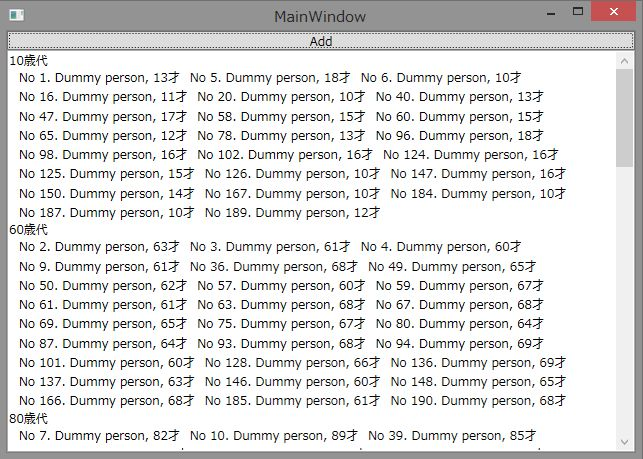

# WPFでデータをグルーピングして表示させる
## Requires
- Visual Studio 2012
## License
- Apache License, Version 2.0
## Technologies
- WPF
## Topics
- WPF Basics
## Updated
- 06/01/2013
## Description

<h1>サンプルプログラムの概要</h1>

このサンプルプログラムは、CollectionViewSourceクラスにあるデータのグループ化の機能をつかってデータをグループ化して表示する方法を示します。

<h1>サンプルプログラムの説明</h1>

このサンプルプログラムでは、PersonクラスというNameプロパティとAgeプロパティを持ったクラスのコレクションをXAMLで定義したCollectionViewSourceのSourceプロパティに紐づけています。CollectionViewSourceでは、GroupDescriptionsプロパティにPropertyGroupDescriptionを使ってPersonクラスのAgeプロパティをもとにグループ化するように定義しています。このとき、年齢を10歳単位でグルーピングしたかったため、AgeToGenerationConverterというIValueConverterを実装したコンバータを使用して10歳単位でグルーピングされるように値の変換を行っています。

CollectionViewSourceの定義部分をいかに示します。

XAML

スクリプトの編集|Remove

xaml
<pre class="hidden">&lt;!-- 年齢から1の位を省くコンバータ --&gt;
&lt;local:AgeToGenerationConverter x:Key=&quot;ageToGenerationConverter&quot; /&gt;
&lt;CollectionViewSource
    x:Key=&quot;source&quot;&gt;
    &lt;CollectionViewSource.GroupDescriptions&gt;
        &lt;!-- 年齢でグルーピングする。グルーピングに使用する値はコンバータで変換した結果 --&gt;
        &lt;PropertyGroupDescription
            PropertyName=&quot;Age&quot; 
            Converter=&quot;{StaticResource ageToGenerationConverter}&quot; /&gt;
    &lt;/CollectionViewSource.GroupDescriptions&gt;
&lt;/CollectionViewSource&gt;
</pre>

<pre class="xaml">&lt;!--&nbsp;年齢から1の位を省くコンバータ&nbsp;--&gt;&nbsp;
&lt;local:AgeToGenerationConverter&nbsp;x:Key=&quot;ageToGenerationConverter&quot;&nbsp;/&gt;&nbsp;
&lt;CollectionViewSource&nbsp;
&nbsp;&nbsp;&nbsp;&nbsp;x:Key=&quot;source&quot;&gt;&nbsp;
&nbsp;&nbsp;&nbsp;&nbsp;&lt;CollectionViewSource.GroupDescriptions&gt;&nbsp;
&nbsp;&nbsp;&nbsp;&nbsp;&nbsp;&nbsp;&nbsp;&nbsp;&lt;!--&nbsp;年齢でグルーピングする。グルーピングに使用する値はコンバータで変換した結果&nbsp;--&gt;&nbsp;
&nbsp;&nbsp;&nbsp;&nbsp;&nbsp;&nbsp;&nbsp;&nbsp;&lt;PropertyGroupDescription&nbsp;
&nbsp;&nbsp;&nbsp;&nbsp;&nbsp;&nbsp;&nbsp;&nbsp;&nbsp;&nbsp;&nbsp;&nbsp;PropertyName=&quot;Age&quot;&nbsp;&nbsp;
&nbsp;&nbsp;&nbsp;&nbsp;&nbsp;&nbsp;&nbsp;&nbsp;&nbsp;&nbsp;&nbsp;&nbsp;Converter=&quot;{StaticResource&nbsp;ageToGenerationConverter}&quot;&nbsp;/&gt;&nbsp;
&nbsp;&nbsp;&nbsp;&nbsp;&lt;/CollectionViewSource.GroupDescriptions&gt;&nbsp;
&lt;/CollectionViewSource&gt;&nbsp;
</pre>

&nbsp;グルーピングされたデータの表示はListBoxで行っています。基本的に、ItemsControlの派生クラスでは同じような要領でデータのグルーピングができるので、DataGridなどでもここで使っているのと同じ方法でグルーピングが行えます。

グルーピングされたときのグループごとに表示するヘッダーは、GroupStyleのHeaderTemplateで指定可能です。HeaderTemplateにはCollectionViewGroupクラスのインスタンスがDataContextに設定されています。CollectionViewGroupクラスのNameプロパティにグルーピングに使用した値が入っているので、この値を利用してグループヘッダーを定義することが多いと思います。ここでは、**歳代という形でグループヘッダーを定義しています。

XAML

スクリプトの編集|Remove

xaml
<pre class="hidden">&lt;ListBox.GroupStyle&gt;
    &lt;GroupStyle&gt;
        &lt;!-- グループヘッダーの見た目を定義します。 --&gt;
        &lt;GroupStyle.HeaderTemplate&gt;
            &lt;DataTemplate&gt;
                &lt;TextBlock Text=&quot;{Binding Name, StringFormat={}{0}0歳代}&quot; /&gt;
            &lt;/DataTemplate&gt;
        &lt;/GroupStyle.HeaderTemplate&gt;
    &lt;/GroupStyle&gt;
&lt;/ListBox.GroupStyle&gt;
</pre>

<pre class="xaml">&lt;ListBox.GroupStyle&gt;&nbsp;
&nbsp;&nbsp;&nbsp;&nbsp;&lt;GroupStyle&gt;&nbsp;
&nbsp;&nbsp;&nbsp;&nbsp;&nbsp;&nbsp;&nbsp;&nbsp;&lt;!--&nbsp;グループヘッダーの見た目を定義します。&nbsp;--&gt;&nbsp;
&nbsp;&nbsp;&nbsp;&nbsp;&nbsp;&nbsp;&nbsp;&nbsp;&lt;GroupStyle.HeaderTemplate&gt;&nbsp;
&nbsp;&nbsp;&nbsp;&nbsp;&nbsp;&nbsp;&nbsp;&nbsp;&nbsp;&nbsp;&nbsp;&nbsp;&lt;DataTemplate&gt;&nbsp;
&nbsp;&nbsp;&nbsp;&nbsp;&nbsp;&nbsp;&nbsp;&nbsp;&nbsp;&nbsp;&nbsp;&nbsp;&nbsp;&nbsp;&nbsp;&nbsp;&lt;TextBlock&nbsp;Text=&quot;{Binding&nbsp;Name,&nbsp;StringFormat={}{0}0歳代}&quot;&nbsp;/&gt;&nbsp;
&nbsp;&nbsp;&nbsp;&nbsp;&nbsp;&nbsp;&nbsp;&nbsp;&nbsp;&nbsp;&nbsp;&nbsp;&lt;/DataTemplate&gt;&nbsp;
&nbsp;&nbsp;&nbsp;&nbsp;&nbsp;&nbsp;&nbsp;&nbsp;&lt;/GroupStyle.HeaderTemplate&gt;&nbsp;
&nbsp;&nbsp;&nbsp;&nbsp;&lt;/GroupStyle&gt;&nbsp;
&lt;/ListBox.GroupStyle&gt;&nbsp;
</pre>

&nbsp;最後に、グルーピングとは関係ないですが、データが縦長に表示されるだけではつまらなかったので、ListBox横スクロールバーを無効化してListBoxのItemsPanelにWrapPanelを設定して、データを横並びで右端で折り返すようにしました。ちなみに、グループの並びをカスタマイズしたい場合は、GroupStyleのPanelプロパティにItemsPanelTemplateを設定することで変更が可能です。

&nbsp;

<h1>参考情報</h1>

このサンプルプログラム内で使用している主なクラスのMSDNへのリンクです。

<ul>
<li>CollectionViewSourceクラス 
<a href="http://msdn.microsoft.com/ja-jp/library/system.windows.data.collectionviewsource(v=vs.100).aspx">http://msdn.microsoft.com/ja-jp/library/system.windows.data.collectionviewsource(v=vs.100).aspx</a>
</li><li>CollectionViewSource.GroupDescriptionsプロパティ 
<a href="http://msdn.microsoft.com/ja-jp/library/system.windows.data.collectionviewsource.groupdescriptions(v=vs.100).aspx">http://msdn.microsoft.com/ja-jp/library/system.windows.data.collectionviewsource.groupdescriptions(v=vs.100).aspx</a>
</li><li>CollectionViewGoupクラス 
<a href="http://msdn.microsoft.com/ja-jp/library/system.windows.data.collectionviewgroup(v=vs.100).aspx">http://msdn.microsoft.com/ja-jp/library/system.windows.data.collectionviewgroup(v=vs.100).aspx</a>
</li><li>GroupItemクラス 
<a href="http://msdn.microsoft.com/ja-jp/library/system.windows.controls.groupitem(v=vs.100).aspx">http://msdn.microsoft.com/ja-jp/library/system.windows.controls.groupitem(v=vs.100).aspx</a>
</li></ul>

&nbsp;

