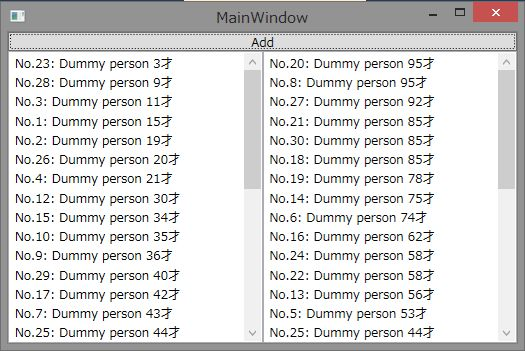

# WPFでデータをソートして表示する方法
## Requires
- Visual Studio 2012
## License
- Apache License, Version 2.0
## Technologies
- WPF
## Topics
- WPF Basics
## Updated
- 05/30/2013
## Description

<h1>サンプルプログラムの概要</h1>

このサンプルプログラムは、Windows Presentation FoudationのCollectionViewSourceを使用してデータをソートして表示するプログラムです。CollectionViewSourceのソート機能を使うことで、バックグラウンドで持つデータはソートしないまま、表示のソートを行うことが可能です。

サンプルプログラムでは、画面の左右にあるListBoxに1つのコレクションを異なるソート条件で表示しています。

<h1>サンプルプログラムの解説</h1>

このサンプルプログラムでは、画面に表示するデータを表すために以下のようなPersonクラスを定義しています。

C#

スクリプトの編集|Remove

csharp
<pre class="hidden">namespace WPFSortSample
{
    /// &lt;summary&gt;
    /// 画面に表示するためのダミーオブジェクト
    /// &lt;/summary&gt;
    public class Person
    {
        public string Name { get; set; }
        public int Age { get; set; }

        public override string ToString()
        {
            // 画面に表示するための文字列を作成
            return string.Format(&quot;{0} {1}才&quot;, this.Name, this.Age);
        }
    }
}
</pre>

<pre class="csharp">namespace&nbsp;WPFSortSample&nbsp;
{&nbsp;
&nbsp;&nbsp;&nbsp;&nbsp;///&nbsp;&lt;summary&gt;&nbsp;
&nbsp;&nbsp;&nbsp;&nbsp;///&nbsp;画面に表示するためのダミーオブジェクト&nbsp;
&nbsp;&nbsp;&nbsp;&nbsp;///&nbsp;&lt;/summary&gt;&nbsp;
&nbsp;&nbsp;&nbsp;&nbsp;public&nbsp;class&nbsp;Person&nbsp;
&nbsp;&nbsp;&nbsp;&nbsp;{&nbsp;
&nbsp;&nbsp;&nbsp;&nbsp;&nbsp;&nbsp;&nbsp;&nbsp;public&nbsp;string&nbsp;Name&nbsp;{&nbsp;get;&nbsp;set;&nbsp;}&nbsp;
&nbsp;&nbsp;&nbsp;&nbsp;&nbsp;&nbsp;&nbsp;&nbsp;public&nbsp;int&nbsp;Age&nbsp;{&nbsp;get;&nbsp;set;&nbsp;}&nbsp;
&nbsp;
&nbsp;&nbsp;&nbsp;&nbsp;&nbsp;&nbsp;&nbsp;&nbsp;public&nbsp;override&nbsp;string&nbsp;ToString()&nbsp;
&nbsp;&nbsp;&nbsp;&nbsp;&nbsp;&nbsp;&nbsp;&nbsp;{&nbsp;
&nbsp;&nbsp;&nbsp;&nbsp;&nbsp;&nbsp;&nbsp;&nbsp;&nbsp;&nbsp;&nbsp;&nbsp;//&nbsp;画面に表示するための文字列を作成&nbsp;
&nbsp;&nbsp;&nbsp;&nbsp;&nbsp;&nbsp;&nbsp;&nbsp;&nbsp;&nbsp;&nbsp;&nbsp;return&nbsp;string.Format(&quot;{0}&nbsp;{1}才&quot;,&nbsp;this.Name,&nbsp;this.Age);&nbsp;
&nbsp;&nbsp;&nbsp;&nbsp;&nbsp;&nbsp;&nbsp;&nbsp;}&nbsp;
&nbsp;&nbsp;&nbsp;&nbsp;}&nbsp;
}&nbsp;
</pre>

&nbsp;上記PersonクラスのAgeプロパティをキーにしてソートします。

WPFでのソートは、CollectionViewSourceクラスのSortDescriptionsプロパティを使用すると簡単にできます。SortDescriptionsプロパティには複数のSortDescription構造体を設定できます。SortDescription構造体はCollectionViewSourceクラスのSourceプロパティに設定されたコレクション内のオブジェクトのプロパティをキーにして昇順でソートするか降順でソートするか指定可能です。

サンプルプログラムでは、MainWindow.xamlのResourcesにAgeプロパティを昇順・降順でソートする2種類のCollectionViewSourceを定義しています。

XAML

スクリプトの編集|Remove

xaml
<pre class="hidden">&lt;CollectionViewSource x:Key=&quot;source1&quot;&gt;
    &lt;CollectionViewSource.SortDescriptions&gt;
        &lt;ComponentModel:SortDescription
            Direction=&quot;Ascending&quot;
            PropertyName=&quot;Age&quot; /&gt;
    &lt;/CollectionViewSource.SortDescriptions&gt;
&lt;/CollectionViewSource&gt;
&lt;CollectionViewSource x:Key=&quot;source2&quot;&gt;
    &lt;CollectionViewSource.SortDescriptions&gt;
        &lt;ComponentModel:SortDescription
            Direction=&quot;Descending&quot;
            PropertyName=&quot;Age&quot; /&gt;
    &lt;/CollectionViewSource.SortDescriptions&gt;
&lt;/CollectionViewSource&gt;
&lt;/Window.Resources&gt;
</pre>

<pre class="xaml">&lt;CollectionViewSource&nbsp;x:Key=&quot;source1&quot;&gt;&nbsp;
&nbsp;&nbsp;&nbsp;&nbsp;&lt;CollectionViewSource.SortDescriptions&gt;&nbsp;
&nbsp;&nbsp;&nbsp;&nbsp;&nbsp;&nbsp;&nbsp;&nbsp;&lt;ComponentModel:SortDescription&nbsp;
&nbsp;&nbsp;&nbsp;&nbsp;&nbsp;&nbsp;&nbsp;&nbsp;&nbsp;&nbsp;&nbsp;&nbsp;Direction=&quot;Ascending&quot;&nbsp;
&nbsp;&nbsp;&nbsp;&nbsp;&nbsp;&nbsp;&nbsp;&nbsp;&nbsp;&nbsp;&nbsp;&nbsp;PropertyName=&quot;Age&quot;&nbsp;/&gt;&nbsp;
&nbsp;&nbsp;&nbsp;&nbsp;&lt;/CollectionViewSource.SortDescriptions&gt;&nbsp;
&lt;/CollectionViewSource&gt;&nbsp;
&lt;CollectionViewSource&nbsp;x:Key=&quot;source2&quot;&gt;&nbsp;
&nbsp;&nbsp;&nbsp;&nbsp;&lt;CollectionViewSource.SortDescriptions&gt;&nbsp;
&nbsp;&nbsp;&nbsp;&nbsp;&nbsp;&nbsp;&nbsp;&nbsp;&lt;ComponentModel:SortDescription&nbsp;
&nbsp;&nbsp;&nbsp;&nbsp;&nbsp;&nbsp;&nbsp;&nbsp;&nbsp;&nbsp;&nbsp;&nbsp;Direction=&quot;Descending&quot;&nbsp;
&nbsp;&nbsp;&nbsp;&nbsp;&nbsp;&nbsp;&nbsp;&nbsp;&nbsp;&nbsp;&nbsp;&nbsp;PropertyName=&quot;Age&quot;&nbsp;/&gt;&nbsp;
&nbsp;&nbsp;&nbsp;&nbsp;&lt;/CollectionViewSource.SortDescriptions&gt;&nbsp;
&lt;/CollectionViewSource&gt;&nbsp;
&lt;/Window.Resources&gt;&nbsp;
</pre>

&nbsp;このCollectionViewSourceを画面のListBoxのItemsSourceプロパティにBindingしています。

XAML

スクリプトの編集|Remove

xaml
<pre class="hidden">&lt;ListBox Grid.Row=&quot;1&quot; ItemsSource=&quot;{Binding Source={StaticResource source1}}&quot; /&gt;
&lt;ListBox Grid.Row=&quot;1&quot; Grid.Column=&quot;1&quot; ItemsSource=&quot;{Binding Source={StaticResource source2}}&quot; /&gt;
</pre>

<pre class="xaml">&lt;ListBox&nbsp;Grid.Row=&quot;1&quot;&nbsp;ItemsSource=&quot;{Binding&nbsp;Source={StaticResource&nbsp;source1}}&quot;&nbsp;/&gt;&nbsp;
&lt;ListBox&nbsp;Grid.Row=&quot;1&quot;&nbsp;Grid.Column=&quot;1&quot;&nbsp;ItemsSource=&quot;{Binding&nbsp;Source={StaticResource&nbsp;source2}}&quot;&nbsp;/&gt;&nbsp;
</pre>

&nbsp;

コードビハインドのMainWindow.xaml.csのコンストラクタで、XAMLに定義したCollectionViewSourceのSourceプロパティにデータを&#26684;納しているObservableCollectionのインスタンスを設定しています。

C#

スクリプトの編集|Remove

csharp
<pre class="hidden">public MainWindow()
{
    InitializeComponent();

    // XAMLで定義したCollectionViewSourceのSourceにコレクションを設定
    var source1 = this.Resources[&quot;source1&quot;] as CollectionViewSource;
    if (source1 != null)
    {
        source1.Source = people;
    }

    var source2 = this.Resources[&quot;source2&quot;] as CollectionViewSource;
    if (source2 != null)
    {
        source2.Source = people;
    }
}
</pre>

<pre class="csharp">public&nbsp;MainWindow()&nbsp;
{&nbsp;
&nbsp;&nbsp;&nbsp;&nbsp;InitializeComponent();&nbsp;
&nbsp;
&nbsp;&nbsp;&nbsp;&nbsp;//&nbsp;XAMLで定義したCollectionViewSourceのSourceにコレクションを設定&nbsp;
&nbsp;&nbsp;&nbsp;&nbsp;var&nbsp;source1&nbsp;=&nbsp;this.Resources[&quot;source1&quot;]&nbsp;as&nbsp;CollectionViewSource;&nbsp;
&nbsp;&nbsp;&nbsp;&nbsp;if&nbsp;(source1&nbsp;!=&nbsp;null)&nbsp;
&nbsp;&nbsp;&nbsp;&nbsp;{&nbsp;
&nbsp;&nbsp;&nbsp;&nbsp;&nbsp;&nbsp;&nbsp;&nbsp;source1.Source&nbsp;=&nbsp;people;&nbsp;
&nbsp;&nbsp;&nbsp;&nbsp;}&nbsp;
&nbsp;
&nbsp;&nbsp;&nbsp;&nbsp;var&nbsp;source2&nbsp;=&nbsp;this.Resources[&quot;source2&quot;]&nbsp;as&nbsp;CollectionViewSource;&nbsp;
&nbsp;&nbsp;&nbsp;&nbsp;if&nbsp;(source2&nbsp;!=&nbsp;null)&nbsp;
&nbsp;&nbsp;&nbsp;&nbsp;{&nbsp;
&nbsp;&nbsp;&nbsp;&nbsp;&nbsp;&nbsp;&nbsp;&nbsp;source2.Source&nbsp;=&nbsp;people;&nbsp;
&nbsp;&nbsp;&nbsp;&nbsp;}&nbsp;
}&nbsp;
</pre>

&nbsp;画面上部にあるボタンのクリックイベントでは、年齢に乱数を設定したPersonクラスのインスタンスを作成してコレクションに追加しています。ポイントは、people変数の中では、何もソートをしていないという点です。

C#

スクリプトの編集|Remove

csharp
<pre class="hidden">private void AddPersonButton_Click(object sender, RoutedEventArgs e)
{
    // ランダムな年齢のPersonクラスのオブジェクトを追加する
    var p = new Person
    {
        Name = &quot;No.&quot; &#43; (this.people.Count &#43; 1) &#43; &quot;: Dummy person&quot;,
        Age = this.RandomObject.Next(100)
    };
    this.people.Add(p);
}
</pre>

<pre class="csharp">private&nbsp;void&nbsp;AddPersonButton_Click(object&nbsp;sender,&nbsp;RoutedEventArgs&nbsp;e)&nbsp;
{&nbsp;
&nbsp;&nbsp;&nbsp;&nbsp;//&nbsp;ランダムな年齢のPersonクラスのオブジェクトを追加する&nbsp;
&nbsp;&nbsp;&nbsp;&nbsp;var&nbsp;p&nbsp;=&nbsp;new&nbsp;Person&nbsp;
&nbsp;&nbsp;&nbsp;&nbsp;{&nbsp;
&nbsp;&nbsp;&nbsp;&nbsp;&nbsp;&nbsp;&nbsp;&nbsp;Name&nbsp;=&nbsp;&quot;No.&quot;&nbsp;&#43;&nbsp;(this.people.Count&nbsp;&#43;&nbsp;1)&nbsp;&#43;&nbsp;&quot;:&nbsp;Dummy&nbsp;person&quot;,&nbsp;
&nbsp;&nbsp;&nbsp;&nbsp;&nbsp;&nbsp;&nbsp;&nbsp;Age&nbsp;=&nbsp;this.RandomObject.Next(100)&nbsp;
&nbsp;&nbsp;&nbsp;&nbsp;};&nbsp;
&nbsp;&nbsp;&nbsp;&nbsp;this.people.Add(p);&nbsp;
}&nbsp;
</pre>

&nbsp;

プログラムを実行してボタンを何回かクリックすると、CollectionViewSourceに設定したソートの条件でListBoxにデータが表示されていることが確認できます。

<h1 class="endscriptcode">参考情報</h1>

このサンプルで使用している代表的なクラスのMSDNへのリンクです。

<ul>
<li>

CollectionViewSourceクラス 
<a href="http://msdn.microsoft.com/ja-jp/library/system.windows.data.collectionviewsource(v=vs.100).aspx">http://msdn.microsoft.com/ja-jp/library/system.windows.data.collectionviewsource(v=vs.100).aspx</a>

</li><li>

SortDescription構造体 
<a href="http://msdn.microsoft.com/ja-jp/library/system.componentmodel.sortdescription(v=vs.100).aspx">http://msdn.microsoft.com/ja-jp/library/system.componentmodel.sortdescription(v=vs.100).aspx</a>

</li></ul>
