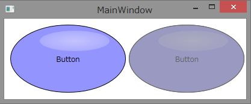
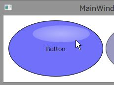

# WPFでボタンの見た目をコントロールテンプレートを使ってカスタマイズする
## Requires
- Visual Studio 2012
## License
- Apache License, Version 2.0
## Technologies
- WPF
## Topics
- WPF Styling
## Updated
- 05/29/2013
## Description

<h1>サンプルプログラムの概要</h1>

このサンプルプログラムは、Windows Presentation Foundationのテンプレート機能を使ってボタンの見た目をカスタマイズする方法を示しています。このボタンを作成する際にはXAMLは直接いじらずにBlend for Visual Studio 2012を使用して、ボタンを作成しました。

コントロールの見た目の変更の参考にしてください。このサンプルプログラムを実行した様子を下図に示します。

左右のボタンには、サンプロプログラム内で定義した同じスタイルを適用しています。左のボタンが通常のボタンで、右側のボタンがIsEnabledプロパティをFalseにした状態のボタンです。また、マウスオーバー時のボタンの色の変更にも対応しています。

スクリーンショットではわかりづらいですが、ボタンをクリックすると押し込んだ感じを出すためにボタンの位置が若干右下に移動するような動作も設定しています。

<h1>サンプルプログラムの作成過程</h1>
<h2>構成要素の配置</h2>

Windows Presentation Foundationでコントロールを自作する場合には、見た目を作成してコントロール化する方法が簡単に行えて便利です。Blend for Visual Studio 2012でWPFアプリケーションを作成したら、まず画面にこのような見た目のコントロールを作りたいと感じるままに図形などを配置します。

今回のサンプルではEllipseを3つ重ねています。1つ目のEllipseは、ベースとなる青い楕円で、2つ目のEllipseは、楕円が光っているように見せるためのてかりを表しています。円形の白色のグラデーションで外側にいくほど透明度をあげるようにして、Opacityプロパティで光の部分の楕円事態の透明度を薄くすることで光っている感じを出すことができます。3つ目のEllipseは、未選択状態のときに表示する楕円で、普段は非表示にしています。表示されたときにグレーの半透明の色の楕円が覆いかぶさるように配置します。

XAMLでは、以下のようになっています。

XAML

スクリプトの編集|Remove

xaml

<pre class="xaml">&lt;Ellipse&nbsp;x:Name=&quot;ellipse&quot;&nbsp;Width=&quot;192&quot;&nbsp;VerticalAlignment=&quot;Top&quot;&nbsp;Stroke=&quot;Black&quot;&nbsp;Height=&quot;113&quot;&nbsp;HorizontalAlignment=&quot;Left&quot;&nbsp;Fill=&quot;#FF9494FF&quot;/&gt;&nbsp;
&lt;Ellipse&nbsp;Width=&quot;116&quot;&nbsp;VerticalAlignment=&quot;Top&quot;&nbsp;Opacity=&quot;0.445&quot;&nbsp;Margin=&quot;49,10,0,0&quot;&nbsp;Height=&quot;34&quot;&nbsp;HorizontalAlignment=&quot;Left&quot;&gt;&nbsp;
&nbsp;&nbsp;&nbsp;&nbsp;&lt;Ellipse.Fill&gt;&nbsp;
&nbsp;&nbsp;&nbsp;&nbsp;&nbsp;&nbsp;&nbsp;&nbsp;&lt;RadialGradientBrush&gt;&nbsp;
&nbsp;&nbsp;&nbsp;&nbsp;&nbsp;&nbsp;&nbsp;&nbsp;&nbsp;&nbsp;&nbsp;&nbsp;&lt;GradientStop&nbsp;Color=&quot;White&quot;&nbsp;Offset=&quot;0&quot;/&gt;&nbsp;
&nbsp;&nbsp;&nbsp;&nbsp;&nbsp;&nbsp;&nbsp;&nbsp;&nbsp;&nbsp;&nbsp;&nbsp;&lt;GradientStop&nbsp;Color=&quot;#7EFFFFFF&quot;&nbsp;Offset=&quot;1&quot;/&gt;&nbsp;
&nbsp;&nbsp;&nbsp;&nbsp;&nbsp;&nbsp;&nbsp;&nbsp;&lt;/RadialGradientBrush&gt;&nbsp;
&nbsp;&nbsp;&nbsp;&nbsp;&lt;/Ellipse.Fill&gt;&nbsp;
&lt;/Ellipse&gt;&nbsp;
&lt;ContentPresenter&nbsp;HorizontalAlignment=&quot;{TemplateBinding&nbsp;HorizontalContentAlignment}&quot;&nbsp;RecognizesAccessKey=&quot;True&quot;&nbsp;SnapsToDevicePixels=&quot;{TemplateBinding&nbsp;SnapsToDevicePixels}&quot;&nbsp;VerticalAlignment=&quot;{TemplateBinding&nbsp;VerticalContentAlignment}&quot;/&gt;&nbsp;
&lt;Ellipse&nbsp;x:Name=&quot;ellipse1&quot;&nbsp;HorizontalAlignment=&quot;Left&quot;&nbsp;Height=&quot;113&quot;&nbsp;VerticalAlignment=&quot;Top&quot;&nbsp;Width=&quot;192&quot;&nbsp;Fill=&quot;#9F9B9B9B&quot;&nbsp;Visibility=&quot;Hidden&quot;/&gt;&nbsp;
</pre>

&nbsp;通常は、手書きではなくBlend for Visual Studio 2012を使用してこのような要素の配置や色を作成することになると思います。これらのEllipseをGridでまとめたあとに右クリックメニューからコントロールの作成を行いButtonに変換します。ボタンに変換するとContentPresenterが自動的に挿入されるので、必要に応じて位置調整などを行います。

<h2 class="endscriptcode">状態に応じた表示の定義</h2>

Blend for Visual Studio 2012の状態ウィンドウでは、コントロールのステータスの応じて見た目を変えることが簡単にできるようになっています。コントロールで定義されている状態を選択してデザイナやプロパティウィンドウでプロパティの値を変更するだけで設定は完了します。ボタンコントロールでは以下のような状態が定義されています。

今回のサンプルではMouseOver時に色を変更するという設定と、Pressed時に少し左下に移動させるという設定と、Disabled時に普段は非表示にしている半透明グレーの楕円を表示するように設定しました。

ぜひ、サンプルをダウンロードしてBlend for Visual Studio 2012で触ってみてください。

&nbsp;

