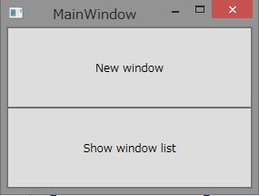
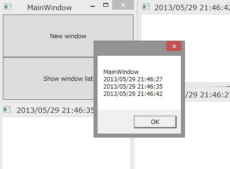

# WPFで表示中のWindowの一覧を取得する
## Requires
- Visual Studio 2012
## License
- Apache License, Version 2.0
## Technologies
- WPF
## Topics
- WPF Basics
## Updated
- 05/29/2013
## Description

<h1>サンプルプログラムの概要</h1>

このサンプルプログラムでは、Windows Presentation FoundationのApplicationクラスにあるWindowsプロパティを使用して表示中のWindowを取得する方法を示しています。WPFでは、このように組み込みのクラスにWindowを管理する機能があるため、自分で表示中のWindowの管理機能を1からつくる必要がありません。

<h1>サンプルプログラムの動作</h1>

このサンプルプログラムは実行すると、以下のように2つのボタンをもったWindowが表示されます。

画面上部のNew windowボタンをクリックすると、タイトルに現在時刻を表示したウィンドウが表示されます。

いくつかのウィンドウを表示した状態で画面下部のShow window listボタンをクリックするとApplicationクラスのWindowsプロパティを使って表示中のWindowを列挙してタイトルのリストをメッセージボックスに表示します。

<h1>サンプルプログラムのポイント</h1>

このサンプルプログラムのポイントは、MainWindow.xaml.csのShowWindowListButton_Clickメソッド内です。このメソッド内でApplicationクラスのWindowsプロパティを使用しています。該当箇所のコードを以下に抜粋して示します。

C#

スクリプトの編集|Remove

csharp

<pre class="csharp">//&nbsp;表示中のWindowのタイトルをメッセージボックスに表示します。&nbsp;
var&nbsp;windowTitles&nbsp;=&nbsp;Application&nbsp;
&nbsp;&nbsp;&nbsp;&nbsp;.Current&nbsp;
&nbsp;&nbsp;&nbsp;&nbsp;.Windows&nbsp;
&nbsp;&nbsp;&nbsp;&nbsp;.Cast&lt;Window&gt;()&nbsp;
&nbsp;&nbsp;&nbsp;&nbsp;.Aggregate(&nbsp;
&nbsp;&nbsp;&nbsp;&nbsp;&nbsp;&nbsp;&nbsp;&nbsp;new&nbsp;StringBuilder(),&nbsp;
&nbsp;&nbsp;&nbsp;&nbsp;&nbsp;&nbsp;&nbsp;&nbsp;(sb,&nbsp;w)&nbsp;=&gt;&nbsp;sb.AppendLine(w.Title))&nbsp;
&nbsp;&nbsp;&nbsp;&nbsp;.ToString();&nbsp;
MessageBox.Show(windowTitles);&nbsp;
</pre>

&nbsp;Applicationクラスのインスタンスは、Currentプロパティを経由して取得できます。そしてWindowsプロパティを使用してWindowのコレクションを取得しています。今回のサンプルプログラムでは、Aggregateメソッドを使ってWindowのTitleプロパティを収集しているので、Castメソッドを使いLINQのメソッドチェーンにつなげています。

<h1>参考情報</h1>

このサンプルプログラム内で使用している代表的なメソッドやプロパティの詳細はMSDNの以下のページを参照してください。

<ul>
<li>Application.Windowsプロパティ 
<a href="http://msdn.microsoft.com/ja-jp/library/vstudio/system.windows.application.windows.aspx">http://msdn.microsoft.com/ja-jp/library/vstudio/system.windows.application.windows.aspx</a>
</li><li>Enumerable.Aggregateメソッド 
<a href="http://msdn.microsoft.com/ja-jp/library/system.linq.enumerable.aggregate(v=vs.100).aspx">http://msdn.microsoft.com/ja-jp/library/system.linq.enumerable.aggregate(v=vs.100).aspx</a>
</li><li>Enumerable.Castメソッド 
<a href="http://msdn.microsoft.com/ja-jp/library/bb341406(v=vs.100).aspx">http://msdn.microsoft.com/ja-jp/library/bb341406(v=vs.100).aspx</a>
</li></ul>
