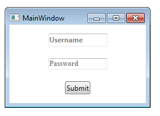

# Watermarked TextBox and PasswordBox
## Requires
- Visual Studio 2010
## License
- Apache License, Version 2.0
## Technologies
- WPF
- XAML
## Topics
- TextBox
- AttachedProperties
- AttachedBehaviours
- PasswordBox
- Watermarking
## Updated
- 09/19/2012
## Description

<h1>Introduction</h1>

This project contains watermark solutions for the TextBox and the PasswordBox. There is a WatermarkTextBox in the Extended WPF Toolkit, there&nbsp;is (to date)&nbsp;no solution for the PasswordBox.&nbsp;Also, I prefer to keep my projects as light as possible,
 so here is a very simple solution to a commonly requested pair of controls.

&nbsp;

<h1>&nbsp;</h1>
<h1>Building the Sample</h1>

Just download, unblock, unzip, load &amp; run!

&nbsp;

Description

The purpose of a watermark is to convey a message behind the control. In the case of this demonstration, the watermark also dissappear after you start typing text, so they are more like a field &quot;hint&quot; telling you what is expected.

&nbsp;

To achieve this, we turn to a regular WPF solution provider, the AttachedProperty. AttachedProperties allow you to add extra properties to any control. You can also extend it into an Attachedbehaviour, where you are making the control react to changes to
 the property.

&nbsp;

In this example, we use two attached properties. The first &quot;WaterrmarkProperty&quot;&nbsp;to take the watermark value and initialise the control:

C#

Edit|Remove

csharp

<pre class="csharp">public&nbsp;static&nbsp;string&nbsp;GetWatermark(DependencyObject&nbsp;obj)&nbsp;
{&nbsp;
&nbsp;&nbsp;&nbsp;&nbsp;return&nbsp;(string)obj.GetValue(WatermarkProperty);&nbsp;
}&nbsp;
&nbsp;
public&nbsp;static&nbsp;void&nbsp;SetWatermark(DependencyObject&nbsp;obj,&nbsp;string&nbsp;value)&nbsp;
{&nbsp;
&nbsp;&nbsp;&nbsp;&nbsp;obj.SetValue(WatermarkProperty,&nbsp;value);&nbsp;
}&nbsp;
&nbsp;
public&nbsp;static&nbsp;readonly&nbsp;DependencyProperty&nbsp;WatermarkProperty&nbsp;=&nbsp;
&nbsp;&nbsp;&nbsp;&nbsp;DependencyProperty.RegisterAttached(&quot;Watermark&quot;,&nbsp;typeof(string),&nbsp;typeof(TextBoxHelper),&nbsp;new&nbsp;UIPropertyMetadata(null,&nbsp;WatermarkChanged));</pre>

The second attached property is to notify whether there is a value in the box, which the template binds to and hides or shows the watermark.

&nbsp;

C#

Edit|Remove

csharp

<pre class="js">public&nbsp;static&nbsp;bool&nbsp;GetShowWatermark(DependencyObject&nbsp;obj)&nbsp;
{&nbsp;
&nbsp;&nbsp;&nbsp;&nbsp;return&nbsp;(bool)obj.GetValue(ShowWatermarkProperty);&nbsp;
}&nbsp;
&nbsp;
public&nbsp;static&nbsp;void&nbsp;SetShowWatermark(DependencyObject&nbsp;obj,&nbsp;bool&nbsp;value)&nbsp;
{&nbsp;
&nbsp;&nbsp;&nbsp;&nbsp;obj.SetValue(ShowWatermarkProperty,&nbsp;value);&nbsp;
}&nbsp;
&nbsp;
public&nbsp;static&nbsp;readonly&nbsp;DependencyProperty&nbsp;ShowWatermarkProperty&nbsp;=&nbsp;
&nbsp;&nbsp;&nbsp;&nbsp;DependencyProperty.RegisterAttached(&quot;ShowWatermark&quot;,&nbsp;typeof(bool),&nbsp;typeof(TextBoxHelper),&nbsp;new&nbsp;UIPropertyMetadata(false));</pre>

&nbsp;

For the TextBoxHelper, whenever the text is changed,&nbsp;the watermark is shown or hidden as follows:

&nbsp;

&nbsp;

C#

Edit|Remove

csharp

<pre class="js">private&nbsp;static&nbsp;void&nbsp;CheckShowWatermark(TextBox&nbsp;box)&nbsp;
{&nbsp;
&nbsp;&nbsp;&nbsp;&nbsp;box.SetValue(TextBoxHelper.ShowWatermarkProperty,&nbsp;box.Text&nbsp;==&nbsp;string.Empty);&nbsp;
}&nbsp;
</pre>

This is controlled by the ControlTemplate:

XAML

Edit|Remove

xaml

<pre class="js">&lt;ControlTemplate&nbsp;x:Key=&quot;WatermarkedTextBoxTemplate&quot;&nbsp;TargetType=&quot;{x:Type&nbsp;TextBox}&quot;&gt;&nbsp;
&nbsp;&nbsp;&nbsp;&nbsp;&lt;Microsoft_Windows_Themes:ListBoxChrome&nbsp;x:Name=&quot;Bd&quot;&nbsp;BorderBrush=&quot;{TemplateBinding&nbsp;BorderBrush}&quot;&nbsp;BorderThickness=&quot;{TemplateBinding&nbsp;BorderThickness}&quot;&nbsp;Background=&quot;{TemplateBinding&nbsp;Background}&quot;&nbsp;RenderMouseOver=&quot;{TemplateBinding&nbsp;IsMouseOver}&quot;&nbsp;RenderFocused=&quot;{TemplateBinding&nbsp;IsKeyboardFocusWithin}&quot;&nbsp;SnapsToDevicePixels=&quot;true&quot;&gt;&nbsp;
&nbsp;&nbsp;&nbsp;&nbsp;&nbsp;&nbsp;&nbsp;&nbsp;&lt;Grid&gt;&nbsp;
&nbsp;&nbsp;&nbsp;&nbsp;&nbsp;&nbsp;&nbsp;&nbsp;&nbsp;&nbsp;&nbsp;&nbsp;&lt;TextBlock&nbsp;Text=&quot;{Binding&nbsp;Path=(local:TextBoxHelper.Watermark),&nbsp;RelativeSource={RelativeSource&nbsp;TemplatedParent}}&quot;&nbsp;Opacity=&quot;.5&quot;&nbsp;FontWeight=&quot;Bold&quot;&nbsp;Visibility=&quot;{Binding&nbsp;(local:TextBoxHelper.ShowWatermark),&nbsp;Converter={StaticResource&nbsp;BooleanToVisibilityConverter},&nbsp;RelativeSource={RelativeSource&nbsp;TemplatedParent}}&quot;&nbsp;/&gt;&nbsp;
&nbsp;&nbsp;&nbsp;&nbsp;&nbsp;&nbsp;&nbsp;&nbsp;&nbsp;&nbsp;&nbsp;&nbsp;&lt;ScrollViewer&nbsp;x:Name=&quot;PART_ContentHost&quot;&nbsp;SnapsToDevicePixels=&quot;{TemplateBinding&nbsp;SnapsToDevicePixels}&quot;/&gt;&nbsp;
&nbsp;&nbsp;&nbsp;&nbsp;&nbsp;&nbsp;&nbsp;&nbsp;&lt;/Grid&gt;&nbsp;
&nbsp;&nbsp;&nbsp;&nbsp;&lt;/Microsoft_Windows_Themes:ListBoxChrome&gt;&nbsp;
&nbsp;&nbsp;&nbsp;&nbsp;&lt;ControlTemplate.Triggers&gt;&nbsp;
&nbsp;&nbsp;&nbsp;&nbsp;&nbsp;&nbsp;&nbsp;&nbsp;&lt;Trigger&nbsp;Property=&quot;IsEnabled&quot;&nbsp;Value=&quot;false&quot;&gt;&nbsp;
&nbsp;&nbsp;&nbsp;&nbsp;&nbsp;&nbsp;&nbsp;&nbsp;&nbsp;&nbsp;&nbsp;&nbsp;&lt;Setter&nbsp;Property=&quot;Background&quot;&nbsp;TargetName=&quot;Bd&quot;&nbsp;Value=&quot;{DynamicResource&nbsp;{x:Static&nbsp;SystemColors.ControlBrushKey}}&quot;/&gt;&nbsp;
&nbsp;&nbsp;&nbsp;&nbsp;&nbsp;&nbsp;&nbsp;&nbsp;&nbsp;&nbsp;&nbsp;&nbsp;&lt;Setter&nbsp;Property=&quot;Foreground&quot;&nbsp;Value=&quot;{DynamicResource&nbsp;{x:Static&nbsp;SystemColors.GrayTextBrushKey}}&quot;/&gt;&nbsp;
&nbsp;&nbsp;&nbsp;&nbsp;&nbsp;&nbsp;&nbsp;&nbsp;&lt;/Trigger&gt;&nbsp;
&nbsp;&nbsp;&nbsp;&nbsp;&lt;/ControlTemplate.Triggers&gt;&nbsp;
&lt;/ControlTemplate&gt;</pre>

&nbsp;

&nbsp;

<h1>Source Code Files</h1>
<ul>
<li><em>MainWindow.xaml - Startup window &amp; example controls</em> </li><li><em>App.xaml - Control templates for both control types</em> </li></ul>

&nbsp;

&nbsp;

