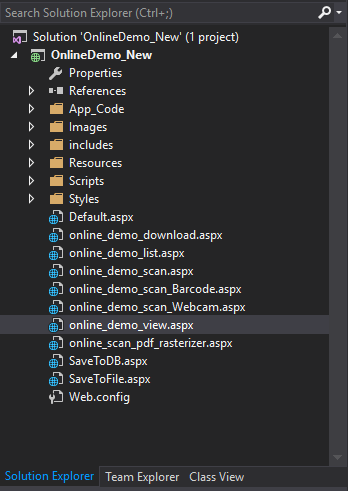

# Web TWAIN SDK for Document Scanning, Webcam Capture, Barcode and PDF Rasterize
## Requires
- Visual Studio 2008
## License
- Apache License, Version 2.0
## Technologies
- C#
- SQL Server
- ASP.NET
- Javascript
- Web
- HTML5
- Webcam
- WIA
- PDF
- Image Processing
- scanner
- Twain
- document scanning
- Barcode
## Topics
- ImageViewer
- using webcam
- Image manipulation
- Image
- HTTP
- Databases
- HTML5/JavaScript
- media capture
- Image editing
- document scanning
- PDF rasterizer
## Updated
- 08/26/2016
## Description

<h2>Introduction</h2>

<em>The sample illustrates how to use <a href="http://www.dynamsoft.com/Products/WebTWAIN_Overview.aspx" target="_blank">
Dynamic Web TWAIN</a> JavaScript library to scan documents, control webcam, read barcode and rasterize PDF in web browsers. All of these functionalities can work on
<strong>Windows </strong>and <strong>macOS</strong>.</em>

<h2><em>Features of Dynamic Web TWAIN</em></h2>
<ul class="right-content">
<li>TWAIN specification 2.1 and below compatible (ActiveX, HTML5 for Windows, Plugin APIs).
</li><li>TWAIN specification 1.9 and below compatible (HTML5 for Mac API). </li><li>Optional disk caching mechanism enables high volume document scanning (up to thousands of pages).
</li><li>Supports Auto Document Feeder (ADF) and multiple image acquisition. </li><li>Supports duplex scanning mode. </li><li>Supports image preview mode. </li><li>Supports blank page detection. </li><li>Built-in wizard mode intelligently manages TWAIN states. </li><li>

Supports setting up image acquisition parameters (resolution, pixel type, bit depth, brightness, contrast, page size, unit, etc).

</li><li>

Supports both Native and Disk File Image transfer modes. ActiveX, Plugin and HTML5 for Windows APIs also support Buffered Memory transfer mode.

</li></ul>
<h2>Building the Sample</h2>

<em>Download and extract the package. Open the project with Visual Studio 2005, 2008, 2010, 2013 and 2015.</em>

<em></em>

<em>Press F5 to launch the project:</em>

<em> 
</em>

<h2>Document Scanning, Webcam, Barcode &amp; PDF in JavaScript</h2>
<h3><em>Scan Document</em></h3>

Here is the complete code for scanning document from TWAIN, WIA scanners.

JavaScript

Edit|Remove

js
<pre class="hidden">&lt;input type=&quot;button&quot; value=&quot;Scan&quot; onclick=&quot;AcquireImage();&quot; /&gt;

&lt;!-- dwtcontrolContainer is the default div id for Dynamic Web TWAIN control.
    If you need to rename the id, you should also change the id in the dynamsoft.webtwain.config.js accordingly. --&gt;
&lt;div id=&quot;dwtcontrolContainer&quot;&gt;&lt;/div&gt;

&lt;script type=&quot;text/javascript&quot;&gt;
    Dynamsoft.WebTwainEnv.RegisterEvent('OnWebTwainReady', Dynamsoft_OnReady); // Register OnWebTwainReady event. This event fires as soon as Dynamic Web TWAIN is initialized and ready to be used
    var DWObject;

    function Dynamsoft_OnReady() {
        DWObject = Dynamsoft.WebTwainEnv.GetWebTwain('dwtcontrolContainer'); // Get the Dynamic Web TWAIN object that is embeded in the div with id 'dwtcontrolContainer'
        if (DWObject) {
            DWObject.ImageCaptureDriverType = 3;
            var count = DWObject.SourceCount;
            for (var i = 0; i &lt; count; i&#43;&#43;)
                document.getElementById(&quot;source&quot;).options.add(new Option(DWObject.GetSourceNameItems(i), i)); // Get Data Source names from Data Source Manager and put them in a drop-down box
        }
    }

    function AcquireImage() {
        if (DWObject) {
            var OnAcquireImageSuccess, OnAcquireImageFailure;
            OnAcquireImageSuccess = OnAcquireImageFailure = function() {
                DWObject.CloseSource();
            };

            DWObject.SelectSourceByIndex(document.getElementById(&quot;source&quot;).selectedIndex); //Use method SelectSourceByIndex to avoid the 'Select Source' dialog
            DWObject.OpenSource();
            DWObject.IfDisableSourceAfterAcquire = true; // Scanner source will be disabled/closed automatically after the scan.
            DWObject.AcquireImage(OnAcquireImageSuccess, OnAcquireImageFailure);
        }
    }
&lt;/script&gt;</pre>

<pre class="js">&lt;input&nbsp;type=&quot;button&quot;&nbsp;value=&quot;Scan&quot;&nbsp;onclick=&quot;AcquireImage();&quot;&nbsp;/&gt;&nbsp;
&nbsp;
&lt;!--&nbsp;dwtcontrolContainer&nbsp;is&nbsp;the&nbsp;default&nbsp;div&nbsp;id&nbsp;for&nbsp;Dynamic&nbsp;Web&nbsp;TWAIN&nbsp;control.&nbsp;
&nbsp;&nbsp;&nbsp;&nbsp;If&nbsp;you&nbsp;need&nbsp;to&nbsp;rename&nbsp;the&nbsp;id,&nbsp;you&nbsp;should&nbsp;also&nbsp;change&nbsp;the&nbsp;id&nbsp;in&nbsp;the&nbsp;dynamsoft.webtwain.config.js&nbsp;accordingly.&nbsp;--&gt;&nbsp;
&lt;div&nbsp;id=&quot;dwtcontrolContainer&quot;&gt;&lt;/div&gt;&nbsp;
&nbsp;
&lt;script&nbsp;type=&quot;text/javascript&quot;&gt;&nbsp;
&nbsp;&nbsp;&nbsp;&nbsp;Dynamsoft.WebTwainEnv.RegisterEvent('OnWebTwainReady',&nbsp;Dynamsoft_OnReady);&nbsp;//&nbsp;Register&nbsp;OnWebTwainReady&nbsp;event.&nbsp;This&nbsp;event&nbsp;fires&nbsp;as&nbsp;soon&nbsp;as&nbsp;Dynamic&nbsp;Web&nbsp;TWAIN&nbsp;is&nbsp;initialized&nbsp;and&nbsp;ready&nbsp;to&nbsp;be&nbsp;used&nbsp;
&nbsp;&nbsp;&nbsp;&nbsp;var&nbsp;DWObject;&nbsp;
&nbsp;
&nbsp;&nbsp;&nbsp;&nbsp;function&nbsp;Dynamsoft_OnReady()&nbsp;{&nbsp;
&nbsp;&nbsp;&nbsp;&nbsp;&nbsp;&nbsp;&nbsp;&nbsp;DWObject&nbsp;=&nbsp;Dynamsoft.WebTwainEnv.GetWebTwain('dwtcontrolContainer');&nbsp;//&nbsp;Get&nbsp;the&nbsp;Dynamic&nbsp;Web&nbsp;TWAIN&nbsp;object&nbsp;that&nbsp;is&nbsp;embeded&nbsp;in&nbsp;the&nbsp;div&nbsp;with&nbsp;id&nbsp;'dwtcontrolContainer'&nbsp;
&nbsp;&nbsp;&nbsp;&nbsp;&nbsp;&nbsp;&nbsp;&nbsp;if&nbsp;(DWObject)&nbsp;{&nbsp;
&nbsp;&nbsp;&nbsp;&nbsp;&nbsp;&nbsp;&nbsp;&nbsp;&nbsp;&nbsp;&nbsp;&nbsp;DWObject.ImageCaptureDriverType&nbsp;=&nbsp;3;&nbsp;
&nbsp;&nbsp;&nbsp;&nbsp;&nbsp;&nbsp;&nbsp;&nbsp;&nbsp;&nbsp;&nbsp;&nbsp;var&nbsp;count&nbsp;=&nbsp;DWObject.SourceCount;&nbsp;
&nbsp;&nbsp;&nbsp;&nbsp;&nbsp;&nbsp;&nbsp;&nbsp;&nbsp;&nbsp;&nbsp;&nbsp;for&nbsp;(var&nbsp;i&nbsp;=&nbsp;0;&nbsp;i&nbsp;&lt;&nbsp;count;&nbsp;i&#43;&#43;)&nbsp;
&nbsp;&nbsp;&nbsp;&nbsp;&nbsp;&nbsp;&nbsp;&nbsp;&nbsp;&nbsp;&nbsp;&nbsp;&nbsp;&nbsp;&nbsp;&nbsp;document.getElementById(&quot;source&quot;).options.add(new&nbsp;Option(DWObject.GetSourceNameItems(i),&nbsp;i));&nbsp;//&nbsp;Get&nbsp;Data&nbsp;Source&nbsp;names&nbsp;from&nbsp;Data&nbsp;Source&nbsp;Manager&nbsp;and&nbsp;put&nbsp;them&nbsp;in&nbsp;a&nbsp;drop-down&nbsp;box&nbsp;
&nbsp;&nbsp;&nbsp;&nbsp;&nbsp;&nbsp;&nbsp;&nbsp;}&nbsp;
&nbsp;&nbsp;&nbsp;&nbsp;}&nbsp;
&nbsp;
&nbsp;&nbsp;&nbsp;&nbsp;function&nbsp;AcquireImage()&nbsp;{&nbsp;
&nbsp;&nbsp;&nbsp;&nbsp;&nbsp;&nbsp;&nbsp;&nbsp;if&nbsp;(DWObject)&nbsp;{&nbsp;
&nbsp;&nbsp;&nbsp;&nbsp;&nbsp;&nbsp;&nbsp;&nbsp;&nbsp;&nbsp;&nbsp;&nbsp;var&nbsp;OnAcquireImageSuccess,&nbsp;OnAcquireImageFailure;&nbsp;
&nbsp;&nbsp;&nbsp;&nbsp;&nbsp;&nbsp;&nbsp;&nbsp;&nbsp;&nbsp;&nbsp;&nbsp;OnAcquireImageSuccess&nbsp;=&nbsp;OnAcquireImageFailure&nbsp;=&nbsp;function()&nbsp;{&nbsp;
&nbsp;&nbsp;&nbsp;&nbsp;&nbsp;&nbsp;&nbsp;&nbsp;&nbsp;&nbsp;&nbsp;&nbsp;&nbsp;&nbsp;&nbsp;&nbsp;DWObject.CloseSource();&nbsp;
&nbsp;&nbsp;&nbsp;&nbsp;&nbsp;&nbsp;&nbsp;&nbsp;&nbsp;&nbsp;&nbsp;&nbsp;};&nbsp;
&nbsp;
&nbsp;&nbsp;&nbsp;&nbsp;&nbsp;&nbsp;&nbsp;&nbsp;&nbsp;&nbsp;&nbsp;&nbsp;DWObject.SelectSourceByIndex(document.getElementById(&quot;source&quot;).selectedIndex);&nbsp;//Use&nbsp;method&nbsp;SelectSourceByIndex&nbsp;to&nbsp;avoid&nbsp;the&nbsp;'Select&nbsp;Source'&nbsp;dialog&nbsp;
&nbsp;&nbsp;&nbsp;&nbsp;&nbsp;&nbsp;&nbsp;&nbsp;&nbsp;&nbsp;&nbsp;&nbsp;DWObject.OpenSource();&nbsp;
&nbsp;&nbsp;&nbsp;&nbsp;&nbsp;&nbsp;&nbsp;&nbsp;&nbsp;&nbsp;&nbsp;&nbsp;DWObject.IfDisableSourceAfterAcquire&nbsp;=&nbsp;true;&nbsp;//&nbsp;Scanner&nbsp;source&nbsp;will&nbsp;be&nbsp;disabled/closed&nbsp;automatically&nbsp;after&nbsp;the&nbsp;scan.&nbsp;
&nbsp;&nbsp;&nbsp;&nbsp;&nbsp;&nbsp;&nbsp;&nbsp;&nbsp;&nbsp;&nbsp;&nbsp;DWObject.AcquireImage(OnAcquireImageSuccess,&nbsp;OnAcquireImageFailure);&nbsp;
&nbsp;&nbsp;&nbsp;&nbsp;&nbsp;&nbsp;&nbsp;&nbsp;}&nbsp;
&nbsp;&nbsp;&nbsp;&nbsp;}&nbsp;
&lt;/script&gt;</pre>

To upload an image, use the JavaScript code on the client-side:

&nbsp;

JavaScript

Edit|Remove

js
<pre class="hidden">function btnUpload_onclick() {
    if (!checkIfImagesInBuffer()) {
        return;
    }
    var i, strHTTPServer, strActionPage, strImageType;

    var _txtFileName = document.getElementById(&quot;txt_fileName&quot;);
    if(_txtFileName)
        _txtFileName.className = &quot;&quot;;
  
    //DWObject.MaxInternetTransferThreads = 5;
    strHTTPServer = location.hostname;
    DWObject.IfSSL = DynamLib.detect.ssl;
    var _strPort = location.port == &quot;&quot; ? 80 : location.port;
    if (DynamLib.detect.ssl == true)
        _strPort = location.port == &quot;&quot; ? 443 : location.port;
    DWObject.HTTPPort = _strPort;
    
    
    var CurrentPathName = unescape(location.pathname); // get current PathName in plain ASCII	
    var CurrentPath = CurrentPathName.substring(0, CurrentPathName.lastIndexOf(&quot;/&quot;) &#43; 1);
    strActionPage = CurrentPath &#43; &quot;SaveToFile.aspx&quot;; //the ActionPage's file path , Online Demo:&quot;SaveToDB.aspx&quot; ;Sample: &quot;SaveToFile.aspx&quot;;
    var redirectURLifOK = CurrentPath &#43; &quot;online_demo_list.aspx&quot;;
    for (i = 0; i &lt; 4; i&#43;&#43;) {
        if (document.getElementsByName(&quot;ImageType&quot;).item(i).checked == true) {
            strImageType = i &#43; 1;
            break;
        }
    }

	var fileName = _txtFileName.value;
	var replaceStr = &quot;&lt;&quot;;
	fileName = fileName.replace(new RegExp(replaceStr,'gm'),'&amp;lt;');
    var uploadfilename = fileName &#43; &quot;.&quot; &#43; document.getElementsByName(&quot;ImageType&quot;).item(i).value;

    var OnSuccess = function(httpResponse) {
        appendMessage('&lt;b&gt;Upload: &lt;/b&gt;');
        checkErrorStringWithErrorCode(0, &quot;Successful.&quot;);
        if (strActionPage.indexOf(&quot;SaveToFile&quot;) != -1) {
            alert(&quot;Successful&quot;)//if save to file.
        } else {
            window.location.href = redirectURLifOK;
        }
    };

    var OnFailure = function(errorCode, errorString, httpResponse) {
        checkErrorStringWithErrorCode(errorCode, errorString, httpResponse);
    };
    
    if (strImageType == 2 &amp;&amp; document.getElementById(&quot;MultiPageTIFF&quot;).checked) {
        if ((DWObject.SelectedImagesCount == 1) || (DWObject.SelectedImagesCount == DWObject.HowManyImagesInBuffer)) {
            DWObject.HTTPUploadAllThroughPostAsMultiPageTIFF(
                strHTTPServer,
                strActionPage,
                uploadfilename,
                OnSuccess, OnFailure
            );
        }
        else {
            DWObject.HTTPUploadThroughPostAsMultiPageTIFF(
                strHTTPServer,
                strActionPage,
                uploadfilename,
                OnSuccess, OnFailure
            );
        }
    }
    else if (strImageType == 4 &amp;&amp; document.getElementById(&quot;MultiPagePDF&quot;).checked) {
    if ((DWObject.SelectedImagesCount == 1) || (DWObject.SelectedImagesCount == DWObject.HowManyImagesInBuffer)) {
            DWObject.HTTPUploadAllThroughPostAsPDF(
                strHTTPServer,
                strActionPage,
                uploadfilename,
                OnSuccess, OnFailure
            );
        }
        else {
            DWObject.HTTPUploadThroughPostAsMultiPagePDF(
                strHTTPServer,
                strActionPage,
                uploadfilename,
                OnSuccess, OnFailure
            );
        }
    }
    else {
        DWObject.HTTPUploadThroughPostEx(
            strHTTPServer,
            DWObject.CurrentImageIndexInBuffer,
            strActionPage,
            uploadfilename,
            strImageType,
            OnSuccess, OnFailure
        );
    }
}</pre>

<pre class="js">function&nbsp;btnUpload_onclick()&nbsp;{&nbsp;
&nbsp;&nbsp;&nbsp;&nbsp;if&nbsp;(!checkIfImagesInBuffer())&nbsp;{&nbsp;
&nbsp;&nbsp;&nbsp;&nbsp;&nbsp;&nbsp;&nbsp;&nbsp;return;&nbsp;
&nbsp;&nbsp;&nbsp;&nbsp;}&nbsp;
&nbsp;&nbsp;&nbsp;&nbsp;var&nbsp;i,&nbsp;strHTTPServer,&nbsp;strActionPage,&nbsp;strImageType;&nbsp;
&nbsp;
&nbsp;&nbsp;&nbsp;&nbsp;var&nbsp;_txtFileName&nbsp;=&nbsp;document.getElementById(&quot;txt_fileName&quot;);&nbsp;
&nbsp;&nbsp;&nbsp;&nbsp;if(_txtFileName)&nbsp;
&nbsp;&nbsp;&nbsp;&nbsp;&nbsp;&nbsp;&nbsp;&nbsp;_txtFileName.className&nbsp;=&nbsp;&quot;&quot;;&nbsp;
&nbsp;&nbsp;&nbsp;
&nbsp;&nbsp;&nbsp;&nbsp;//DWObject.MaxInternetTransferThreads&nbsp;=&nbsp;5;&nbsp;
&nbsp;&nbsp;&nbsp;&nbsp;strHTTPServer&nbsp;=&nbsp;location.hostname;&nbsp;
&nbsp;&nbsp;&nbsp;&nbsp;DWObject.IfSSL&nbsp;=&nbsp;DynamLib.detect.ssl;&nbsp;
&nbsp;&nbsp;&nbsp;&nbsp;var&nbsp;_strPort&nbsp;=&nbsp;location.port&nbsp;==&nbsp;&quot;&quot;&nbsp;?&nbsp;80&nbsp;:&nbsp;location.port;&nbsp;
&nbsp;&nbsp;&nbsp;&nbsp;if&nbsp;(DynamLib.detect.ssl&nbsp;==&nbsp;true)&nbsp;
&nbsp;&nbsp;&nbsp;&nbsp;&nbsp;&nbsp;&nbsp;&nbsp;_strPort&nbsp;=&nbsp;location.port&nbsp;==&nbsp;&quot;&quot;&nbsp;?&nbsp;443&nbsp;:&nbsp;location.port;&nbsp;
&nbsp;&nbsp;&nbsp;&nbsp;DWObject.HTTPPort&nbsp;=&nbsp;_strPort;&nbsp;
&nbsp;&nbsp;&nbsp;&nbsp;&nbsp;
&nbsp;&nbsp;&nbsp;&nbsp;&nbsp;
&nbsp;&nbsp;&nbsp;&nbsp;var&nbsp;CurrentPathName&nbsp;=&nbsp;unescape(location.pathname);&nbsp;//&nbsp;get&nbsp;current&nbsp;PathName&nbsp;in&nbsp;plain&nbsp;ASCII&nbsp;&nbsp;&nbsp;&nbsp;&nbsp;
&nbsp;&nbsp;&nbsp;&nbsp;var&nbsp;CurrentPath&nbsp;=&nbsp;CurrentPathName.substring(0,&nbsp;CurrentPathName.lastIndexOf(&quot;/&quot;)&nbsp;&#43;&nbsp;1);&nbsp;
&nbsp;&nbsp;&nbsp;&nbsp;strActionPage&nbsp;=&nbsp;CurrentPath&nbsp;&#43;&nbsp;&quot;SaveToFile.aspx&quot;;&nbsp;//the&nbsp;ActionPage's&nbsp;file&nbsp;path&nbsp;,&nbsp;Online&nbsp;Demo:&quot;SaveToDB.aspx&quot;&nbsp;;Sample:&nbsp;&quot;SaveToFile.aspx&quot;;&nbsp;
&nbsp;&nbsp;&nbsp;&nbsp;var&nbsp;redirectURLifOK&nbsp;=&nbsp;CurrentPath&nbsp;&#43;&nbsp;&quot;online_demo_list.aspx&quot;;&nbsp;
&nbsp;&nbsp;&nbsp;&nbsp;for&nbsp;(i&nbsp;=&nbsp;0;&nbsp;i&nbsp;&lt;&nbsp;4;&nbsp;i&#43;&#43;)&nbsp;{&nbsp;
&nbsp;&nbsp;&nbsp;&nbsp;&nbsp;&nbsp;&nbsp;&nbsp;if&nbsp;(document.getElementsByName(&quot;ImageType&quot;).item(i).checked&nbsp;==&nbsp;true)&nbsp;{&nbsp;
&nbsp;&nbsp;&nbsp;&nbsp;&nbsp;&nbsp;&nbsp;&nbsp;&nbsp;&nbsp;&nbsp;&nbsp;strImageType&nbsp;=&nbsp;i&nbsp;&#43;&nbsp;1;&nbsp;
&nbsp;&nbsp;&nbsp;&nbsp;&nbsp;&nbsp;&nbsp;&nbsp;&nbsp;&nbsp;&nbsp;&nbsp;break;&nbsp;
&nbsp;&nbsp;&nbsp;&nbsp;&nbsp;&nbsp;&nbsp;&nbsp;}&nbsp;
&nbsp;&nbsp;&nbsp;&nbsp;}&nbsp;
&nbsp;
&nbsp;&nbsp;&nbsp;&nbsp;var&nbsp;fileName&nbsp;=&nbsp;_txtFileName.value;&nbsp;
&nbsp;&nbsp;&nbsp;&nbsp;var&nbsp;replaceStr&nbsp;=&nbsp;&quot;&lt;&quot;;&nbsp;
&nbsp;&nbsp;&nbsp;&nbsp;fileName&nbsp;=&nbsp;fileName.replace(new&nbsp;RegExp(replaceStr,'gm'),'&amp;lt;');&nbsp;
&nbsp;&nbsp;&nbsp;&nbsp;var&nbsp;uploadfilename&nbsp;=&nbsp;fileName&nbsp;&#43;&nbsp;&quot;.&quot;&nbsp;&#43;&nbsp;document.getElementsByName(&quot;ImageType&quot;).item(i).value;&nbsp;
&nbsp;
&nbsp;&nbsp;&nbsp;&nbsp;var&nbsp;OnSuccess&nbsp;=&nbsp;function(httpResponse)&nbsp;{&nbsp;
&nbsp;&nbsp;&nbsp;&nbsp;&nbsp;&nbsp;&nbsp;&nbsp;appendMessage('&lt;b&gt;Upload:&nbsp;&lt;/b&gt;');&nbsp;
&nbsp;&nbsp;&nbsp;&nbsp;&nbsp;&nbsp;&nbsp;&nbsp;checkErrorStringWithErrorCode(0,&nbsp;&quot;Successful.&quot;);&nbsp;
&nbsp;&nbsp;&nbsp;&nbsp;&nbsp;&nbsp;&nbsp;&nbsp;if&nbsp;(strActionPage.indexOf(&quot;SaveToFile&quot;)&nbsp;!=&nbsp;-1)&nbsp;{&nbsp;
&nbsp;&nbsp;&nbsp;&nbsp;&nbsp;&nbsp;&nbsp;&nbsp;&nbsp;&nbsp;&nbsp;&nbsp;alert(&quot;Successful&quot;)//if&nbsp;save&nbsp;to&nbsp;file.&nbsp;
&nbsp;&nbsp;&nbsp;&nbsp;&nbsp;&nbsp;&nbsp;&nbsp;}&nbsp;else&nbsp;{&nbsp;
&nbsp;&nbsp;&nbsp;&nbsp;&nbsp;&nbsp;&nbsp;&nbsp;&nbsp;&nbsp;&nbsp;&nbsp;window.location.href&nbsp;=&nbsp;redirectURLifOK;&nbsp;
&nbsp;&nbsp;&nbsp;&nbsp;&nbsp;&nbsp;&nbsp;&nbsp;}&nbsp;
&nbsp;&nbsp;&nbsp;&nbsp;};&nbsp;
&nbsp;
&nbsp;&nbsp;&nbsp;&nbsp;var&nbsp;OnFailure&nbsp;=&nbsp;function(errorCode,&nbsp;errorString,&nbsp;httpResponse)&nbsp;{&nbsp;
&nbsp;&nbsp;&nbsp;&nbsp;&nbsp;&nbsp;&nbsp;&nbsp;checkErrorStringWithErrorCode(errorCode,&nbsp;errorString,&nbsp;httpResponse);&nbsp;
&nbsp;&nbsp;&nbsp;&nbsp;};&nbsp;
&nbsp;&nbsp;&nbsp;&nbsp;&nbsp;
&nbsp;&nbsp;&nbsp;&nbsp;if&nbsp;(strImageType&nbsp;==&nbsp;2&nbsp;&amp;&amp;&nbsp;document.getElementById(&quot;MultiPageTIFF&quot;).checked)&nbsp;{&nbsp;
&nbsp;&nbsp;&nbsp;&nbsp;&nbsp;&nbsp;&nbsp;&nbsp;if&nbsp;((DWObject.SelectedImagesCount&nbsp;==&nbsp;1)&nbsp;||&nbsp;(DWObject.SelectedImagesCount&nbsp;==&nbsp;DWObject.HowManyImagesInBuffer))&nbsp;{&nbsp;
&nbsp;&nbsp;&nbsp;&nbsp;&nbsp;&nbsp;&nbsp;&nbsp;&nbsp;&nbsp;&nbsp;&nbsp;DWObject.HTTPUploadAllThroughPostAsMultiPageTIFF(&nbsp;
&nbsp;&nbsp;&nbsp;&nbsp;&nbsp;&nbsp;&nbsp;&nbsp;&nbsp;&nbsp;&nbsp;&nbsp;&nbsp;&nbsp;&nbsp;&nbsp;strHTTPServer,&nbsp;
&nbsp;&nbsp;&nbsp;&nbsp;&nbsp;&nbsp;&nbsp;&nbsp;&nbsp;&nbsp;&nbsp;&nbsp;&nbsp;&nbsp;&nbsp;&nbsp;strActionPage,&nbsp;
&nbsp;&nbsp;&nbsp;&nbsp;&nbsp;&nbsp;&nbsp;&nbsp;&nbsp;&nbsp;&nbsp;&nbsp;&nbsp;&nbsp;&nbsp;&nbsp;uploadfilename,&nbsp;
&nbsp;&nbsp;&nbsp;&nbsp;&nbsp;&nbsp;&nbsp;&nbsp;&nbsp;&nbsp;&nbsp;&nbsp;&nbsp;&nbsp;&nbsp;&nbsp;OnSuccess,&nbsp;OnFailure&nbsp;
&nbsp;&nbsp;&nbsp;&nbsp;&nbsp;&nbsp;&nbsp;&nbsp;&nbsp;&nbsp;&nbsp;&nbsp;);&nbsp;
&nbsp;&nbsp;&nbsp;&nbsp;&nbsp;&nbsp;&nbsp;&nbsp;}&nbsp;
&nbsp;&nbsp;&nbsp;&nbsp;&nbsp;&nbsp;&nbsp;&nbsp;else&nbsp;{&nbsp;
&nbsp;&nbsp;&nbsp;&nbsp;&nbsp;&nbsp;&nbsp;&nbsp;&nbsp;&nbsp;&nbsp;&nbsp;DWObject.HTTPUploadThroughPostAsMultiPageTIFF(&nbsp;
&nbsp;&nbsp;&nbsp;&nbsp;&nbsp;&nbsp;&nbsp;&nbsp;&nbsp;&nbsp;&nbsp;&nbsp;&nbsp;&nbsp;&nbsp;&nbsp;strHTTPServer,&nbsp;
&nbsp;&nbsp;&nbsp;&nbsp;&nbsp;&nbsp;&nbsp;&nbsp;&nbsp;&nbsp;&nbsp;&nbsp;&nbsp;&nbsp;&nbsp;&nbsp;strActionPage,&nbsp;
&nbsp;&nbsp;&nbsp;&nbsp;&nbsp;&nbsp;&nbsp;&nbsp;&nbsp;&nbsp;&nbsp;&nbsp;&nbsp;&nbsp;&nbsp;&nbsp;uploadfilename,&nbsp;
&nbsp;&nbsp;&nbsp;&nbsp;&nbsp;&nbsp;&nbsp;&nbsp;&nbsp;&nbsp;&nbsp;&nbsp;&nbsp;&nbsp;&nbsp;&nbsp;OnSuccess,&nbsp;OnFailure&nbsp;
&nbsp;&nbsp;&nbsp;&nbsp;&nbsp;&nbsp;&nbsp;&nbsp;&nbsp;&nbsp;&nbsp;&nbsp;);&nbsp;
&nbsp;&nbsp;&nbsp;&nbsp;&nbsp;&nbsp;&nbsp;&nbsp;}&nbsp;
&nbsp;&nbsp;&nbsp;&nbsp;}&nbsp;
&nbsp;&nbsp;&nbsp;&nbsp;else&nbsp;if&nbsp;(strImageType&nbsp;==&nbsp;4&nbsp;&amp;&amp;&nbsp;document.getElementById(&quot;MultiPagePDF&quot;).checked)&nbsp;{&nbsp;
&nbsp;&nbsp;&nbsp;&nbsp;if&nbsp;((DWObject.SelectedImagesCount&nbsp;==&nbsp;1)&nbsp;||&nbsp;(DWObject.SelectedImagesCount&nbsp;==&nbsp;DWObject.HowManyImagesInBuffer))&nbsp;{&nbsp;
&nbsp;&nbsp;&nbsp;&nbsp;&nbsp;&nbsp;&nbsp;&nbsp;&nbsp;&nbsp;&nbsp;&nbsp;DWObject.HTTPUploadAllThroughPostAsPDF(&nbsp;
&nbsp;&nbsp;&nbsp;&nbsp;&nbsp;&nbsp;&nbsp;&nbsp;&nbsp;&nbsp;&nbsp;&nbsp;&nbsp;&nbsp;&nbsp;&nbsp;strHTTPServer,&nbsp;
&nbsp;&nbsp;&nbsp;&nbsp;&nbsp;&nbsp;&nbsp;&nbsp;&nbsp;&nbsp;&nbsp;&nbsp;&nbsp;&nbsp;&nbsp;&nbsp;strActionPage,&nbsp;
&nbsp;&nbsp;&nbsp;&nbsp;&nbsp;&nbsp;&nbsp;&nbsp;&nbsp;&nbsp;&nbsp;&nbsp;&nbsp;&nbsp;&nbsp;&nbsp;uploadfilename,&nbsp;
&nbsp;&nbsp;&nbsp;&nbsp;&nbsp;&nbsp;&nbsp;&nbsp;&nbsp;&nbsp;&nbsp;&nbsp;&nbsp;&nbsp;&nbsp;&nbsp;OnSuccess,&nbsp;OnFailure&nbsp;
&nbsp;&nbsp;&nbsp;&nbsp;&nbsp;&nbsp;&nbsp;&nbsp;&nbsp;&nbsp;&nbsp;&nbsp;);&nbsp;
&nbsp;&nbsp;&nbsp;&nbsp;&nbsp;&nbsp;&nbsp;&nbsp;}&nbsp;
&nbsp;&nbsp;&nbsp;&nbsp;&nbsp;&nbsp;&nbsp;&nbsp;else&nbsp;{&nbsp;
&nbsp;&nbsp;&nbsp;&nbsp;&nbsp;&nbsp;&nbsp;&nbsp;&nbsp;&nbsp;&nbsp;&nbsp;DWObject.HTTPUploadThroughPostAsMultiPagePDF(&nbsp;
&nbsp;&nbsp;&nbsp;&nbsp;&nbsp;&nbsp;&nbsp;&nbsp;&nbsp;&nbsp;&nbsp;&nbsp;&nbsp;&nbsp;&nbsp;&nbsp;strHTTPServer,&nbsp;
&nbsp;&nbsp;&nbsp;&nbsp;&nbsp;&nbsp;&nbsp;&nbsp;&nbsp;&nbsp;&nbsp;&nbsp;&nbsp;&nbsp;&nbsp;&nbsp;strActionPage,&nbsp;
&nbsp;&nbsp;&nbsp;&nbsp;&nbsp;&nbsp;&nbsp;&nbsp;&nbsp;&nbsp;&nbsp;&nbsp;&nbsp;&nbsp;&nbsp;&nbsp;uploadfilename,&nbsp;
&nbsp;&nbsp;&nbsp;&nbsp;&nbsp;&nbsp;&nbsp;&nbsp;&nbsp;&nbsp;&nbsp;&nbsp;&nbsp;&nbsp;&nbsp;&nbsp;OnSuccess,&nbsp;OnFailure&nbsp;
&nbsp;&nbsp;&nbsp;&nbsp;&nbsp;&nbsp;&nbsp;&nbsp;&nbsp;&nbsp;&nbsp;&nbsp;);&nbsp;
&nbsp;&nbsp;&nbsp;&nbsp;&nbsp;&nbsp;&nbsp;&nbsp;}&nbsp;
&nbsp;&nbsp;&nbsp;&nbsp;}&nbsp;
&nbsp;&nbsp;&nbsp;&nbsp;else&nbsp;{&nbsp;
&nbsp;&nbsp;&nbsp;&nbsp;&nbsp;&nbsp;&nbsp;&nbsp;DWObject.HTTPUploadThroughPostEx(&nbsp;
&nbsp;&nbsp;&nbsp;&nbsp;&nbsp;&nbsp;&nbsp;&nbsp;&nbsp;&nbsp;&nbsp;&nbsp;strHTTPServer,&nbsp;
&nbsp;&nbsp;&nbsp;&nbsp;&nbsp;&nbsp;&nbsp;&nbsp;&nbsp;&nbsp;&nbsp;&nbsp;DWObject.CurrentImageIndexInBuffer,&nbsp;
&nbsp;&nbsp;&nbsp;&nbsp;&nbsp;&nbsp;&nbsp;&nbsp;&nbsp;&nbsp;&nbsp;&nbsp;strActionPage,&nbsp;
&nbsp;&nbsp;&nbsp;&nbsp;&nbsp;&nbsp;&nbsp;&nbsp;&nbsp;&nbsp;&nbsp;&nbsp;uploadfilename,&nbsp;
&nbsp;&nbsp;&nbsp;&nbsp;&nbsp;&nbsp;&nbsp;&nbsp;&nbsp;&nbsp;&nbsp;&nbsp;strImageType,&nbsp;
&nbsp;&nbsp;&nbsp;&nbsp;&nbsp;&nbsp;&nbsp;&nbsp;&nbsp;&nbsp;&nbsp;&nbsp;OnSuccess,&nbsp;OnFailure&nbsp;
&nbsp;&nbsp;&nbsp;&nbsp;&nbsp;&nbsp;&nbsp;&nbsp;);&nbsp;
&nbsp;&nbsp;&nbsp;&nbsp;}&nbsp;
}</pre>

&nbsp;

And the C# code on the server-side:

&nbsp;

C#

Edit|Remove

csharp
<pre class="hidden">// save to file
String strImageName;
        HttpFileCollection files = HttpContext.Current.Request.Files;
        HttpPostedFile uploadfile = files[&quot;RemoteFile&quot;];
        strImageName = uploadfile.FileName;

        uploadfile.SaveAs(Server.MapPath(&quot;.&quot;) &#43; &quot;\\UploadedImages\\&quot; &#43; strImageName);</pre>

<pre class="csharp">//&nbsp;save&nbsp;to&nbsp;file&nbsp;
String&nbsp;strImageName;&nbsp;
&nbsp;&nbsp;&nbsp;&nbsp;&nbsp;&nbsp;&nbsp;&nbsp;HttpFileCollection&nbsp;files&nbsp;=&nbsp;HttpContext.Current.Request.Files;&nbsp;
&nbsp;&nbsp;&nbsp;&nbsp;&nbsp;&nbsp;&nbsp;&nbsp;HttpPostedFile&nbsp;uploadfile&nbsp;=&nbsp;files[&quot;RemoteFile&quot;];&nbsp;
&nbsp;&nbsp;&nbsp;&nbsp;&nbsp;&nbsp;&nbsp;&nbsp;strImageName&nbsp;=&nbsp;uploadfile.FileName;&nbsp;
&nbsp;
&nbsp;&nbsp;&nbsp;&nbsp;&nbsp;&nbsp;&nbsp;&nbsp;uploadfile.SaveAs(Server.MapPath(&quot;.&quot;)&nbsp;&#43;&nbsp;&quot;\\UploadedImages\\&quot;&nbsp;&#43;&nbsp;strImageName);</pre>

&nbsp;

C#

Edit|Remove

csharp
<pre class="hidden">// save to database
string strImageName = &quot;&quot;;
try
{
    int iFileLength;
    HttpFileCollection files = HttpContext.Current.Request.Files;
    HttpPostedFile uploadfile = files[&quot;RemoteFile&quot;];
    if (uploadfile != null)
    {
        strImageName = uploadfile.FileName;
        iFileLength = uploadfile.ContentLength;

        Byte[] inputBuffer = new Byte[iFileLength];
        System.IO.Stream inputStream;

        inputStream = uploadfile.InputStream;
        inputStream.Read(inputBuffer, 0, iFileLength);

        String strConnString;

        strConnString = Common.DW_ConnString;

        System.Data.SqlClient.SqlConnection sqlConnection = new System.Data.SqlClient.SqlConnection(strConnString);

        String SqlCmdText = &quot;INSERT INTO &quot; &#43; Common.DW_SaveTable &#43; &quot; (strImageName,imgImageData) VALUES (@ImageName,@Image)&quot;;
        System.Data.SqlClient.SqlCommand sqlCmdObj = new System.Data.SqlClient.SqlCommand(SqlCmdText, sqlConnection);

        sqlCmdObj.Parameters.Add(&quot;@Image&quot;, System.Data.SqlDbType.Binary, iFileLength).Value = inputBuffer;
        sqlCmdObj.Parameters.Add(&quot;@ImageName&quot;, System.Data.SqlDbType.VarChar, 255).Value = strImageName;

        sqlConnection.Open();
        sqlCmdObj.ExecuteNonQuery();
        sqlConnection.Close();

    }
}
catch 
{
} </pre>

<pre class="csharp">//&nbsp;save&nbsp;to&nbsp;database&nbsp;
string&nbsp;strImageName&nbsp;=&nbsp;&quot;&quot;;&nbsp;
try&nbsp;
{&nbsp;
&nbsp;&nbsp;&nbsp;&nbsp;int&nbsp;iFileLength;&nbsp;
&nbsp;&nbsp;&nbsp;&nbsp;HttpFileCollection&nbsp;files&nbsp;=&nbsp;HttpContext.Current.Request.Files;&nbsp;
&nbsp;&nbsp;&nbsp;&nbsp;HttpPostedFile&nbsp;uploadfile&nbsp;=&nbsp;files[&quot;RemoteFile&quot;];&nbsp;
&nbsp;&nbsp;&nbsp;&nbsp;if&nbsp;(uploadfile&nbsp;!=&nbsp;null)&nbsp;
&nbsp;&nbsp;&nbsp;&nbsp;{&nbsp;
&nbsp;&nbsp;&nbsp;&nbsp;&nbsp;&nbsp;&nbsp;&nbsp;strImageName&nbsp;=&nbsp;uploadfile.FileName;&nbsp;
&nbsp;&nbsp;&nbsp;&nbsp;&nbsp;&nbsp;&nbsp;&nbsp;iFileLength&nbsp;=&nbsp;uploadfile.ContentLength;&nbsp;
&nbsp;
&nbsp;&nbsp;&nbsp;&nbsp;&nbsp;&nbsp;&nbsp;&nbsp;Byte[]&nbsp;inputBuffer&nbsp;=&nbsp;new&nbsp;Byte[iFileLength];&nbsp;
&nbsp;&nbsp;&nbsp;&nbsp;&nbsp;&nbsp;&nbsp;&nbsp;System.IO.Stream&nbsp;inputStream;&nbsp;
&nbsp;
&nbsp;&nbsp;&nbsp;&nbsp;&nbsp;&nbsp;&nbsp;&nbsp;inputStream&nbsp;=&nbsp;uploadfile.InputStream;&nbsp;
&nbsp;&nbsp;&nbsp;&nbsp;&nbsp;&nbsp;&nbsp;&nbsp;inputStream.Read(inputBuffer,&nbsp;0,&nbsp;iFileLength);&nbsp;
&nbsp;
&nbsp;&nbsp;&nbsp;&nbsp;&nbsp;&nbsp;&nbsp;&nbsp;String&nbsp;strConnString;&nbsp;
&nbsp;
&nbsp;&nbsp;&nbsp;&nbsp;&nbsp;&nbsp;&nbsp;&nbsp;strConnString&nbsp;=&nbsp;Common.DW_ConnString;&nbsp;
&nbsp;
&nbsp;&nbsp;&nbsp;&nbsp;&nbsp;&nbsp;&nbsp;&nbsp;System.Data.SqlClient.SqlConnection&nbsp;sqlConnection&nbsp;=&nbsp;new&nbsp;System.Data.SqlClient.SqlConnection(strConnString);&nbsp;
&nbsp;
&nbsp;&nbsp;&nbsp;&nbsp;&nbsp;&nbsp;&nbsp;&nbsp;String&nbsp;SqlCmdText&nbsp;=&nbsp;&quot;INSERT&nbsp;INTO&nbsp;&quot;&nbsp;&#43;&nbsp;Common.DW_SaveTable&nbsp;&#43;&nbsp;&quot;&nbsp;(strImageName,imgImageData)&nbsp;VALUES&nbsp;(@ImageName,@Image)&quot;;&nbsp;
&nbsp;&nbsp;&nbsp;&nbsp;&nbsp;&nbsp;&nbsp;&nbsp;System.Data.SqlClient.SqlCommand&nbsp;sqlCmdObj&nbsp;=&nbsp;new&nbsp;System.Data.SqlClient.SqlCommand(SqlCmdText,&nbsp;sqlConnection);&nbsp;
&nbsp;
&nbsp;&nbsp;&nbsp;&nbsp;&nbsp;&nbsp;&nbsp;&nbsp;sqlCmdObj.Parameters.Add(&quot;@Image&quot;,&nbsp;System.Data.SqlDbType.Binary,&nbsp;iFileLength).Value&nbsp;=&nbsp;inputBuffer;&nbsp;
&nbsp;&nbsp;&nbsp;&nbsp;&nbsp;&nbsp;&nbsp;&nbsp;sqlCmdObj.Parameters.Add(&quot;@ImageName&quot;,&nbsp;System.Data.SqlDbType.VarChar,&nbsp;255).Value&nbsp;=&nbsp;strImageName;&nbsp;
&nbsp;
&nbsp;&nbsp;&nbsp;&nbsp;&nbsp;&nbsp;&nbsp;&nbsp;sqlConnection.Open();&nbsp;
&nbsp;&nbsp;&nbsp;&nbsp;&nbsp;&nbsp;&nbsp;&nbsp;sqlCmdObj.ExecuteNonQuery();&nbsp;
&nbsp;&nbsp;&nbsp;&nbsp;&nbsp;&nbsp;&nbsp;&nbsp;sqlConnection.Close();&nbsp;
&nbsp;
&nbsp;&nbsp;&nbsp;&nbsp;}&nbsp;
}&nbsp;
catch&nbsp;&nbsp;
{&nbsp;
}&nbsp;</pre>

&nbsp;

<h3>Webcam Capture</h3>

&nbsp;

JavaScript

Edit|Remove

js
<pre class="hidden">function acquireImageByWebcam()
{
    DWObject.Addon.Webcam.SelectSource(document.getElementById(&quot;webcamsource&quot;).options[document.getElementById(&quot;webcamsource&quot;).selectedIndex].text);
    var valueMediaType = &quot;&quot;;
    var MediaType = document.getElementById(&quot;MediaType&quot;);
    if(MediaType &amp;&amp; MediaType.options.length &gt; 0)
    {
        valueMediaType = MediaType.options[MediaType.selectedIndex].text;
        if(valueMediaType != &quot;&quot;)
            if(!DWObject.Addon.Webcam.SetMediaType(valueMediaType))
            {
        	    appendMessage('&lt;b&gt;Error setting MediaType value: &lt;/b&gt;');
		        appendMessage(&quot;&lt;span style='color:#cE5E04'&gt;&lt;b&gt;&quot; &#43; DWObject.ErrorString &#43; &quot;&lt;/b&gt;&lt;/span&gt;&lt;br /&gt;&quot;);
            }
    }

    var valueResolution = &quot;&quot;;
    var ResolutionWebcam = document.getElementById(&quot;ResolutionWebcam&quot;);
    if(ResolutionWebcam &amp;&amp; ResolutionWebcam.options.length &gt; 0)
    {
        valueResolution = ResolutionWebcam.options[ResolutionWebcam.selectedIndex].text;
        if(valueResolution != &quot;&quot;)
        DWObject.Addon.Webcam.SetResolution(valueResolution);
        var aryResolution = DWObject.Addon.Webcam.GetResolution();
        if(valueResolution != aryResolution.GetCurrent())
        {
    	    appendMessage('&lt;b&gt;Error setting Resolution value: &lt;/b&gt;');
		    appendMessage(&quot;&lt;span style='color:#cE5E04'&gt;&lt;b&gt;&quot; &#43; DWObject.ErrorString &#43; &quot;&lt;/b&gt;&lt;/span&gt;&lt;br /&gt;&quot;);
        }
    }
    
    var showUI = document.getElementById(&quot;ShowUIForWebcam&quot;).checked;

    // optional
    var OnCaptureStart = function () {
    }
    // optional
    var OnCaptureSuccess = function () {
    }
    // optional
    var OnCaptureError = function (error, errorstr) {
        alert(errorstr);
    }
    // optional
    var OnCaptureEnd = function () {
        //Call DWObject.Addon.Webcam.CloseSource() to release webcam.
        DWObject.Addon.Webcam.CloseSource();
        updatePageInfo();
    }

    DWObject.Addon.Webcam.CaptureImage(showUI, OnCaptureStart, OnCaptureSuccess, OnCaptureError, OnCaptureEnd);
    
}</pre>

<pre class="js">function&nbsp;acquireImageByWebcam()&nbsp;
{&nbsp;
&nbsp;&nbsp;&nbsp;&nbsp;DWObject.Addon.Webcam.SelectSource(document.getElementById(&quot;webcamsource&quot;).options[document.getElementById(&quot;webcamsource&quot;).selectedIndex].text);&nbsp;
&nbsp;&nbsp;&nbsp;&nbsp;var&nbsp;valueMediaType&nbsp;=&nbsp;&quot;&quot;;&nbsp;
&nbsp;&nbsp;&nbsp;&nbsp;var&nbsp;MediaType&nbsp;=&nbsp;document.getElementById(&quot;MediaType&quot;);&nbsp;
&nbsp;&nbsp;&nbsp;&nbsp;if(MediaType&nbsp;&amp;&amp;&nbsp;MediaType.options.length&nbsp;&gt;&nbsp;0)&nbsp;
&nbsp;&nbsp;&nbsp;&nbsp;{&nbsp;
&nbsp;&nbsp;&nbsp;&nbsp;&nbsp;&nbsp;&nbsp;&nbsp;valueMediaType&nbsp;=&nbsp;MediaType.options[MediaType.selectedIndex].text;&nbsp;
&nbsp;&nbsp;&nbsp;&nbsp;&nbsp;&nbsp;&nbsp;&nbsp;if(valueMediaType&nbsp;!=&nbsp;&quot;&quot;)&nbsp;
&nbsp;&nbsp;&nbsp;&nbsp;&nbsp;&nbsp;&nbsp;&nbsp;&nbsp;&nbsp;&nbsp;&nbsp;if(!DWObject.Addon.Webcam.SetMediaType(valueMediaType))&nbsp;
&nbsp;&nbsp;&nbsp;&nbsp;&nbsp;&nbsp;&nbsp;&nbsp;&nbsp;&nbsp;&nbsp;&nbsp;{&nbsp;
&nbsp;&nbsp;&nbsp;&nbsp;&nbsp;&nbsp;&nbsp;&nbsp;&nbsp;&nbsp;&nbsp;&nbsp;&nbsp;&nbsp;&nbsp;&nbsp;appendMessage('&lt;b&gt;Error&nbsp;setting&nbsp;MediaType&nbsp;value:&nbsp;&lt;/b&gt;');&nbsp;
&nbsp;&nbsp;&nbsp;&nbsp;&nbsp;&nbsp;&nbsp;&nbsp;&nbsp;&nbsp;&nbsp;&nbsp;&nbsp;&nbsp;&nbsp;&nbsp;appendMessage(&quot;&lt;span&nbsp;style='color:#cE5E04'&gt;&lt;b&gt;&quot;&nbsp;&#43;&nbsp;DWObject.ErrorString&nbsp;&#43;&nbsp;&quot;&lt;/b&gt;&lt;/span&gt;&lt;br&nbsp;/&gt;&quot;);&nbsp;
&nbsp;&nbsp;&nbsp;&nbsp;&nbsp;&nbsp;&nbsp;&nbsp;&nbsp;&nbsp;&nbsp;&nbsp;}&nbsp;
&nbsp;&nbsp;&nbsp;&nbsp;}&nbsp;
&nbsp;
&nbsp;&nbsp;&nbsp;&nbsp;var&nbsp;valueResolution&nbsp;=&nbsp;&quot;&quot;;&nbsp;
&nbsp;&nbsp;&nbsp;&nbsp;var&nbsp;ResolutionWebcam&nbsp;=&nbsp;document.getElementById(&quot;ResolutionWebcam&quot;);&nbsp;
&nbsp;&nbsp;&nbsp;&nbsp;if(ResolutionWebcam&nbsp;&amp;&amp;&nbsp;ResolutionWebcam.options.length&nbsp;&gt;&nbsp;0)&nbsp;
&nbsp;&nbsp;&nbsp;&nbsp;{&nbsp;
&nbsp;&nbsp;&nbsp;&nbsp;&nbsp;&nbsp;&nbsp;&nbsp;valueResolution&nbsp;=&nbsp;ResolutionWebcam.options[ResolutionWebcam.selectedIndex].text;&nbsp;
&nbsp;&nbsp;&nbsp;&nbsp;&nbsp;&nbsp;&nbsp;&nbsp;if(valueResolution&nbsp;!=&nbsp;&quot;&quot;)&nbsp;
&nbsp;&nbsp;&nbsp;&nbsp;&nbsp;&nbsp;&nbsp;&nbsp;DWObject.Addon.Webcam.SetResolution(valueResolution);&nbsp;
&nbsp;&nbsp;&nbsp;&nbsp;&nbsp;&nbsp;&nbsp;&nbsp;var&nbsp;aryResolution&nbsp;=&nbsp;DWObject.Addon.Webcam.GetResolution();&nbsp;
&nbsp;&nbsp;&nbsp;&nbsp;&nbsp;&nbsp;&nbsp;&nbsp;if(valueResolution&nbsp;!=&nbsp;aryResolution.GetCurrent())&nbsp;
&nbsp;&nbsp;&nbsp;&nbsp;&nbsp;&nbsp;&nbsp;&nbsp;{&nbsp;
&nbsp;&nbsp;&nbsp;&nbsp;&nbsp;&nbsp;&nbsp;&nbsp;&nbsp;&nbsp;&nbsp;&nbsp;appendMessage('&lt;b&gt;Error&nbsp;setting&nbsp;Resolution&nbsp;value:&nbsp;&lt;/b&gt;');&nbsp;
&nbsp;&nbsp;&nbsp;&nbsp;&nbsp;&nbsp;&nbsp;&nbsp;&nbsp;&nbsp;&nbsp;&nbsp;appendMessage(&quot;&lt;span&nbsp;style='color:#cE5E04'&gt;&lt;b&gt;&quot;&nbsp;&#43;&nbsp;DWObject.ErrorString&nbsp;&#43;&nbsp;&quot;&lt;/b&gt;&lt;/span&gt;&lt;br&nbsp;/&gt;&quot;);&nbsp;
&nbsp;&nbsp;&nbsp;&nbsp;&nbsp;&nbsp;&nbsp;&nbsp;}&nbsp;
&nbsp;&nbsp;&nbsp;&nbsp;}&nbsp;
&nbsp;&nbsp;&nbsp;&nbsp;&nbsp;
&nbsp;&nbsp;&nbsp;&nbsp;var&nbsp;showUI&nbsp;=&nbsp;document.getElementById(&quot;ShowUIForWebcam&quot;).checked;&nbsp;
&nbsp;
&nbsp;&nbsp;&nbsp;&nbsp;//&nbsp;optional&nbsp;
&nbsp;&nbsp;&nbsp;&nbsp;var&nbsp;OnCaptureStart&nbsp;=&nbsp;function&nbsp;()&nbsp;{&nbsp;
&nbsp;&nbsp;&nbsp;&nbsp;}&nbsp;
&nbsp;&nbsp;&nbsp;&nbsp;//&nbsp;optional&nbsp;
&nbsp;&nbsp;&nbsp;&nbsp;var&nbsp;OnCaptureSuccess&nbsp;=&nbsp;function&nbsp;()&nbsp;{&nbsp;
&nbsp;&nbsp;&nbsp;&nbsp;}&nbsp;
&nbsp;&nbsp;&nbsp;&nbsp;//&nbsp;optional&nbsp;
&nbsp;&nbsp;&nbsp;&nbsp;var&nbsp;OnCaptureError&nbsp;=&nbsp;function&nbsp;(error,&nbsp;errorstr)&nbsp;{&nbsp;
&nbsp;&nbsp;&nbsp;&nbsp;&nbsp;&nbsp;&nbsp;&nbsp;alert(errorstr);&nbsp;
&nbsp;&nbsp;&nbsp;&nbsp;}&nbsp;
&nbsp;&nbsp;&nbsp;&nbsp;//&nbsp;optional&nbsp;
&nbsp;&nbsp;&nbsp;&nbsp;var&nbsp;OnCaptureEnd&nbsp;=&nbsp;function&nbsp;()&nbsp;{&nbsp;
&nbsp;&nbsp;&nbsp;&nbsp;&nbsp;&nbsp;&nbsp;&nbsp;//Call&nbsp;DWObject.Addon.Webcam.CloseSource()&nbsp;to&nbsp;release&nbsp;webcam.&nbsp;
&nbsp;&nbsp;&nbsp;&nbsp;&nbsp;&nbsp;&nbsp;&nbsp;DWObject.Addon.Webcam.CloseSource();&nbsp;
&nbsp;&nbsp;&nbsp;&nbsp;&nbsp;&nbsp;&nbsp;&nbsp;updatePageInfo();&nbsp;
&nbsp;&nbsp;&nbsp;&nbsp;}&nbsp;
&nbsp;
&nbsp;&nbsp;&nbsp;&nbsp;DWObject.Addon.Webcam.CaptureImage(showUI,&nbsp;OnCaptureStart,&nbsp;OnCaptureSuccess,&nbsp;OnCaptureError,&nbsp;OnCaptureEnd);&nbsp;
&nbsp;&nbsp;&nbsp;&nbsp;&nbsp;
}</pre>

&nbsp;

<h3>Barcode Reader</h3>

&nbsp;

JavaScript

Edit|Remove

js
<pre class="hidden">function btnScanReadBarcode_onclick() {
    if (!checkIfImagesInBuffer()) {
        return;
    }
    
     var OnSuccess = function () {
         //Get barcode result.
        DWObject.Addon.Barcode.Read(DWObject.CurrentImageIndexInBuffer, 
        BarcodeInfo[document.getElementById(&quot;ddl_barcodeFormat&quot;).selectedIndex].val, GetBarcodeInfo, GetErrorInfo);
    };

    var OnFailure = function(errorCode, errorString) {
        appendMessage(errorString);
    };

    var strhttp = &quot;http:&quot;;
	if(&quot;https:&quot; == document.location.protocol) 
		strhttp = &quot;https:&quot;;

    if(Dynamsoft.Lib.env.bMac)
        DWObject.Addon.Barcode.Download(strhttp &#43; &quot;//www.dynamsoft.com/Demo/DWT/Resources/addon/MacBarcode.zip&quot;, OnSuccess, OnFailure);  
    else
    {
        DWObject.Addon.Barcode.Download(strhttp &#43; &quot;//www.dynamsoft.com/Demo/DWT/Resources/addon/Barcode.zip&quot;, OnSuccess, OnFailure); 
    }  
}</pre>

<pre class="js">function&nbsp;btnScanReadBarcode_onclick()&nbsp;{&nbsp;
&nbsp;&nbsp;&nbsp;&nbsp;if&nbsp;(!checkIfImagesInBuffer())&nbsp;{&nbsp;
&nbsp;&nbsp;&nbsp;&nbsp;&nbsp;&nbsp;&nbsp;&nbsp;return;&nbsp;
&nbsp;&nbsp;&nbsp;&nbsp;}&nbsp;
&nbsp;&nbsp;&nbsp;&nbsp;&nbsp;
&nbsp;&nbsp;&nbsp;&nbsp;&nbsp;var&nbsp;OnSuccess&nbsp;=&nbsp;function&nbsp;()&nbsp;{&nbsp;
&nbsp;&nbsp;&nbsp;&nbsp;&nbsp;&nbsp;&nbsp;&nbsp;&nbsp;//Get&nbsp;barcode&nbsp;result.&nbsp;
&nbsp;&nbsp;&nbsp;&nbsp;&nbsp;&nbsp;&nbsp;&nbsp;DWObject.Addon.Barcode.Read(DWObject.CurrentImageIndexInBuffer,&nbsp;&nbsp;
&nbsp;&nbsp;&nbsp;&nbsp;&nbsp;&nbsp;&nbsp;&nbsp;BarcodeInfo[document.getElementById(&quot;ddl_barcodeFormat&quot;).selectedIndex].val,&nbsp;GetBarcodeInfo,&nbsp;GetErrorInfo);&nbsp;
&nbsp;&nbsp;&nbsp;&nbsp;};&nbsp;
&nbsp;
&nbsp;&nbsp;&nbsp;&nbsp;var&nbsp;OnFailure&nbsp;=&nbsp;function(errorCode,&nbsp;errorString)&nbsp;{&nbsp;
&nbsp;&nbsp;&nbsp;&nbsp;&nbsp;&nbsp;&nbsp;&nbsp;appendMessage(errorString);&nbsp;
&nbsp;&nbsp;&nbsp;&nbsp;};&nbsp;
&nbsp;
&nbsp;&nbsp;&nbsp;&nbsp;var&nbsp;strhttp&nbsp;=&nbsp;&quot;http:&quot;;&nbsp;
&nbsp;&nbsp;&nbsp;&nbsp;if(&quot;https:&quot;&nbsp;==&nbsp;document.location.protocol)&nbsp;&nbsp;
&nbsp;&nbsp;&nbsp;&nbsp;&nbsp;&nbsp;&nbsp;&nbsp;strhttp&nbsp;=&nbsp;&quot;https:&quot;;&nbsp;
&nbsp;
&nbsp;&nbsp;&nbsp;&nbsp;if(Dynamsoft.Lib.env.bMac)&nbsp;
&nbsp;&nbsp;&nbsp;&nbsp;&nbsp;&nbsp;&nbsp;&nbsp;DWObject.Addon.Barcode.Download(strhttp&nbsp;&#43;&nbsp;&quot;//www.dynamsoft.com/Demo/DWT/Resources/addon/MacBarcode.zip&quot;,&nbsp;OnSuccess,&nbsp;OnFailure);&nbsp;&nbsp;&nbsp;
&nbsp;&nbsp;&nbsp;&nbsp;else&nbsp;
&nbsp;&nbsp;&nbsp;&nbsp;{&nbsp;
&nbsp;&nbsp;&nbsp;&nbsp;&nbsp;&nbsp;&nbsp;&nbsp;DWObject.Addon.Barcode.Download(strhttp&nbsp;&#43;&nbsp;&quot;//www.dynamsoft.com/Demo/DWT/Resources/addon/Barcode.zip&quot;,&nbsp;OnSuccess,&nbsp;OnFailure);&nbsp;&nbsp;
&nbsp;&nbsp;&nbsp;&nbsp;}&nbsp;&nbsp;&nbsp;
}</pre>

&nbsp;

<h3>PDF Rasterizer</h3>

&nbsp;

JavaScript

Edit|Remove

js
<pre class="hidden">function btnLoadPDF_onclick() {
    var OnPDFSuccess = function () {
        appendMessage(&quot;Loaded an image successfully.&lt;br/&gt;&quot;);
        updatePageInfo();
    };

    var OnPDFFailure = function (errorCode, errorString) {
        checkErrorStringWithErrorCode(errorCode, errorString);
    };

    var OnSuccess = function () {
        DWObject.IfShowFileDialog = true;
        DWObject.Addon.PDF.SetResolution(300);
        DWObject.Addon.PDF.SetConvertMode(EnumDWT_ConverMode.CM_RENDERALL);
        DWObject.LoadImageEx(&quot;&quot;, EnumDWT_ImageType.IT_PDF, OnPDFSuccess, OnPDFFailure);

    };

    var OnFailure = function (errorCode, errorString) {
        appendMessage(errorString);
    };

    var strhttp = &quot;http:&quot;;
    if (&quot;https:&quot; == document.location.protocol)
        strhttp = &quot;https:&quot;;

    if (Dynamsoft.Lib.env.bMac) {
        DWObject.IfShowFileDialog = true;
        DWObject.Addon.PDF.SetResolution(300);
        DWObject.Addon.PDF.SetConvertMode(EnumDWT_ConverMode.CM_RENDERALL);
        DWObject.LoadImageEx(&quot;&quot;, EnumDWT_ImageType.IT_PDF, OnPDFSuccess, OnPDFFailure);
    }
    else {
        DWObject.Addon.PDF.Download(strhttp &#43; &quot;//www.dynamsoft.com/Demo/DWT/Resources/addon/Pdf.zip&quot;, OnSuccess, OnFailure);
    }
}</pre>

<pre class="js">function&nbsp;btnLoadPDF_onclick()&nbsp;{&nbsp;
&nbsp;&nbsp;&nbsp;&nbsp;var&nbsp;OnPDFSuccess&nbsp;=&nbsp;function&nbsp;()&nbsp;{&nbsp;
&nbsp;&nbsp;&nbsp;&nbsp;&nbsp;&nbsp;&nbsp;&nbsp;appendMessage(&quot;Loaded&nbsp;an&nbsp;image&nbsp;successfully.&lt;br/&gt;&quot;);&nbsp;
&nbsp;&nbsp;&nbsp;&nbsp;&nbsp;&nbsp;&nbsp;&nbsp;updatePageInfo();&nbsp;
&nbsp;&nbsp;&nbsp;&nbsp;};&nbsp;
&nbsp;
&nbsp;&nbsp;&nbsp;&nbsp;var&nbsp;OnPDFFailure&nbsp;=&nbsp;function&nbsp;(errorCode,&nbsp;errorString)&nbsp;{&nbsp;
&nbsp;&nbsp;&nbsp;&nbsp;&nbsp;&nbsp;&nbsp;&nbsp;checkErrorStringWithErrorCode(errorCode,&nbsp;errorString);&nbsp;
&nbsp;&nbsp;&nbsp;&nbsp;};&nbsp;
&nbsp;
&nbsp;
&nbsp;&nbsp;&nbsp;&nbsp;var&nbsp;OnSuccess&nbsp;=&nbsp;function&nbsp;()&nbsp;{&nbsp;
&nbsp;&nbsp;&nbsp;&nbsp;&nbsp;&nbsp;&nbsp;&nbsp;DWObject.IfShowFileDialog&nbsp;=&nbsp;true;&nbsp;
&nbsp;&nbsp;&nbsp;&nbsp;&nbsp;&nbsp;&nbsp;&nbsp;DWObject.Addon.PDF.SetResolution(300);&nbsp;
&nbsp;&nbsp;&nbsp;&nbsp;&nbsp;&nbsp;&nbsp;&nbsp;DWObject.Addon.PDF.SetConvertMode(EnumDWT_ConverMode.CM_RENDERALL);&nbsp;
&nbsp;&nbsp;&nbsp;&nbsp;&nbsp;&nbsp;&nbsp;&nbsp;DWObject.LoadImageEx(&quot;&quot;,&nbsp;EnumDWT_ImageType.IT_PDF,&nbsp;OnPDFSuccess,&nbsp;OnPDFFailure);&nbsp;
&nbsp;
&nbsp;&nbsp;&nbsp;&nbsp;};&nbsp;
&nbsp;
&nbsp;&nbsp;&nbsp;&nbsp;var&nbsp;OnFailure&nbsp;=&nbsp;function&nbsp;(errorCode,&nbsp;errorString)&nbsp;{&nbsp;
&nbsp;&nbsp;&nbsp;&nbsp;&nbsp;&nbsp;&nbsp;&nbsp;appendMessage(errorString);&nbsp;
&nbsp;&nbsp;&nbsp;&nbsp;};&nbsp;
&nbsp;
&nbsp;&nbsp;&nbsp;&nbsp;var&nbsp;strhttp&nbsp;=&nbsp;&quot;http:&quot;;&nbsp;
&nbsp;&nbsp;&nbsp;&nbsp;if&nbsp;(&quot;https:&quot;&nbsp;==&nbsp;document.location.protocol)&nbsp;
&nbsp;&nbsp;&nbsp;&nbsp;&nbsp;&nbsp;&nbsp;&nbsp;strhttp&nbsp;=&nbsp;&quot;https:&quot;;&nbsp;
&nbsp;
&nbsp;&nbsp;&nbsp;&nbsp;if&nbsp;(Dynamsoft.Lib.env.bMac)&nbsp;{&nbsp;
&nbsp;&nbsp;&nbsp;&nbsp;&nbsp;&nbsp;&nbsp;&nbsp;DWObject.IfShowFileDialog&nbsp;=&nbsp;true;&nbsp;
&nbsp;&nbsp;&nbsp;&nbsp;&nbsp;&nbsp;&nbsp;&nbsp;DWObject.Addon.PDF.SetResolution(300);&nbsp;
&nbsp;&nbsp;&nbsp;&nbsp;&nbsp;&nbsp;&nbsp;&nbsp;DWObject.Addon.PDF.SetConvertMode(EnumDWT_ConverMode.CM_RENDERALL);&nbsp;
&nbsp;&nbsp;&nbsp;&nbsp;&nbsp;&nbsp;&nbsp;&nbsp;DWObject.LoadImageEx(&quot;&quot;,&nbsp;EnumDWT_ImageType.IT_PDF,&nbsp;OnPDFSuccess,&nbsp;OnPDFFailure);&nbsp;
&nbsp;&nbsp;&nbsp;&nbsp;}&nbsp;
&nbsp;&nbsp;&nbsp;&nbsp;else&nbsp;{&nbsp;
&nbsp;&nbsp;&nbsp;&nbsp;&nbsp;&nbsp;&nbsp;&nbsp;DWObject.Addon.PDF.Download(strhttp&nbsp;&#43;&nbsp;&quot;//www.dynamsoft.com/Demo/DWT/Resources/addon/Pdf.zip&quot;,&nbsp;OnSuccess,&nbsp;OnFailure);&nbsp;
&nbsp;&nbsp;&nbsp;&nbsp;}&nbsp;
}</pre>

&nbsp;

&nbsp;

<ul>
</ul>
<h2>More Information</h2>
<ul>
<li><em><a href="http://www.dynamsoft.com/Products/WebTWAIN_Overview.aspx" target="_blank">Dynamic Web TWAIN Homepage</a></em>
</li><li><em><a href="http://developer.dynamsoft.com/dwt" target="_blank">Developer Center</a></em>
</li><li><em><a href="http://www.dynamsoft.com/Downloads/WebTWAIN-Sample-Download.aspx" target="_blank">All Sample Code</a></em>
</li></ul>
<h2>Video</h2>

<a href="https://youtu.be/mQEX0l3yz5U" target="_blank">https://youtu.be/mQEX0l3yz5U</a>

<h2>Online Demo</h2>

<a href="https://www.dynamsoft.com/Demo/DWT/online_demo_scan.aspx" target="_blank">https://www.dynamsoft.com/Demo/DWT/online_demo_scan.aspx</a>

