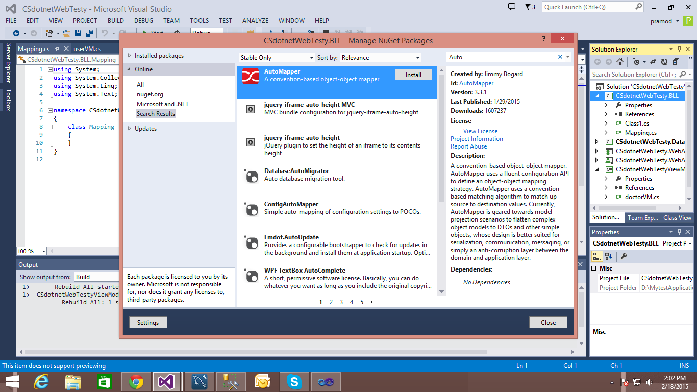
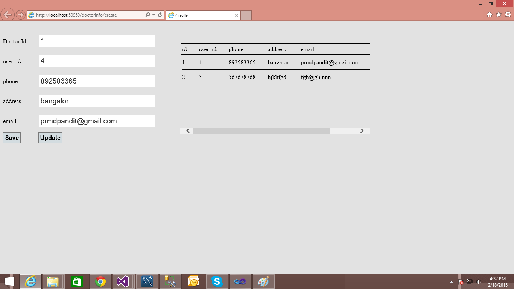

# WebAPI AutoMapper Entity framwork 6 DataFirst MVC Knockout Crud opration
## Requires
- Visual Studio 2013
## License
- Apache License, Version 2.0
## Technologies
- SQL Server
- ADO.NET Entity Framework
- Class Library
- Entity Framework
- ASP.NET MVC 4
- ASP.NET Web API
- knockout.js
- automapper
## Topics
- Code Access Security
- ObservableCollection
- REST/JSON Web Services Communication
- N-tier application
- ViewModel pattern (MVVM) Knockout
## Updated
- 02/18/2015
## Description

<h1>Introduction</h1>

<em>In this sample we will make restfull webapi.through the knockout.js we will create the crud opration in to the data base . we have used the automapper for mapping the entiframwork models to Viewmodel. its working fine in to the IE becuase some jquery
 problem in javascript its not working in chrom and mozila.</em>

<h1>Building the Sample</h1>

<em>this sample have devide in to the multipal projects for futur inhancement and reusablity of the code and libraries in other miscrosoft .net technology. before execute the sample you have to configure your sqlserver database .please run the script in
 sqlserver query window.</em>

<em>create the table script</em>

<em>CREATE DATABASE [Testy]</em>

&nbsp;

<em>create the doctor table</em>

<em> 
CREATE TABLE [dbo].[doctor]( [id] [int] IDENTITY(1,1) NOT NULL,
[phone] [varchar](50) NULL, [address] [varchar](50) NULL,
[email] [varchar](50) NULL, [user_id] [int] NULL,&nbsp;CONSTRAINT [PK_doctor] PRIMARY KEY CLUSTERED&nbsp;(
[id] ASC)WITH (PAD_INDEX = OFF, STATISTICS_NORECOMPUTE = OFF, IGNORE_DUP_KEY = OFF, ALLOW_ROW_LOCKS = ON, ALLOW_PAGE_LOCKS = ON) ON [PRIMARY]) ON [PRIMARY]</em>

&nbsp;

<em>create the user table</em>

<em> 
CREATE TABLE [dbo].[user]( [user_id] [int] IDENTITY(1,1) NOT NULL,
[user_name] [varchar](50) NULL, [fname] [varchar](50) NULL,
[lname] [varchar](50) NULL,&nbsp;CONSTRAINT [PK_user] PRIMARY KEY CLUSTERED&nbsp;(
[user_id] ASC)WITH (PAD_INDEX = OFF, STATISTICS_NORECOMPUTE = OFF, IGNORE_DUP_KEY = OFF, ALLOW_ROW_LOCKS = ON, ALLOW_PAGE_LOCKS = ON) ON [PRIMARY]) ON [PRIMARY] 
</em>

Description

<em>1)first we have create class library of Application.data where you have to create your database first approach entityframwork .edmx .</em>

<em> 
</em>

&nbsp;

&nbsp;

<em>2)now you have to create application.Modelview where you will create the modelview according to the view .</em>

<em>3)Now you have to create new class library application.BLL .Its the buisness logic layer where we have done the all the basic crud opration with your data context.</em>

&nbsp;

&nbsp;

&nbsp;

<em>So you have to give reference of the application.data.</em>

&nbsp;

<em> 
</em>

<em>this is the final view in IE please execute the application becuase its not working in chrom and mozila some jquery problem.</em>

<em> 
</em>

&nbsp;

&nbsp;

&nbsp;

<em>This is the some usefull code which is required. &nbsp;</em>

&nbsp;

C#

Edit|Remove

csharp

<pre class="csharp">//&nbsp;Doctor&nbsp;view&nbsp;model&nbsp;
public&nbsp;class&nbsp;doctorVM&nbsp;
&nbsp;&nbsp;&nbsp;&nbsp;{&nbsp;
&nbsp;&nbsp;&nbsp;&nbsp;&nbsp;&nbsp;&nbsp;&nbsp;public&nbsp;int&nbsp;id&nbsp;{&nbsp;get;&nbsp;set;&nbsp;}&nbsp;
&nbsp;
&nbsp;
&nbsp;&nbsp;&nbsp;&nbsp;&nbsp;&nbsp;&nbsp;&nbsp;public&nbsp;int?&nbsp;user_id&nbsp;{&nbsp;get;&nbsp;set;&nbsp;}&nbsp;
&nbsp;&nbsp;&nbsp;&nbsp;&nbsp;&nbsp;&nbsp;&nbsp;public&nbsp;string&nbsp;phone&nbsp;{&nbsp;get;&nbsp;set;&nbsp;}&nbsp;
&nbsp;&nbsp;&nbsp;&nbsp;&nbsp;&nbsp;&nbsp;&nbsp;public&nbsp;string&nbsp;address&nbsp;{&nbsp;get;&nbsp;set;&nbsp;}&nbsp;
&nbsp;&nbsp;&nbsp;&nbsp;&nbsp;&nbsp;&nbsp;&nbsp;public&nbsp;string&nbsp;email&nbsp;{&nbsp;get;&nbsp;set;&nbsp;}&nbsp;
&nbsp;&nbsp;&nbsp;&nbsp;&nbsp;&nbsp;&nbsp;//&nbsp;public&nbsp;DateTime?&nbsp;created_date&nbsp;{&nbsp;get;&nbsp;set;&nbsp;}&nbsp;
&nbsp;&nbsp;&nbsp;&nbsp;&nbsp;&nbsp;&nbsp;//&nbsp;public&nbsp;DateTime?&nbsp;update_date&nbsp;{&nbsp;get;&nbsp;set;&nbsp;}&nbsp;
&nbsp;&nbsp;&nbsp;&nbsp;&nbsp;&nbsp;&nbsp;&nbsp;//&nbsp;public&nbsp;virtual&nbsp;user&nbsp;user&nbsp;{&nbsp;get;&nbsp;set;&nbsp;}&nbsp;
&nbsp;&nbsp;&nbsp;&nbsp;}&nbsp;
&nbsp;
//&nbsp;user&nbsp;view&nbsp;model&nbsp;
&nbsp;public&nbsp;class&nbsp;userVM&nbsp;
&nbsp;&nbsp;&nbsp;&nbsp;{&nbsp;
&nbsp;&nbsp;&nbsp;&nbsp;&nbsp;&nbsp;&nbsp;&nbsp;public&nbsp;int&nbsp;user_id&nbsp;{&nbsp;get;&nbsp;set;&nbsp;}&nbsp;
&nbsp;&nbsp;&nbsp;&nbsp;&nbsp;&nbsp;&nbsp;&nbsp;public&nbsp;string&nbsp;user_name&nbsp;{&nbsp;get;&nbsp;set;&nbsp;}&nbsp;
&nbsp;&nbsp;&nbsp;&nbsp;&nbsp;&nbsp;&nbsp;&nbsp;public&nbsp;string&nbsp;fname&nbsp;{&nbsp;get;&nbsp;set;&nbsp;}&nbsp;
&nbsp;&nbsp;&nbsp;&nbsp;&nbsp;&nbsp;&nbsp;&nbsp;public&nbsp;string&nbsp;lname&nbsp;{&nbsp;get;&nbsp;set;&nbsp;}&nbsp;
&nbsp;&nbsp;&nbsp;&nbsp;}&nbsp;
&nbsp;
//auto&nbsp;mapper&nbsp;view&nbsp;to&nbsp;model&nbsp;
public&nbsp;class&nbsp;DomainToViewModelMap&nbsp;:&nbsp;AutoMapper.Profile&nbsp;
&nbsp;&nbsp;&nbsp;&nbsp;{&nbsp;
&nbsp;&nbsp;&nbsp;&nbsp;&nbsp;&nbsp;&nbsp;&nbsp;public&nbsp;override&nbsp;string&nbsp;ProfileName&nbsp;
&nbsp;&nbsp;&nbsp;&nbsp;&nbsp;&nbsp;&nbsp;&nbsp;{&nbsp;
&nbsp;&nbsp;&nbsp;&nbsp;&nbsp;&nbsp;&nbsp;&nbsp;&nbsp;&nbsp;&nbsp;&nbsp;get&nbsp;{&nbsp;return&nbsp;&quot;ViewModelToDomainMappings&quot;;&nbsp;}&nbsp;
&nbsp;&nbsp;&nbsp;&nbsp;&nbsp;&nbsp;&nbsp;&nbsp;}&nbsp;
&nbsp;&nbsp;&nbsp;&nbsp;&nbsp;&nbsp;&nbsp;&nbsp;protected&nbsp;override&nbsp;void&nbsp;Configure()&nbsp;
&nbsp;&nbsp;&nbsp;&nbsp;&nbsp;&nbsp;&nbsp;&nbsp;{&nbsp;
&nbsp;&nbsp;&nbsp;&nbsp;&nbsp;&nbsp;&nbsp;&nbsp;&nbsp;&nbsp;&nbsp;&nbsp;Mapper.CreateMap&lt;doctor,&nbsp;doctorVM&gt;();&nbsp;
&nbsp;&nbsp;&nbsp;&nbsp;&nbsp;&nbsp;&nbsp;&nbsp;&nbsp;&nbsp;&nbsp;&nbsp;Mapper.CreateMap&lt;user,&nbsp;userVM&gt;();&nbsp;
&nbsp;&nbsp;&nbsp;&nbsp;&nbsp;&nbsp;&nbsp;&nbsp;}&nbsp;
&nbsp;
&nbsp;&nbsp;&nbsp;&nbsp;}&nbsp;
&nbsp;
//&nbsp;automaper&nbsp;model&nbsp;to&nbsp;view&nbsp;
&nbsp;
public&nbsp;class&nbsp;ViewModelToDomainMap&nbsp;:&nbsp;AutoMapper.Profile&nbsp;
&nbsp;&nbsp;&nbsp;&nbsp;{&nbsp;
&nbsp;&nbsp;&nbsp;&nbsp;&nbsp;&nbsp;&nbsp;&nbsp;public&nbsp;override&nbsp;string&nbsp;ProfileName&nbsp;
&nbsp;&nbsp;&nbsp;&nbsp;&nbsp;&nbsp;&nbsp;&nbsp;{&nbsp;
&nbsp;&nbsp;&nbsp;&nbsp;&nbsp;&nbsp;&nbsp;&nbsp;&nbsp;&nbsp;&nbsp;&nbsp;get&nbsp;{&nbsp;return&nbsp;&quot;ViewModelToDomainMappings&quot;;&nbsp;}&nbsp;
&nbsp;&nbsp;&nbsp;&nbsp;&nbsp;&nbsp;&nbsp;&nbsp;}&nbsp;
&nbsp;&nbsp;&nbsp;&nbsp;&nbsp;&nbsp;&nbsp;&nbsp;protected&nbsp;override&nbsp;void&nbsp;Configure()&nbsp;
&nbsp;&nbsp;&nbsp;&nbsp;&nbsp;&nbsp;&nbsp;&nbsp;{&nbsp;
&nbsp;&nbsp;&nbsp;&nbsp;&nbsp;&nbsp;&nbsp;&nbsp;&nbsp;&nbsp;&nbsp;&nbsp;Mapper.CreateMap&lt;doctorVM,&nbsp;doctor&gt;();&nbsp;
&nbsp;&nbsp;&nbsp;&nbsp;&nbsp;&nbsp;&nbsp;&nbsp;&nbsp;&nbsp;&nbsp;&nbsp;Mapper.CreateMap&lt;userVM,&nbsp;user&gt;();&nbsp;
&nbsp;
&nbsp;&nbsp;&nbsp;&nbsp;&nbsp;&nbsp;&nbsp;&nbsp;}&nbsp;
&nbsp;&nbsp;&nbsp;&nbsp;}&nbsp;
&nbsp;
//automapper&nbsp;configuration&nbsp;
&nbsp;
&nbsp;public&nbsp;class&nbsp;AutoMapperConfiguration&nbsp;
&nbsp;&nbsp;&nbsp;&nbsp;{&nbsp;
&nbsp;&nbsp;&nbsp;&nbsp;&nbsp;&nbsp;&nbsp;&nbsp;public&nbsp;static&nbsp;void&nbsp;Configure()&nbsp;
&nbsp;&nbsp;&nbsp;&nbsp;&nbsp;&nbsp;&nbsp;&nbsp;{&nbsp;
&nbsp;&nbsp;&nbsp;&nbsp;&nbsp;&nbsp;&nbsp;&nbsp;&nbsp;&nbsp;&nbsp;&nbsp;Mapper.Initialize(x&nbsp;=&gt;&nbsp;
&nbsp;&nbsp;&nbsp;&nbsp;&nbsp;&nbsp;&nbsp;&nbsp;&nbsp;&nbsp;&nbsp;&nbsp;{&nbsp;
&nbsp;&nbsp;&nbsp;&nbsp;&nbsp;&nbsp;&nbsp;&nbsp;&nbsp;&nbsp;&nbsp;&nbsp;&nbsp;&nbsp;&nbsp;&nbsp;x.AddProfile&lt;DomainToViewModelMap&gt;();&nbsp;
&nbsp;&nbsp;&nbsp;&nbsp;&nbsp;&nbsp;&nbsp;&nbsp;&nbsp;&nbsp;&nbsp;&nbsp;&nbsp;&nbsp;&nbsp;&nbsp;x.AddProfile&lt;ViewModelToDomainMap&gt;();&nbsp;
&nbsp;&nbsp;&nbsp;&nbsp;&nbsp;&nbsp;&nbsp;&nbsp;&nbsp;&nbsp;&nbsp;&nbsp;});&nbsp;
&nbsp;&nbsp;&nbsp;&nbsp;&nbsp;&nbsp;&nbsp;&nbsp;}&nbsp;
&nbsp;&nbsp;&nbsp;&nbsp;}&nbsp;
&nbsp;
//configer&nbsp;automapper&nbsp;in&nbsp;global.asax&nbsp;in&nbsp;mvc&nbsp;web&nbsp;application&nbsp;
&nbsp;protected&nbsp;void&nbsp;Application_Start()&nbsp;
&nbsp;&nbsp;&nbsp;&nbsp;&nbsp;&nbsp;&nbsp;&nbsp;{&nbsp;
&nbsp;&nbsp;&nbsp;&nbsp;&nbsp;&nbsp;&nbsp;&nbsp;&nbsp;&nbsp;&nbsp;&nbsp;AreaRegistration.RegisterAllAreas();&nbsp;
&nbsp;
&nbsp;&nbsp;&nbsp;&nbsp;&nbsp;&nbsp;&nbsp;&nbsp;&nbsp;&nbsp;&nbsp;&nbsp;WebApiConfig.Register(GlobalConfiguration.Configuration);&nbsp;
&nbsp;&nbsp;&nbsp;&nbsp;&nbsp;&nbsp;&nbsp;&nbsp;&nbsp;&nbsp;&nbsp;&nbsp;FilterConfig.RegisterGlobalFilters(GlobalFilters.Filters);&nbsp;
&nbsp;&nbsp;&nbsp;&nbsp;&nbsp;&nbsp;&nbsp;&nbsp;&nbsp;&nbsp;&nbsp;&nbsp;RouteConfig.RegisterRoutes(RouteTable.Routes);&nbsp;
&nbsp;&nbsp;&nbsp;&nbsp;&nbsp;&nbsp;&nbsp;&nbsp;&nbsp;&nbsp;&nbsp;&nbsp;BundleConfig.RegisterBundles(BundleTable.Bundles);&nbsp;
&nbsp;&nbsp;&nbsp;&nbsp;&nbsp;&nbsp;&nbsp;&nbsp;&nbsp;&nbsp;&nbsp;&nbsp;CSdotnetWebTesty.BLL.AutoMapperConfiguration.Configure();&nbsp;
&nbsp;&nbsp;&nbsp;&nbsp;&nbsp;&nbsp;&nbsp;&nbsp;}</pre>

<h1>Source Code Files</h1>
<h1><em>&nbsp;doctorBLL.cs</em></h1>

<em>using AutoMapper;using CSdotnetWebTesty.Data;using CSdotnetWebTestyViewModel;using System;using <a class="libraryLink" href="https://msdn.microsoft.com/en-US/library/System.Collections.Generic.aspx" target="_blank" title="Auto generated link to System.Collections.Generic">System.Collections.Generic</a>;using <a class="libraryLink" href="https://msdn.microsoft.com/en-US/library/System.Linq.aspx" target="_blank" title="Auto generated link to System.Linq">System.Linq</a>;using <a class="libraryLink" href="https://msdn.microsoft.com/en-US/library/System.Text.aspx" target="_blank" title="Auto generated link to System.Text">System.Text</a>; 
namespace CSdotnetWebTesty.BLL{&nbsp; public &nbsp;class doctorBLL&nbsp; &nbsp; {&nbsp; &nbsp; &nbsp; &nbsp; public IEnumerable&lt;doctorVM&gt; Get()&nbsp; &nbsp; &nbsp; &nbsp; {&nbsp; &nbsp; &nbsp; &nbsp; &nbsp; &nbsp; TestyEntities _dbContext = new TestyEntities();&nbsp;
 &nbsp; &nbsp; &nbsp; &nbsp; &nbsp; List&lt;doctorVM&gt; query = new List&lt;doctorVM&gt;();&nbsp; &nbsp; &nbsp; &nbsp; &nbsp; &nbsp; var test = _dbContext.doctors.ToList();&nbsp; &nbsp; &nbsp; &nbsp; &nbsp; &nbsp; foreach (var item in test)&nbsp; &nbsp; &nbsp;
 &nbsp; &nbsp; &nbsp; {&nbsp; &nbsp; &nbsp; &nbsp; &nbsp; &nbsp; &nbsp; &nbsp; var temp = Mapper.Map&lt;doctor, doctorVM&gt;(item);&nbsp; &nbsp; &nbsp; &nbsp; &nbsp; &nbsp; &nbsp; &nbsp; query.Add(temp);&nbsp; &nbsp; &nbsp; &nbsp; &nbsp; &nbsp; }&nbsp; &nbsp;
 &nbsp; &nbsp; &nbsp; &nbsp; return query.AsQueryable();&nbsp; &nbsp; &nbsp; &nbsp; }&nbsp; &nbsp; &nbsp; &nbsp; public bool Create(doctorVM obj)&nbsp; &nbsp; &nbsp; &nbsp; {&nbsp; &nbsp; &nbsp; &nbsp; &nbsp; &nbsp; var doctorMap = Mapper.Map&lt;doctorVM, doctor&gt;(obj);&nbsp;
 &nbsp; &nbsp; &nbsp; &nbsp; &nbsp; TestyEntities _db = new TestyEntities();&nbsp; &nbsp; &nbsp; &nbsp; &nbsp; &nbsp; _db.doctors.Add(doctorMap);&nbsp; &nbsp; &nbsp; &nbsp; &nbsp; &nbsp;&nbsp;&nbsp; &nbsp; &nbsp; &nbsp; &nbsp; &nbsp; if (_db.SaveChanges() ==
 0)&nbsp; &nbsp; &nbsp; &nbsp; &nbsp; &nbsp; { return true; }&nbsp; &nbsp; &nbsp; &nbsp; &nbsp; &nbsp; return false;&nbsp; &nbsp; &nbsp; &nbsp; }&nbsp; &nbsp; &nbsp; &nbsp; public bool Update(doctorVM obj)&nbsp; &nbsp; &nbsp; &nbsp; {&nbsp; &nbsp; &nbsp; &nbsp;
 &nbsp; &nbsp; var _db = new TestyEntities();&nbsp; &nbsp; &nbsp; &nbsp; &nbsp; &nbsp; var doctor = _db.doctors.Where(tem =&gt; tem.id == obj.id &amp;&amp; tem.user_id == obj.user_id).FirstOrDefault();&nbsp; &nbsp; &nbsp; &nbsp; &nbsp; &nbsp; if (doctor !=
 null)&nbsp; &nbsp; &nbsp; &nbsp; &nbsp; &nbsp; {&nbsp; &nbsp; &nbsp; &nbsp; &nbsp; &nbsp; &nbsp; &nbsp; doctor.address = obj.address;&nbsp; &nbsp; &nbsp; &nbsp; &nbsp; &nbsp; &nbsp; &nbsp; //doctor.created_date = obj.created_date;&nbsp; &nbsp; &nbsp; &nbsp;
 &nbsp; &nbsp; &nbsp; &nbsp; doctor.email = obj.email;&nbsp; &nbsp; &nbsp; &nbsp; &nbsp; &nbsp; &nbsp; &nbsp; doctor.phone = obj.phone; 
&nbsp; &nbsp; &nbsp; &nbsp; &nbsp; &nbsp; &nbsp; &nbsp; //_db.doctors.Add(doctor);&nbsp; &nbsp; &nbsp; &nbsp; &nbsp; &nbsp; &nbsp; &nbsp; if (_db.SaveChanges() == 1)&nbsp; &nbsp; &nbsp; &nbsp; &nbsp; &nbsp; &nbsp; &nbsp; &nbsp; &nbsp; return true;&nbsp; &nbsp;
 &nbsp; &nbsp; &nbsp; &nbsp; }&nbsp; &nbsp; &nbsp; &nbsp; &nbsp; &nbsp; return false;&nbsp; &nbsp; &nbsp; &nbsp; }&nbsp; &nbsp; &nbsp; &nbsp; public bool Delete(int Id)&nbsp; &nbsp; &nbsp; &nbsp; {&nbsp; &nbsp; &nbsp; &nbsp; &nbsp; &nbsp; var _db = new TestyEntities();&nbsp;
 &nbsp; &nbsp; &nbsp; &nbsp; &nbsp; var doctor = _db.doctors.Where(tem =&gt; tem.id == Id).FirstOrDefault();&nbsp; &nbsp; &nbsp; &nbsp; &nbsp; &nbsp; _db.doctors.Remove(doctor);&nbsp; &nbsp; &nbsp; &nbsp; &nbsp; &nbsp; if (_db.SaveChanges() == 0)&nbsp; &nbsp;
 &nbsp; &nbsp; &nbsp; &nbsp; &nbsp; &nbsp; return true;&nbsp; &nbsp; &nbsp; &nbsp; &nbsp; &nbsp; return false;&nbsp; &nbsp; &nbsp; &nbsp; }&nbsp; &nbsp; &nbsp; &nbsp; public doctorVM GetbyId(int Id)&nbsp; &nbsp; &nbsp; &nbsp; {&nbsp; &nbsp; &nbsp; &nbsp; &nbsp;
 &nbsp; var _db = new TestyEntities();&nbsp; &nbsp; &nbsp; &nbsp; &nbsp; &nbsp; var doctorVeiw = _db.doctors.Where(doct =&gt; doct.id == Id).FirstOrDefault();&nbsp; &nbsp; &nbsp; &nbsp; &nbsp; &nbsp; return Mapper.Map&lt;doctor, doctorVM&gt;(doctorVeiw);&nbsp;
 &nbsp; &nbsp; &nbsp; }&nbsp; &nbsp; }} 
</em>

<h1>More Information</h1>

<em>for more information you can contact me at prmdpandit@gmail.com</em>

