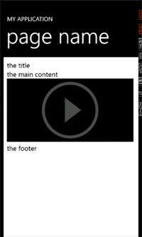
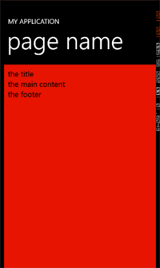
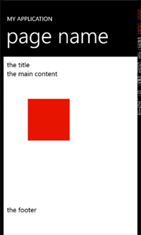

# WebBrowser コントロールで HTML5 を使用するには
## License
- Apache License, Version 2.0
## Technologies
- Windows Phone
## Topics
- Windows Phone アプリケーション
- "How to" ラーニング コース
## Updated
- 02/20/2012
## Description

サンプル | <a href="http://download.microsoft.com/download/A/1/0/A10EBC63-2398-483C-9F65-5DDA7122B45C/HTML5WebBrowser.zip">
Zip、87.7 KB</a>

このサンプルは、手順に沿って、コードをコピーし、ソース コードへ貼り付けることでアプリケーションを作成できます。完成例は、サンプル ファイルの Finish フォルダーに&#26684;納されていますので参考にしてください。

ここでは以下の手順で説明します。

<ul>
<li>Video 要素を使用する </li><li>Silverlight と JavaScript の間でやり取りする </li><li>Canvas 要素を使用する </li></ul>
<h2 style="font-size:120%; margin:20px 0px; border-left:7px solid #666666; padding-left:12px">
Video 要素を使用する</h2>
<ol>
<li>Visual Studio で、&quot;Windows Phone アプリケーション&quot; プロジェクト テンプレートを使って &quot;HTML5BrowserFeatures&quot; という名前の新しいプロジェクトを作成します。
</li><li>MainPage.xaml で、browser という名前の WebBrowser コントロールを追加します。

XAML

スクリプトの編集|Remove

xaml

<pre id="codePreview" class="xaml">&lt;phone:WebBrowser&nbsp;x:Name=&quot;browser&quot;&nbsp;/&gt;</pre>

</li><li>MainPage.xaml.cs のコンストラクターで、Loaded イベント ハンドラーを browser に追加します。

C#

スクリプトの編集|Remove

csharp

<pre id="codePreview" class="csharp">public&nbsp;MainPage()&nbsp;
{&nbsp;
&nbsp;&nbsp;&nbsp;&nbsp;InitializeComponent();&nbsp;
&nbsp;&nbsp;&nbsp;&nbsp;browser.Loaded&nbsp;&#43;=&nbsp;new&nbsp;RoutedEventHandler(browser_Loaded);&nbsp;
}&nbsp;
&nbsp;
void&nbsp;browser_Loaded(object&nbsp;sender,&nbsp;RoutedEventArgs&nbsp;e)&nbsp;
{&nbsp;
&nbsp;
}</pre>

</li><li>このコンテンツのサポート ファイルの Asset フォルダーから &quot;IsoExtras.cs&quot; と &quot;main.html&quot; を既存のアイテムとして追加します。
</li><li>&quot;main.html&quot; の &quot;ビルド アクション&quot; が &quot;コンテンツ&quot; に設定されていることを確認します。 </li><li>Loaded イベント ハンドラーで、SaveFilesToIsoStore メソッドを呼び出し、&quot;main.html&quot; を渡します。

C#

スクリプトの編集|Remove

csharp

<pre id="codePreview" class="csharp">void&nbsp;browser_Loaded(object&nbsp;sender,&nbsp;RoutedEventArgs&nbsp;e)&nbsp;
{&nbsp;
&nbsp;&nbsp;&nbsp;&nbsp;IsoExtras.SaveFilesToIsoStore(new&nbsp;string[]&nbsp;{&nbsp;&quot;main.html&quot;&nbsp;});&nbsp;
&nbsp;&nbsp;browser.Navigate(new&nbsp;Uri(&quot;main.html&quot;,&nbsp;UriKind.Relative));&nbsp;
}</pre>

</li><li>browser を &quot;main.html&quot; に移動します。 </li><li>main.html の main div で、コメント アウトされている video 要素のコメントをはずし、wmv ビデオをソースに設定します。controls も設定してください。

HTML

スクリプトの編集|Remove

html

<pre id="codePreview" class="html">&lt;div&nbsp;id=&quot;main&quot;&gt;&nbsp;
&nbsp;&nbsp;&nbsp;&nbsp;the&nbsp;main&nbsp;content&nbsp;
&nbsp;&nbsp;&nbsp;&nbsp;&lt;video&nbsp;src=&quot;http://media.ch9.ms/ch9/956d/685e3d3f-c2e2-4763-a668-9f020134956d/HAdoodlejump_ch9.wmv&quot;&nbsp;controls&nbsp;/&gt;&nbsp;
&lt;/div&gt;</pre>

</li><li>プロジェクトを実行します。 </li><li>ローカルの html が読み込まれます。 

</li><li>video 要素をタップするとビデオが全画面で再生されます。

※Windows Phone Emulator では再生できませんので、Windows Phone デバイスでお試しください

</li></ol>
<h2 style="font-size:120%; margin:20px 0px; border-left:7px solid #666666; padding-left:12px">
Silverlight と JavaScript の間でやり取りする</h2>
<ol>
<li>MainPage.xaml で、browser の IsScriptEnabled を &quot;true&quot; に設定し、ScriptNotify イベント ハンドラーを追加します。

XAML

スクリプトの編集|Remove

xaml

<pre id="codePreview" class="xaml">&lt;Grid&nbsp;x:Name=&quot;ContentPanel&quot;&nbsp;Grid.Row=&quot;1&quot;&nbsp;Margin=&quot;12,0,12,0&quot;&gt;&nbsp;
&nbsp;&nbsp;&nbsp;&nbsp;&lt;phone:WebBrowser&nbsp;x:Name=&quot;browser&quot;&nbsp;IsScriptEnabled=&quot;True&quot;&nbsp;ScriptNotify=&quot;browser_ScriptNotify&quot;&nbsp;/&gt;&nbsp;
&lt;/Grid&gt;&nbsp;</pre>

</li><li>MainPage.xaml.cs の ScriptNotify イベント ハンドラーで、渡される値を MessageBox で表示します。

C#

スクリプトの編集|Remove

csharp

<pre id="codePreview" class="csharp">private&nbsp;void&nbsp;browser_ScriptNotify(object&nbsp;sender,&nbsp;NotifyEventArgs&nbsp;e)&nbsp;
{&nbsp;
&nbsp;&nbsp;&nbsp;&nbsp;MessageBox.Show(e.Value);&nbsp;
}</pre>

</li><li>main.html で、script タグを追加し、JavaScript の window.external.notify 呼び出しを追加し、&quot;HTML Loaded&quot; (&quot;HTML が読み込まれました&quot; という意味の文字列) を渡します。

HTML

スクリプトの編集|Remove

html

<pre id="codePreview" class="html">&lt;script&gt;&nbsp;
&nbsp;&nbsp;&nbsp;&nbsp;&nbsp;&nbsp;window.external.notify(&quot;HTML&nbsp;loaded&quot;);&nbsp;
&lt;/script&gt;</pre>

</li><li>プロジェクトを実行します。 </li><li>JavaScript から渡された文字列が Silverlight のメッセージ ボックスに表示されます。 </li><li>main.html で setBackground という関数を追加します。これは、パラメーターとして色を受け取り、それを背景色に設定します。

HTML

スクリプトの編集|Remove

html

<pre id="codePreview" class="html">&lt;script&gt;&nbsp;
&nbsp;&nbsp;&nbsp;&nbsp;&nbsp;&nbsp;window.external.notify(&quot;HTML&nbsp;loaded&quot;);&nbsp;
function&nbsp;setBackground(c)&nbsp;{&nbsp;
&nbsp;&nbsp;&nbsp;&nbsp;&nbsp;&nbsp;&nbsp;&nbsp;document.body.style.backgroundColor&nbsp;=&nbsp;c;&nbsp;
}&nbsp;
&lt;/script&gt;</pre>

</li><li>MainPage.xaml.cs の ScriptNotify イベント ハンドラーで、渡された文字列が &quot;HTML Loaded&quot; に等しい場合にメッセージを表示するように修正します。

C#

スクリプトの編集|Remove

csharp

<pre id="codePreview" class="csharp">private&nbsp;void&nbsp;browser_ScriptNotify(object&nbsp;sender,&nbsp;NotifyEventArgs&nbsp;e)&nbsp;
{&nbsp;
&nbsp;&nbsp;&nbsp;&nbsp;if&nbsp;(e.Value&nbsp;==&nbsp;&quot;HTML&nbsp;loaded&quot;)&nbsp;
&nbsp;&nbsp;&nbsp;&nbsp;{&nbsp;
MessageBox.Show(e.Value);&nbsp;
&nbsp;&nbsp;&nbsp;&nbsp;}&nbsp;
}</pre>

</li><li>Windows Phone のアクセント カラー PhoneAccentBrush の色を取得して、16 進数の文字列に変換します。

C#

スクリプトの編集|Remove

csharp

<pre id="codePreview" class="csharp">private&nbsp;void&nbsp;browser_ScriptNotify(object&nbsp;sender,&nbsp;NotifyEventArgs&nbsp;e)&nbsp;
{&nbsp;
&nbsp;&nbsp;&nbsp;&nbsp;if&nbsp;(e.Value&nbsp;==&nbsp;&quot;HTML&nbsp;loaded&quot;)&nbsp;
&nbsp;&nbsp;&nbsp;&nbsp;{&nbsp;
MessageBox.Show(e.Value);&nbsp;
&nbsp;&nbsp;&nbsp;&nbsp;Color&nbsp;c&nbsp;=&nbsp;((SolidColorBrush)Application.Current.Resources[&quot;PhoneAccentBrush&quot;]).Color;&nbsp;
&nbsp;&nbsp;&nbsp;&nbsp;string&nbsp;hex&nbsp;=&nbsp;string.Format(&quot;#{0:x2}{1:x2}{2:x2}&quot;,&nbsp;c.R,&nbsp;c.G,&nbsp;c.B);&nbsp;
&nbsp;&nbsp;&nbsp;&nbsp;}&nbsp;
}</pre>

</li><li>InvokeScript 呼び出しで setBackground を呼び出し、16 進数値を渡します。

C#

スクリプトの編集|Remove

csharp

<pre id="codePreview" class="csharp">private&nbsp;void&nbsp;browser_ScriptNotify(object&nbsp;sender,&nbsp;NotifyEventArgs&nbsp;e)&nbsp;
{&nbsp;
&nbsp;&nbsp;&nbsp;&nbsp;if&nbsp;(e.Value&nbsp;==&nbsp;&quot;HTML&nbsp;loaded&quot;)&nbsp;
&nbsp;&nbsp;&nbsp;&nbsp;{&nbsp;
MessageBox.Show(e.Value);&nbsp;
&nbsp;&nbsp;&nbsp;&nbsp;Color&nbsp;c&nbsp;=&nbsp;((SolidColorBrush)Application.Current.Resources[&quot;PhoneAccentBrush&quot;]).Color;&nbsp;
&nbsp;&nbsp;&nbsp;&nbsp;string&nbsp;hex&nbsp;=&nbsp;string.Format(&quot;#{0:x2}{1:x2}{2:x2}&quot;,&nbsp;c.R,&nbsp;c.G,&nbsp;c.B);&nbsp;
&nbsp;&nbsp;&nbsp;&nbsp;browser.InvokeScript(&quot;setBackground&quot;,&nbsp;hex);&nbsp;
&nbsp;&nbsp;&nbsp;&nbsp;}&nbsp;
}</pre>

</li><li>プロジェクトを実行します。 </li><li>html 本文の背景色が、選択されている Windows Phone のアクセント カラーに変更されています。 

</li></ol>
<h2 style="font-size:120%; margin:20px 0px; border-left:7px solid #666666; padding-left:12px">
Canvas 要素を使用する</h2>
<ol>
<li>main.html で、video 要素をコメント アウトします。 </li><li>theCanvas という名前の Canvas 要素を追加し、サイズを 300 x 300 に設定します。

HTML

スクリプトの編集|Remove

html

<pre id="codePreview" class="html">&lt;div&nbsp;id=&quot;main&quot;&gt;&nbsp;
&nbsp;&nbsp;&nbsp;&nbsp;the&nbsp;main&nbsp;content&nbsp;
&lt;!--&lt;video&nbsp;src=&quot;http://media.ch9.ms/ch9/956d/685e3d3f-c2e2-4763-a668-9f020134956d/HAdoodlejump_ch9.wmv&quot;&nbsp;controls&nbsp;/&gt;--&gt;&nbsp;
&lt;canvas&nbsp;id=&quot;theCanvas&quot;&nbsp;width=&quot;300&quot;&nbsp;height=&quot;300&quot;&gt;&lt;/canvas&gt;&nbsp;
&lt;/div&gt;</pre>

</li><li>drawSquare メソッドを追加して、Canvas の 2D 描画コンテキストへの参照を保存し、渡される色を fillStyle に設定します。さらに fillRect を呼び出して、50,50 の位置と 100 x 100 のサイズを設定します。

HTML

スクリプトの編集|Remove

html

<pre id="codePreview" class="html">&nbsp;&lt;script&gt;&nbsp;
&nbsp;
&nbsp;&nbsp;&nbsp;&nbsp;&nbsp;&nbsp;window.external.notify(&quot;HTML&nbsp;loaded&quot;);&nbsp;
&nbsp;
function&nbsp;drawSquare(c)&nbsp;{&nbsp;
&nbsp;&nbsp;&nbsp;&nbsp;&nbsp;&nbsp;&nbsp;&nbsp;var&nbsp;canvas&nbsp;=&nbsp;document.getElementById('theCanvas');&nbsp;
var&nbsp;ctx&nbsp;=&nbsp;canvas.getContext('2d');&nbsp;
ctx.fillStyle&nbsp;=&nbsp;c;&nbsp;
ctx.fillRect(50,&nbsp;50,&nbsp;100,&nbsp;100);&nbsp;
}&nbsp;
&nbsp;
function&nbsp;setBackground(c)&nbsp;{&nbsp;
&nbsp;&nbsp;&nbsp;&nbsp;&nbsp;&nbsp;&nbsp;&nbsp;document.body.style.backgroundColor&nbsp;=&nbsp;c;&nbsp;
}&nbsp;
&nbsp;
&lt;/script&gt;</pre>

</li><li>MainPage.xaml.cs の ScriptNotify イベント ハンドラーで、InvokeScript を変更して drawSquare を呼び出します。

C#

スクリプトの編集|Remove

csharp

<pre id="codePreview" class="csharp">private&nbsp;void&nbsp;browser_ScriptNotify(object&nbsp;sender,&nbsp;NotifyEventArgs&nbsp;e)&nbsp;
{&nbsp;
&nbsp;&nbsp;&nbsp;&nbsp;if&nbsp;(e.Value&nbsp;==&nbsp;&quot;HTML&nbsp;loaded&quot;)&nbsp;
&nbsp;&nbsp;&nbsp;&nbsp;{&nbsp;
MessageBox.Show(e.Value);&nbsp;
&nbsp;&nbsp;&nbsp;&nbsp;Color&nbsp;c&nbsp;=&nbsp;((SolidColorBrush)Application.Current.Resources[&quot;PhoneAccentBrush&quot;]).Color;&nbsp;
&nbsp;&nbsp;&nbsp;&nbsp;string&nbsp;hex&nbsp;=&nbsp;string.Format(&quot;#{0:x2}{1:x2}{2:x2}&quot;,&nbsp;c.R,&nbsp;c.G,&nbsp;c.B);&nbsp;
browser.InvokeScript(&quot;drawSquare&quot;,&nbsp;hex);&nbsp;
&nbsp;&nbsp;&nbsp;&nbsp;}&nbsp;
}</pre>

</li><li>プロジェクトを実行します。 </li><li>Canvas 領域に、Windows Phone のアクセント カラーを使って四角形が描画されます。 

</li></ol>

Windows Phone 上の IE9 が提供する強力なモバイル Web エクスペリエンスを紹介しました。WebBrowser コントロールを使用することで、Web エクスペリエンスを効果的に使用するアプリケーションの開発が可能になります。

<h2 style="font-size:120%; margin:20px 0px; border-left:7px solid #666666; padding-left:12px">
関連ドキュメント</h2>
<ul>
<li><a href="http://msdn.microsoft.com/ja-jp/library/microsoft.phone.controls.webbrowser(VS.92).aspx" target="_blank">WebBrowser クラス</a>
</li><li><a href="http://msdn.microsoft.com/ja-jp/library/system.windows.application.resources(VS.95).aspx" target="_blank">Application.Resources プロパティ</a>
</li></ul>
<h2 style="font-size:120%; margin:20px 0px; border-left:7px solid #666666; padding-left:12px">
参考ビデオ</h2>
<ul>
<li><a href="http://msdn.microsoft.com/en-us/hh369944" target="_blank">How Do I: Use HTML5 in the WebBrowser Control in Windows Phone 'Mango'?</a>
</li></ul>

<table>
<tbody>
<tr>
<td></td>
<td></td>
<td>
<ul>
<li>もっと他のコンテンツを見る &gt;&gt; <a href="http://msdn.microsoft.com/ja-jp/windowsphone/hh744643" target="_blank">
Windows Phone アプリケーション開発 &quot;How to&quot; ラーニング コースへ</a> </li><li>もっと&nbsp;Windows Phone の情報を見る &gt;&gt; <a href="http://msdn.microsoft.com/ja-jp/windowsphone" target="_blank">
Windows Phone デベロッパー センターへ</a> </li></ul>
</td>
</tr>
</tbody>
</table>

<a href="#top">ページのトップへ</a>

