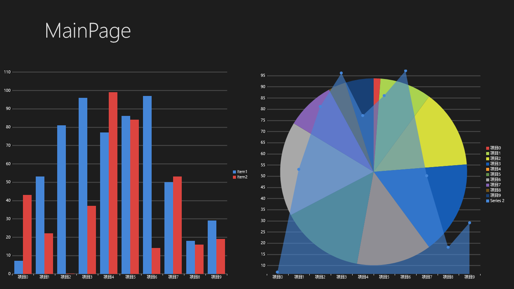

# WinRT XAML Toolkitでチャートを表示する
## Requires
- Visual Studio 2012
## License
- Apache License, Version 2.0
## Technologies
- Windows Store app
## Topics
- WinRT XAML Toolkit
## Updated
- 07/25/2013
## Description

<h1>サンプルプログラムの概要</h1>

このサンプルプログラムは、WinRT XAML Toolkitの中の、Chartを使って以下のようなチャートをWinows ストア アプリで実現します。WinRT XAML Toolkitは、Chart系のコントロール以外にも、Windows Runtimeの標準機能では不足しているコントロールや、便利機能がたくさん詰まったライブラリです。このChartのサンプルで興味を持たれた方は、この記事の最後の参考情報からWinRT XAML Toolkitのプロジェクトページを参照してみてください。

<h1>サンプルプログラムの内容</h1>

このサンプルプログラムはPrism for Windows Runtimeのプロジェクトテンプレートを使用して作成しています。プログラムが起動すると、App.xaml.cs内でMainPage.xamlへ遷移して、Prismの機能を使ってMainPageのDataContextにMainPageViewModelを設定しています。

このMainPageViewModelクラスのプロパティをChartにバインディングして、グラフを表示しています。

<h2>チャートに表示するデータ</h2>

このサンプルプログラムでは、アプリケーションを起動するたびにランダムなデータを作成して、チャートに表示しています。Chartコントロールに表示するためには、最低でもチャートのラベルに使用するプロパティと、チャートのデータ（数値）のプロパティが必要です。このサンプルプログラムでは、Models名前空間にChartItemというクラスを定義して使用しています。

C#

スクリプトの編集|Remove

csharp

<pre class="csharp">using&nbsp;System;&nbsp;
using&nbsp;<a class="libraryLink" href="http://msdn.microsoft.com/ja-JP/library/System.Collections.Generic.aspx" target="_blank" title="Auto generated link to System.Collections.Generic">System.Collections.Generic</a>;&nbsp;
using&nbsp;<a class="libraryLink" href="http://msdn.microsoft.com/ja-JP/library/System.Linq.aspx" target="_blank" title="Auto generated link to System.Linq">System.Linq</a>;&nbsp;
&nbsp;
namespace&nbsp;WinRTToolkitChartSample.Models&nbsp;
{&nbsp;
&nbsp;&nbsp;&nbsp;&nbsp;///&nbsp;&lt;summary&gt;&nbsp;
&nbsp;&nbsp;&nbsp;&nbsp;///&nbsp;グラフに表示するためのデータ&nbsp;
&nbsp;&nbsp;&nbsp;&nbsp;///&nbsp;&lt;/summary&gt;&nbsp;
&nbsp;&nbsp;&nbsp;&nbsp;public&nbsp;class&nbsp;ChartItem&nbsp;
&nbsp;&nbsp;&nbsp;&nbsp;{&nbsp;
&nbsp;&nbsp;&nbsp;&nbsp;&nbsp;&nbsp;&nbsp;&nbsp;///&nbsp;&lt;summary&gt;&nbsp;
&nbsp;&nbsp;&nbsp;&nbsp;&nbsp;&nbsp;&nbsp;&nbsp;///&nbsp;グラフの値&nbsp;
&nbsp;&nbsp;&nbsp;&nbsp;&nbsp;&nbsp;&nbsp;&nbsp;///&nbsp;&lt;/summary&gt;&nbsp;
&nbsp;&nbsp;&nbsp;&nbsp;&nbsp;&nbsp;&nbsp;&nbsp;public&nbsp;int&nbsp;Value&nbsp;{&nbsp;get;&nbsp;set;&nbsp;}&nbsp;
&nbsp;&nbsp;&nbsp;&nbsp;&nbsp;&nbsp;&nbsp;&nbsp;///&nbsp;&lt;summary&gt;&nbsp;
&nbsp;&nbsp;&nbsp;&nbsp;&nbsp;&nbsp;&nbsp;&nbsp;///&nbsp;グラフのラベル&nbsp;
&nbsp;&nbsp;&nbsp;&nbsp;&nbsp;&nbsp;&nbsp;&nbsp;///&nbsp;&lt;/summary&gt;&nbsp;
&nbsp;&nbsp;&nbsp;&nbsp;&nbsp;&nbsp;&nbsp;&nbsp;public&nbsp;string&nbsp;Name&nbsp;{&nbsp;get;&nbsp;set;&nbsp;}&nbsp;
&nbsp;
&nbsp;&nbsp;&nbsp;&nbsp;&nbsp;&nbsp;&nbsp;&nbsp;///&nbsp;&lt;summary&gt;&nbsp;
&nbsp;&nbsp;&nbsp;&nbsp;&nbsp;&nbsp;&nbsp;&nbsp;///&nbsp;ランダムなデータを10件返す。&nbsp;
&nbsp;&nbsp;&nbsp;&nbsp;&nbsp;&nbsp;&nbsp;&nbsp;///&nbsp;&lt;/summary&gt;&nbsp;
&nbsp;&nbsp;&nbsp;&nbsp;&nbsp;&nbsp;&nbsp;&nbsp;///&nbsp;&lt;returns&gt;&lt;/returns&gt;&nbsp;
&nbsp;&nbsp;&nbsp;&nbsp;&nbsp;&nbsp;&nbsp;&nbsp;public&nbsp;static&nbsp;IEnumerable&lt;ChartItem&gt;&nbsp;GetChartItems()&nbsp;
&nbsp;&nbsp;&nbsp;&nbsp;&nbsp;&nbsp;&nbsp;&nbsp;{&nbsp;
&nbsp;&nbsp;&nbsp;&nbsp;&nbsp;&nbsp;&nbsp;&nbsp;&nbsp;&nbsp;&nbsp;&nbsp;var&nbsp;r&nbsp;=&nbsp;new&nbsp;Random();&nbsp;
&nbsp;&nbsp;&nbsp;&nbsp;&nbsp;&nbsp;&nbsp;&nbsp;&nbsp;&nbsp;&nbsp;&nbsp;return&nbsp;Enumerable.Range(0,&nbsp;10)&nbsp;
&nbsp;&nbsp;&nbsp;&nbsp;&nbsp;&nbsp;&nbsp;&nbsp;&nbsp;&nbsp;&nbsp;&nbsp;&nbsp;&nbsp;&nbsp;&nbsp;.Select(i&nbsp;=&gt;&nbsp;new&nbsp;ChartItem&nbsp;&nbsp;
&nbsp;&nbsp;&nbsp;&nbsp;&nbsp;&nbsp;&nbsp;&nbsp;&nbsp;&nbsp;&nbsp;&nbsp;&nbsp;&nbsp;&nbsp;&nbsp;{&nbsp;&nbsp;
&nbsp;&nbsp;&nbsp;&nbsp;&nbsp;&nbsp;&nbsp;&nbsp;&nbsp;&nbsp;&nbsp;&nbsp;&nbsp;&nbsp;&nbsp;&nbsp;&nbsp;&nbsp;&nbsp;&nbsp;Name&nbsp;=&nbsp;&quot;項目&quot;&nbsp;&#43;&nbsp;i,&nbsp;&nbsp;
&nbsp;&nbsp;&nbsp;&nbsp;&nbsp;&nbsp;&nbsp;&nbsp;&nbsp;&nbsp;&nbsp;&nbsp;&nbsp;&nbsp;&nbsp;&nbsp;&nbsp;&nbsp;&nbsp;&nbsp;Value&nbsp;=&nbsp;r.Next(100)&nbsp;&nbsp;
&nbsp;&nbsp;&nbsp;&nbsp;&nbsp;&nbsp;&nbsp;&nbsp;&nbsp;&nbsp;&nbsp;&nbsp;&nbsp;&nbsp;&nbsp;&nbsp;});&nbsp;
&nbsp;&nbsp;&nbsp;&nbsp;&nbsp;&nbsp;&nbsp;&nbsp;}&nbsp;
&nbsp;&nbsp;&nbsp;&nbsp;}&nbsp;
}&nbsp;
</pre>

GetChartItemsメソッドでランダムなエータを10個作成して返しています。

<h2 class="endscriptcode">MainPageViewModelクラス</h2>

画面に表示するデータを保持するMainPageViewModelクラスでは、上記のChartItemのコレクション型のプロパティを2つ定義しています。この2つのプロパティをChartにバインドしてグラフとして画面に表示しています。

&nbsp;

C#

スクリプトの編集|Remove

csharp

<pre class="js">using&nbsp;Microsoft.Practices.Prism.StoreApps;&nbsp;
using&nbsp;<a class="libraryLink" href="http://msdn.microsoft.com/ja-JP/library/System.Collections.Generic.aspx" target="_blank" title="Auto generated link to System.Collections.Generic">System.Collections.Generic</a>;&nbsp;
using&nbsp;<a class="libraryLink" href="http://msdn.microsoft.com/ja-JP/library/System.Collections.ObjectModel.aspx" target="_blank" title="Auto generated link to System.Collections.ObjectModel">System.Collections.ObjectModel</a>;&nbsp;
using&nbsp;Windows.UI.Xaml.Navigation;&nbsp;
using&nbsp;WinRTToolkitChartSample.Common;&nbsp;
using&nbsp;WinRTToolkitChartSample.Models;&nbsp;
&nbsp;
namespace&nbsp;WinRTToolkitChartSample.ViewModels&nbsp;
{&nbsp;
&nbsp;&nbsp;&nbsp;&nbsp;public&nbsp;class&nbsp;MainPageViewModel&nbsp;:&nbsp;ViewModel&nbsp;
&nbsp;&nbsp;&nbsp;&nbsp;{&nbsp;
&nbsp;&nbsp;&nbsp;&nbsp;&nbsp;&nbsp;&nbsp;&nbsp;private&nbsp;ObservableCollection&lt;ChartItem&gt;&nbsp;chartItems1;&nbsp;
&nbsp;
&nbsp;&nbsp;&nbsp;&nbsp;&nbsp;&nbsp;&nbsp;&nbsp;///&nbsp;&lt;summary&gt;&nbsp;
&nbsp;&nbsp;&nbsp;&nbsp;&nbsp;&nbsp;&nbsp;&nbsp;///&nbsp;グラフに表示するためのデータのコレクションその１&nbsp;
&nbsp;&nbsp;&nbsp;&nbsp;&nbsp;&nbsp;&nbsp;&nbsp;///&nbsp;&lt;/summary&gt;&nbsp;
&nbsp;&nbsp;&nbsp;&nbsp;&nbsp;&nbsp;&nbsp;&nbsp;public&nbsp;ObservableCollection&lt;ChartItem&gt;&nbsp;ChartItems1&nbsp;
&nbsp;&nbsp;&nbsp;&nbsp;&nbsp;&nbsp;&nbsp;&nbsp;{&nbsp;
&nbsp;&nbsp;&nbsp;&nbsp;&nbsp;&nbsp;&nbsp;&nbsp;&nbsp;&nbsp;&nbsp;&nbsp;get&nbsp;{&nbsp;return&nbsp;this.chartItems1;&nbsp;}&nbsp;
&nbsp;&nbsp;&nbsp;&nbsp;&nbsp;&nbsp;&nbsp;&nbsp;&nbsp;&nbsp;&nbsp;&nbsp;set&nbsp;{&nbsp;this.SetProperty(ref&nbsp;this.chartItems1,&nbsp;value);&nbsp;}&nbsp;
&nbsp;&nbsp;&nbsp;&nbsp;&nbsp;&nbsp;&nbsp;&nbsp;}&nbsp;
&nbsp;
&nbsp;&nbsp;&nbsp;&nbsp;&nbsp;&nbsp;&nbsp;&nbsp;private&nbsp;ObservableCollection&lt;ChartItem&gt;&nbsp;chartItems2;&nbsp;
&nbsp;
&nbsp;&nbsp;&nbsp;&nbsp;&nbsp;&nbsp;&nbsp;&nbsp;///&nbsp;&lt;summary&gt;&nbsp;
&nbsp;&nbsp;&nbsp;&nbsp;&nbsp;&nbsp;&nbsp;&nbsp;///&nbsp;グラフに表示するためのデータのコレクションその２&nbsp;
&nbsp;&nbsp;&nbsp;&nbsp;&nbsp;&nbsp;&nbsp;&nbsp;///&nbsp;&lt;/summary&gt;&nbsp;
&nbsp;&nbsp;&nbsp;&nbsp;&nbsp;&nbsp;&nbsp;&nbsp;public&nbsp;ObservableCollection&lt;ChartItem&gt;&nbsp;ChartItems2&nbsp;
&nbsp;&nbsp;&nbsp;&nbsp;&nbsp;&nbsp;&nbsp;&nbsp;{&nbsp;
&nbsp;&nbsp;&nbsp;&nbsp;&nbsp;&nbsp;&nbsp;&nbsp;&nbsp;&nbsp;&nbsp;&nbsp;get&nbsp;{&nbsp;return&nbsp;this.chartItems2;&nbsp;}&nbsp;
&nbsp;&nbsp;&nbsp;&nbsp;&nbsp;&nbsp;&nbsp;&nbsp;&nbsp;&nbsp;&nbsp;&nbsp;set&nbsp;{&nbsp;this.SetProperty(ref&nbsp;this.chartItems2,&nbsp;value);&nbsp;}&nbsp;
&nbsp;&nbsp;&nbsp;&nbsp;&nbsp;&nbsp;&nbsp;&nbsp;}&nbsp;
&nbsp;
&nbsp;&nbsp;&nbsp;&nbsp;&nbsp;&nbsp;&nbsp;&nbsp;public&nbsp;override&nbsp;void&nbsp;OnNavigatedTo(object&nbsp;navigationParameter,&nbsp;NavigationMode&nbsp;navigationMode,&nbsp;Dictionary&lt;string,&nbsp;object&gt;&nbsp;viewModelState)&nbsp;
&nbsp;&nbsp;&nbsp;&nbsp;&nbsp;&nbsp;&nbsp;&nbsp;{&nbsp;
&nbsp;&nbsp;&nbsp;&nbsp;&nbsp;&nbsp;&nbsp;&nbsp;&nbsp;&nbsp;&nbsp;&nbsp;base.OnNavigatedTo(navigationParameter,&nbsp;navigationMode,&nbsp;viewModelState);&nbsp;
&nbsp;&nbsp;&nbsp;&nbsp;&nbsp;&nbsp;&nbsp;&nbsp;&nbsp;&nbsp;&nbsp;&nbsp;//&nbsp;画面にナビゲーションしてきたタイミングでデータの初期化を行う&nbsp;
&nbsp;&nbsp;&nbsp;&nbsp;&nbsp;&nbsp;&nbsp;&nbsp;&nbsp;&nbsp;&nbsp;&nbsp;this.ChartItems1&nbsp;=&nbsp;ChartItem.GetChartItems().ToObservableCollection();&nbsp;
&nbsp;&nbsp;&nbsp;&nbsp;&nbsp;&nbsp;&nbsp;&nbsp;&nbsp;&nbsp;&nbsp;&nbsp;this.ChartItems2&nbsp;=&nbsp;ChartItem.GetChartItems().ToObservableCollection();&nbsp;
&nbsp;&nbsp;&nbsp;&nbsp;&nbsp;&nbsp;&nbsp;&nbsp;}&nbsp;
&nbsp;&nbsp;&nbsp;&nbsp;}&nbsp;
}&nbsp;
</pre>

&nbsp;

&nbsp;

OnNavigateｄToメソッドで先ほどのChartItemクラスに定義したデータの作成処理を呼び出してプロパティへ&#26684;納しています。

<h2>Chartコントロール</h2>

Chartコントロールは、WinRTXamlToolkit.Controls.DataVisualization.Charting名前空間に定義されています。そのためXAMLで名前空間の定義をして使用します。サンプルプログラムではChartingという名前空間に紐づけています。

Chartコントロールの基本的な使い方はChartコントロールを置いて、そこのSeriesプロパティに****Seriesクラス(****の部分にグラフの種類が入る）を設定して使います。Seriesプロパティには複数の****Seriesを指定できてグラフを重ね合わせたり、同じ種類のグラフの場合はマージして表示します。

****Seriesクラスには、以下のようなプロパティが定義されています。

<ul>
<li>Titleプロパティ 
グラフのタイトル（棒グラフなどでは凡例の部分に表示されたりします） </li><li>ItemsSourceプロパティ 
グラフに表示するデータのコレクションを設定します。 </li><li>IndependentValueBindingプロパティ 
グラフのデータの塊を表すデータ（縦の棒グラフでは 横軸の下のラベル、円グラフでは円の中のデータの塊の名前）のプロパティをバインドします </li><li>DependentValueBindingプロパティ 
グラフのデータを表すプロパティをバインドします。 （縦の棒グラフでは棒の長さ、円グラフでは円の中を占める面積の広さ） </li><li>IsSelectionEnabledプロパティ 
Trueにすると、マウスなどでグラフを選択したときにデータを表示したりすることが出来ます。 </li></ul>

このサンプルプログラムでは、画面左にColumnSeriesという縦の棒グラフを2つ並べたものと、画面右に円グラフとエリアグラフを重ね合わせたものを作成しています。

<h1>

XAML

スクリプトの編集|Remove

xaml

<pre class="csharp">&lt;!--&nbsp;画面左部分のチャート&nbsp;--&gt;&nbsp;
&lt;Charting:Chart&nbsp;Grid.Row=&quot;1&quot;&gt;&nbsp;
&nbsp;&nbsp;&nbsp;&nbsp;&lt;!--&nbsp;縦の棒グラフを2つ表示&nbsp;--&gt;&nbsp;
&nbsp;&nbsp;&nbsp;&nbsp;&lt;Charting:ColumnSeries&nbsp;&nbsp;
&nbsp;&nbsp;&nbsp;&nbsp;&nbsp;&nbsp;&nbsp;&nbsp;Title=&quot;Item1&quot;&nbsp;
&nbsp;&nbsp;&nbsp;&nbsp;&nbsp;&nbsp;&nbsp;&nbsp;ItemsSource=&quot;{Binding&nbsp;ChartItems1}&quot;&nbsp;&nbsp;
&nbsp;&nbsp;&nbsp;&nbsp;&nbsp;&nbsp;&nbsp;&nbsp;IndependentValueBinding=&quot;{Binding&nbsp;Name}&quot;&nbsp;&nbsp;
&nbsp;&nbsp;&nbsp;&nbsp;&nbsp;&nbsp;&nbsp;&nbsp;DependentValueBinding=&quot;{Binding&nbsp;Value}&quot;&nbsp;&nbsp;
&nbsp;&nbsp;&nbsp;&nbsp;&nbsp;&nbsp;&nbsp;&nbsp;IsSelectionEnabled=&quot;True&quot;&nbsp;/&gt;&nbsp;
&nbsp;&nbsp;&nbsp;&nbsp;&lt;Charting:ColumnSeries&nbsp;&nbsp;
&nbsp;&nbsp;&nbsp;&nbsp;&nbsp;&nbsp;&nbsp;&nbsp;Title=&quot;Item2&quot;&nbsp;
&nbsp;&nbsp;&nbsp;&nbsp;&nbsp;&nbsp;&nbsp;&nbsp;ItemsSource=&quot;{Binding&nbsp;ChartItems2}&quot;&nbsp;&nbsp;
&nbsp;&nbsp;&nbsp;&nbsp;&nbsp;&nbsp;&nbsp;&nbsp;IndependentValueBinding=&quot;{Binding&nbsp;Name}&quot;&nbsp;&nbsp;
&nbsp;&nbsp;&nbsp;&nbsp;&nbsp;&nbsp;&nbsp;&nbsp;DependentValueBinding=&quot;{Binding&nbsp;Value}&quot;&nbsp;&nbsp;
&nbsp;&nbsp;&nbsp;&nbsp;&nbsp;&nbsp;&nbsp;&nbsp;IsSelectionEnabled=&quot;True&quot;&nbsp;/&gt;&nbsp;
&lt;/Charting:Chart&gt;&nbsp;
&lt;!--&nbsp;画面右部分のチャート&nbsp;--&gt;&nbsp;
&lt;!--&nbsp;異なる種類のグラフを複数指定してみる&nbsp;--&gt;&nbsp;
&lt;Charting:Chart&nbsp;Grid.Column=&quot;1&quot;&nbsp;Grid.Row=&quot;1&quot;&gt;&nbsp;
&nbsp;&nbsp;&nbsp;&nbsp;&lt;!--&nbsp;円グラフ&nbsp;--&gt;&nbsp;
&nbsp;&nbsp;&nbsp;&nbsp;&lt;Charting:PieSeries&nbsp;&nbsp;
&nbsp;&nbsp;&nbsp;&nbsp;&nbsp;&nbsp;&nbsp;&nbsp;ItemsSource=&quot;{Binding&nbsp;ChartItems1}&quot;&nbsp;&nbsp;
&nbsp;&nbsp;&nbsp;&nbsp;&nbsp;&nbsp;&nbsp;&nbsp;IndependentValueBinding=&quot;{Binding&nbsp;Name}&quot;&nbsp;&nbsp;
&nbsp;&nbsp;&nbsp;&nbsp;&nbsp;&nbsp;&nbsp;&nbsp;DependentValueBinding=&quot;{Binding&nbsp;Value}&quot;&nbsp;
&nbsp;&nbsp;&nbsp;&nbsp;&nbsp;&nbsp;&nbsp;&nbsp;IsSelectionEnabled=&quot;True&quot;/&gt;&nbsp;
&nbsp;&nbsp;&nbsp;&nbsp;&lt;!--&nbsp;領域グラフ？&nbsp;--&gt;&nbsp;
&nbsp;&nbsp;&nbsp;&nbsp;&lt;Charting:AreaSeries&nbsp;
&nbsp;&nbsp;&nbsp;&nbsp;&nbsp;&nbsp;&nbsp;&nbsp;ItemsSource=&quot;{Binding&nbsp;ChartItems1}&quot;&nbsp;&nbsp;
&nbsp;&nbsp;&nbsp;&nbsp;&nbsp;&nbsp;&nbsp;&nbsp;IndependentValueBinding=&quot;{Binding&nbsp;Name}&quot;&nbsp;&nbsp;
&nbsp;&nbsp;&nbsp;&nbsp;&nbsp;&nbsp;&nbsp;&nbsp;DependentValueBinding=&quot;{Binding&nbsp;Value}&quot;&nbsp;
&nbsp;&nbsp;&nbsp;&nbsp;&nbsp;&nbsp;&nbsp;&nbsp;IsSelectionEnabled=&quot;True&quot;/&gt;&nbsp;
&lt;/Charting:Chart&gt;&nbsp;
</pre>

</h1>
<h1>まとめ</h1>

WinRT XAML ToolkitのChartコントロールを使うと、少量のコードでチャートを表示することができます。Windows ストア アプリは、データの可視化をする領域での使用に向いてると思います。そのため、扱うコンテンツによってはチャート形式でデータを表示するのが最適なこともあり得ます。その時の一つの検討の候補としてWinRT XAML Toolkitを評価してみるのもありなのではないかと思います。

<h1>参考情報</h1>
<ol>
<li><a href="http://winrtxamltoolkit.codeplex.com/">WinRT XAML Toolkit</a> </li><li><a href="http://prismwindowsruntime.codeplex.com/">Prism for Windows Runtime</a>
</li><li><a href="http://code.msdn.microsoft.com/site/search?f%5B0%5D.Type=Topic&f%5B0%5D.Value=Prism%20for%20Windows%20Runtime&f%5B0%5D.Text=Prism%20for%20Windows%20Runtime">コードレシピ内のPrism for Windows Runtimeのサンプルコード</a>
</li></ol>
