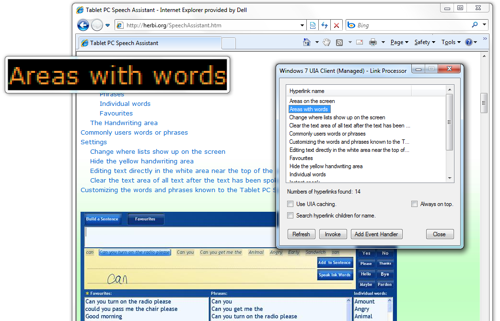

# Windows 7 UI Automation Client API C# sample (hyperlink processor) Version 1.0
## Requires
- Visual Studio 2010
## License
- Apache License, Version 2.0
## Technologies
- Windows 7 UI Automation Client API
- Windows Magnification API
## Topics
- UI Automation
- Magnification API
## Updated
- 05/02/2011
## Description

A few weeks ago I demo&rsquo;d the sample C&#43;&#43; app which uses the Windows 7 UI Automation Client API to interact with hyperlinks in a browser, (<a href="http://code.msdn.microsoft.com/Windows-7-UI-Automation-9131f729">http://code.msdn.microsoft.com/Windows-7-UI-Automation-9131f729</a>),
 at the CSUN 2011 conference in San Diego. I got feedback that a similar C# sample would be useful too. So I&rsquo;ve built this new sample to perform the same actions to get a list of hyperlinks from the browser, invoke the links, and react to structure changed
 events when a page changes, but the client is C#. 
&nbsp;

Note that the app is using the unmanaged Windows 7 UI Automation API. The sample has a custom build step:

&quot;%PROGRAMFILES%\Microsoft SDKs\Windows\v7.0A\bin\tlbimp.exe&quot; %windir%\system32\UIAutomationCore.dll /out:..\interop.UIAutomationCore.dll&quot;

&nbsp;

Using tlbimp.exe, an interop dll gets built and is referenced by the C# source files. If this doesn&rsquo;t build for you, you&rsquo;ll need to update the custom build action to specify where tlbimp.exe is on your computer.
 (It can be downloaded with the Windows SDK.)

The highlighting of the hyperlinks is still done using the Windows Magnification API. As that API is a flat C-style API, I&rsquo;ve added a file Win32.cs containing all the pinvoke-related data required for using the Mag API
 from C#. 

Also note that a lot of the work done in the LinkProcessor.cs and SampleEventHandler.cs files relates to managing the background threads on which all the UIA-related calls are made.

If you&rsquo;d like to see more UIA-related action demonstrated in the sample, let me know and I can update it accordingly.

Guy

