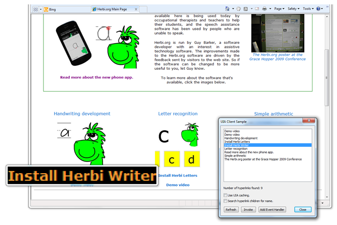

# Windows 7 UI Automation Client API sample (hyperlink processor) Version 1.1
## Requires
- Visual Studio 2010
## License
- Apache License, Version 2.0
## Technologies
- Magnification API
- Windows 7 UI Automation Client API
## Topics
- UI Automation
- Magnification API
## Updated
- 03/08/2011
## Description

This sample application demonstrates some of the more commonly used parts of the Windows 7 UI Automation Client API.

The sample retrieves a list of hyperlinks shown in an already-running browser application and presents those hyperlinks in its own UI. When a hyperlink is selected in the sample application's UI, the sample will highlight the
 link shown in the browser window using the Windows Magnification API. The sample can also invoke the hyperlinks in the browser window and react to notifications sent by the browser to have the sample's list of hyperlinks automatically refreshed.

&nbsp;The sample includes use of the following interfaces:

IUIAutomation, IUIAutomationElement, IUIAutomationCacheRequest, IUIAutomationCondition, IUIAutomationElementArray, IUIAutomationTreeWalker.

<strong>Version 1.1 moves all calls to UIA off the main UI thread and&nbsp;onto a new background MTA thread. This prevents the possibility of unexpected delays occurring beneath UIA calls.</strong>

 
The following image shows the sample application listing hyperlinks shown in a browser, with a specific link highlighted.

&nbsp;

