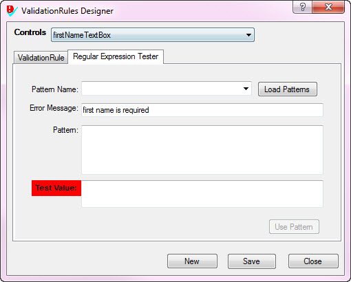
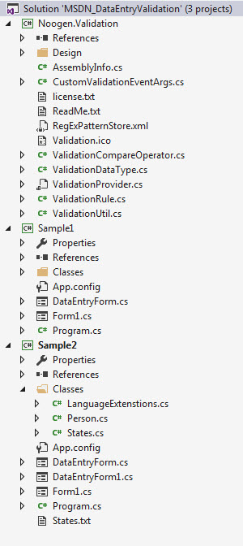

# Windows Form Validation (C#)
## Requires
- Visual Studio 2015
## License
- MIT
## Technologies
- C#
- Validation
- Windows Forms
## Topics
- C#
- Windows Forms
- Form validation
- Windows controls
## Updated
- 12/03/2017
## Description

<h1>Description</h1>

This code sample provides code samples that will provide you with various choices to validate information entered by a user into Textbox and CombBox controls but the methods provided are not limited to these two controls, I
 wanted to keep things simple all around.

From my time on various forums the average developer (thinking not with much experience) will do very little validation to confirm that information entered by the user is valid or no validation at all.

Also these same developers believe that adding, editing data is best done in a DataGridView, perhaps from seeing this done within MS-Access. I can understand this yet with a little learning they can work adding and editing into
 a dialog form that displays over a form containing a DataGridView, add or edit and save back to the calling form.

I&rsquo;ve done three examples, none of them load data from a file or database as I wanted to focus solely on validating data.

In all three examples I validate that all TextBox controls are not empty and a ComboBox has a validate selection. Granted determining if all TextBox controls are populated can eat up many lines of code and really doesn&rsquo;t
 tell the user in most cases what is missing unless we add a Error Provider in which can be a ton of code if there are a lot of controls to validate as we must handle valid and invalid entries.

In example one in project Sample1, this is all completely valid and would only do this type of validation on simple types (a few fields with simple validation). While example 2 I provide two alternatives. For the first we work
 with Validating event of the controls (same controls as in example 1), code must be written while the last method uses a component which was up on Code Project (see the read me file for details).

Both code samples in Sample2 project are all valid and can see some developers leaning toward one or the other or heck, back to Sample1.

Going with the last sample using a custom component, all you need to do is set it up e.g.

<ol>
<li>Drop it on the form. </li><li>Write two lines of code. </li><li>Setup each control via the property window.
</li></ol>

Two lines of code

&nbsp;

C#

Edit|Remove

csharp
<pre class="hidden">ValidationRule vr = new ValidationRule();
vr.CustomValidationMethod &#43;= vr_CustomValidationMethod;</pre>

<pre class="csharp">ValidationRule&nbsp;vr&nbsp;=&nbsp;new&nbsp;ValidationRule();&nbsp;
vr.CustomValidationMethod&nbsp;&#43;=&nbsp;vr_CustomValidationMethod;</pre>

&nbsp;

&nbsp;

Setup in the property window.

.

Rules once selecting the above.

.

 

.

You can test a regular expression pattern e.g.

.

.

Although the special validator mentioned above makes life very easy to do validation does not mean that is how you should do validation. As mentioned above, some will go with the more basic method to validate information while
 others will go with one of the others. There are some people (perhaps hobbyist) who are not fluent enough to go with a more sophisticated method to validate, don&rsquo;t see the need while others don&rsquo;t care to use third party components. It&rsquo;s all
 up to you, I&rsquo;ve simply provided alternate methods that should make it easy to provide a basic to advance level of validation.&nbsp;

 

 

