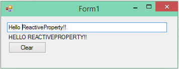

# Windows FormsとReactivePropertyで簡易データバインディングを行う
## Requires
- Visual Studio 2013
## License
- Apache License, Version 2.0
## Technologies
- Reactive Extensions
## Topics
- ReactiveProperty
## Updated
- 10/10/2014
## Description

<h1>サンプルプログラムの概要</h1>

このサンプルプログラムは、ReactivePropertyをソースにしてPOCOをターゲットにして単方向・双方向のバインディングを行う方法をしめしています。WPFやWindows PhoneやWindows store appでは、XAMLのデータバインディングを使用するため、使用することはありませんが、XamarinやWindows Formsなどデータバインディングが無い(または、あったとしても貧弱な）環境での使用を想定しています。

このサンプルは、Windows FormsでReactivePropertyを使用しています。

<h1>サンプルプログラムの実行方法</h1>

ソリューションのNuGetパッケージの復元を有効化してリビルドしてください。そのあと、実行を行うとサンプルプログラムを実行できます。

<h1>サンプルプログラムの解説</h1>

このサンプルプログラムは、TextBoxに入力した内容が3秒遅れでLabelにすべて大文字になって表示される動作をします。

<h2>Windows Formsで使うための下準備</h2>

本題のBindingに入る前にWindows FormsでReactivePropertyを使うための下準備として、Windows FormsのUIスレッドにディスパッチしてくれるSchedulerを作成します。WindowsFormsSynchronizationContextを使ってSynchronizationContextSchedulerを作成すればOKです。

C#

スクリプトの編集|Remove

csharp
<pre class="hidden">using System;
using System.Reactive.Concurrency;
using System.Windows.Forms;

namespace WindowsFormsRxSampleApp
{
    public static class WindowsFormUIDispatcher
    {
        private static Lazy&lt;IScheduler&gt; defaultValue = new Lazy&lt;IScheduler&gt;(
            () =&gt; new SynchronizationContextScheduler(WindowsFormsSynchronizationContext.Current));

        public static IScheduler Default
        {
            get { return defaultValue.Value; }
        }
    }
}
</pre>

<pre class="js">using&nbsp;System;&nbsp;
using&nbsp;System.Reactive.Concurrency;&nbsp;
using&nbsp;System.Windows.Forms;&nbsp;
&nbsp;
namespace&nbsp;WindowsFormsRxSampleApp&nbsp;
{&nbsp;
&nbsp;&nbsp;&nbsp;&nbsp;public&nbsp;static&nbsp;class&nbsp;WindowsFormUIDispatcher&nbsp;
&nbsp;&nbsp;&nbsp;&nbsp;{&nbsp;
&nbsp;&nbsp;&nbsp;&nbsp;&nbsp;&nbsp;&nbsp;&nbsp;private&nbsp;static&nbsp;Lazy&lt;IScheduler&gt;&nbsp;defaultValue&nbsp;=&nbsp;new&nbsp;Lazy&lt;IScheduler&gt;(&nbsp;
&nbsp;&nbsp;&nbsp;&nbsp;&nbsp;&nbsp;&nbsp;&nbsp;&nbsp;&nbsp;&nbsp;&nbsp;()&nbsp;=&gt;&nbsp;new&nbsp;SynchronizationContextScheduler(WindowsFormsSynchronizationContext.Current));&nbsp;
&nbsp;
&nbsp;&nbsp;&nbsp;&nbsp;&nbsp;&nbsp;&nbsp;&nbsp;public&nbsp;static&nbsp;IScheduler&nbsp;Default&nbsp;
&nbsp;&nbsp;&nbsp;&nbsp;&nbsp;&nbsp;&nbsp;&nbsp;{&nbsp;
&nbsp;&nbsp;&nbsp;&nbsp;&nbsp;&nbsp;&nbsp;&nbsp;&nbsp;&nbsp;&nbsp;&nbsp;get&nbsp;{&nbsp;return&nbsp;defaultValue.Value;&nbsp;}&nbsp;
&nbsp;&nbsp;&nbsp;&nbsp;&nbsp;&nbsp;&nbsp;&nbsp;}&nbsp;
&nbsp;&nbsp;&nbsp;&nbsp;}&nbsp;
}&nbsp;
</pre>

&nbsp;

<h2>ViewModelの作成</h2>

ViewModelは通常の場合と同じなので詳細な説明は省略します。注意点としてはDelayしたあとにUIスレッドに戻している点です。

C#

スクリプトの編集|Remove

csharp
<pre class="hidden">using Codeplex.Reactive;
using System;
using System.Reactive.Linq;

namespace WindowsFormsRxSampleApp
{
    public class MainFormViewModel
    {
        public ReactiveProperty&lt;string&gt; Input { get; private set; }
        public ReactiveProperty&lt;string&gt; Output { get; private set; }

        public ReactiveCommand ClearCommand { get; private set; }

        public MainFormViewModel()
        {
            this.Input = new ReactiveProperty&lt;string&gt;();

            this.Output = this.Input
                .Where(x =&gt; x != null)
                .Delay(TimeSpan.FromSeconds(3))
                .Select(x =&gt; x.ToUpper())
                .ObserveOn(WindowsFormUIDispatcher.Default)
                .ToReactiveProperty();

            this.ClearCommand = new ReactiveCommand();
            this.ClearCommand.Subscribe(_ =&gt; this.Input.Value = &quot;Clear value!!&quot;);
        }
    }
}
</pre>

<pre class="js">using&nbsp;Codeplex.Reactive;&nbsp;
using&nbsp;System;&nbsp;
using&nbsp;System.Reactive.Linq;&nbsp;
&nbsp;
namespace&nbsp;WindowsFormsRxSampleApp&nbsp;
{&nbsp;
&nbsp;&nbsp;&nbsp;&nbsp;public&nbsp;class&nbsp;MainFormViewModel&nbsp;
&nbsp;&nbsp;&nbsp;&nbsp;{&nbsp;
&nbsp;&nbsp;&nbsp;&nbsp;&nbsp;&nbsp;&nbsp;&nbsp;public&nbsp;ReactiveProperty&lt;string&gt;&nbsp;Input&nbsp;{&nbsp;get;&nbsp;private&nbsp;set;&nbsp;}&nbsp;
&nbsp;&nbsp;&nbsp;&nbsp;&nbsp;&nbsp;&nbsp;&nbsp;public&nbsp;ReactiveProperty&lt;string&gt;&nbsp;Output&nbsp;{&nbsp;get;&nbsp;private&nbsp;set;&nbsp;}&nbsp;
&nbsp;
&nbsp;&nbsp;&nbsp;&nbsp;&nbsp;&nbsp;&nbsp;&nbsp;public&nbsp;ReactiveCommand&nbsp;ClearCommand&nbsp;{&nbsp;get;&nbsp;private&nbsp;set;&nbsp;}&nbsp;
&nbsp;
&nbsp;&nbsp;&nbsp;&nbsp;&nbsp;&nbsp;&nbsp;&nbsp;public&nbsp;MainFormViewModel()&nbsp;
&nbsp;&nbsp;&nbsp;&nbsp;&nbsp;&nbsp;&nbsp;&nbsp;{&nbsp;
&nbsp;&nbsp;&nbsp;&nbsp;&nbsp;&nbsp;&nbsp;&nbsp;&nbsp;&nbsp;&nbsp;&nbsp;this.Input&nbsp;=&nbsp;new&nbsp;ReactiveProperty&lt;string&gt;();&nbsp;
&nbsp;
&nbsp;&nbsp;&nbsp;&nbsp;&nbsp;&nbsp;&nbsp;&nbsp;&nbsp;&nbsp;&nbsp;&nbsp;this.Output&nbsp;=&nbsp;this.Input&nbsp;
&nbsp;&nbsp;&nbsp;&nbsp;&nbsp;&nbsp;&nbsp;&nbsp;&nbsp;&nbsp;&nbsp;&nbsp;&nbsp;&nbsp;&nbsp;&nbsp;.Where(x&nbsp;=&gt;&nbsp;x&nbsp;!=&nbsp;null)&nbsp;
&nbsp;&nbsp;&nbsp;&nbsp;&nbsp;&nbsp;&nbsp;&nbsp;&nbsp;&nbsp;&nbsp;&nbsp;&nbsp;&nbsp;&nbsp;&nbsp;.Delay(TimeSpan.FromSeconds(3))&nbsp;
&nbsp;&nbsp;&nbsp;&nbsp;&nbsp;&nbsp;&nbsp;&nbsp;&nbsp;&nbsp;&nbsp;&nbsp;&nbsp;&nbsp;&nbsp;&nbsp;.Select(x&nbsp;=&gt;&nbsp;x.ToUpper())&nbsp;
&nbsp;&nbsp;&nbsp;&nbsp;&nbsp;&nbsp;&nbsp;&nbsp;&nbsp;&nbsp;&nbsp;&nbsp;&nbsp;&nbsp;&nbsp;&nbsp;.ObserveOn(WindowsFormUIDispatcher.Default)&nbsp;
&nbsp;&nbsp;&nbsp;&nbsp;&nbsp;&nbsp;&nbsp;&nbsp;&nbsp;&nbsp;&nbsp;&nbsp;&nbsp;&nbsp;&nbsp;&nbsp;.ToReactiveProperty();&nbsp;
&nbsp;
&nbsp;&nbsp;&nbsp;&nbsp;&nbsp;&nbsp;&nbsp;&nbsp;&nbsp;&nbsp;&nbsp;&nbsp;this.ClearCommand&nbsp;=&nbsp;new&nbsp;ReactiveCommand();&nbsp;
&nbsp;&nbsp;&nbsp;&nbsp;&nbsp;&nbsp;&nbsp;&nbsp;&nbsp;&nbsp;&nbsp;&nbsp;this.ClearCommand.Subscribe(_&nbsp;=&gt;&nbsp;this.Input.Value&nbsp;=&nbsp;&quot;Clear&nbsp;value!!&quot;);&nbsp;
&nbsp;&nbsp;&nbsp;&nbsp;&nbsp;&nbsp;&nbsp;&nbsp;}&nbsp;
&nbsp;&nbsp;&nbsp;&nbsp;}&nbsp;
}&nbsp;
</pre>

&nbsp;

<h2>データのバインド</h2>

本題のデータのバインドを行います。ReactivePropertyには、Codeplex.Reactive.Binding名前空間にReactivePropertyをバインドするための拡張メソッドが定義されています。

BindTo拡張メソッドを使うと、単方向・双方向のデータバインドが可能になります。ReactivePropertyから何かのオブジェクトへの一方通行の変換の場合は以下のように簡単に書けます。

C#

スクリプトの編集|Remove

csharp
<pre class="hidden">private MainFormViewModel viewModel = new MainFormViewModel();

// -----------------------------------------------------
this.viewModel
    .Output
    .BindTo(
        this.labelOutput,
        x =&gt; x.Text);
</pre>

<pre class="csharp">private&nbsp;MainFormViewModel&nbsp;viewModel&nbsp;=&nbsp;new&nbsp;MainFormViewModel();&nbsp;
&nbsp;
//&nbsp;-----------------------------------------------------&nbsp;
this.viewModel&nbsp;
&nbsp;&nbsp;&nbsp;&nbsp;.Output&nbsp;
&nbsp;&nbsp;&nbsp;&nbsp;.BindTo(&nbsp;
&nbsp;&nbsp;&nbsp;&nbsp;&nbsp;&nbsp;&nbsp;&nbsp;this.labelOutput,&nbsp;
&nbsp;&nbsp;&nbsp;&nbsp;&nbsp;&nbsp;&nbsp;&nbsp;x&nbsp;=&gt;&nbsp;x.Text);&nbsp;
</pre>

&nbsp;

第一引数に、バインドの先になるオブジェクトを渡して、第二引数に、バインド先のプロパティを指定するラムダ式を指定します。これで、ReactivePropertyの値が変更されたら、バインド先のプロパティに値が反映されます。

双方向のデータバインドも基本的に同じ方法で指定しますが、バインド先からReactivePropertyの値の変更のトリガーとなるIObservable&lt;Unit&gt;を渡す点が異なります。サンプルプログラムでは、TextBoxのTextChangedイベントをトリガーに、ReactivePropertyに値を書き戻すように指定しているので、以下のようなコードになります。

C#

スクリプトの編集|Remove

csharp
<pre class="hidden">this.viewModel
    .Input
    .BindTo(
        this.textBoxInput,
        x =&gt; x.Text,
        mode: BindingMode.TwoWay,
        targetUpdateTrigger: Observable.FromEvent&lt;EventHandler, EventArgs&gt;(
            h =&gt; (s, e) =&gt; h(e),
            h =&gt; this.textBoxInput.TextChanged &#43;= h,
            h =&gt; this.textBoxInput.TextChanged -= h)
            .ToUnit());
</pre>

<pre class="csharp">this.viewModel&nbsp;
&nbsp;&nbsp;&nbsp;&nbsp;.Input&nbsp;
&nbsp;&nbsp;&nbsp;&nbsp;.BindTo(&nbsp;
&nbsp;&nbsp;&nbsp;&nbsp;&nbsp;&nbsp;&nbsp;&nbsp;this.textBoxInput,&nbsp;
&nbsp;&nbsp;&nbsp;&nbsp;&nbsp;&nbsp;&nbsp;&nbsp;x&nbsp;=&gt;&nbsp;x.Text,&nbsp;
&nbsp;&nbsp;&nbsp;&nbsp;&nbsp;&nbsp;&nbsp;&nbsp;mode:&nbsp;BindingMode.TwoWay,&nbsp;
&nbsp;&nbsp;&nbsp;&nbsp;&nbsp;&nbsp;&nbsp;&nbsp;targetUpdateTrigger:&nbsp;Observable.FromEvent&lt;EventHandler,&nbsp;EventArgs&gt;(&nbsp;
&nbsp;&nbsp;&nbsp;&nbsp;&nbsp;&nbsp;&nbsp;&nbsp;&nbsp;&nbsp;&nbsp;&nbsp;h&nbsp;=&gt;&nbsp;(s,&nbsp;e)&nbsp;=&gt;&nbsp;h(e),&nbsp;
&nbsp;&nbsp;&nbsp;&nbsp;&nbsp;&nbsp;&nbsp;&nbsp;&nbsp;&nbsp;&nbsp;&nbsp;h&nbsp;=&gt;&nbsp;this.textBoxInput.TextChanged&nbsp;&#43;=&nbsp;h,&nbsp;
&nbsp;&nbsp;&nbsp;&nbsp;&nbsp;&nbsp;&nbsp;&nbsp;&nbsp;&nbsp;&nbsp;&nbsp;h&nbsp;=&gt;&nbsp;this.textBoxInput.TextChanged&nbsp;-=&nbsp;h)&nbsp;
&nbsp;&nbsp;&nbsp;&nbsp;&nbsp;&nbsp;&nbsp;&nbsp;&nbsp;&nbsp;&nbsp;&nbsp;.ToUnit());&nbsp;
</pre>

&nbsp;

mode引数で双方向バインディングであることを指定してtargetUpdateTrigger引数で、変更のタイミングを指定しています。

最後に、ReactiveCommandをボタンのClickイベントに紐づけるためのToEventHandlerメソッドを紹介します。このメソッドはCommandをEvehtHandler型に変換するメソッドです。以下のように使用します。

C#

スクリプトの編集|Remove

csharp
<pre class="hidden">this.buttonClear.Click &#43;= this.viewModel.ClearCommand.ToEventHandler();</pre>

<pre class="js">this.buttonClear.Click&nbsp;&#43;=&nbsp;this.viewModel.ClearCommand.ToEventHandler();</pre>

&nbsp;

あとで、イベントハンドラの解除を行う必要がある場合はToEventHandlerの結果を変数に保持して必要になった個所で -= でイベントの登録を解除するようにしてください。

