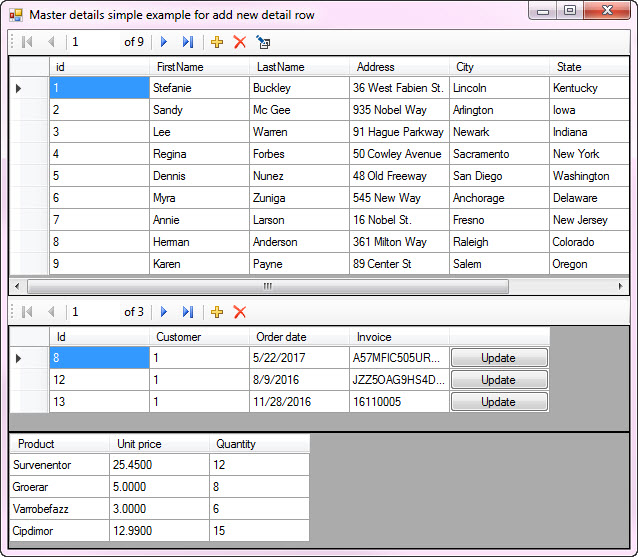
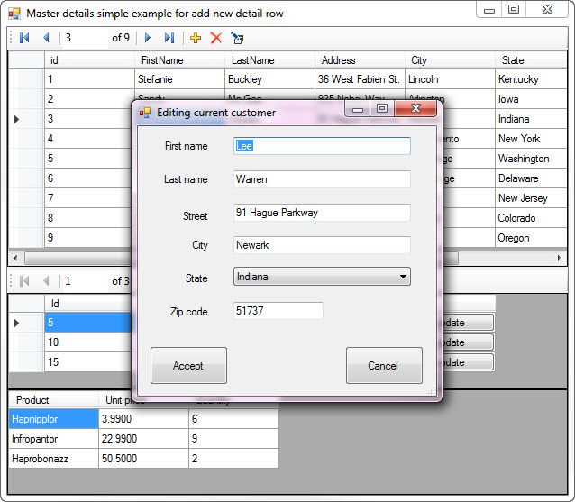

# Windows forms Master-detail view with add/edit/delete on SQL-Server
## Requires
- Visual Studio 2015
## License
- MIT
## Technologies
- Data Binding
- SQL Server
- Windows Forms
- custom controls
- Data Platform
- SqlClient
## Topics
- C#
- SQL
- Class Library
- Windows Forms
- Data Access
- VB.Net
- Code Sample
- DataGridView
- How to
- UI Design
- Extension
- Databases
- Master/Detail
- CRUD
- Design &amp; Implementation
## Updated
- 02/12/2017
## Description

<h1>Description</h1>

A business application can be created to interact with one database table that is fairly simple to write yet the majority of business applications are written on top of a relational database e.g. a table for customers, a related
 table for addresses another table for phone numbers, a table for products, orders and order details, vendors to purchase from and shippers to ship orders. Attempting to write an order based application with less tables is possible yet down the road will eventually
 develop issues and time to fix issues that could be avoided with a good database design.&nbsp; 
 
In my current solution at work the application has in its domain 12 plus tables along with tables in other domains on the same SQL-Server. The prior version of the application had only six tables which over time became useless
 thus had to be rewritten with a better database design. 
 
Once the database has been designed classes are written to handle all required operations such as relate tables together e.g. customer, orders and order details. For the code samples within I&rsquo;m keeping to these tables as
 bring in other tables will cause those who want to learn how to write application code to interact with master-details extremely difficult. 
 
High-level the code focuses on reading data from SQL-Server using SqlClient managed data provider along with add, edit and remove master records, remove detail records when deleting a customer. Pause, a real life app more likely
 would archive a customer and their orders but here focus is on crude operations. The code shows how to work with detail records same as customer records. 
 
There is a little inconsistency with crude operations e.g. press enter on a row in a DataGridView to edit and also pressing a button in a BindingNavigator to edit while delete operations are done via the appropriate BindingNavigator.
 By seeing both methods you can for your application can decide on all operations are done both in the BindingNavigator and also in the DataGridView. Example, there is code to see if the user pressed ENTER in the DataGridView to edit, you could also check for
 DEL for delete. 
 
Details of working with data, there is a class, DataOperations which for each operation opens a connection to the backend database, do some work, closes the connection. Some developers like to keep one connection, that is their
 choice but I would suggest getting use to this. If you move to Entity Framework you create a new instance of the entity, do work and the entity is closed. 
 
Each operation for working with data has its own method to compartmentalize the operation so that it does not conflict with other variables or properties of the class. 
 
Exception handling in the data class never uses UI method to show an exception/error message but instead sets a property in the class which if there is a failure for a method another property will contain the actual exception/error
 text. When I was writing window form application these error messages would be both written to a log file and send to a help desk email address.&nbsp; 
 
Thinking front end and backend, anytime there are changes no refreshing is needed on the UI side as the logic used dynamically changes the UI to reflect the backend operations. 
 
Okay, all focus when examining the code should be on the master-detail then followed up to examine what I did to show related data for the details in the bottom DataGridView.

&nbsp;

&nbsp;

From here one would surely want to add search capabilities to the UI, if I get time I will add this but of course you can try writing search capabilities also. One option is to use a free component e.g.

<a href="https://www.codeproject.com/Articles/20990/DataGridView-with-integrated-filtering-sorting-and">https://www.codeproject.com/Articles/20990/DataGridView-with-integrated-filtering-sorting-and</a>

or

<a href="https://www.codeproject.com/Articles/33786/DataGridView-Filter-Popup">https://www.codeproject.com/Articles/33786/DataGridView-Filter-Popup</a>&nbsp;

The last one is very configurable.

Of course you might be better off writing your own. For VB.NET I have some code in the following
<a href="https://code.msdn.microsoft.com/Basics-of-manuall-creating-aa1a5c3d">MSDN Code sample</a>.

&nbsp;

<h1>IMPORTANT Information</h1>
<ul>
<li>In each of the backend classes for VB and C# I've
<strong>included a SQL script</strong> to create the database,tables and data. In the first several lines of the script note the path to where the database will be created. This path is good for the default installation of SQL-Server, if your path is different
 then change it. You might want to create the database say in C:\Data, it's up to you.
</li><li>Also, you will need to change the name of the SQL-SERVER from KAREN-PC to your server name.
</li><li>Primary keys are shown for learning purposes only.
</li><li>NOTE <strong>2/1/2017</strong> seems that the script for creating the database was incomplete, I just uploaded the revied version that has all the right stuff to properly create the database.
</li></ul>
