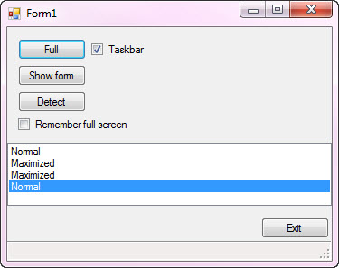

# Windows forms make form cover taskbar
## Requires
- Visual Studio 2015
## License
- MIT
## Technologies
- User Interface
- Windows Forms
## Topics
- User Interface
- Windows Forms
- VB.Net
- C# Language Features
- User Experience
## Updated
- 11/13/2016
## Description

<h1>Description</h1>

This sample shows how to make a form cover the entire screen with an option to cover or not cover the Windows task bar. There are many reasons for this but the main reason is a form has many controls that requires either the
 user scrolls through the controls or simply depresses the X in the window title bar to maximism the window.&nbsp;

With that we must allow the user to remember this to either startup with&nbsp;maximized or not as the user may be fine with scolling so that when working with one monitor they can share the screen with another application that
 is used in tangent with your application.

Let's get started, we could place all the code presented in the attached solution directly into a form and be good yet it's a good idea to place the code into another class so that it is reusable and does not clutter up the
 form with this code. Best practices dicate place very little code into a form so that is what I have done with a slight twist which is place the code into a class project where each method is done as a language extension method.

Visual BasicC#

Edit|Remove

vbcsharp

<pre class="js">Imports&nbsp;System.Windows.Forms&nbsp;
Public&nbsp;Module&nbsp;FormExtensions&nbsp;
&nbsp;&nbsp;&nbsp;&nbsp;Private&nbsp;Declare&nbsp;Function&nbsp;SetWindowPos&nbsp;Lib&nbsp;&quot;user32.dll&quot;&nbsp;_&nbsp;
&nbsp;&nbsp;&nbsp;&nbsp;&nbsp;&nbsp;&nbsp;&nbsp;Alias&nbsp;&quot;SetWindowPos&quot;&nbsp;(ByVal&nbsp;hWnd&nbsp;As&nbsp;IntPtr,&nbsp;
&nbsp;&nbsp;&nbsp;&nbsp;&nbsp;&nbsp;&nbsp;&nbsp;&nbsp;&nbsp;&nbsp;&nbsp;&nbsp;&nbsp;&nbsp;&nbsp;&nbsp;&nbsp;&nbsp;&nbsp;&nbsp;&nbsp;&nbsp;&nbsp;&nbsp;&nbsp;&nbsp;&nbsp;&nbsp;&nbsp;ByVal&nbsp;hWndIntertAfter&nbsp;As&nbsp;IntPtr,&nbsp;
&nbsp;&nbsp;&nbsp;&nbsp;&nbsp;&nbsp;&nbsp;&nbsp;&nbsp;&nbsp;&nbsp;&nbsp;&nbsp;&nbsp;&nbsp;&nbsp;&nbsp;&nbsp;&nbsp;&nbsp;&nbsp;&nbsp;&nbsp;&nbsp;&nbsp;&nbsp;&nbsp;&nbsp;&nbsp;&nbsp;ByVal&nbsp;X&nbsp;As&nbsp;Integer,&nbsp;
&nbsp;&nbsp;&nbsp;&nbsp;&nbsp;&nbsp;&nbsp;&nbsp;&nbsp;&nbsp;&nbsp;&nbsp;&nbsp;&nbsp;&nbsp;&nbsp;&nbsp;&nbsp;&nbsp;&nbsp;&nbsp;&nbsp;&nbsp;&nbsp;&nbsp;&nbsp;&nbsp;&nbsp;&nbsp;&nbsp;ByVal&nbsp;Y&nbsp;As&nbsp;Integer,&nbsp;
&nbsp;&nbsp;&nbsp;&nbsp;&nbsp;&nbsp;&nbsp;&nbsp;&nbsp;&nbsp;&nbsp;&nbsp;&nbsp;&nbsp;&nbsp;&nbsp;&nbsp;&nbsp;&nbsp;&nbsp;&nbsp;&nbsp;&nbsp;&nbsp;&nbsp;&nbsp;&nbsp;&nbsp;&nbsp;&nbsp;ByVal&nbsp;cx&nbsp;As&nbsp;Integer,&nbsp;
&nbsp;&nbsp;&nbsp;&nbsp;&nbsp;&nbsp;&nbsp;&nbsp;&nbsp;&nbsp;&nbsp;&nbsp;&nbsp;&nbsp;&nbsp;&nbsp;&nbsp;&nbsp;&nbsp;&nbsp;&nbsp;&nbsp;&nbsp;&nbsp;&nbsp;&nbsp;&nbsp;&nbsp;&nbsp;&nbsp;ByVal&nbsp;cy&nbsp;As&nbsp;Integer,&nbsp;
&nbsp;&nbsp;&nbsp;&nbsp;&nbsp;&nbsp;&nbsp;&nbsp;&nbsp;&nbsp;&nbsp;&nbsp;&nbsp;&nbsp;&nbsp;&nbsp;&nbsp;&nbsp;&nbsp;&nbsp;&nbsp;&nbsp;&nbsp;&nbsp;&nbsp;&nbsp;&nbsp;&nbsp;&nbsp;&nbsp;ByVal&nbsp;uFlags&nbsp;As&nbsp;Integer)&nbsp;As&nbsp;Boolean&nbsp;
&nbsp;
&nbsp;&nbsp;&nbsp;&nbsp;Private&nbsp;HWND_TOP&nbsp;As&nbsp;IntPtr&nbsp;=&nbsp;IntPtr.Zero&nbsp;
&nbsp;&nbsp;&nbsp;&nbsp;Private&nbsp;Const&nbsp;SWP_SHOWWINDOW&nbsp;As&nbsp;Integer&nbsp;=&nbsp;64&nbsp;
&nbsp;
&nbsp;&nbsp;&nbsp;&nbsp;'''&nbsp;&lt;summary&gt;&nbsp;
&nbsp;&nbsp;&nbsp;&nbsp;'''&nbsp;Place&nbsp;form&nbsp;into&nbsp;full&nbsp;screen&nbsp;
&nbsp;&nbsp;&nbsp;&nbsp;'''&nbsp;&lt;/summary&gt;&nbsp;
&nbsp;&nbsp;&nbsp;&nbsp;'''&nbsp;&lt;param&nbsp;name=&quot;sender&quot;&gt;&lt;/param&gt;&nbsp;
&nbsp;&nbsp;&nbsp;&nbsp;'''&nbsp;&lt;param&nbsp;name=&quot;TaskBar&quot;&gt;True&nbsp;to&nbsp;hide&nbsp;Windows&nbsp;TaskBar&lt;/param&gt;&nbsp;
&nbsp;&nbsp;&nbsp;&nbsp;'''&nbsp;&lt;remarks&gt;&nbsp;
&nbsp;&nbsp;&nbsp;&nbsp;'''&nbsp;Showing&nbsp;this&nbsp;task&nbsp;bar&nbsp;may&nbsp;not&nbsp;work&nbsp;fully&nbsp;but&nbsp;that&nbsp;is&nbsp;not&nbsp;the&nbsp;
&nbsp;&nbsp;&nbsp;&nbsp;'''&nbsp;point&nbsp;here,&nbsp;the&nbsp;point&nbsp;is&nbsp;to&nbsp;cover&nbsp;the&nbsp;task&nbsp;bar&nbsp;with&nbsp;a&nbsp;option&nbsp;
&nbsp;&nbsp;&nbsp;&nbsp;'''&nbsp;to&nbsp;expose&nbsp;it&nbsp;is&nbsp;secondary.&nbsp;
&nbsp;&nbsp;&nbsp;&nbsp;'''&nbsp;&lt;/remarks&gt;&nbsp;
&nbsp;&nbsp;&nbsp;&nbsp;&lt;Runtime.CompilerServices.Extension()&gt;&nbsp;
&nbsp;&nbsp;&nbsp;&nbsp;Public&nbsp;Sub&nbsp;FullScreen(ByVal&nbsp;sender&nbsp;As&nbsp;Form,&nbsp;ByVal&nbsp;TaskBar&nbsp;As&nbsp;Boolean)&nbsp;
&nbsp;
&nbsp;&nbsp;&nbsp;&nbsp;&nbsp;&nbsp;&nbsp;&nbsp;sender.WindowState&nbsp;=&nbsp;FormWindowState.Maximized&nbsp;
&nbsp;&nbsp;&nbsp;&nbsp;&nbsp;&nbsp;&nbsp;&nbsp;sender.FormBorderStyle&nbsp;=&nbsp;FormBorderStyle.None&nbsp;
&nbsp;&nbsp;&nbsp;&nbsp;&nbsp;&nbsp;&nbsp;&nbsp;sender.TopMost&nbsp;=&nbsp;True&nbsp;
&nbsp;
&nbsp;&nbsp;&nbsp;&nbsp;&nbsp;&nbsp;&nbsp;&nbsp;If&nbsp;TaskBar&nbsp;Then&nbsp;
&nbsp;
&nbsp;&nbsp;&nbsp;&nbsp;&nbsp;&nbsp;&nbsp;&nbsp;&nbsp;&nbsp;&nbsp;&nbsp;SetWindowPos(sender.Handle,&nbsp;HWND_TOP,&nbsp;0,&nbsp;0,&nbsp;
&nbsp;&nbsp;&nbsp;&nbsp;&nbsp;&nbsp;&nbsp;&nbsp;&nbsp;&nbsp;&nbsp;&nbsp;&nbsp;&nbsp;&nbsp;&nbsp;&nbsp;&nbsp;&nbsp;&nbsp;&nbsp;&nbsp;&nbsp;&nbsp;&nbsp;Screen.PrimaryScreen.Bounds.Width,&nbsp;
&nbsp;&nbsp;&nbsp;&nbsp;&nbsp;&nbsp;&nbsp;&nbsp;&nbsp;&nbsp;&nbsp;&nbsp;&nbsp;&nbsp;&nbsp;&nbsp;&nbsp;&nbsp;&nbsp;&nbsp;&nbsp;&nbsp;&nbsp;&nbsp;&nbsp;Screen.PrimaryScreen.Bounds.Height,&nbsp;
&nbsp;&nbsp;&nbsp;&nbsp;&nbsp;&nbsp;&nbsp;&nbsp;&nbsp;&nbsp;&nbsp;&nbsp;&nbsp;&nbsp;&nbsp;&nbsp;&nbsp;&nbsp;&nbsp;&nbsp;&nbsp;&nbsp;&nbsp;&nbsp;&nbsp;SWP_SHOWWINDOW&nbsp;
&nbsp;&nbsp;&nbsp;&nbsp;&nbsp;&nbsp;&nbsp;&nbsp;&nbsp;&nbsp;&nbsp;&nbsp;)&nbsp;
&nbsp;
&nbsp;&nbsp;&nbsp;&nbsp;&nbsp;&nbsp;&nbsp;&nbsp;End&nbsp;If&nbsp;
&nbsp;
&nbsp;&nbsp;&nbsp;&nbsp;End&nbsp;Sub&nbsp;
&nbsp;&nbsp;&nbsp;&nbsp;'''&nbsp;&lt;summary&gt;&nbsp;
&nbsp;&nbsp;&nbsp;&nbsp;'''&nbsp;Restore&nbsp;to&nbsp;original&nbsp;size/position&nbsp;
&nbsp;&nbsp;&nbsp;&nbsp;'''&nbsp;&lt;/summary&gt;&nbsp;
&nbsp;&nbsp;&nbsp;&nbsp;'''&nbsp;&lt;param&nbsp;name=&quot;sender&quot;&gt;&lt;/param&gt;&nbsp;
&nbsp;&nbsp;&nbsp;&nbsp;'''&nbsp;&lt;remarks&gt;&lt;/remarks&gt;&nbsp;
&nbsp;&nbsp;&nbsp;&nbsp;&lt;Runtime.CompilerServices.Extension()&gt;&nbsp;
&nbsp;&nbsp;&nbsp;&nbsp;Public&nbsp;Sub&nbsp;NormalMode(ByVal&nbsp;sender&nbsp;As&nbsp;Form)&nbsp;
&nbsp;&nbsp;&nbsp;&nbsp;&nbsp;&nbsp;&nbsp;&nbsp;sender.WindowState&nbsp;=&nbsp;FormWindowState.Normal&nbsp;
&nbsp;&nbsp;&nbsp;&nbsp;&nbsp;&nbsp;&nbsp;&nbsp;sender.FormBorderStyle&nbsp;=&nbsp;FormBorderStyle.FixedSingle&nbsp;
&nbsp;&nbsp;&nbsp;&nbsp;&nbsp;&nbsp;&nbsp;&nbsp;sender.TopMost&nbsp;=&nbsp;True&nbsp;
&nbsp;&nbsp;&nbsp;&nbsp;End&nbsp;Sub&nbsp;
End&nbsp;Module&nbsp;
</pre>

So by placing the code into a class project allows us to use the methods in other applications.

The screenshot below shows the main form. The button labeled &quot;Full&quot; works in tangent with the CheckBox labeled Taskbar. Press this button with the check box checked will cover the screen and Window's taskbar while un-checking
 the check box will allow the taskbar to display but when testing the code the main form may slightly overlap the taskbar yet for the focus here the intent is to cover the taskbar so let's not get hung up on this.

The button labeled &quot;Show form&quot; simply shows a modal form that works no different than in a regular form but we must change the TopMost property from the main form being top most to the child form then to ensure we revert back
 to the main form I wrapped the code in a try/finally.

The &quot;Detect&quot; button indicate the form's state for demo purposes.

The CheckBox &quot;Remember full screen&quot; we databind to a property under the project properties were the data binding is done via selecting the checkbox, select properties then set as per figure 2

Figure 2

When examining the code in the vb.net or c# main form, note all you really need is a call to Me.FullScreen(true/false) or this.FullScreen(true/false) to max the form or me.NormalMode/this.NormalMode()

