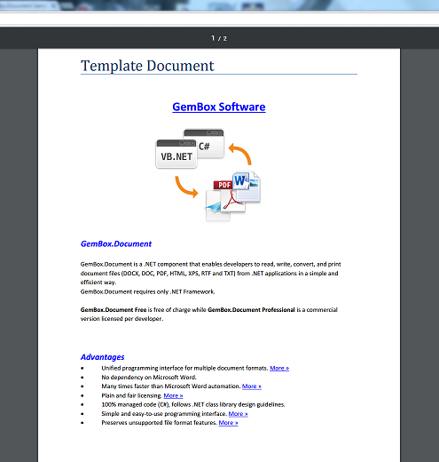

# Word Document Editor in ASP.NET using GemBox.Document
## Requires
- Visual Studio 2012
## License
- MIT
## Technologies
- ASP.NET Web Forms
## Topics
- Export to Word
- Export to Pdf
- HTML to PDF
- Converting DOCX/DOC/HTML/RTF to PDF/XPS/Image
## Updated
- 01/07/2016
## Description

This is a demonstration sample of a document editor in ASP.NET achieved with GemBox.Document Free library. Sample shows interoperability between GemBox.Document component and WYSIWYG HTML control, in particular&nbsp;CKEditor editor but it'll works seamlessly&nbsp;with
 any HTML editor as well.

GemBox.Document is a .NET component that enables us to read, write, convert and print document files (DOCX, DOC, PDF, HTML, XPS, RTF and TXT) from .NET application.

&nbsp;

<h2>Table of Contents</h2>
<ul>
<li><a href="#screenshots">Screen Shots</a>
</li><li><a href="#download">Download GemBox.Document Free</a>
</li><li><a href="#mainfeatures">Main Features</a>
</li><li><a href="#moreinfo">More Information</a>
</li></ul>

&nbsp;

<h2 id="screenshots">Screen Shots</h2>

&nbsp;

<h2 id="download">Download GemBox.Document Free</h2>

<a href="http://www.gemboxsoftware.com/document/free-version">Download GemBox.Document Free here</a>, you will receive an MSI file which is easily installed.

However it's not necessary to install GemBox.Document in order to use GemBox.Document.dll.You can just develop your application by adding a reference to the GemBox.Document.dll.

You can download GemBox.Document.dll directly from the <a href="http://www.gemboxsoftware.com/document/downloads/BugFixes.htm">
BugFixes page</a>&nbsp;or you can download it via <a href="http://www.nuget.org/packages/GemBox.Document/">
NuGet</a>.

&nbsp;

<h2 id="mainfeatures">Main Features</h2>
<ul>
<li><a href="http://www.gemboxsoftware.com/document/articles/c-sharp-vb-net-create-write-word">Creating a new Word document in ASP.NET with C#</a>
</li><li><a href="http://www.gemboxsoftware.com/document/articles/c-sharp-vb-net-create-pdf">Creating a new PDF document in ASP.NET with C#</a>
</li><li><a href="http://www.gemboxsoftware.com/document/articles/c-sharp-vb-net-convert-html-to-word">Converting between HTML document and Word document in ASP.NET with C#</a>
</li><li><a href="http://www.gemboxsoftware.com/document/articles/c-sharp-vb-net-convert-html-to-pdf">Converting a HTML document to PDF document in ASP.NET with C#</a>
</li><li><a href="http://www.gemboxsoftware.com/document/articles/asp-net-export-to-word-pdf">Exporting both Word or PDF document in ASP.NET with C#</a>
</li><li>Converting between other document formats as well, see <a href="http://www.gemboxsoftware.com/Document/help/html/Supported_File_Formats.htm">
Supported File Formats</a> </li></ul>

&nbsp;

&nbsp;

<h2 id="moreinfo">More Information</h2>

For more information visit one of the following related links.

<strong>Website:</strong> 
<a href="http://www.gemboxsoftware.com/">http://www.gemboxsoftware.com/</a>

<strong>GemBox.Document Overview:</strong> 
<a href="http://www.gemboxsoftware.com/document/overview">http://www.gemboxsoftware.com/document/overview</a>

<strong>GemBox.Document Sample Explorer:</strong> 
<a href="http://www.gemboxsoftware.com/SampleExplorer/document">http://www.gemboxsoftware.com/SampleExplorer/document</a>

<strong>GemBox.Document Help:</strong> 
<a href="http://www.gemboxsoftware.com/Document/help/html/Introduction.htm">http://www.gemboxsoftware.com/Document/help/html/Introduction.htm</a>

