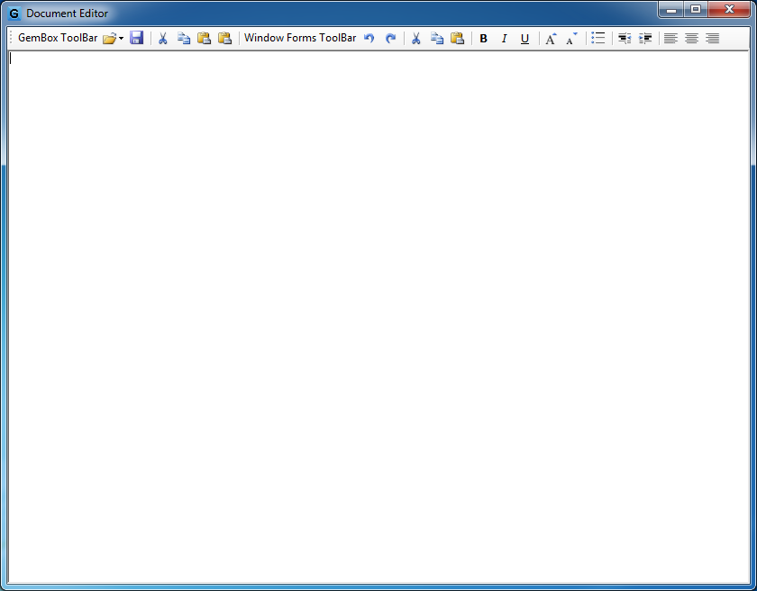

# Word Document Editor in Windows Forms using GemBox.Document
## Requires
- Visual Studio 2010
## License
- Apache License, Version 2.0
## Technologies
- C#
- Windows Forms
## Topics
- Controls
- Word Editor
- Converting DOCX/DOC/HTML/RTF to PDF/XPS/Image
## Updated
- 01/07/2016
## Description

This is a demonstration sample of a document editor in Windows Forms achieved with GemBox.Document Free library. 
Sample shows interoperability between GemBox.Document component and Windows Forms RichTextBox control via RTF format. 
Sample also implements common rich text editor functionalities and shows how to copy and paste between clipboard and GemBox.Document.

GemBox.Document is a .NET component that enables us to read, write, convert and print document files (DOCX, DOC, PDF, HTML, XPS, RTF and TXT) from .NET application. 

<h1>Table of Contents</h1>
<ul>
<li><a href="#screen-shots">Screen Shots</a>
</li><li><a href="#download-gembox-document">Download GemBox.Document Free</a>
</li><li><a href="#main-features">Main Features</a>
</li><li><a href="#more-information">More Information</a>
</li></ul>
<h1 id="screen-shots">Screen Shots</h1>

<h1 id="download-gembox-document">Download GemBox.Document Free</h1>

<a href="http://www.gemboxsoftware.com/document/free-version">Download GemBox.Document Free here</a>, you will receive an MSI file which is easily installed. Now in order to use GemBox.Document.dll we need to add reference to
 it inside our project, see the following image:

 

<h1 id="main-features">Main Features</h1>
<ul>
<li><a href="http://www.gemboxsoftware.com/document/articles/c-sharp-vb-net-create-write-word">Creating a new Word document in Windows Forms with C#</a>
</li><li><a href="http://www.gemboxsoftware.com/document/articles/c-sharp-vb-net-create-pdf">Creating a new PDF document in Windows Forms with C#</a> 
</li><li><a href="http://www.gemboxsoftware.com/document/articles/c-sharp-vb-net-open-read-word">Opening an existing Word document in Windows Forms with C#</a>
</li><li><a href="http://www.gemboxsoftware.com/document/articles/c-sharp-vb-net-edit-save-word">Editing and then saving an opened Word document in Windows Forms with C#</a>
</li><li>Converting between various document formats, <a href="http://www.gemboxsoftware.com/Document/help/html/Supported_File_Formats.htm">
see Supported File Formats</a> </li><li>Easy to enhance with more capabilities, like <a href="http://www.gemboxsoftware.com/document/articles/c-sharp-vb-net-print-word">
printing Word document in Windows Forms with C#</a> </li></ul>
<h1 id="more-information">More Information</h1>

For more information visit one of the following related links.

<strong>Website: 
</strong><a href="http://www.gemboxsoftware.com/">http://www.gemboxsoftware.com/</a>

<strong>GemBox.Document&nbsp;</strong><strong>Overview:</strong> 
<a href="http://www.gemboxsoftware.com/document/overview">http://www.gemboxsoftware.com/document/overview</a>

<strong>GemBox.Document&nbsp;</strong><strong>Sample Explorer:</strong> 
<a href="http://www.gemboxsoftware.com/SampleExplorer/document">http://www.gemboxsoftware.com/SampleExplorer/document</a>

<strong>GemBox.Document Help:</strong> 
<a href="http://www.gemboxsoftware.com/Document/help/html/Introduction.htm">http://www.gemboxsoftware.com/Document/help/html/Introduction.htm</a>

