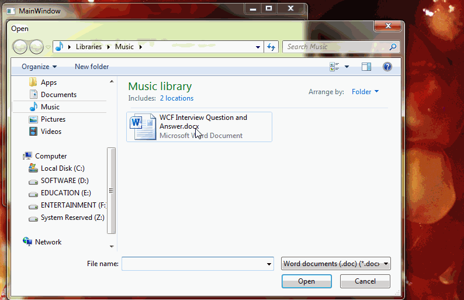

# Word Document to PDF Conversion.
## Requires
- Visual Studio 2012
## License
- Apache License, Version 2.0
## Technologies
- C#
- Windows Forms
- WPF
- Microsoft Office Word
## Topics
- COM Interop
- .NET 4.5
## Updated
- 01/09/2014
## Description

<h1>Introduction</h1>

<em>In .NET no direct support for Word Document to PDF Document Conversion.</em>

<em>This sample of application explain how to Convert Document File such as .doc,.docx to PDF Documents. It is very easy to use and understand. 
</em>

<h1>Screen</h1>

 

<h1>Building the Sample</h1>

<em>Add the following reference Assembly.</em>

<em>1) system.windows.forms</em>

<em>2)Microsoft.Office.Interop.Word</em>

<em> 
</em>

Description

<em>This Sample of application converts the .doc/.docx file to PDF document using WPF and C#. You can integrate into your application as per your requirement. With the help of this sample you can convert office file such as excel, presentation file into
 pdf in the same way.&nbsp;&nbsp;&nbsp;&nbsp;&nbsp;&nbsp;&nbsp;&nbsp;&nbsp;&nbsp;&nbsp;&nbsp;&nbsp;&nbsp;&nbsp;&nbsp;&nbsp;&nbsp;&nbsp;&nbsp;&nbsp;&nbsp;&nbsp;&nbsp;&nbsp;&nbsp;&nbsp;&nbsp;&nbsp;&nbsp;&nbsp;&nbsp;&nbsp;&nbsp;&nbsp;&nbsp;&nbsp;&nbsp;&nbsp;&nbsp;&nbsp;&nbsp;&nbsp;&nbsp;&nbsp;&nbsp;&nbsp;&nbsp;&nbsp;&nbsp;&nbsp;&nbsp;&nbsp;&nbsp;&nbsp;&nbsp;&nbsp;&nbsp;&nbsp;&nbsp;&nbsp;&nbsp;&nbsp;&nbsp;&nbsp;&nbsp;&nbsp;&nbsp;&nbsp;&nbsp;&nbsp;&nbsp;&nbsp;&nbsp;&nbsp;&nbsp;&nbsp;&nbsp;&nbsp;&nbsp;&nbsp;&nbsp;&nbsp;&nbsp;&nbsp;&nbsp;&nbsp;&nbsp;&nbsp;&nbsp;&nbsp;&nbsp;&nbsp;&nbsp;&nbsp;&nbsp;&nbsp;&nbsp;&nbsp;&nbsp;&nbsp;&nbsp;&nbsp;&nbsp;&nbsp;&nbsp;&nbsp;&nbsp;&nbsp;&nbsp;&nbsp;&nbsp;&nbsp;&nbsp;&nbsp;
 
</em>

&nbsp;Word2PDF Converter will convert any WORD document to a PDF file extension. If you have a .doc or a .docx file and you need it to be converted to a .PDF file, this program will do it simply and completely free. When you convert word to PDF free you
 will notice everything from images, text, columns, and anything else is included in the finished PDF file.

<em>&nbsp;It is easy to use and easy to integrate in your application.&nbsp;&nbsp;&nbsp;&nbsp;</em>

<em><strong>Design Process:</strong> 
</em>

<em>If you want to build this application Take one TextBox to display Source File Path Name and One Button to open the File DialogueBox. Take another TextBox to Display the Distination Path. One Button to convert the Button. Make sure that to add reference
 assembly&nbsp; &nbsp;&nbsp;&nbsp;&nbsp;&nbsp;&nbsp;&nbsp;&nbsp;&nbsp;&nbsp;&nbsp;&nbsp;&nbsp;&nbsp;&nbsp;&nbsp;&nbsp;&nbsp;&nbsp;&nbsp;&nbsp;&nbsp;
 
</em>

Include the name space.&nbsp;&nbsp;&nbsp;&nbsp;&nbsp;&nbsp;&nbsp;&nbsp;&nbsp;&nbsp;&nbsp;&nbsp;&nbsp;&nbsp;&nbsp;&nbsp;&nbsp;&nbsp;&nbsp;&nbsp;&nbsp;&nbsp;&nbsp;&nbsp;&nbsp;&nbsp;&nbsp;&nbsp;&nbsp;&nbsp;&nbsp;&nbsp;&nbsp;

&nbsp;

Visual BasicC#

Edit|Remove

vbcsharp
<pre class="hidden">Imports System.Windows
Imports Microsoft.Office.Interop.Word
Imports System.Windows.Forms</pre>
<pre class="hidden">using System;
using System.Windows;
using Microsoft.Office.Interop.Word;
using System.Windows.Forms;</pre>

<pre class="vb">Imports&nbsp;System.Windows&nbsp;
Imports&nbsp;Microsoft.Office.Interop.Word&nbsp;
Imports&nbsp;System.Windows.Forms</pre>

&nbsp;

Visual BasicC#

Edit|Remove

vbcsharp
<pre class="hidden">Public Property wordDocument() As Microsoft.Office.Interop.Word.Document
	Get
		Return m_wordDocument
	End Get
	Set
		m_wordDocument = Value
	End Set
End Property
Private m_wordDocument As Microsoft.Office.Interop.Word.Document</pre>
<pre class="hidden">public Microsoft.Office.Interop.Word.Document wordDocument { get; set; }</pre>

<pre class="vb">Public&nbsp;Property&nbsp;wordDocument()&nbsp;As&nbsp;Microsoft.Office.Interop.Word.Document&nbsp;
&nbsp;&nbsp;&nbsp;&nbsp;Get&nbsp;
&nbsp;&nbsp;&nbsp;&nbsp;&nbsp;&nbsp;&nbsp;&nbsp;Return&nbsp;m_wordDocument&nbsp;
&nbsp;&nbsp;&nbsp;&nbsp;End&nbsp;Get&nbsp;
&nbsp;&nbsp;&nbsp;&nbsp;Set&nbsp;
&nbsp;&nbsp;&nbsp;&nbsp;&nbsp;&nbsp;&nbsp;&nbsp;m_wordDocument&nbsp;=&nbsp;Value&nbsp;
&nbsp;&nbsp;&nbsp;&nbsp;End&nbsp;Set&nbsp;
End&nbsp;Property&nbsp;
Private&nbsp;m_wordDocument&nbsp;As&nbsp;Microsoft.Office.Interop.Word.Document</pre>

&nbsp;Write the following code on Browse Button Click Event.

Visual BasicC#

Edit|Remove

vbcsharp
<pre class="hidden">Private Sub btnBrowse_Click(sender As Object, e As RoutedEventArgs)
	Dim dlg As New Microsoft.Win32.OpenFileDialog()

	' Set filter for file extension and default file extension
	dlg.DefaultExt = &quot;.doc&quot;
	dlg.Filter = &quot;Word documents (.doc)|*.docx;*.doc&quot;

	' Display OpenFileDialog by calling ShowDialog method
	Dim result As Nullable(Of Boolean) = dlg.ShowDialog()

	' Get the selected file name and display in a TextBox
	If result = True Then
		' Open document
		Dim filename As String = dlg.FileName
		FileNameTextBox.Text = filename
	End If
End Sub</pre>
<pre class="hidden"> private void btnBrowse_Click(object sender, RoutedEventArgs e)
        {
            Microsoft.Win32.OpenFileDialog dlg = new Microsoft.Win32.OpenFileDialog();

            // Set filter for file extension and default file extension
            dlg.DefaultExt = &quot;.doc&quot;;
            dlg.Filter = &quot;Word documents (.doc)|*.docx;*.doc&quot;;

            // Display OpenFileDialog by calling ShowDialog method
            Nullable&lt;bool&gt; result = dlg.ShowDialog();

            // Get the selected file name and display in a TextBox
            if (result == true)
            {
                // Open document
                string filename = dlg.FileName;
                FileNameTextBox.Text = filename;
            }
        }</pre>

<pre class="vb">Private&nbsp;Sub&nbsp;btnBrowse_Click(sender&nbsp;As&nbsp;Object,&nbsp;e&nbsp;As&nbsp;RoutedEventArgs)&nbsp;
&nbsp;&nbsp;&nbsp;&nbsp;Dim&nbsp;dlg&nbsp;As&nbsp;New&nbsp;Microsoft.Win32.OpenFileDialog()&nbsp;
&nbsp;
&nbsp;&nbsp;&nbsp;&nbsp;'&nbsp;Set&nbsp;filter&nbsp;for&nbsp;file&nbsp;extension&nbsp;and&nbsp;default&nbsp;file&nbsp;extension&nbsp;
&nbsp;&nbsp;&nbsp;&nbsp;dlg.DefaultExt&nbsp;=&nbsp;&quot;.doc&quot;&nbsp;
&nbsp;&nbsp;&nbsp;&nbsp;dlg.Filter&nbsp;=&nbsp;&quot;Word&nbsp;documents&nbsp;(.doc)|*.docx;*.doc&quot;&nbsp;
&nbsp;
&nbsp;&nbsp;&nbsp;&nbsp;'&nbsp;Display&nbsp;OpenFileDialog&nbsp;by&nbsp;calling&nbsp;ShowDialog&nbsp;method&nbsp;
&nbsp;&nbsp;&nbsp;&nbsp;Dim&nbsp;result&nbsp;As&nbsp;Nullable(Of&nbsp;Boolean)&nbsp;=&nbsp;dlg.ShowDialog()&nbsp;
&nbsp;
&nbsp;&nbsp;&nbsp;&nbsp;'&nbsp;Get&nbsp;the&nbsp;selected&nbsp;file&nbsp;name&nbsp;and&nbsp;display&nbsp;in&nbsp;a&nbsp;TextBox&nbsp;
&nbsp;&nbsp;&nbsp;&nbsp;If&nbsp;result&nbsp;=&nbsp;True&nbsp;Then&nbsp;
&nbsp;&nbsp;&nbsp;&nbsp;&nbsp;&nbsp;&nbsp;&nbsp;'&nbsp;Open&nbsp;document&nbsp;
&nbsp;&nbsp;&nbsp;&nbsp;&nbsp;&nbsp;&nbsp;&nbsp;Dim&nbsp;filename&nbsp;As&nbsp;String&nbsp;=&nbsp;dlg.FileName&nbsp;
&nbsp;&nbsp;&nbsp;&nbsp;&nbsp;&nbsp;&nbsp;&nbsp;FileNameTextBox.Text&nbsp;=&nbsp;filename&nbsp;
&nbsp;&nbsp;&nbsp;&nbsp;End&nbsp;If&nbsp;
End&nbsp;Sub</pre>

&nbsp;Write the following code on convert button click event.

&nbsp;

Visual BasicC#

Edit|Remove

vbcsharp
<pre class="hidden">Private Sub btnConvert_Click(sender As Object, e As RoutedEventArgs)
	Dim appWord As New Microsoft.Office.Interop.Word.Application()
	wordDocument = appWord.Documents.Open(FileNameTextBox.Text)
	Dim sfd As New SaveFileDialog()
	sfd.Filter = &quot;PDF Documents|*.pdf&quot;
	Try
		If sfd.ShowDialog() = System.Windows.Forms.DialogResult.OK Then
			Dim ext As String = System.IO.Path.GetExtension(sfd.FileName)
			Select Case ext
				Case &quot;.pdf&quot;
					wordDocument.ExportAsFixedFormat(sfd.FileName, WdExportFormat.wdExportFormatPDF)
					Exit Select

			End Select
			pdfFileName.Text = sfd.FileName
		End If
		System.Windows.Forms.MessageBox.Show(&quot;File Converted Successfully..&quot;)
	Catch ex As Exception
		System.Windows.Forms.MessageBox.Show(ex.Message)
	End Try
	System.Diagnostics.Process.Start(sfd.FileName)
End Sub</pre>
<pre class="hidden">private void btnConvert_Click(object sender, RoutedEventArgs e)
        {
            Microsoft.Office.Interop.Word.Application appWord = new Microsoft.Office.Interop.Word.Application();
            wordDocument = appWord.Documents.Open(FileNameTextBox.Text);
            SaveFileDialog sfd = new SaveFileDialog();
            sfd.Filter = &quot;PDF Documents|*.pdf&quot;;
            try
            {
                if (sfd.ShowDialog() == System.Windows.Forms.DialogResult.OK)
                {
                    string ext = System.IO.Path.GetExtension(sfd.FileName);
                    switch (ext)
                    {
                        case &quot;.pdf&quot;:
                            wordDocument.ExportAsFixedFormat(sfd.FileName, WdExportFormat.wdExportFormatPDF);
                            break;
                       
                    }
                    pdfFileName.Text = sfd.FileName;
                }
                System.Windows.Forms.MessageBox.Show(&quot;File Converted Successfully..&quot;);
            }
            catch (Exception ex)
            {
                System.Windows.Forms.MessageBox.Show(ex.Message);
            }
            System.Diagnostics.Process.Start(sfd.FileName);
        }</pre>

<pre class="vb">Private&nbsp;Sub&nbsp;btnConvert_Click(sender&nbsp;As&nbsp;Object,&nbsp;e&nbsp;As&nbsp;RoutedEventArgs)&nbsp;
&nbsp;&nbsp;&nbsp;&nbsp;Dim&nbsp;appWord&nbsp;As&nbsp;New&nbsp;Microsoft.Office.Interop.Word.Application()&nbsp;
&nbsp;&nbsp;&nbsp;&nbsp;wordDocument&nbsp;=&nbsp;appWord.Documents.Open(FileNameTextBox.Text)&nbsp;
&nbsp;&nbsp;&nbsp;&nbsp;Dim&nbsp;sfd&nbsp;As&nbsp;New&nbsp;SaveFileDialog()&nbsp;
&nbsp;&nbsp;&nbsp;&nbsp;sfd.Filter&nbsp;=&nbsp;&quot;PDF&nbsp;Documents|*.pdf&quot;&nbsp;
&nbsp;&nbsp;&nbsp;&nbsp;Try&nbsp;
&nbsp;&nbsp;&nbsp;&nbsp;&nbsp;&nbsp;&nbsp;&nbsp;If&nbsp;sfd.ShowDialog()&nbsp;=&nbsp;System.Windows.Forms.DialogResult.OK&nbsp;Then&nbsp;
&nbsp;&nbsp;&nbsp;&nbsp;&nbsp;&nbsp;&nbsp;&nbsp;&nbsp;&nbsp;&nbsp;&nbsp;Dim&nbsp;ext&nbsp;As&nbsp;String&nbsp;=&nbsp;System.IO.Path.GetExtension(sfd.FileName)&nbsp;
&nbsp;&nbsp;&nbsp;&nbsp;&nbsp;&nbsp;&nbsp;&nbsp;&nbsp;&nbsp;&nbsp;&nbsp;Select&nbsp;Case&nbsp;ext&nbsp;
&nbsp;&nbsp;&nbsp;&nbsp;&nbsp;&nbsp;&nbsp;&nbsp;&nbsp;&nbsp;&nbsp;&nbsp;&nbsp;&nbsp;&nbsp;&nbsp;Case&nbsp;&quot;.pdf&quot;&nbsp;
&nbsp;&nbsp;&nbsp;&nbsp;&nbsp;&nbsp;&nbsp;&nbsp;&nbsp;&nbsp;&nbsp;&nbsp;&nbsp;&nbsp;&nbsp;&nbsp;&nbsp;&nbsp;&nbsp;&nbsp;wordDocument.ExportAsFixedFormat(sfd.FileName,&nbsp;WdExportFormat.wdExportFormatPDF)&nbsp;
&nbsp;&nbsp;&nbsp;&nbsp;&nbsp;&nbsp;&nbsp;&nbsp;&nbsp;&nbsp;&nbsp;&nbsp;&nbsp;&nbsp;&nbsp;&nbsp;&nbsp;&nbsp;&nbsp;&nbsp;Exit&nbsp;Select&nbsp;
&nbsp;
&nbsp;&nbsp;&nbsp;&nbsp;&nbsp;&nbsp;&nbsp;&nbsp;&nbsp;&nbsp;&nbsp;&nbsp;End&nbsp;Select&nbsp;
&nbsp;&nbsp;&nbsp;&nbsp;&nbsp;&nbsp;&nbsp;&nbsp;&nbsp;&nbsp;&nbsp;&nbsp;pdfFileName.Text&nbsp;=&nbsp;sfd.FileName&nbsp;
&nbsp;&nbsp;&nbsp;&nbsp;&nbsp;&nbsp;&nbsp;&nbsp;End&nbsp;If&nbsp;
&nbsp;&nbsp;&nbsp;&nbsp;&nbsp;&nbsp;&nbsp;&nbsp;System.Windows.Forms.MessageBox.Show(&quot;File&nbsp;Converted&nbsp;Successfully..&quot;)&nbsp;
&nbsp;&nbsp;&nbsp;&nbsp;Catch&nbsp;ex&nbsp;As&nbsp;Exception&nbsp;
&nbsp;&nbsp;&nbsp;&nbsp;&nbsp;&nbsp;&nbsp;&nbsp;System.Windows.Forms.MessageBox.Show(ex.Message)&nbsp;
&nbsp;&nbsp;&nbsp;&nbsp;End&nbsp;Try&nbsp;
&nbsp;&nbsp;&nbsp;&nbsp;System.Diagnostics.Process.Start(sfd.FileName)&nbsp;
End&nbsp;Sub</pre>

<h1>Source Code Files</h1>
<ul>
<li><a id="106818" href="/windowsdesktop/site/view/file/106818/1/DOC2PDF.zip">DOC2PDF.zip</a>
</li></ul>
<h1>More Information</h1>

<em>For more information on X, see ...?</em>

