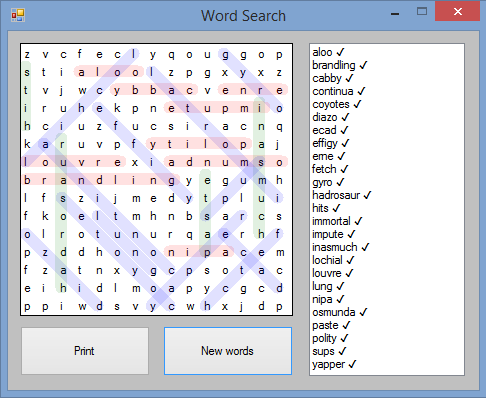

# WordSearch Game
## Requires
- Visual Studio 2008
## License
- MIT
## Technologies
- vb2008
## Topics
- Word game
## Updated
- 03/03/2017
## Description

&nbsp;

This is a WordSearch game, intended for playing either at your computer, or alternatively you can print it out and play in the traditional fashion with pen and paper. Each new game uses twenty five random words chosen from a
 46K&#43; word list. Any single line (horizontal, vertical, or diagonal) in a letter grid may contain more than one word but no two words in a single line will overlap. Words may be as spelled in the listbox or reversed.

&nbsp; 
The letter grid used in this game is an extended DataGridView. This allows DoubleBuffering and restricting user selections, so mouse input can be used for highlighting words in any direction.

 
Clicking on a cell, or tabbing the focus to the DataGridView doesn't show any visible focus.&nbsp;

 
Holding the left mouse button down on the DataGridView and dragging to another cell causes a yellow rubber band highlighting line to be drawn. Releasing the mousebutton will change the color of the highlighting line, and make that
 a permanent line, &nbsp;if you have selected a valid line.&nbsp;

 
If the letters you have highlighted form a word that is listed in the listbox, that item will be ticked in the listbox.

 
Writing a game in VB.Net is similar to writing any program in VB.Net, except where you need to be a little creative with the Controls you use.When designing your game, you need to look at which available Controls have behaviour
 that you could use. If those Controls have other behaviour that is not useful, or even a hindrance in your game, you need to work out ways to remove or modify that behaviour.This was a problem when designing this game. By default, the DataGridView responds
 to mouse input by highlighting a cell or a range of cells. This was a hindrance in this game. As well as being unsightly, it was dramatically reducing the drawing speed of the DataGridView which was making the game unresponsive.

 
So my tip for VB.Net game developers, but also applies to any VB.Net program developer, is to ask yourself: How can you use the available Controls?

