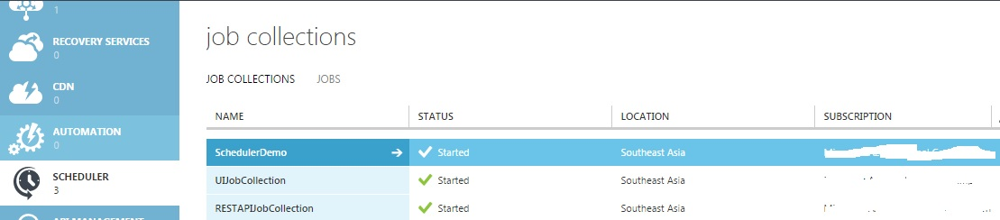

# Working with Azure Scheduler using .Net SDK
## Requires
- Visual Studio 2013
## License
- Apache License, Version 2.0
## Technologies
- Microsoft Azure
## Topics
- Azure Scheduler
## Updated
- 11/04/2014
## Description

<h1>Introduction</h1>
<h2>Create jobs that run on your schedule</h2>

Azure Scheduler lets you create jobs in the cloud that reliably invoke services inside and outside of Azure&mdash;such as calling HTTP/S endpoints or posting messages to Azure Storage queues. You can choose to run jobs right away, on a recurring schedule,
 or at some point in the future.

<h2>Ideal for recurring actions, daily maintenance, developers</h2>

Azure Scheduler is great for recurring actions&mdash;for example, periodically gathering data from Twitter into a feed. It&rsquo;s also ideal for cleaning up logs, kicking off routine backups, and other application maintenance tasks. Developers can also
 integrate Scheduler into their applications.

<h2>Designed for high availability, reliability</h2>

Scheduler is designed to operate even in the face of network, machine, and datacenter failures, so your scheduled jobs continue to execute on time. It can automatically switch to an alternative datacenter in the same region if needed. Users can also configure
 alternate endpoints, in case their main endpoint becomes unavailable.

<h2>Create asynchronous jobs using queues</h2>

Scheduler can also post messages to <a href="http://azure.microsoft.com/en-us/documentation/articles/storage-dotnet-how-to-use-queues/">
Azure Storage queues</a> for asynchronous processing of recurring requests. This is useful for complex or long-running requests&mdash;such as a series of SQL queries against a large database&mdash;and when you want to invoke a service that&rsquo;s offline

&nbsp;

&nbsp;Before Starting Sample Creation , We need Azure Certificate for given Subcription. Use below steps to get that:

Have a Subscription ready.

Open Azure Powershell and excute below commands:

<ul>
<li>

The <strong>Get-AzurePublishSettingsFile</strong> cmdlet opens a web page on the Azure Management Portal, from which you can download the subscription information. The information is contained in a .publishsettings file.

</li><li>

The <strong>Import-AzurePublishSettingsFile</strong> imports the .publishsettings file for use by the module. This file includes a management certificate that has security credentials.&nbsp;

</li></ul>

Once done retrive ThumbPrint from Management Portal like below:

<em>&nbsp; &nbsp;</em>

Now Create C# Console Application and Add below Package for Azure Scheduler:

&gt;install-package&nbsp;Microsoft.WindowsAzure.Management.Scheduler.

Then add below code &nbsp;and references:

using System.Security.Cryptography.X509Certificates;using Microsoft.WindowsAzure;

using Microsoft.WindowsAzure.Management;using Microsoft.WindowsAzure.Scheduler;

using Microsoft.WindowsAzure.Scheduler.Models;using Microsoft.WindowsAzure.Management.Scheduler;

using Microsoft.WindowsAzure.Common.Internals;using Microsoft.WindowsAzure.Management.Scheduler.Models;

C#

Edit|Remove

csharp
<pre class="hidden">var store = new X509Store(StoreName.My, StoreLocation.CurrentUser);
            store.Open(OpenFlags.ReadWrite);
            var certificate = store.Certificates.Find(X509FindType.FindByThumbprint, &quot;&lt;ThumbPrint&gt;&quot;, false)[0];
            store.Close();
            //
            // create management credencials and cloud service management client
            var credentials = new CertificateCloudCredentials(&quot;8cb918af-59d0-4b24-893c-15661d048f16&quot;, certificate);
            var cloudServiceMgmCli = new CloudServiceManagementClient(credentials);

            // create cloud service
            var cloudServiceCreateParameters = new CloudServiceCreateParameters()
            {
                Description = &quot;schedulerdemo1&quot;,
                Email = &quot;microsoft.com&quot;,
                GeoRegion = &quot;Southeast Asia&quot;,
                Label = &quot;schedulerdemo1&quot;
            };
            var cloudService = cloudServiceMgmCli.CloudServices.Create(&quot;schedulerdemo1&quot;, cloudServiceCreateParameters);
            // create job collection
            var schedulerMgmCli = new SchedulerManagementClient(credentials);
            var jobCollectionIntrinsicSettings = new JobCollectionIntrinsicSettings()
            {
                Plan = JobCollectionPlan.Free,
                Quota = new JobCollectionQuota()
                {
                    MaxJobCount = 5,
                    MaxJobOccurrence = 1,
                    MaxRecurrence = new JobCollectionMaxRecurrence()
                     {
                         Frequency = JobCollectionRecurrenceFrequency.Hour,
                         Interval = 1
                     }
                }
            };
            var jobCollectionCreateParameters = new JobCollectionCreateParameters()
            {
                IntrinsicSettings = jobCollectionIntrinsicSettings,
                Label = &quot;jc1&quot;
            };
            var jobCollectionCreateResponse = schedulerMgmCli.JobCollections.Create(&quot;schedulerdemo1&quot;, &quot;jc1&quot;, jobCollectionCreateParameters);

            var schedulerClient = new SchedulerClient(&quot;schedulerdemo1&quot;, &quot;jc1&quot;, credentials);
            var jobAction = new JobAction()
            {
                Type = JobActionType.Http,
                Request = new JobHttpRequest()
                {
                    Uri = new Uri(&quot;http://blog.shaunxu.me&quot;),
                    Method = &quot;GET&quot;
                }
            };
            var jobRecurrence = new JobRecurrence()
            {
                Frequency = JobRecurrenceFrequency.Hour,
                Interval = 1
            };
            var jobCreateOrUpdateParameters = new JobCreateOrUpdateParameters()
            {
                Action = jobAction,
                Recurrence = jobRecurrence
            };
            var jobCreateResponse = schedulerClient.Jobs.CreateOrUpdate(&quot;poll_blog&quot;, jobCreateOrUpdateParameters);

            var jobGetHistoryParameters = new JobGetHistoryParameters()
                 {
                     Skip = 0,
                     Top = 100
                 };
            var history = schedulerClient.Jobs.GetHistory(&quot;poll_blog&quot;, jobGetHistoryParameters);
            foreach (var action in history)
            {
                Console.WriteLine(&quot;{0}\t{1}\t{2}\t{3}\t{4}&quot;, action.Status, action.Message, action.RetryCount, action.RepeatCount, action.Timestamp);
            }
</pre>

<pre class="csharp">var&nbsp;store&nbsp;=&nbsp;new&nbsp;X509Store(StoreName.My,&nbsp;StoreLocation.CurrentUser);&nbsp;
&nbsp;&nbsp;&nbsp;&nbsp;&nbsp;&nbsp;&nbsp;&nbsp;&nbsp;&nbsp;&nbsp;&nbsp;store.Open(OpenFlags.ReadWrite);&nbsp;
&nbsp;&nbsp;&nbsp;&nbsp;&nbsp;&nbsp;&nbsp;&nbsp;&nbsp;&nbsp;&nbsp;&nbsp;var&nbsp;certificate&nbsp;=&nbsp;store.Certificates.Find(X509FindType.FindByThumbprint,&nbsp;&quot;&lt;ThumbPrint&gt;&quot;,&nbsp;false)[0];&nbsp;
&nbsp;&nbsp;&nbsp;&nbsp;&nbsp;&nbsp;&nbsp;&nbsp;&nbsp;&nbsp;&nbsp;&nbsp;store.Close();&nbsp;
&nbsp;&nbsp;&nbsp;&nbsp;&nbsp;&nbsp;&nbsp;&nbsp;&nbsp;&nbsp;&nbsp;&nbsp;//&nbsp;
&nbsp;&nbsp;&nbsp;&nbsp;&nbsp;&nbsp;&nbsp;&nbsp;&nbsp;&nbsp;&nbsp;&nbsp;//&nbsp;create&nbsp;management&nbsp;credencials&nbsp;and&nbsp;cloud&nbsp;service&nbsp;management&nbsp;client&nbsp;
&nbsp;&nbsp;&nbsp;&nbsp;&nbsp;&nbsp;&nbsp;&nbsp;&nbsp;&nbsp;&nbsp;&nbsp;var&nbsp;credentials&nbsp;=&nbsp;new&nbsp;CertificateCloudCredentials(&quot;8cb918af-59d0-4b24-893c-15661d048f16&quot;,&nbsp;certificate);&nbsp;
&nbsp;&nbsp;&nbsp;&nbsp;&nbsp;&nbsp;&nbsp;&nbsp;&nbsp;&nbsp;&nbsp;&nbsp;var&nbsp;cloudServiceMgmCli&nbsp;=&nbsp;new&nbsp;CloudServiceManagementClient(credentials);&nbsp;
&nbsp;
&nbsp;&nbsp;&nbsp;&nbsp;&nbsp;&nbsp;&nbsp;&nbsp;&nbsp;&nbsp;&nbsp;&nbsp;//&nbsp;create&nbsp;cloud&nbsp;service&nbsp;
&nbsp;&nbsp;&nbsp;&nbsp;&nbsp;&nbsp;&nbsp;&nbsp;&nbsp;&nbsp;&nbsp;&nbsp;var&nbsp;cloudServiceCreateParameters&nbsp;=&nbsp;new&nbsp;CloudServiceCreateParameters()&nbsp;
&nbsp;&nbsp;&nbsp;&nbsp;&nbsp;&nbsp;&nbsp;&nbsp;&nbsp;&nbsp;&nbsp;&nbsp;{&nbsp;
&nbsp;&nbsp;&nbsp;&nbsp;&nbsp;&nbsp;&nbsp;&nbsp;&nbsp;&nbsp;&nbsp;&nbsp;&nbsp;&nbsp;&nbsp;&nbsp;Description&nbsp;=&nbsp;&quot;schedulerdemo1&quot;,&nbsp;
&nbsp;&nbsp;&nbsp;&nbsp;&nbsp;&nbsp;&nbsp;&nbsp;&nbsp;&nbsp;&nbsp;&nbsp;&nbsp;&nbsp;&nbsp;&nbsp;Email&nbsp;=&nbsp;&quot;microsoft.com&quot;,&nbsp;
&nbsp;&nbsp;&nbsp;&nbsp;&nbsp;&nbsp;&nbsp;&nbsp;&nbsp;&nbsp;&nbsp;&nbsp;&nbsp;&nbsp;&nbsp;&nbsp;GeoRegion&nbsp;=&nbsp;&quot;Southeast&nbsp;Asia&quot;,&nbsp;
&nbsp;&nbsp;&nbsp;&nbsp;&nbsp;&nbsp;&nbsp;&nbsp;&nbsp;&nbsp;&nbsp;&nbsp;&nbsp;&nbsp;&nbsp;&nbsp;Label&nbsp;=&nbsp;&quot;schedulerdemo1&quot;&nbsp;
&nbsp;&nbsp;&nbsp;&nbsp;&nbsp;&nbsp;&nbsp;&nbsp;&nbsp;&nbsp;&nbsp;&nbsp;};&nbsp;
&nbsp;&nbsp;&nbsp;&nbsp;&nbsp;&nbsp;&nbsp;&nbsp;&nbsp;&nbsp;&nbsp;&nbsp;var&nbsp;cloudService&nbsp;=&nbsp;cloudServiceMgmCli.CloudServices.Create(&quot;schedulerdemo1&quot;,&nbsp;cloudServiceCreateParameters);&nbsp;
&nbsp;&nbsp;&nbsp;&nbsp;&nbsp;&nbsp;&nbsp;&nbsp;&nbsp;&nbsp;&nbsp;&nbsp;//&nbsp;create&nbsp;job&nbsp;collection&nbsp;
&nbsp;&nbsp;&nbsp;&nbsp;&nbsp;&nbsp;&nbsp;&nbsp;&nbsp;&nbsp;&nbsp;&nbsp;var&nbsp;schedulerMgmCli&nbsp;=&nbsp;new&nbsp;SchedulerManagementClient(credentials);&nbsp;
&nbsp;&nbsp;&nbsp;&nbsp;&nbsp;&nbsp;&nbsp;&nbsp;&nbsp;&nbsp;&nbsp;&nbsp;var&nbsp;jobCollectionIntrinsicSettings&nbsp;=&nbsp;new&nbsp;JobCollectionIntrinsicSettings()&nbsp;
&nbsp;&nbsp;&nbsp;&nbsp;&nbsp;&nbsp;&nbsp;&nbsp;&nbsp;&nbsp;&nbsp;&nbsp;{&nbsp;
&nbsp;&nbsp;&nbsp;&nbsp;&nbsp;&nbsp;&nbsp;&nbsp;&nbsp;&nbsp;&nbsp;&nbsp;&nbsp;&nbsp;&nbsp;&nbsp;Plan&nbsp;=&nbsp;JobCollectionPlan.Free,&nbsp;
&nbsp;&nbsp;&nbsp;&nbsp;&nbsp;&nbsp;&nbsp;&nbsp;&nbsp;&nbsp;&nbsp;&nbsp;&nbsp;&nbsp;&nbsp;&nbsp;Quota&nbsp;=&nbsp;new&nbsp;JobCollectionQuota()&nbsp;
&nbsp;&nbsp;&nbsp;&nbsp;&nbsp;&nbsp;&nbsp;&nbsp;&nbsp;&nbsp;&nbsp;&nbsp;&nbsp;&nbsp;&nbsp;&nbsp;{&nbsp;
&nbsp;&nbsp;&nbsp;&nbsp;&nbsp;&nbsp;&nbsp;&nbsp;&nbsp;&nbsp;&nbsp;&nbsp;&nbsp;&nbsp;&nbsp;&nbsp;&nbsp;&nbsp;&nbsp;&nbsp;MaxJobCount&nbsp;=&nbsp;5,&nbsp;
&nbsp;&nbsp;&nbsp;&nbsp;&nbsp;&nbsp;&nbsp;&nbsp;&nbsp;&nbsp;&nbsp;&nbsp;&nbsp;&nbsp;&nbsp;&nbsp;&nbsp;&nbsp;&nbsp;&nbsp;MaxJobOccurrence&nbsp;=&nbsp;1,&nbsp;
&nbsp;&nbsp;&nbsp;&nbsp;&nbsp;&nbsp;&nbsp;&nbsp;&nbsp;&nbsp;&nbsp;&nbsp;&nbsp;&nbsp;&nbsp;&nbsp;&nbsp;&nbsp;&nbsp;&nbsp;MaxRecurrence&nbsp;=&nbsp;new&nbsp;JobCollectionMaxRecurrence()&nbsp;
&nbsp;&nbsp;&nbsp;&nbsp;&nbsp;&nbsp;&nbsp;&nbsp;&nbsp;&nbsp;&nbsp;&nbsp;&nbsp;&nbsp;&nbsp;&nbsp;&nbsp;&nbsp;&nbsp;&nbsp;&nbsp;{&nbsp;
&nbsp;&nbsp;&nbsp;&nbsp;&nbsp;&nbsp;&nbsp;&nbsp;&nbsp;&nbsp;&nbsp;&nbsp;&nbsp;&nbsp;&nbsp;&nbsp;&nbsp;&nbsp;&nbsp;&nbsp;&nbsp;&nbsp;&nbsp;&nbsp;&nbsp;Frequency&nbsp;=&nbsp;JobCollectionRecurrenceFrequency.Hour,&nbsp;
&nbsp;&nbsp;&nbsp;&nbsp;&nbsp;&nbsp;&nbsp;&nbsp;&nbsp;&nbsp;&nbsp;&nbsp;&nbsp;&nbsp;&nbsp;&nbsp;&nbsp;&nbsp;&nbsp;&nbsp;&nbsp;&nbsp;&nbsp;&nbsp;&nbsp;Interval&nbsp;=&nbsp;1&nbsp;
&nbsp;&nbsp;&nbsp;&nbsp;&nbsp;&nbsp;&nbsp;&nbsp;&nbsp;&nbsp;&nbsp;&nbsp;&nbsp;&nbsp;&nbsp;&nbsp;&nbsp;&nbsp;&nbsp;&nbsp;&nbsp;}&nbsp;
&nbsp;&nbsp;&nbsp;&nbsp;&nbsp;&nbsp;&nbsp;&nbsp;&nbsp;&nbsp;&nbsp;&nbsp;&nbsp;&nbsp;&nbsp;&nbsp;}&nbsp;
&nbsp;&nbsp;&nbsp;&nbsp;&nbsp;&nbsp;&nbsp;&nbsp;&nbsp;&nbsp;&nbsp;&nbsp;};&nbsp;
&nbsp;&nbsp;&nbsp;&nbsp;&nbsp;&nbsp;&nbsp;&nbsp;&nbsp;&nbsp;&nbsp;&nbsp;var&nbsp;jobCollectionCreateParameters&nbsp;=&nbsp;new&nbsp;JobCollectionCreateParameters()&nbsp;
&nbsp;&nbsp;&nbsp;&nbsp;&nbsp;&nbsp;&nbsp;&nbsp;&nbsp;&nbsp;&nbsp;&nbsp;{&nbsp;
&nbsp;&nbsp;&nbsp;&nbsp;&nbsp;&nbsp;&nbsp;&nbsp;&nbsp;&nbsp;&nbsp;&nbsp;&nbsp;&nbsp;&nbsp;&nbsp;IntrinsicSettings&nbsp;=&nbsp;jobCollectionIntrinsicSettings,&nbsp;
&nbsp;&nbsp;&nbsp;&nbsp;&nbsp;&nbsp;&nbsp;&nbsp;&nbsp;&nbsp;&nbsp;&nbsp;&nbsp;&nbsp;&nbsp;&nbsp;Label&nbsp;=&nbsp;&quot;jc1&quot;&nbsp;
&nbsp;&nbsp;&nbsp;&nbsp;&nbsp;&nbsp;&nbsp;&nbsp;&nbsp;&nbsp;&nbsp;&nbsp;};&nbsp;
&nbsp;&nbsp;&nbsp;&nbsp;&nbsp;&nbsp;&nbsp;&nbsp;&nbsp;&nbsp;&nbsp;&nbsp;var&nbsp;jobCollectionCreateResponse&nbsp;=&nbsp;schedulerMgmCli.JobCollections.Create(&quot;schedulerdemo1&quot;,&nbsp;&quot;jc1&quot;,&nbsp;jobCollectionCreateParameters);&nbsp;
&nbsp;
&nbsp;&nbsp;&nbsp;&nbsp;&nbsp;&nbsp;&nbsp;&nbsp;&nbsp;&nbsp;&nbsp;&nbsp;var&nbsp;schedulerClient&nbsp;=&nbsp;new&nbsp;SchedulerClient(&quot;schedulerdemo1&quot;,&nbsp;&quot;jc1&quot;,&nbsp;credentials);&nbsp;
&nbsp;&nbsp;&nbsp;&nbsp;&nbsp;&nbsp;&nbsp;&nbsp;&nbsp;&nbsp;&nbsp;&nbsp;var&nbsp;jobAction&nbsp;=&nbsp;new&nbsp;JobAction()&nbsp;
&nbsp;&nbsp;&nbsp;&nbsp;&nbsp;&nbsp;&nbsp;&nbsp;&nbsp;&nbsp;&nbsp;&nbsp;{&nbsp;
&nbsp;&nbsp;&nbsp;&nbsp;&nbsp;&nbsp;&nbsp;&nbsp;&nbsp;&nbsp;&nbsp;&nbsp;&nbsp;&nbsp;&nbsp;&nbsp;Type&nbsp;=&nbsp;JobActionType.Http,&nbsp;
&nbsp;&nbsp;&nbsp;&nbsp;&nbsp;&nbsp;&nbsp;&nbsp;&nbsp;&nbsp;&nbsp;&nbsp;&nbsp;&nbsp;&nbsp;&nbsp;Request&nbsp;=&nbsp;new&nbsp;JobHttpRequest()&nbsp;
&nbsp;&nbsp;&nbsp;&nbsp;&nbsp;&nbsp;&nbsp;&nbsp;&nbsp;&nbsp;&nbsp;&nbsp;&nbsp;&nbsp;&nbsp;&nbsp;{&nbsp;
&nbsp;&nbsp;&nbsp;&nbsp;&nbsp;&nbsp;&nbsp;&nbsp;&nbsp;&nbsp;&nbsp;&nbsp;&nbsp;&nbsp;&nbsp;&nbsp;&nbsp;&nbsp;&nbsp;&nbsp;Uri&nbsp;=&nbsp;new&nbsp;Uri(&quot;http://blog.shaunxu.me&quot;),&nbsp;
&nbsp;&nbsp;&nbsp;&nbsp;&nbsp;&nbsp;&nbsp;&nbsp;&nbsp;&nbsp;&nbsp;&nbsp;&nbsp;&nbsp;&nbsp;&nbsp;&nbsp;&nbsp;&nbsp;&nbsp;Method&nbsp;=&nbsp;&quot;GET&quot;&nbsp;
&nbsp;&nbsp;&nbsp;&nbsp;&nbsp;&nbsp;&nbsp;&nbsp;&nbsp;&nbsp;&nbsp;&nbsp;&nbsp;&nbsp;&nbsp;&nbsp;}&nbsp;
&nbsp;&nbsp;&nbsp;&nbsp;&nbsp;&nbsp;&nbsp;&nbsp;&nbsp;&nbsp;&nbsp;&nbsp;};&nbsp;
&nbsp;&nbsp;&nbsp;&nbsp;&nbsp;&nbsp;&nbsp;&nbsp;&nbsp;&nbsp;&nbsp;&nbsp;var&nbsp;jobRecurrence&nbsp;=&nbsp;new&nbsp;JobRecurrence()&nbsp;
&nbsp;&nbsp;&nbsp;&nbsp;&nbsp;&nbsp;&nbsp;&nbsp;&nbsp;&nbsp;&nbsp;&nbsp;{&nbsp;
&nbsp;&nbsp;&nbsp;&nbsp;&nbsp;&nbsp;&nbsp;&nbsp;&nbsp;&nbsp;&nbsp;&nbsp;&nbsp;&nbsp;&nbsp;&nbsp;Frequency&nbsp;=&nbsp;JobRecurrenceFrequency.Hour,&nbsp;
&nbsp;&nbsp;&nbsp;&nbsp;&nbsp;&nbsp;&nbsp;&nbsp;&nbsp;&nbsp;&nbsp;&nbsp;&nbsp;&nbsp;&nbsp;&nbsp;Interval&nbsp;=&nbsp;1&nbsp;
&nbsp;&nbsp;&nbsp;&nbsp;&nbsp;&nbsp;&nbsp;&nbsp;&nbsp;&nbsp;&nbsp;&nbsp;};&nbsp;
&nbsp;&nbsp;&nbsp;&nbsp;&nbsp;&nbsp;&nbsp;&nbsp;&nbsp;&nbsp;&nbsp;&nbsp;var&nbsp;jobCreateOrUpdateParameters&nbsp;=&nbsp;new&nbsp;JobCreateOrUpdateParameters()&nbsp;
&nbsp;&nbsp;&nbsp;&nbsp;&nbsp;&nbsp;&nbsp;&nbsp;&nbsp;&nbsp;&nbsp;&nbsp;{&nbsp;
&nbsp;&nbsp;&nbsp;&nbsp;&nbsp;&nbsp;&nbsp;&nbsp;&nbsp;&nbsp;&nbsp;&nbsp;&nbsp;&nbsp;&nbsp;&nbsp;Action&nbsp;=&nbsp;jobAction,&nbsp;
&nbsp;&nbsp;&nbsp;&nbsp;&nbsp;&nbsp;&nbsp;&nbsp;&nbsp;&nbsp;&nbsp;&nbsp;&nbsp;&nbsp;&nbsp;&nbsp;Recurrence&nbsp;=&nbsp;jobRecurrence&nbsp;
&nbsp;&nbsp;&nbsp;&nbsp;&nbsp;&nbsp;&nbsp;&nbsp;&nbsp;&nbsp;&nbsp;&nbsp;};&nbsp;
&nbsp;&nbsp;&nbsp;&nbsp;&nbsp;&nbsp;&nbsp;&nbsp;&nbsp;&nbsp;&nbsp;&nbsp;var&nbsp;jobCreateResponse&nbsp;=&nbsp;schedulerClient.Jobs.CreateOrUpdate(&quot;poll_blog&quot;,&nbsp;jobCreateOrUpdateParameters);&nbsp;
&nbsp;
&nbsp;&nbsp;&nbsp;&nbsp;&nbsp;&nbsp;&nbsp;&nbsp;&nbsp;&nbsp;&nbsp;&nbsp;var&nbsp;jobGetHistoryParameters&nbsp;=&nbsp;new&nbsp;JobGetHistoryParameters()&nbsp;
&nbsp;&nbsp;&nbsp;&nbsp;&nbsp;&nbsp;&nbsp;&nbsp;&nbsp;&nbsp;&nbsp;&nbsp;&nbsp;&nbsp;&nbsp;&nbsp;&nbsp;{&nbsp;
&nbsp;&nbsp;&nbsp;&nbsp;&nbsp;&nbsp;&nbsp;&nbsp;&nbsp;&nbsp;&nbsp;&nbsp;&nbsp;&nbsp;&nbsp;&nbsp;&nbsp;&nbsp;&nbsp;&nbsp;&nbsp;Skip&nbsp;=&nbsp;0,&nbsp;
&nbsp;&nbsp;&nbsp;&nbsp;&nbsp;&nbsp;&nbsp;&nbsp;&nbsp;&nbsp;&nbsp;&nbsp;&nbsp;&nbsp;&nbsp;&nbsp;&nbsp;&nbsp;&nbsp;&nbsp;&nbsp;Top&nbsp;=&nbsp;100&nbsp;
&nbsp;&nbsp;&nbsp;&nbsp;&nbsp;&nbsp;&nbsp;&nbsp;&nbsp;&nbsp;&nbsp;&nbsp;&nbsp;&nbsp;&nbsp;&nbsp;&nbsp;};&nbsp;
&nbsp;&nbsp;&nbsp;&nbsp;&nbsp;&nbsp;&nbsp;&nbsp;&nbsp;&nbsp;&nbsp;&nbsp;var&nbsp;history&nbsp;=&nbsp;schedulerClient.Jobs.GetHistory(&quot;poll_blog&quot;,&nbsp;jobGetHistoryParameters);&nbsp;
&nbsp;&nbsp;&nbsp;&nbsp;&nbsp;&nbsp;&nbsp;&nbsp;&nbsp;&nbsp;&nbsp;&nbsp;foreach&nbsp;(var&nbsp;action&nbsp;in&nbsp;history)&nbsp;
&nbsp;&nbsp;&nbsp;&nbsp;&nbsp;&nbsp;&nbsp;&nbsp;&nbsp;&nbsp;&nbsp;&nbsp;{&nbsp;
&nbsp;&nbsp;&nbsp;&nbsp;&nbsp;&nbsp;&nbsp;&nbsp;&nbsp;&nbsp;&nbsp;&nbsp;&nbsp;&nbsp;&nbsp;&nbsp;Console.WriteLine(&quot;{0}\t{1}\t{2}\t{3}\t{4}&quot;,&nbsp;action.Status,&nbsp;action.Message,&nbsp;action.RetryCount,&nbsp;action.RepeatCount,&nbsp;action.Timestamp);&nbsp;
&nbsp;&nbsp;&nbsp;&nbsp;&nbsp;&nbsp;&nbsp;&nbsp;&nbsp;&nbsp;&nbsp;&nbsp;}&nbsp;
</pre>

<h1>Verify Results in Management Portal:</h1>

&nbsp;

Done!

