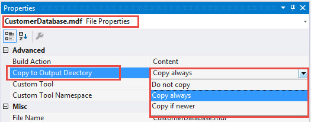

# Working with Copy to Output Directory in C# and VB.NET
## Requires
- Visual Studio 2013
## License
- MIT
## Technologies
- C#
- VB.Net
- Visual Studio
## Topics
- Visual Studio
- Databases
## Updated
- 01/21/2019
## Description

<h1>Description</h1>

A common question on many of the developer forums is as follows. I created a new project, added a database to the project then added code to add new records to the database which works but after I run the project again the newly
 added records are not there, what happened to them.

 
The majority of the time the problem is that when adding a database to a project the default behavior is for the database to be copied to the bin\Debug folder each time the project is built.&nbsp; 
This is controlled by a property &ldquo;Copy to Output Directory&rdquo; of the database. The options for &ldquo;Copy to Output Directory are as follows.

&nbsp;

See <a href="https://msdn.microsoft.com/en-us/library/ms246989.aspx?f=255&MSPPError=-2147217396">
MSDN documentation</a>. 01/2019 seems this page has been removed.

 
<strong>Copy always</strong>: this is the default. Why would a developer want to use this option in the first place? You want to try out various operations during a single run of the application so to keep the original database
 clean. Example, I want to work with edits that may if done incorrectly mess up my data. So we use this option in the event a mistake is made.

 
<strong>Copy if Newer</strong>: This option means the first time the project is built the database is copied to the output folder. You might add several records and edit them also. Next time you build the project the database is
 not copied to the output folder. After say the second time around you realize a field is needed in a table within the database so you add a field. Now when the project is built it will be copied as the modified date has changed. So in this option the first
 and second run of the application all data is preserved but on the third run the data is overwritten because you changed the field in a table.

 
<strong>Do not Copy</strong>: This is a good choice as you are in full control but must be mindful that if you change something in the database that the change is first made in the folder where the database is opened by the application.
 Test the changes, if they are good to go and satisfied remember to copy the database to the project folder and optionally cleanse the database of data if the intent is to publish the database with no data.

 
With the above options in mind and you happen to switch from one to the other it&rsquo;s prudent that in your code you have some assertion to ensure the database exists where it should be, in the project folder. Side note, some
 might place the database in another folder than say bin\debug, you should still have assertion here too. Assertion is simple, use <a class="libraryLink" href="https://msdn.microsoft.com/en-US/library/System.IO.File.Exists.aspx" target="_blank" title="Auto generated link to System.IO.File.Exists">System.IO.File.Exists</a> as shown in the sample projects included. A caveat, if the database is published with ClickOnce or another
 installer you may need a different method to see if the database exists. If you have dragged a database into your project the method to work with data is different than shown in the samples, there will be code placed into Form Load event to retrieve data so
 I would suggest wrapping that code in an IF statement using System.IO.File.Exists. 
<em> 
. &nbsp;&nbsp;</em>

The solution included has two identical projects done in both C# and VB.NET. I kept all code for each project within the project but generally speaking would have created a class project for all database options. There is one
 project that is done in C# that is shared by both projects which simply is passed a connection string then gets the path and database name which is used in the form project as part of <a class="libraryLink" href="https://msdn.microsoft.com/en-US/library/System.IO.File.Exists.aspx" target="_blank" title="Auto generated link to System.IO.File.Exists">System.IO.File.Exists</a> to check if the database exists. This is done so that
 you can run the project and gracefully halt before a run time exception is raised.

<h2>How to use the projects:</h2>

The idea is after building the project you want to try it to run the project as is, enter a new record then close the project. Run the project again and the record or records will be gone. This is because I left Copy to Output
 Directory to Copy always. Now change Copyt to Output Directory to Copy if Newer, run the project add one or more records then re-run the project, the records will still be there. Lastly, change Copy to Output Directory to Do not copy and this time you can't
 work because the database was removed by Visual Studio.

Note that all versions of Visual Studio work as explained above in regards to Copy to Output Folder and it does not matter which database or if you are even using Entity Framework with a local database.

