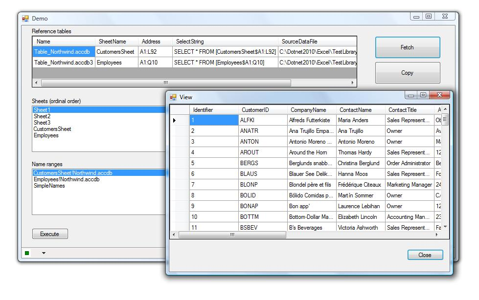

# Working with Excel reference tables
## Requires
- Visual Studio 2012
## License
- Apache License, Version 2.0
## Technologies
- SQL
- Excel
- ADO.NET
- Visual Basic .NET
- Excel 2007
- Excel 2010
- Excel 2013
## Topics
- Excel
- Excel Automation
- Excel ranges
## Updated
- 07/23/2014
## Description

<h1>Introduction</h1>

How to work with <a href="http://office.microsoft.com/en-us/excel-help/using-structured-references-with-excel-tables-HA010155686.aspx" target="_blank">
Excel Reference tables</a> to get data to display or simply work with in your solution. Even thou this is all done in VB.NET a C# developer can add the library in the sample code into their solution to access code to get at reference tables or simple compile
 and add the library project as a reference to their C# project or see 7/23/2014 update. 
 
<strong>UPDATE</strong> 7/23/2014, upgraded from VS2010 to VS2012 so I could add a C# solution and don't have VS2010 anymore.

<strong>Note</strong> I have updated the attached VS2010 project. Two minor changes

<ul>
<li>GetInformation function originally returned a Boolean and now returns a Enum which allows you to determine if to a) use information (the list) or if the file failed to open or if the file opened and there was an internal issue.
 I never had issues so the two possible failures have not been tested yet conceptually is simply an expansion of the original version of GetInformation which was a simple Boolean
</li><li>Original code did not clear the private variable mReferenceTables which it does now.
</li></ul>

<h1>Building the Sample</h1>
<ul>
<li>Requires VS2010 or higher </li><li>Only tested under 32bit OS. </li></ul>

Description

It is commonplace for clients to request that an application read data from Excel files and display this data into a control such as a DataGridView. There are many methods to read data from Excel, several of the most popular
 methods are Office automation and OleDb which are explained in my article &ldquo;<a href="http://code.msdn.microsoft.com/Basics-of-using-Excel-4453945d" target="_blank">Basics of using Excel automation in VB.NET with emphasis on creating and destroy</a>&rdquo;
 while other methods are available these two methods are used more often as they are easy and free. Just because they are free does not mean there is no cost. The main cost is developer time where hours can rack up quickly when the developer is not well versed
 with working Excel data. For common data (you have one or more sheets with tubular data) a simple OleDb connection and command object will get your data into a DataTable. The main consideration is getting various parts of the connection string correct, for
 instance is the first row data or column names.

Now suppose you need to deal with sections of data as defined by a user creating a connection to say a MS-Access database, which becomes a reference table in the Excel file. These reference tables do not appear in a list with
 sheet names, which is what this articles goal is to show how to get at these reference tables with a few bonuses.

There are two projects in the attached VS2010 VB.NET solution. The first project named ExcelHelperLibrary contains a class to retrieve
<a href="http://office.microsoft.com/en-us/excel-help/using-structured-references-with-excel-tables-HA010155686.aspx" target="_blank">
reference table</a> names (and SQL information for getting data later), worksheet names and also name range names. All is done via Office automation, as much of the information we want is not available via OleDb data provider.

Starting with worksheet names there is code which populates a List(Of String) with worksheet names in their ordinal position within the workbook unlike OleDb which automatically sorts the names. Many clients will want to see
 their list of sheet names in ordinal position thus we do this via automation.

For reference tables we need access to ListObjects of a WorkSheet where key properties are critical for using later to retrieve data using OleDb. First we need the sheet name for the where condition followed by the cell address
 (which in the code I format the address suitable for our select statement).&nbsp; Optional information is also retrieved if available which is where did the data originally come from. All this information is placed into a List(Of ExcelReferenceTable) which
 is a class included where one property provides a select statement suitable for use with OleDb command object.

The best way to get a handle on working with reference tables as described above is to download the solution, build/run. Press the Execute button and select one of the included Excel files. Next press the Fetch button to read
 data from Excel into a DataGridView. The button below Fetch will copy all rows from the DataGridView on the main form to a comma delimited array and displayed in a TextBox. Now you can try this with any of your Excel files that has reference tables and get
 the SQL to read data in your own application.

<h2>Caveat</h2>

If you where to create the helper library under Framework 4 and added it to a project with Framework 3.5 you most likely will get a warning when building the project as shown below. This is a clear indicator you need to match
 framework to framework versions.

could not be resolved because it has an indirect dependency on the .NET Framework assembly

&nbsp;

The following code is the core code for getting reference tables

&nbsp;

&nbsp;

&nbsp;

&nbsp;

Visual Basic

Edit|Remove

vb
<pre class="hidden">Imports Microsoft.Office.Interop
''' &lt;summary&gt;
''' 
''' &lt;/summary&gt;
''' &lt;remarks&gt;
''' This was a trick devil in regards to releasing objects but
''' has been done without making any calls to the GC.
''' &lt;/remarks&gt;
Public Class ExcelInfo
    Private Extensions As String() = {&quot;.xls&quot;, &quot;.xlsx&quot;}
    Private mFileName As String
    ''' &lt;summary&gt;
    ''' Valid/existing Excel file name to work with.
    ''' &lt;/summary&gt;
    ''' &lt;value&gt;&lt;/value&gt;
    ''' &lt;returns&gt;&lt;/returns&gt;
    ''' &lt;remarks&gt;&lt;/remarks&gt;
    Public Property FileName() As String
        Get
            Return mFileName
        End Get
        Set(ByVal value As String)
            If Not Extensions.Contains(IO.Path.GetExtension(value.ToLower)) Then
                Throw New Exception(&quot;Invalid file name&quot;)
            End If

            mFileName = value
        End Set
    End Property
    Private mReferenceTables As List(Of ExcelReferenceTable)
    ''' &lt;summary&gt;
    ''' List of reference tables
    ''' &lt;/summary&gt;
    ''' &lt;value&gt;&lt;/value&gt;
    ''' &lt;returns&gt;&lt;/returns&gt;
    ''' &lt;remarks&gt;&lt;/remarks&gt;
    Public ReadOnly Property ReferenceTables As List(Of ExcelReferenceTable)
        Get
            Return mReferenceTables
        End Get
    End Property
    Private mNameRanges As New List(Of String)
    ''' &lt;summary&gt;
    ''' List of named ranges in current file
    ''' &lt;/summary&gt;
    ''' &lt;value&gt;&lt;/value&gt;
    ''' &lt;returns&gt;&lt;/returns&gt;
    ''' &lt;remarks&gt;&lt;/remarks&gt;
    Public ReadOnly Property NameRanges() As List(Of String)
        Get
            Return mNameRanges
        End Get
    End Property
    Private mSheets As New List(Of String)
    ''' &lt;summary&gt;
    ''' List of work sheets in current file
    ''' &lt;/summary&gt;
    ''' &lt;value&gt;&lt;/value&gt;
    ''' &lt;returns&gt;&lt;/returns&gt;
    ''' &lt;remarks&gt;&lt;/remarks&gt;
    Public ReadOnly Property Sheets() As List(Of String)
        Get
            Return mSheets
        End Get
    End Property

    Public Sub New()
    End Sub
    ''' &lt;summary&gt;
    ''' File to get information from
    ''' &lt;/summary&gt;
    ''' &lt;param name=&quot;FileName&quot;&gt;&lt;/param&gt;
    ''' &lt;remarks&gt;
    ''' The caller is responsible to ensure the file exists.
    ''' &lt;/remarks&gt;
    Public Sub New(ByVal FileName As String)
        Me.FileName = FileName
    End Sub
    ''' &lt;summary&gt;
    ''' Get information and return success
    ''' &lt;/summary&gt;
    ''' &lt;returns&gt;&lt;/returns&gt;
    ''' &lt;remarks&gt;&lt;/remarks&gt;
    Public Function GetInformation() As Boolean
        Dim Success As Boolean = True

        mSheets.Clear()
        mNameRanges.Clear()

        Dim xlApp As Excel.Application = Nothing
        Dim xlWorkBooks As Excel.Workbooks = Nothing
        Dim xlWorkBook As Excel.Workbook = Nothing
        Dim xlSheet As Excel.Worksheet = Nothing
        Dim xlWorkSheets As Excel.Sheets = Nothing

        Try
            xlApp = New Excel.Application
            xlApp.DisplayAlerts = False
            xlWorkBooks = xlApp.Workbooks

            Try
                xlWorkBook = xlWorkBooks.Open(FileName)
            Catch ex As Exception
                Console.WriteLine(&quot;Failed to open&quot;)
            End Try

            xlWorkSheets = xlWorkBook.Sheets

            Dim xlRangeNames As Excel.Name = Nothing
            Try
                For Each xlRangeNames In xlWorkBook.Names
                    mNameRanges.Add(xlRangeNames.Name)
                Next
            Finally
                ReleaseComObject(xlRangeNames)
            End Try

            For x As Int32 = 1 To xlWorkSheets.Count
                xlSheet = CType(xlWorkBook.Sheets(x), Excel.Worksheet)
                mSheets.Add(xlSheet.Name)
            Next

            GetReferenceTables(xlWorkSheets)
            ReleaseComObject(xlWorkSheets)
            xlWorkBook.Close()

            xlApp.UserControl = True
            xlApp.Quit()

        Catch ex As Exception
            Console.WriteLine(ex.Message)
            Success = False
        Finally
            ReleaseComObject(xlSheet)
            ReleaseComObject(xlWorkBook)
            ReleaseComObject(xlApp)
        End Try

        Return Success

    End Function
    ''' &lt;summary&gt;
    ''' Get reference tables
    ''' &lt;/summary&gt;
    ''' &lt;param name=&quot;xlWorkSheets&quot;&gt;&lt;/param&gt;
    ''' &lt;returns&gt;&lt;/returns&gt;
    ''' &lt;remarks&gt;
    ''' One of those time I needed to call the GC to force objects to release.
    ''' &lt;/remarks&gt;
    Private Function GetReferenceTables(ByVal xlWorkSheets As Excel.Sheets) As List(Of ExcelReferenceTable)
        Dim Result As New List(Of ExcelReferenceTable)
        Dim Temp As String = &quot;&quot;
        Dim xlWorkSheet As Excel.Worksheet = Nothing
        Dim xlListObjects As Excel.ListObjects = Nothing
        Dim ThisItem As Excel.ListObject = Nothing

        For x As Integer = 1 To xlWorkSheets.Count
            Dim Item As New ExcelReferenceTable

            xlWorkSheet = CType(xlWorkSheets(x), Excel.Worksheet)
            xlListObjects = xlWorkSheet.ListObjects

            Dim TotalCount As Int32 = xlListObjects.Count - 1
            For y As Integer = 0 To TotalCount

                ThisItem = xlListObjects.Item(y &#43; 1)
                Item.Name = ThisItem.Name
                Item.SheetName = xlWorkSheet.Name

                ' TODO: Need to tinker with this.
                Try
                    Dim QT As Excel.QueryTable = ThisItem.QueryTable
                    Item.SourceDataFile = QT.SourceDataFile
                    ReleaseComObject(QT)
                Catch ex As Exception
                    Item.SourceDataFile = &quot;&quot;
                End Try

                Dim ThisRange As Excel.Range = ThisItem.Range
                Temp = ThisRange.Address

                Item.Address = Temp.Replace(&quot;$&quot;, &quot;&quot;)

                Result.Add(Item)

                Runtime.InteropServices.Marshal.FinalReleaseComObject(ThisRange)
                ThisRange = Nothing

                Runtime.InteropServices.Marshal.FinalReleaseComObject(ThisItem)
                ThisItem = Nothing

                Runtime.InteropServices.Marshal.FinalReleaseComObject(xlListObjects)
                xlListObjects = Nothing

            Next
        Next

        releaseObject(xlWorkSheet)

        mReferenceTables = Result

        Return Result

    End Function
End Class
</pre>

<pre class="vb">Imports&nbsp;Microsoft.Office.Interop&nbsp;
'''&nbsp;&lt;summary&gt;&nbsp;
'''&nbsp;&nbsp;
'''&nbsp;&lt;/summary&gt;&nbsp;
'''&nbsp;&lt;remarks&gt;&nbsp;
'''&nbsp;This&nbsp;was&nbsp;a&nbsp;trick&nbsp;devil&nbsp;in&nbsp;regards&nbsp;to&nbsp;releasing&nbsp;objects&nbsp;but&nbsp;
'''&nbsp;has&nbsp;been&nbsp;done&nbsp;without&nbsp;making&nbsp;any&nbsp;calls&nbsp;to&nbsp;the&nbsp;GC.&nbsp;
'''&nbsp;&lt;/remarks&gt;&nbsp;
Public&nbsp;Class&nbsp;ExcelInfo&nbsp;
&nbsp;&nbsp;&nbsp;&nbsp;Private&nbsp;Extensions&nbsp;As&nbsp;String()&nbsp;=&nbsp;{&quot;.xls&quot;,&nbsp;&quot;.xlsx&quot;}&nbsp;
&nbsp;&nbsp;&nbsp;&nbsp;Private&nbsp;mFileName&nbsp;As&nbsp;String&nbsp;
&nbsp;&nbsp;&nbsp;&nbsp;'''&nbsp;&lt;summary&gt;&nbsp;
&nbsp;&nbsp;&nbsp;&nbsp;'''&nbsp;Valid/existing&nbsp;Excel&nbsp;file&nbsp;name&nbsp;to&nbsp;work&nbsp;with.&nbsp;
&nbsp;&nbsp;&nbsp;&nbsp;'''&nbsp;&lt;/summary&gt;&nbsp;
&nbsp;&nbsp;&nbsp;&nbsp;'''&nbsp;&lt;value&gt;&lt;/value&gt;&nbsp;
&nbsp;&nbsp;&nbsp;&nbsp;'''&nbsp;&lt;returns&gt;&lt;/returns&gt;&nbsp;
&nbsp;&nbsp;&nbsp;&nbsp;'''&nbsp;&lt;remarks&gt;&lt;/remarks&gt;&nbsp;
&nbsp;&nbsp;&nbsp;&nbsp;Public&nbsp;Property&nbsp;FileName()&nbsp;As&nbsp;String&nbsp;
&nbsp;&nbsp;&nbsp;&nbsp;&nbsp;&nbsp;&nbsp;&nbsp;Get&nbsp;
&nbsp;&nbsp;&nbsp;&nbsp;&nbsp;&nbsp;&nbsp;&nbsp;&nbsp;&nbsp;&nbsp;&nbsp;Return&nbsp;mFileName&nbsp;
&nbsp;&nbsp;&nbsp;&nbsp;&nbsp;&nbsp;&nbsp;&nbsp;End&nbsp;Get&nbsp;
&nbsp;&nbsp;&nbsp;&nbsp;&nbsp;&nbsp;&nbsp;&nbsp;Set(ByVal&nbsp;value&nbsp;As&nbsp;String)&nbsp;
&nbsp;&nbsp;&nbsp;&nbsp;&nbsp;&nbsp;&nbsp;&nbsp;&nbsp;&nbsp;&nbsp;&nbsp;If&nbsp;Not&nbsp;Extensions.Contains(IO.Path.GetExtension(value.ToLower))&nbsp;Then&nbsp;
&nbsp;&nbsp;&nbsp;&nbsp;&nbsp;&nbsp;&nbsp;&nbsp;&nbsp;&nbsp;&nbsp;&nbsp;&nbsp;&nbsp;&nbsp;&nbsp;Throw&nbsp;New&nbsp;Exception(&quot;Invalid&nbsp;file&nbsp;name&quot;)&nbsp;
&nbsp;&nbsp;&nbsp;&nbsp;&nbsp;&nbsp;&nbsp;&nbsp;&nbsp;&nbsp;&nbsp;&nbsp;End&nbsp;If&nbsp;
&nbsp;
&nbsp;&nbsp;&nbsp;&nbsp;&nbsp;&nbsp;&nbsp;&nbsp;&nbsp;&nbsp;&nbsp;&nbsp;mFileName&nbsp;=&nbsp;value&nbsp;
&nbsp;&nbsp;&nbsp;&nbsp;&nbsp;&nbsp;&nbsp;&nbsp;End&nbsp;Set&nbsp;
&nbsp;&nbsp;&nbsp;&nbsp;End&nbsp;Property&nbsp;
&nbsp;&nbsp;&nbsp;&nbsp;Private&nbsp;mReferenceTables&nbsp;As&nbsp;List(Of&nbsp;ExcelReferenceTable)&nbsp;
&nbsp;&nbsp;&nbsp;&nbsp;'''&nbsp;&lt;summary&gt;&nbsp;
&nbsp;&nbsp;&nbsp;&nbsp;'''&nbsp;List&nbsp;of&nbsp;reference&nbsp;tables&nbsp;
&nbsp;&nbsp;&nbsp;&nbsp;'''&nbsp;&lt;/summary&gt;&nbsp;
&nbsp;&nbsp;&nbsp;&nbsp;'''&nbsp;&lt;value&gt;&lt;/value&gt;&nbsp;
&nbsp;&nbsp;&nbsp;&nbsp;'''&nbsp;&lt;returns&gt;&lt;/returns&gt;&nbsp;
&nbsp;&nbsp;&nbsp;&nbsp;'''&nbsp;&lt;remarks&gt;&lt;/remarks&gt;&nbsp;
&nbsp;&nbsp;&nbsp;&nbsp;Public&nbsp;ReadOnly&nbsp;Property&nbsp;ReferenceTables&nbsp;As&nbsp;List(Of&nbsp;ExcelReferenceTable)&nbsp;
&nbsp;&nbsp;&nbsp;&nbsp;&nbsp;&nbsp;&nbsp;&nbsp;Get&nbsp;
&nbsp;&nbsp;&nbsp;&nbsp;&nbsp;&nbsp;&nbsp;&nbsp;&nbsp;&nbsp;&nbsp;&nbsp;Return&nbsp;mReferenceTables&nbsp;
&nbsp;&nbsp;&nbsp;&nbsp;&nbsp;&nbsp;&nbsp;&nbsp;End&nbsp;Get&nbsp;
&nbsp;&nbsp;&nbsp;&nbsp;End&nbsp;Property&nbsp;
&nbsp;&nbsp;&nbsp;&nbsp;Private&nbsp;mNameRanges&nbsp;As&nbsp;New&nbsp;List(Of&nbsp;String)&nbsp;
&nbsp;&nbsp;&nbsp;&nbsp;'''&nbsp;&lt;summary&gt;&nbsp;
&nbsp;&nbsp;&nbsp;&nbsp;'''&nbsp;List&nbsp;of&nbsp;named&nbsp;ranges&nbsp;in&nbsp;current&nbsp;file&nbsp;
&nbsp;&nbsp;&nbsp;&nbsp;'''&nbsp;&lt;/summary&gt;&nbsp;
&nbsp;&nbsp;&nbsp;&nbsp;'''&nbsp;&lt;value&gt;&lt;/value&gt;&nbsp;
&nbsp;&nbsp;&nbsp;&nbsp;'''&nbsp;&lt;returns&gt;&lt;/returns&gt;&nbsp;
&nbsp;&nbsp;&nbsp;&nbsp;'''&nbsp;&lt;remarks&gt;&lt;/remarks&gt;&nbsp;
&nbsp;&nbsp;&nbsp;&nbsp;Public&nbsp;ReadOnly&nbsp;Property&nbsp;NameRanges()&nbsp;As&nbsp;List(Of&nbsp;String)&nbsp;
&nbsp;&nbsp;&nbsp;&nbsp;&nbsp;&nbsp;&nbsp;&nbsp;Get&nbsp;
&nbsp;&nbsp;&nbsp;&nbsp;&nbsp;&nbsp;&nbsp;&nbsp;&nbsp;&nbsp;&nbsp;&nbsp;Return&nbsp;mNameRanges&nbsp;
&nbsp;&nbsp;&nbsp;&nbsp;&nbsp;&nbsp;&nbsp;&nbsp;End&nbsp;Get&nbsp;
&nbsp;&nbsp;&nbsp;&nbsp;End&nbsp;Property&nbsp;
&nbsp;&nbsp;&nbsp;&nbsp;Private&nbsp;mSheets&nbsp;As&nbsp;New&nbsp;List(Of&nbsp;String)&nbsp;
&nbsp;&nbsp;&nbsp;&nbsp;'''&nbsp;&lt;summary&gt;&nbsp;
&nbsp;&nbsp;&nbsp;&nbsp;'''&nbsp;List&nbsp;of&nbsp;work&nbsp;sheets&nbsp;in&nbsp;current&nbsp;file&nbsp;
&nbsp;&nbsp;&nbsp;&nbsp;'''&nbsp;&lt;/summary&gt;&nbsp;
&nbsp;&nbsp;&nbsp;&nbsp;'''&nbsp;&lt;value&gt;&lt;/value&gt;&nbsp;
&nbsp;&nbsp;&nbsp;&nbsp;'''&nbsp;&lt;returns&gt;&lt;/returns&gt;&nbsp;
&nbsp;&nbsp;&nbsp;&nbsp;'''&nbsp;&lt;remarks&gt;&lt;/remarks&gt;&nbsp;
&nbsp;&nbsp;&nbsp;&nbsp;Public&nbsp;ReadOnly&nbsp;Property&nbsp;Sheets()&nbsp;As&nbsp;List(Of&nbsp;String)&nbsp;
&nbsp;&nbsp;&nbsp;&nbsp;&nbsp;&nbsp;&nbsp;&nbsp;Get&nbsp;
&nbsp;&nbsp;&nbsp;&nbsp;&nbsp;&nbsp;&nbsp;&nbsp;&nbsp;&nbsp;&nbsp;&nbsp;Return&nbsp;mSheets&nbsp;
&nbsp;&nbsp;&nbsp;&nbsp;&nbsp;&nbsp;&nbsp;&nbsp;End&nbsp;Get&nbsp;
&nbsp;&nbsp;&nbsp;&nbsp;End&nbsp;Property&nbsp;
&nbsp;
&nbsp;&nbsp;&nbsp;&nbsp;Public&nbsp;Sub&nbsp;New()&nbsp;
&nbsp;&nbsp;&nbsp;&nbsp;End&nbsp;Sub&nbsp;
&nbsp;&nbsp;&nbsp;&nbsp;'''&nbsp;&lt;summary&gt;&nbsp;
&nbsp;&nbsp;&nbsp;&nbsp;'''&nbsp;File&nbsp;to&nbsp;get&nbsp;information&nbsp;from&nbsp;
&nbsp;&nbsp;&nbsp;&nbsp;'''&nbsp;&lt;/summary&gt;&nbsp;
&nbsp;&nbsp;&nbsp;&nbsp;'''&nbsp;&lt;param&nbsp;name=&quot;FileName&quot;&gt;&lt;/param&gt;&nbsp;
&nbsp;&nbsp;&nbsp;&nbsp;'''&nbsp;&lt;remarks&gt;&nbsp;
&nbsp;&nbsp;&nbsp;&nbsp;'''&nbsp;The&nbsp;caller&nbsp;is&nbsp;responsible&nbsp;to&nbsp;ensure&nbsp;the&nbsp;file&nbsp;exists.&nbsp;
&nbsp;&nbsp;&nbsp;&nbsp;'''&nbsp;&lt;/remarks&gt;&nbsp;
&nbsp;&nbsp;&nbsp;&nbsp;Public&nbsp;Sub&nbsp;New(ByVal&nbsp;FileName&nbsp;As&nbsp;String)&nbsp;
&nbsp;&nbsp;&nbsp;&nbsp;&nbsp;&nbsp;&nbsp;&nbsp;Me.FileName&nbsp;=&nbsp;FileName&nbsp;
&nbsp;&nbsp;&nbsp;&nbsp;End&nbsp;Sub&nbsp;
&nbsp;&nbsp;&nbsp;&nbsp;'''&nbsp;&lt;summary&gt;&nbsp;
&nbsp;&nbsp;&nbsp;&nbsp;'''&nbsp;Get&nbsp;information&nbsp;and&nbsp;return&nbsp;success&nbsp;
&nbsp;&nbsp;&nbsp;&nbsp;'''&nbsp;&lt;/summary&gt;&nbsp;
&nbsp;&nbsp;&nbsp;&nbsp;'''&nbsp;&lt;returns&gt;&lt;/returns&gt;&nbsp;
&nbsp;&nbsp;&nbsp;&nbsp;'''&nbsp;&lt;remarks&gt;&lt;/remarks&gt;&nbsp;
&nbsp;&nbsp;&nbsp;&nbsp;Public&nbsp;Function&nbsp;GetInformation()&nbsp;As&nbsp;Boolean&nbsp;
&nbsp;&nbsp;&nbsp;&nbsp;&nbsp;&nbsp;&nbsp;&nbsp;Dim&nbsp;Success&nbsp;As&nbsp;Boolean&nbsp;=&nbsp;True&nbsp;
&nbsp;
&nbsp;&nbsp;&nbsp;&nbsp;&nbsp;&nbsp;&nbsp;&nbsp;mSheets.Clear()&nbsp;
&nbsp;&nbsp;&nbsp;&nbsp;&nbsp;&nbsp;&nbsp;&nbsp;mNameRanges.Clear()&nbsp;
&nbsp;
&nbsp;&nbsp;&nbsp;&nbsp;&nbsp;&nbsp;&nbsp;&nbsp;Dim&nbsp;xlApp&nbsp;As&nbsp;Excel.Application&nbsp;=&nbsp;Nothing&nbsp;
&nbsp;&nbsp;&nbsp;&nbsp;&nbsp;&nbsp;&nbsp;&nbsp;Dim&nbsp;xlWorkBooks&nbsp;As&nbsp;Excel.Workbooks&nbsp;=&nbsp;Nothing&nbsp;
&nbsp;&nbsp;&nbsp;&nbsp;&nbsp;&nbsp;&nbsp;&nbsp;Dim&nbsp;xlWorkBook&nbsp;As&nbsp;Excel.Workbook&nbsp;=&nbsp;Nothing&nbsp;
&nbsp;&nbsp;&nbsp;&nbsp;&nbsp;&nbsp;&nbsp;&nbsp;Dim&nbsp;xlSheet&nbsp;As&nbsp;Excel.Worksheet&nbsp;=&nbsp;Nothing&nbsp;
&nbsp;&nbsp;&nbsp;&nbsp;&nbsp;&nbsp;&nbsp;&nbsp;Dim&nbsp;xlWorkSheets&nbsp;As&nbsp;Excel.Sheets&nbsp;=&nbsp;Nothing&nbsp;
&nbsp;
&nbsp;&nbsp;&nbsp;&nbsp;&nbsp;&nbsp;&nbsp;&nbsp;Try&nbsp;
&nbsp;&nbsp;&nbsp;&nbsp;&nbsp;&nbsp;&nbsp;&nbsp;&nbsp;&nbsp;&nbsp;&nbsp;xlApp&nbsp;=&nbsp;New&nbsp;Excel.Application&nbsp;
&nbsp;&nbsp;&nbsp;&nbsp;&nbsp;&nbsp;&nbsp;&nbsp;&nbsp;&nbsp;&nbsp;&nbsp;xlApp.DisplayAlerts&nbsp;=&nbsp;False&nbsp;
&nbsp;&nbsp;&nbsp;&nbsp;&nbsp;&nbsp;&nbsp;&nbsp;&nbsp;&nbsp;&nbsp;&nbsp;xlWorkBooks&nbsp;=&nbsp;xlApp.Workbooks&nbsp;
&nbsp;
&nbsp;&nbsp;&nbsp;&nbsp;&nbsp;&nbsp;&nbsp;&nbsp;&nbsp;&nbsp;&nbsp;&nbsp;Try&nbsp;
&nbsp;&nbsp;&nbsp;&nbsp;&nbsp;&nbsp;&nbsp;&nbsp;&nbsp;&nbsp;&nbsp;&nbsp;&nbsp;&nbsp;&nbsp;&nbsp;xlWorkBook&nbsp;=&nbsp;xlWorkBooks.Open(FileName)&nbsp;
&nbsp;&nbsp;&nbsp;&nbsp;&nbsp;&nbsp;&nbsp;&nbsp;&nbsp;&nbsp;&nbsp;&nbsp;Catch&nbsp;ex&nbsp;As&nbsp;Exception&nbsp;
&nbsp;&nbsp;&nbsp;&nbsp;&nbsp;&nbsp;&nbsp;&nbsp;&nbsp;&nbsp;&nbsp;&nbsp;&nbsp;&nbsp;&nbsp;&nbsp;Console.WriteLine(&quot;Failed&nbsp;to&nbsp;open&quot;)&nbsp;
&nbsp;&nbsp;&nbsp;&nbsp;&nbsp;&nbsp;&nbsp;&nbsp;&nbsp;&nbsp;&nbsp;&nbsp;End&nbsp;Try&nbsp;
&nbsp;
&nbsp;&nbsp;&nbsp;&nbsp;&nbsp;&nbsp;&nbsp;&nbsp;&nbsp;&nbsp;&nbsp;&nbsp;xlWorkSheets&nbsp;=&nbsp;xlWorkBook.Sheets&nbsp;
&nbsp;
&nbsp;&nbsp;&nbsp;&nbsp;&nbsp;&nbsp;&nbsp;&nbsp;&nbsp;&nbsp;&nbsp;&nbsp;Dim&nbsp;xlRangeNames&nbsp;As&nbsp;Excel.Name&nbsp;=&nbsp;Nothing&nbsp;
&nbsp;&nbsp;&nbsp;&nbsp;&nbsp;&nbsp;&nbsp;&nbsp;&nbsp;&nbsp;&nbsp;&nbsp;Try&nbsp;
&nbsp;&nbsp;&nbsp;&nbsp;&nbsp;&nbsp;&nbsp;&nbsp;&nbsp;&nbsp;&nbsp;&nbsp;&nbsp;&nbsp;&nbsp;&nbsp;For&nbsp;Each&nbsp;xlRangeNames&nbsp;In&nbsp;xlWorkBook.Names&nbsp;
&nbsp;&nbsp;&nbsp;&nbsp;&nbsp;&nbsp;&nbsp;&nbsp;&nbsp;&nbsp;&nbsp;&nbsp;&nbsp;&nbsp;&nbsp;&nbsp;&nbsp;&nbsp;&nbsp;&nbsp;mNameRanges.Add(xlRangeNames.Name)&nbsp;
&nbsp;&nbsp;&nbsp;&nbsp;&nbsp;&nbsp;&nbsp;&nbsp;&nbsp;&nbsp;&nbsp;&nbsp;&nbsp;&nbsp;&nbsp;&nbsp;Next&nbsp;
&nbsp;&nbsp;&nbsp;&nbsp;&nbsp;&nbsp;&nbsp;&nbsp;&nbsp;&nbsp;&nbsp;&nbsp;Finally&nbsp;
&nbsp;&nbsp;&nbsp;&nbsp;&nbsp;&nbsp;&nbsp;&nbsp;&nbsp;&nbsp;&nbsp;&nbsp;&nbsp;&nbsp;&nbsp;&nbsp;ReleaseComObject(xlRangeNames)&nbsp;
&nbsp;&nbsp;&nbsp;&nbsp;&nbsp;&nbsp;&nbsp;&nbsp;&nbsp;&nbsp;&nbsp;&nbsp;End&nbsp;Try&nbsp;
&nbsp;
&nbsp;&nbsp;&nbsp;&nbsp;&nbsp;&nbsp;&nbsp;&nbsp;&nbsp;&nbsp;&nbsp;&nbsp;For&nbsp;x&nbsp;As&nbsp;Int32&nbsp;=&nbsp;1&nbsp;To&nbsp;xlWorkSheets.Count&nbsp;
&nbsp;&nbsp;&nbsp;&nbsp;&nbsp;&nbsp;&nbsp;&nbsp;&nbsp;&nbsp;&nbsp;&nbsp;&nbsp;&nbsp;&nbsp;&nbsp;xlSheet&nbsp;=&nbsp;CType(xlWorkBook.Sheets(x),&nbsp;Excel.Worksheet)&nbsp;
&nbsp;&nbsp;&nbsp;&nbsp;&nbsp;&nbsp;&nbsp;&nbsp;&nbsp;&nbsp;&nbsp;&nbsp;&nbsp;&nbsp;&nbsp;&nbsp;mSheets.Add(xlSheet.Name)&nbsp;
&nbsp;&nbsp;&nbsp;&nbsp;&nbsp;&nbsp;&nbsp;&nbsp;&nbsp;&nbsp;&nbsp;&nbsp;Next&nbsp;
&nbsp;
&nbsp;&nbsp;&nbsp;&nbsp;&nbsp;&nbsp;&nbsp;&nbsp;&nbsp;&nbsp;&nbsp;&nbsp;GetReferenceTables(xlWorkSheets)&nbsp;
&nbsp;&nbsp;&nbsp;&nbsp;&nbsp;&nbsp;&nbsp;&nbsp;&nbsp;&nbsp;&nbsp;&nbsp;ReleaseComObject(xlWorkSheets)&nbsp;
&nbsp;&nbsp;&nbsp;&nbsp;&nbsp;&nbsp;&nbsp;&nbsp;&nbsp;&nbsp;&nbsp;&nbsp;xlWorkBook.Close()&nbsp;
&nbsp;
&nbsp;&nbsp;&nbsp;&nbsp;&nbsp;&nbsp;&nbsp;&nbsp;&nbsp;&nbsp;&nbsp;&nbsp;xlApp.UserControl&nbsp;=&nbsp;True&nbsp;
&nbsp;&nbsp;&nbsp;&nbsp;&nbsp;&nbsp;&nbsp;&nbsp;&nbsp;&nbsp;&nbsp;&nbsp;xlApp.Quit()&nbsp;
&nbsp;
&nbsp;&nbsp;&nbsp;&nbsp;&nbsp;&nbsp;&nbsp;&nbsp;Catch&nbsp;ex&nbsp;As&nbsp;Exception&nbsp;
&nbsp;&nbsp;&nbsp;&nbsp;&nbsp;&nbsp;&nbsp;&nbsp;&nbsp;&nbsp;&nbsp;&nbsp;Console.WriteLine(ex.Message)&nbsp;
&nbsp;&nbsp;&nbsp;&nbsp;&nbsp;&nbsp;&nbsp;&nbsp;&nbsp;&nbsp;&nbsp;&nbsp;Success&nbsp;=&nbsp;False&nbsp;
&nbsp;&nbsp;&nbsp;&nbsp;&nbsp;&nbsp;&nbsp;&nbsp;Finally&nbsp;
&nbsp;&nbsp;&nbsp;&nbsp;&nbsp;&nbsp;&nbsp;&nbsp;&nbsp;&nbsp;&nbsp;&nbsp;ReleaseComObject(xlSheet)&nbsp;
&nbsp;&nbsp;&nbsp;&nbsp;&nbsp;&nbsp;&nbsp;&nbsp;&nbsp;&nbsp;&nbsp;&nbsp;ReleaseComObject(xlWorkBook)&nbsp;
&nbsp;&nbsp;&nbsp;&nbsp;&nbsp;&nbsp;&nbsp;&nbsp;&nbsp;&nbsp;&nbsp;&nbsp;ReleaseComObject(xlApp)&nbsp;
&nbsp;&nbsp;&nbsp;&nbsp;&nbsp;&nbsp;&nbsp;&nbsp;End&nbsp;Try&nbsp;
&nbsp;
&nbsp;&nbsp;&nbsp;&nbsp;&nbsp;&nbsp;&nbsp;&nbsp;Return&nbsp;Success&nbsp;
&nbsp;
&nbsp;&nbsp;&nbsp;&nbsp;End&nbsp;Function&nbsp;
&nbsp;&nbsp;&nbsp;&nbsp;'''&nbsp;&lt;summary&gt;&nbsp;
&nbsp;&nbsp;&nbsp;&nbsp;'''&nbsp;Get&nbsp;reference&nbsp;tables&nbsp;
&nbsp;&nbsp;&nbsp;&nbsp;'''&nbsp;&lt;/summary&gt;&nbsp;
&nbsp;&nbsp;&nbsp;&nbsp;'''&nbsp;&lt;param&nbsp;name=&quot;xlWorkSheets&quot;&gt;&lt;/param&gt;&nbsp;
&nbsp;&nbsp;&nbsp;&nbsp;'''&nbsp;&lt;returns&gt;&lt;/returns&gt;&nbsp;
&nbsp;&nbsp;&nbsp;&nbsp;'''&nbsp;&lt;remarks&gt;&nbsp;
&nbsp;&nbsp;&nbsp;&nbsp;'''&nbsp;One&nbsp;of&nbsp;those&nbsp;time&nbsp;I&nbsp;needed&nbsp;to&nbsp;call&nbsp;the&nbsp;GC&nbsp;to&nbsp;force&nbsp;objects&nbsp;to&nbsp;release.&nbsp;
&nbsp;&nbsp;&nbsp;&nbsp;'''&nbsp;&lt;/remarks&gt;&nbsp;
&nbsp;&nbsp;&nbsp;&nbsp;Private&nbsp;Function&nbsp;GetReferenceTables(ByVal&nbsp;xlWorkSheets&nbsp;As&nbsp;Excel.Sheets)&nbsp;As&nbsp;List(Of&nbsp;ExcelReferenceTable)&nbsp;
&nbsp;&nbsp;&nbsp;&nbsp;&nbsp;&nbsp;&nbsp;&nbsp;Dim&nbsp;Result&nbsp;As&nbsp;New&nbsp;List(Of&nbsp;ExcelReferenceTable)&nbsp;
&nbsp;&nbsp;&nbsp;&nbsp;&nbsp;&nbsp;&nbsp;&nbsp;Dim&nbsp;Temp&nbsp;As&nbsp;String&nbsp;=&nbsp;&quot;&quot;&nbsp;
&nbsp;&nbsp;&nbsp;&nbsp;&nbsp;&nbsp;&nbsp;&nbsp;Dim&nbsp;xlWorkSheet&nbsp;As&nbsp;Excel.Worksheet&nbsp;=&nbsp;Nothing&nbsp;
&nbsp;&nbsp;&nbsp;&nbsp;&nbsp;&nbsp;&nbsp;&nbsp;Dim&nbsp;xlListObjects&nbsp;As&nbsp;Excel.ListObjects&nbsp;=&nbsp;Nothing&nbsp;
&nbsp;&nbsp;&nbsp;&nbsp;&nbsp;&nbsp;&nbsp;&nbsp;Dim&nbsp;ThisItem&nbsp;As&nbsp;Excel.ListObject&nbsp;=&nbsp;Nothing&nbsp;
&nbsp;
&nbsp;&nbsp;&nbsp;&nbsp;&nbsp;&nbsp;&nbsp;&nbsp;For&nbsp;x&nbsp;As&nbsp;Integer&nbsp;=&nbsp;1&nbsp;To&nbsp;xlWorkSheets.Count&nbsp;
&nbsp;&nbsp;&nbsp;&nbsp;&nbsp;&nbsp;&nbsp;&nbsp;&nbsp;&nbsp;&nbsp;&nbsp;Dim&nbsp;Item&nbsp;As&nbsp;New&nbsp;ExcelReferenceTable&nbsp;
&nbsp;
&nbsp;&nbsp;&nbsp;&nbsp;&nbsp;&nbsp;&nbsp;&nbsp;&nbsp;&nbsp;&nbsp;&nbsp;xlWorkSheet&nbsp;=&nbsp;CType(xlWorkSheets(x),&nbsp;Excel.Worksheet)&nbsp;
&nbsp;&nbsp;&nbsp;&nbsp;&nbsp;&nbsp;&nbsp;&nbsp;&nbsp;&nbsp;&nbsp;&nbsp;xlListObjects&nbsp;=&nbsp;xlWorkSheet.ListObjects&nbsp;
&nbsp;
&nbsp;&nbsp;&nbsp;&nbsp;&nbsp;&nbsp;&nbsp;&nbsp;&nbsp;&nbsp;&nbsp;&nbsp;Dim&nbsp;TotalCount&nbsp;As&nbsp;Int32&nbsp;=&nbsp;xlListObjects.Count&nbsp;-&nbsp;1&nbsp;
&nbsp;&nbsp;&nbsp;&nbsp;&nbsp;&nbsp;&nbsp;&nbsp;&nbsp;&nbsp;&nbsp;&nbsp;For&nbsp;y&nbsp;As&nbsp;Integer&nbsp;=&nbsp;0&nbsp;To&nbsp;TotalCount&nbsp;
&nbsp;
&nbsp;&nbsp;&nbsp;&nbsp;&nbsp;&nbsp;&nbsp;&nbsp;&nbsp;&nbsp;&nbsp;&nbsp;&nbsp;&nbsp;&nbsp;&nbsp;ThisItem&nbsp;=&nbsp;xlListObjects.Item(y&nbsp;&#43;&nbsp;1)&nbsp;
&nbsp;&nbsp;&nbsp;&nbsp;&nbsp;&nbsp;&nbsp;&nbsp;&nbsp;&nbsp;&nbsp;&nbsp;&nbsp;&nbsp;&nbsp;&nbsp;Item.Name&nbsp;=&nbsp;ThisItem.Name&nbsp;
&nbsp;&nbsp;&nbsp;&nbsp;&nbsp;&nbsp;&nbsp;&nbsp;&nbsp;&nbsp;&nbsp;&nbsp;&nbsp;&nbsp;&nbsp;&nbsp;Item.SheetName&nbsp;=&nbsp;xlWorkSheet.Name&nbsp;
&nbsp;
&nbsp;&nbsp;&nbsp;&nbsp;&nbsp;&nbsp;&nbsp;&nbsp;&nbsp;&nbsp;&nbsp;&nbsp;&nbsp;&nbsp;&nbsp;&nbsp;'&nbsp;TODO:&nbsp;Need&nbsp;to&nbsp;tinker&nbsp;with&nbsp;this.&nbsp;
&nbsp;&nbsp;&nbsp;&nbsp;&nbsp;&nbsp;&nbsp;&nbsp;&nbsp;&nbsp;&nbsp;&nbsp;&nbsp;&nbsp;&nbsp;&nbsp;Try&nbsp;
&nbsp;&nbsp;&nbsp;&nbsp;&nbsp;&nbsp;&nbsp;&nbsp;&nbsp;&nbsp;&nbsp;&nbsp;&nbsp;&nbsp;&nbsp;&nbsp;&nbsp;&nbsp;&nbsp;&nbsp;Dim&nbsp;QT&nbsp;As&nbsp;Excel.QueryTable&nbsp;=&nbsp;ThisItem.QueryTable&nbsp;
&nbsp;&nbsp;&nbsp;&nbsp;&nbsp;&nbsp;&nbsp;&nbsp;&nbsp;&nbsp;&nbsp;&nbsp;&nbsp;&nbsp;&nbsp;&nbsp;&nbsp;&nbsp;&nbsp;&nbsp;Item.SourceDataFile&nbsp;=&nbsp;QT.SourceDataFile&nbsp;
&nbsp;&nbsp;&nbsp;&nbsp;&nbsp;&nbsp;&nbsp;&nbsp;&nbsp;&nbsp;&nbsp;&nbsp;&nbsp;&nbsp;&nbsp;&nbsp;&nbsp;&nbsp;&nbsp;&nbsp;ReleaseComObject(QT)&nbsp;
&nbsp;&nbsp;&nbsp;&nbsp;&nbsp;&nbsp;&nbsp;&nbsp;&nbsp;&nbsp;&nbsp;&nbsp;&nbsp;&nbsp;&nbsp;&nbsp;Catch&nbsp;ex&nbsp;As&nbsp;Exception&nbsp;
&nbsp;&nbsp;&nbsp;&nbsp;&nbsp;&nbsp;&nbsp;&nbsp;&nbsp;&nbsp;&nbsp;&nbsp;&nbsp;&nbsp;&nbsp;&nbsp;&nbsp;&nbsp;&nbsp;&nbsp;Item.SourceDataFile&nbsp;=&nbsp;&quot;&quot;&nbsp;
&nbsp;&nbsp;&nbsp;&nbsp;&nbsp;&nbsp;&nbsp;&nbsp;&nbsp;&nbsp;&nbsp;&nbsp;&nbsp;&nbsp;&nbsp;&nbsp;End&nbsp;Try&nbsp;
&nbsp;
&nbsp;&nbsp;&nbsp;&nbsp;&nbsp;&nbsp;&nbsp;&nbsp;&nbsp;&nbsp;&nbsp;&nbsp;&nbsp;&nbsp;&nbsp;&nbsp;Dim&nbsp;ThisRange&nbsp;As&nbsp;Excel.Range&nbsp;=&nbsp;ThisItem.Range&nbsp;
&nbsp;&nbsp;&nbsp;&nbsp;&nbsp;&nbsp;&nbsp;&nbsp;&nbsp;&nbsp;&nbsp;&nbsp;&nbsp;&nbsp;&nbsp;&nbsp;Temp&nbsp;=&nbsp;ThisRange.Address&nbsp;
&nbsp;
&nbsp;&nbsp;&nbsp;&nbsp;&nbsp;&nbsp;&nbsp;&nbsp;&nbsp;&nbsp;&nbsp;&nbsp;&nbsp;&nbsp;&nbsp;&nbsp;Item.Address&nbsp;=&nbsp;Temp.Replace(&quot;$&quot;,&nbsp;&quot;&quot;)&nbsp;
&nbsp;
&nbsp;&nbsp;&nbsp;&nbsp;&nbsp;&nbsp;&nbsp;&nbsp;&nbsp;&nbsp;&nbsp;&nbsp;&nbsp;&nbsp;&nbsp;&nbsp;Result.Add(Item)&nbsp;
&nbsp;
&nbsp;&nbsp;&nbsp;&nbsp;&nbsp;&nbsp;&nbsp;&nbsp;&nbsp;&nbsp;&nbsp;&nbsp;&nbsp;&nbsp;&nbsp;&nbsp;Runtime.InteropServices.Marshal.FinalReleaseComObject(ThisRange)&nbsp;
&nbsp;&nbsp;&nbsp;&nbsp;&nbsp;&nbsp;&nbsp;&nbsp;&nbsp;&nbsp;&nbsp;&nbsp;&nbsp;&nbsp;&nbsp;&nbsp;ThisRange&nbsp;=&nbsp;Nothing&nbsp;
&nbsp;
&nbsp;&nbsp;&nbsp;&nbsp;&nbsp;&nbsp;&nbsp;&nbsp;&nbsp;&nbsp;&nbsp;&nbsp;&nbsp;&nbsp;&nbsp;&nbsp;Runtime.InteropServices.Marshal.FinalReleaseComObject(ThisItem)&nbsp;
&nbsp;&nbsp;&nbsp;&nbsp;&nbsp;&nbsp;&nbsp;&nbsp;&nbsp;&nbsp;&nbsp;&nbsp;&nbsp;&nbsp;&nbsp;&nbsp;ThisItem&nbsp;=&nbsp;Nothing&nbsp;
&nbsp;
&nbsp;&nbsp;&nbsp;&nbsp;&nbsp;&nbsp;&nbsp;&nbsp;&nbsp;&nbsp;&nbsp;&nbsp;&nbsp;&nbsp;&nbsp;&nbsp;Runtime.InteropServices.Marshal.FinalReleaseComObject(xlListObjects)&nbsp;
&nbsp;&nbsp;&nbsp;&nbsp;&nbsp;&nbsp;&nbsp;&nbsp;&nbsp;&nbsp;&nbsp;&nbsp;&nbsp;&nbsp;&nbsp;&nbsp;xlListObjects&nbsp;=&nbsp;Nothing&nbsp;
&nbsp;
&nbsp;&nbsp;&nbsp;&nbsp;&nbsp;&nbsp;&nbsp;&nbsp;&nbsp;&nbsp;&nbsp;&nbsp;Next&nbsp;
&nbsp;&nbsp;&nbsp;&nbsp;&nbsp;&nbsp;&nbsp;&nbsp;Next&nbsp;
&nbsp;
&nbsp;&nbsp;&nbsp;&nbsp;&nbsp;&nbsp;&nbsp;&nbsp;releaseObject(xlWorkSheet)&nbsp;
&nbsp;
&nbsp;&nbsp;&nbsp;&nbsp;&nbsp;&nbsp;&nbsp;&nbsp;mReferenceTables&nbsp;=&nbsp;Result&nbsp;
&nbsp;
&nbsp;&nbsp;&nbsp;&nbsp;&nbsp;&nbsp;&nbsp;&nbsp;Return&nbsp;Result&nbsp;
&nbsp;
&nbsp;&nbsp;&nbsp;&nbsp;End&nbsp;Function&nbsp;
End&nbsp;Class&nbsp;
</pre>

&nbsp;

