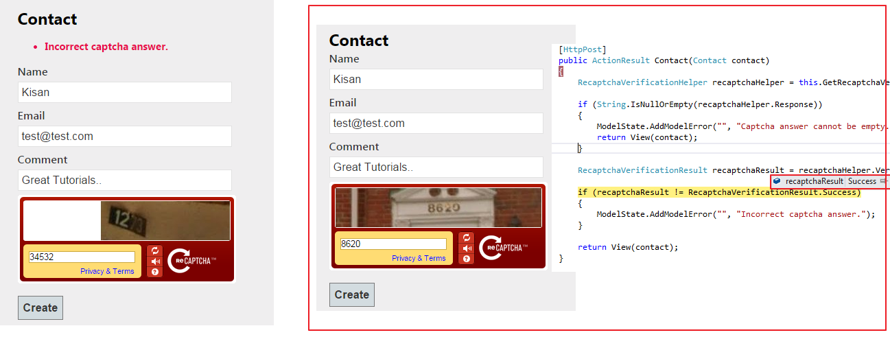

# Working with Google reCAPTCHA in ASP.NET MVC
## Requires
- Visual Studio 2012
## License
- MIT
## Technologies
- ASP.NET MVC
## Topics
- Google reCAPTCHA
## Updated
- 02/01/2015
## Description

In this tutorial, you learn how to working with google reCAPTCHA in ASP.NET MVC using Recaptcha for .NET nuget package with source code.

For full documantation refer this site:&nbsp;<a title="Working with Google reCAPTCHA in ASP.NET MVC" href="http://studyoverflow.com/asp-mvc/working-google-recaptcha-asp-net-mvc/" target="_blank">Working with Google reCAPTCHA in ASP.NET MVC</a>

In this source, I have create a Contact page with captcha varification.

Here, we have also used Recaptcha for .NET nuget package. Recaptcha for .NET is a library that allows a developer to easily integrate Google&rsquo;s Recaptcha service (the most popular captcha control) in an ASP.NET Web Forms or ASP.NET MVC web application.

<strong>web.config</strong>

<pre class="prettyprint prettyprinted">&lt;appSettings&gt;
    &lt;add name=&quot;recaptchaPublicKey&quot; value=&quot;Your Public Key&quot; /&gt;
    &lt;add name=&quot;recaptchaPrivateKey&quot; value=&quot;Your Private Key&quot; /&gt;
&lt;/appSettings&gt;</pre>
<pre class="prettyprint prettyprinted"> </pre>
<pre class="prettyprint prettyprinted"><strong>Contact.cs</strong></pre>
<pre class="prettyprint prettyprinted"><pre class="prettyprint prettyprinted">public class Contact
{
      public int Id { get; set; }
      public string Name { get; set; }

      [EmailAddress]
      public string Email { get; set; }

      public string Comment { get; set; }
}</pre>
 </pre>
<pre class="prettyprint prettyprinted">
<strong>HomeController.cs</strong>

<pre class="prettyprint prettyprinted">public ActionResult Contact()
{
    return View();
}</pre>

<strong>Contact.cshtml</strong>

<pre class="prettyprint prettyprinted">@using Recaptcha.Web.Mvc

@model MVCreCaptchaDemo.Models.Contact
@{
    ViewBag.Title = &quot;Contact&quot;;
}

&lt;h2&gt;Contact&lt;/h2&gt;

@using (Html.BeginForm()) {
           @Html.ValidationSummary(true)

           &lt;fieldset&gt;
               &lt;legend&gt;Contact Us&lt;/legend&gt;

               &lt;div class=&quot;editor-label&quot;&gt;
                   @Html.LabelFor(model =&gt; model.Name)
               &lt;/div&gt;
               &lt;div class=&quot;editor-field&quot;&gt;
                   @Html.EditorFor(model =&gt; model.Name)
                   @Html.ValidationMessageFor(model =&gt; model.Name)
               &lt;/div&gt;

               &lt;div class=&quot;editor-label&quot;&gt;
                   @Html.LabelFor(model =&gt; model.Email)
               &lt;/div&gt;
               &lt;div class=&quot;editor-field&quot;&gt;
                   @Html.EditorFor(model =&gt; model.Email)
                   @Html.ValidationMessageFor(model =&gt; model.Email)
               &lt;/div&gt;

               &lt;div class=&quot;editor-label&quot;&gt;
                   @Html.LabelFor(model =&gt; model.Comment)
               &lt;/div&gt;
               &lt;div class=&quot;editor-field&quot;&gt;
                   @Html.EditorFor(model =&gt; model.Comment)
                   @Html.ValidationMessageFor(model =&gt; model.Comment)
               &lt;/div&gt;
               &lt;div class=&quot;editor-field&quot;&gt;
                   @Html.Recaptcha()
               &lt;/div&gt;
               &lt;p&gt;
                    &lt;input type=&quot;submit&quot; value=&quot;Create&quot; /&gt;
               &lt;/p&gt;
           &lt;/fieldset&gt;
}

@section Scripts {
    @Scripts.Render(&quot;~/bundles/jqueryval&quot;)
}</pre>
 </pre>

<strong>HomeController.cs</strong>

<pre class="prettyprint prettyprinted">[HttpPost]
public ActionResult Contact(Contact contact)
{
      RecaptchaVerificationHelper recaptchaHelper = this.GetRecaptchaVerificationHelper();

      if (String.IsNullOrEmpty(recaptchaHelper.Response))
      {
          ModelState.AddModelError(&quot;&quot;, &quot;Captcha answer cannot be empty.&quot;);
          return View(contact);
      }

      RecaptchaVerificationResult recaptchaResult = recaptchaHelper.VerifyRecaptchaResponse();

      if (recaptchaResult != RecaptchaVerificationResult.Success)
      {
          ModelState.AddModelError(&quot;&quot;, &quot;Incorrect captcha answer.&quot;);
      }
      //Insert code to insert into database...
      return View(contact);
}</pre>
<pre class="prettyprint prettyprinted"> </pre>
