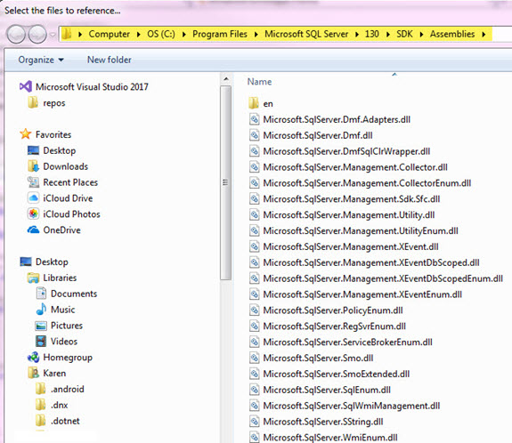
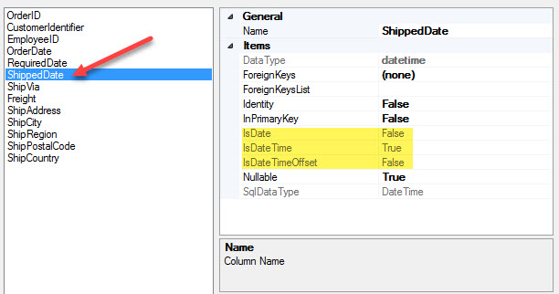

# Working with SQL Server Management Objects (SMO) Part 1 (C#)
## Requires
- Visual Studio 2017
## License
- MIT
## Technologies
- C#
- SQL Server
- SMO
- SQL Server SMO
## Topics
- SQL Server
- Data Access
- SMO
- SQL Server SMO
## Updated
- 12/26/2017
## Description

<h1>Introduction</h1>

This code sample shows some of the basics for working with SQL Server Management Objects commonly referred to as SMO.

SQL Server Management Objects (SMO) is a collection of objects that are designed for programming all aspects of managing Microsoft SQL Server. SQL Server Replication Management Objects (RMO) is a collection of objects that encapsulates
 SQL Server replication management.

To get a good overview see the <a href="https://docs.microsoft.com/en-us/sql/relational-databases/server-management-objects-smo/sql-server-management-objects-smo-programming-guide">
SMO Programming Guide</a>.

Please note, whenever possible consider options e.g. should I do this task in code via SMO,
<a href="https://technet.microsoft.com/en-us/library/ms189826%28v=sql.90%29.aspx?f=255&MSPPError=-2147217396">
T-SQL</a> or <a href="https://docs.microsoft.com/en-us/sql/ssms/sql-server-management-studio-ssms">
SSMS</a>. Always know your toolbox. Suppose I want to know if a database exists or a table exists, T-SQL or SMO works (here is
<a href="https://code.msdn.microsoft.com/SQL-Server-check-if-server-1f53886f?redir=0">
a T-SQL solution</a> I wrote) or perhaps you need detault server and want to create database and tables, here is
<a href="https://code.msdn.microsoft.com/Get-default-SQL-Server-b090d9d4?redir=0">
a code mixure</a> of T-SQL and SMO I wrote.

Last thing, although this is shown in a desktop solution this will work on a server too as I've placed all operations (other than execution) in classes where the classes could be placed into a class project and then used.

<a href="https://code.msdn.microsoft.com/Working-with-SQL-Server-986fff9e">Part 2 is here</a>.

<h1>Building the Sample</h1>

There are several DLL files which are required that may not appear in the dialog for adding the references to your project. Below is the path for my machine, depending on the version installed on your machine you might need
 to traverse to a different folder e.g. instead of the 130 in the path it might be 120.

&nbsp;

<strong>Special note</strong>: I have modified the solution since the initial publish. Now the form which fires up is shown at the bottom of this page.
 You can change to the original form by opening Program.cs and changing the form there. Also I now have a class project which you can use easily in your solution.

 

<em> 
</em>

Description

There many operations which may be performed with SMO from obtaining information about SQL-Server objects to creating and modifying objects or perhaps backing up or restoring a database.

In this code sample (part 1) I will show you how to setup a class that provides the ability to get databases, tables, table columns and column information from a specific database server.

Let's look at a screenshot of a form which provides a high level overview. I've rotated it sideways as a normal view would not be readable.

 

&nbsp;

There are several buttons, &quot;Load database names from server&quot; does just that, loads names of databases from a server. In the class used to get this information we have the following.

&nbsp;

C#

Edit|Remove

csharp

<pre class="csharp">///&nbsp;&lt;summary&gt;&nbsp;
///&nbsp;Your&nbsp;server&nbsp;name&nbsp;e.g.&nbsp;could&nbsp;be&nbsp;(local)&nbsp;or&nbsp;perhaps&nbsp;.\SQLEXPRESS&nbsp;
///&nbsp;&lt;/summary&gt;&nbsp;
public&nbsp;string&nbsp;ServerName&nbsp;{&nbsp;get&nbsp;=&gt;&nbsp;&quot;KARENS-PC&quot;;&nbsp;}&nbsp;
private&nbsp;Server&nbsp;mServer;&nbsp;
public&nbsp;SmoOperations()&nbsp;
{&nbsp;
&nbsp;&nbsp;&nbsp;&nbsp;mServer&nbsp;=&nbsp;InitializeServer();&nbsp;
}</pre>

Here &quot;ServerName&quot; represents the SQL-Server name where mine is KARENS-PC. You need to change this to the name of your SQL-Server.

.

For all operations we need a
<a href="https://msdn.microsoft.com/en-us/library/microsoft.sqlserver.management.smo.server.aspx?f=255&MSPPError=-2147217396">
Server</a> object. In the class I setup a private variable for the server and intialize it from the class constructor.

C#

Edit|Remove

csharp

<pre class="js">private&nbsp;Server&nbsp;mServer;&nbsp;
public&nbsp;SmoOperations()&nbsp;
{&nbsp;
&nbsp;&nbsp;&nbsp;&nbsp;mServer&nbsp;=&nbsp;InitializeServer();&nbsp;
}&nbsp;
Server&nbsp;InitializeServer()&nbsp;
{&nbsp;
&nbsp;&nbsp;&nbsp;&nbsp;ServerConnection&nbsp;connection&nbsp;=&nbsp;new&nbsp;ServerConnection(ServerName);&nbsp;
&nbsp;&nbsp;&nbsp;&nbsp;Server&nbsp;sqlServer&nbsp;=&nbsp;new&nbsp;Server(connection);&nbsp;
&nbsp;&nbsp;&nbsp;&nbsp;return&nbsp;sqlServer;&nbsp;
}</pre>

Now to get the database names the server object is ready to use.

C#

Edit|Remove

csharp

<pre class="js">public&nbsp;List&lt;string&gt;&nbsp;DatabaseNames()&nbsp;
{&nbsp;
&nbsp;&nbsp;&nbsp;&nbsp;var&nbsp;databaseNames&nbsp;=&nbsp;new&nbsp;List&lt;string&gt;();&nbsp;
&nbsp;&nbsp;&nbsp;&nbsp;var&nbsp;server&nbsp;=&nbsp;mServer;&nbsp;
&nbsp;&nbsp;&nbsp;&nbsp;return&nbsp;server.Databases.OfType&lt;Database&gt;().Select(db&nbsp;=&gt;&nbsp;db.Name).ToList();&nbsp;
}</pre>

It would be good to know if a database exists so we use the above with slight modifications.

C#

Edit|Remove

csharp

<pre class="js">///&nbsp;&lt;summary&gt;&nbsp;
///&nbsp;Determine&nbsp;if&nbsp;database&nbsp;exists&nbsp;on&nbsp;the&nbsp;server.&nbsp;
///&nbsp;&lt;/summary&gt;&nbsp;
///&nbsp;&lt;param&nbsp;name=&quot;pDatabaseName&quot;&gt;&lt;/param&gt;&nbsp;
///&nbsp;&lt;returns&gt;&lt;/returns&gt;&nbsp;
public&nbsp;bool&nbsp;DatabaseExists(string&nbsp;pDatabaseName)&nbsp;
{&nbsp;
&nbsp;&nbsp;&nbsp;&nbsp;var&nbsp;databaseNames&nbsp;=&nbsp;new&nbsp;List&lt;string&gt;();&nbsp;
&nbsp;&nbsp;&nbsp;&nbsp;var&nbsp;server&nbsp;=&nbsp;mServer;&nbsp;
&nbsp;&nbsp;&nbsp;&nbsp;var&nbsp;item&nbsp;=&nbsp;server.Databases.OfType&lt;Database&gt;().FirstOrDefault(db&nbsp;=&gt;&nbsp;db.Name&nbsp;==&nbsp;pDatabaseName);&nbsp;
&nbsp;&nbsp;&nbsp;&nbsp;if&nbsp;(item&nbsp;!=&nbsp;null)&nbsp;
&nbsp;&nbsp;&nbsp;&nbsp;{&nbsp;
&nbsp;&nbsp;&nbsp;&nbsp;&nbsp;&nbsp;&nbsp;&nbsp;return&nbsp;true;&nbsp;
&nbsp;&nbsp;&nbsp;&nbsp;}&nbsp;
&nbsp;&nbsp;&nbsp;&nbsp;else&nbsp;
&nbsp;&nbsp;&nbsp;&nbsp;{&nbsp;
&nbsp;&nbsp;&nbsp;&nbsp;&nbsp;&nbsp;&nbsp;&nbsp;return&nbsp;false;&nbsp;
&nbsp;&nbsp;&nbsp;&nbsp;}&nbsp;
}&nbsp;
</pre>

Usually we want to do something to the database so there is a method to get a database object.

C#

Edit|Remove

csharp

<pre class="csharp">///&nbsp;&lt;summary&gt;&nbsp;
///&nbsp;Return&nbsp;a&nbsp;valid&nbsp;Database&nbsp;based&nbsp;on&nbsp;a&nbsp;database&nbsp;name&nbsp;
///&nbsp;&lt;/summary&gt;&nbsp;
///&nbsp;&lt;param&nbsp;name=&quot;pDatabaseName&quot;&gt;&lt;/param&gt;&nbsp;
///&nbsp;&lt;returns&gt;&lt;/returns&gt;&nbsp;
public&nbsp;Database&nbsp;GetDatabase(string&nbsp;pDatabaseName)&nbsp;
{&nbsp;
&nbsp;&nbsp;&nbsp;&nbsp;var&nbsp;databaseNames&nbsp;=&nbsp;new&nbsp;List&lt;string&gt;();&nbsp;
&nbsp;&nbsp;&nbsp;&nbsp;var&nbsp;server&nbsp;=&nbsp;mServer;&nbsp;
&nbsp;&nbsp;&nbsp;&nbsp;return&nbsp;server.Databases.OfType&lt;Database&gt;().FirstOrDefault(db&nbsp;=&gt;&nbsp;db.Name&nbsp;==&nbsp;pDatabaseName);&nbsp;
}</pre>

Once we have a database or databases we can get table information, first table names.

C#

Edit|Remove

csharp

<pre class="js">///&nbsp;&lt;summary&gt;&nbsp;
///&nbsp;Get&nbsp;table&nbsp;names&nbsp;for&nbsp;database&nbsp;
///&nbsp;&lt;/summary&gt;&nbsp;
///&nbsp;&lt;param&nbsp;name=&quot;pDatabaseName&quot;&gt;Exists&nbsp;SQL-Server&nbsp;database&lt;/param&gt;&nbsp;
///&nbsp;&lt;returns&gt;&lt;/returns&gt;&nbsp;
///&nbsp;&lt;remarks&gt;System&nbsp;objects/tables&nbsp;are&nbsp;filtered&nbsp;out&lt;/remarks&gt;&nbsp;
public&nbsp;List&lt;string&gt;&nbsp;TableNames(string&nbsp;pDatabaseName)&nbsp;
{&nbsp;
&nbsp;&nbsp;&nbsp;&nbsp;var&nbsp;tableNames&nbsp;=&nbsp;new&nbsp;List&lt;string&gt;();&nbsp;&nbsp;
&nbsp;&nbsp;&nbsp;&nbsp;var&nbsp;server&nbsp;=&nbsp;mServer;&nbsp;
&nbsp;&nbsp;&nbsp;&nbsp;var&nbsp;database&nbsp;=&nbsp;server.Databases.OfType&lt;Database&gt;().FirstOrDefault(tbl&nbsp;=&gt;&nbsp;tbl.Name&nbsp;==&nbsp;pDatabaseName);&nbsp;
&nbsp;
&nbsp;&nbsp;&nbsp;&nbsp;if&nbsp;(database&nbsp;!=&nbsp;null)&nbsp;
&nbsp;&nbsp;&nbsp;&nbsp;{&nbsp;
&nbsp;&nbsp;&nbsp;&nbsp;&nbsp;&nbsp;&nbsp;&nbsp;tableNames&nbsp;=&nbsp;database.Tables.OfType&lt;Table&gt;().Where(tbl&nbsp;=&gt;&nbsp;!tbl.IsSystemObject).Select(tbl&nbsp;=&gt;&nbsp;tbl.Name).ToList();&nbsp;
&nbsp;&nbsp;&nbsp;&nbsp;}&nbsp;
&nbsp;
&nbsp;&nbsp;&nbsp;&nbsp;return&nbsp;tableNames;&nbsp;
&nbsp;
}</pre>

&nbsp;Does the table exists in a database?

C#

Edit|Remove

csharp

<pre class="js">///&nbsp;&lt;summary&gt;&nbsp;
///&nbsp;Does&nbsp;the&nbsp;table&nbsp;exists&nbsp;in&nbsp;the&nbsp;specified&nbsp;database&nbsp;
///&nbsp;&lt;/summary&gt;&nbsp;
///&nbsp;&lt;param&nbsp;name=&quot;pDatabaseName&quot;&gt;valid&nbsp;SQL-Server&nbsp;database&lt;/param&gt;&nbsp;
///&nbsp;&lt;param&nbsp;name=&quot;pTableName&quot;&gt;Table&nbsp;name&nbsp;to&nbsp;see&nbsp;if&nbsp;it&nbsp;exists&nbsp;in&nbsp;pDatabaseName&lt;/param&gt;&nbsp;
///&nbsp;&lt;returns&gt;&lt;/returns&gt;&nbsp;
public&nbsp;bool&nbsp;TableExists(string&nbsp;pDatabaseName,&nbsp;string&nbsp;pTableName)&nbsp;
{&nbsp;
&nbsp;&nbsp;&nbsp;&nbsp;bool&nbsp;exists&nbsp;=&nbsp;false;&nbsp;
&nbsp;&nbsp;&nbsp;&nbsp;var&nbsp;server&nbsp;=&nbsp;mServer;&nbsp;
&nbsp;&nbsp;&nbsp;&nbsp;var&nbsp;database&nbsp;=&nbsp;server.Databases.OfType&lt;Database&gt;().FirstOrDefault(tbl&nbsp;=&gt;&nbsp;tbl.Name&nbsp;==&nbsp;pDatabaseName);&nbsp;
&nbsp;
&nbsp;&nbsp;&nbsp;&nbsp;if&nbsp;(database&nbsp;!=&nbsp;null)&nbsp;
&nbsp;&nbsp;&nbsp;&nbsp;{&nbsp;
&nbsp;&nbsp;&nbsp;&nbsp;&nbsp;&nbsp;&nbsp;&nbsp;exists&nbsp;=&nbsp;(database.Tables.OfType&lt;Table&gt;().Where(tbl&nbsp;=&gt;&nbsp;!tbl.IsSystemObject).FirstOrDefault(tbl&nbsp;=&gt;&nbsp;tbl.Name&nbsp;==&nbsp;pTableName)&nbsp;!=&nbsp;null);&nbsp;
&nbsp;&nbsp;&nbsp;&nbsp;}&nbsp;
&nbsp;
&nbsp;&nbsp;&nbsp;&nbsp;return&nbsp;exists;&nbsp;
}</pre>

From here let's get column names for a table in a database.

C#

Edit|Remove

csharp

<pre class="js">///&nbsp;&lt;summary&gt;&nbsp;
///&nbsp;Get&nbsp;column&nbsp;names&nbsp;for&nbsp;table&nbsp;in&nbsp;database.&nbsp;
///&nbsp;&lt;/summary&gt;&nbsp;
///&nbsp;&lt;param&nbsp;name=&quot;pDatabaseName&quot;&gt;valid&nbsp;SQL-Server&nbsp;database&lt;/param&gt;&nbsp;
///&nbsp;&lt;param&nbsp;name=&quot;pTableName&quot;&gt;Exists&nbsp;table&nbsp;in&nbsp;pDatabaseName&lt;/param&gt;&nbsp;
///&nbsp;&lt;returns&gt;&lt;/returns&gt;&nbsp;
public&nbsp;List&lt;string&gt;&nbsp;TableColumnNames(string&nbsp;pDatabaseName,&nbsp;string&nbsp;pTableName)&nbsp;
{&nbsp;
&nbsp;&nbsp;&nbsp;&nbsp;var&nbsp;columnNames&nbsp;=&nbsp;new&nbsp;List&lt;string&gt;();&nbsp;
&nbsp;&nbsp;&nbsp;&nbsp;var&nbsp;server&nbsp;=&nbsp;mServer;&nbsp;
&nbsp;&nbsp;&nbsp;&nbsp;var&nbsp;database&nbsp;=&nbsp;server.Databases.OfType&lt;Database&gt;().FirstOrDefault(db&nbsp;=&gt;&nbsp;db.Name&nbsp;==&nbsp;pDatabaseName);&nbsp;
&nbsp;
&nbsp;&nbsp;&nbsp;&nbsp;if&nbsp;(database&nbsp;!=&nbsp;null)&nbsp;
&nbsp;&nbsp;&nbsp;&nbsp;{&nbsp;
&nbsp;&nbsp;&nbsp;&nbsp;&nbsp;&nbsp;&nbsp;&nbsp;var&nbsp;table&nbsp;=&nbsp;database.Tables.OfType&lt;Table&gt;().FirstOrDefault(tbl&nbsp;=&gt;&nbsp;tbl.Name&nbsp;==&nbsp;pTableName);&nbsp;
&nbsp;
&nbsp;&nbsp;&nbsp;&nbsp;&nbsp;&nbsp;&nbsp;&nbsp;if&nbsp;(table&nbsp;!=&nbsp;null)&nbsp;
&nbsp;&nbsp;&nbsp;&nbsp;&nbsp;&nbsp;&nbsp;&nbsp;{&nbsp;
&nbsp;&nbsp;&nbsp;&nbsp;&nbsp;&nbsp;&nbsp;&nbsp;&nbsp;&nbsp;&nbsp;&nbsp;&nbsp;&nbsp;&nbsp;&nbsp;&nbsp;&nbsp;&nbsp;&nbsp;&nbsp;
&nbsp;&nbsp;&nbsp;&nbsp;&nbsp;&nbsp;&nbsp;&nbsp;&nbsp;&nbsp;&nbsp;&nbsp;columnNames&nbsp;=&nbsp;table.Columns.OfType&lt;Column&gt;().Select(col&nbsp;=&gt;&nbsp;col.Name).ToList();&nbsp;
&nbsp;&nbsp;&nbsp;&nbsp;&nbsp;&nbsp;&nbsp;&nbsp;}&nbsp;
&nbsp;&nbsp;&nbsp;&nbsp;}&nbsp;
&nbsp;
&nbsp;&nbsp;&nbsp;&nbsp;return&nbsp;columnNames;&nbsp;
}</pre>

Does a specific column exists by name?

C#

Edit|Remove

csharp

<pre class="js">///&nbsp;&lt;summary&gt;&nbsp;
///&nbsp;Does&nbsp;a&nbsp;column&nbsp;name&nbsp;exists&nbsp;in&nbsp;a&nbsp;table&nbsp;within&nbsp;a&nbsp;specific&nbsp;database&nbsp;
///&nbsp;&lt;/summary&gt;&nbsp;
///&nbsp;&lt;param&nbsp;name=&quot;pDatabaseName&quot;&gt;valid&nbsp;SQL-Server&nbsp;database&lt;/param&gt;&nbsp;
///&nbsp;&lt;param&nbsp;name=&quot;pTableName&quot;&gt;Exists&nbsp;table&nbsp;in&nbsp;pDatabaseName&lt;/param&gt;&nbsp;
///&nbsp;&lt;param&nbsp;name=&quot;pColumnName&quot;&gt;Column&nbsp;to&nbsp;check&nbsp;if&nbsp;it&nbsp;exists&nbsp;in&nbsp;pTableName&nbsp;in&nbsp;pDatabaseName&lt;/param&gt;&nbsp;
///&nbsp;&lt;returns&gt;&lt;/returns&gt;&nbsp;
public&nbsp;bool&nbsp;ColumnExists(string&nbsp;pDatabaseName,&nbsp;string&nbsp;pTableName,&nbsp;string&nbsp;pColumnName)&nbsp;
{&nbsp;
&nbsp;&nbsp;&nbsp;&nbsp;bool&nbsp;exists&nbsp;=&nbsp;false;&nbsp;
&nbsp;
&nbsp;&nbsp;&nbsp;&nbsp;var&nbsp;server&nbsp;=&nbsp;mServer;&nbsp;
&nbsp;&nbsp;&nbsp;&nbsp;var&nbsp;database&nbsp;=&nbsp;server.Databases.OfType&lt;Database&gt;().FirstOrDefault(db&nbsp;=&gt;&nbsp;db.Name&nbsp;==&nbsp;pDatabaseName);&nbsp;
&nbsp;
&nbsp;&nbsp;&nbsp;&nbsp;if&nbsp;(database&nbsp;!=&nbsp;null)&nbsp;
&nbsp;&nbsp;&nbsp;&nbsp;{&nbsp;
&nbsp;&nbsp;&nbsp;&nbsp;&nbsp;&nbsp;&nbsp;&nbsp;var&nbsp;table&nbsp;=&nbsp;database.Tables.OfType&lt;Table&gt;().FirstOrDefault(tbl&nbsp;=&gt;&nbsp;tbl.Name&nbsp;==&nbsp;pTableName);&nbsp;
&nbsp;&nbsp;&nbsp;&nbsp;&nbsp;&nbsp;&nbsp;&nbsp;if&nbsp;(table&nbsp;!=&nbsp;null)&nbsp;
&nbsp;&nbsp;&nbsp;&nbsp;&nbsp;&nbsp;&nbsp;&nbsp;{&nbsp;
&nbsp;&nbsp;&nbsp;&nbsp;&nbsp;&nbsp;&nbsp;&nbsp;&nbsp;&nbsp;&nbsp;&nbsp;exists&nbsp;=&nbsp;(table.Columns.OfType&lt;Column&gt;().FirstOrDefault(col&nbsp;=&gt;&nbsp;col.Name&nbsp;==&nbsp;pColumnName)&nbsp;!=&nbsp;null);&nbsp;
&nbsp;&nbsp;&nbsp;&nbsp;&nbsp;&nbsp;&nbsp;&nbsp;}&nbsp;
&nbsp;&nbsp;&nbsp;&nbsp;}&nbsp;
&nbsp;
&nbsp;&nbsp;&nbsp;&nbsp;return&nbsp;exists;&nbsp;
}</pre>

&nbsp;

&nbsp;Get details for columns, here I've touched only the surface of information we can get and hopefully you get a good idea where to go from here.

C#

Edit|Remove

csharp

<pre class="csharp">///&nbsp;&lt;summary&gt;&nbsp;
///&nbsp;Get&nbsp;details&nbsp;for&nbsp;each&nbsp;column&nbsp;in&nbsp;a&nbsp;table&nbsp;within&nbsp;a&nbsp;database.&nbsp;
///&nbsp;There&nbsp;are&nbsp;more&nbsp;details&nbsp;then&nbsp;returned&nbsp;here&nbsp;so&nbsp;feel&nbsp;free&nbsp;to&nbsp;explore.&nbsp;
///&nbsp;&lt;/summary&gt;&nbsp;
///&nbsp;&lt;param&nbsp;name=&quot;pDatabaseName&quot;&gt;valid&nbsp;SQL-Server&nbsp;database&lt;/param&gt;&nbsp;
///&nbsp;&lt;param&nbsp;name=&quot;pTableName&quot;&gt;Exists&nbsp;table&nbsp;in&nbsp;pDatabaseName&lt;/param&gt;&nbsp;
///&nbsp;&lt;returns&gt;&lt;/returns&gt;&nbsp;
public&nbsp;List&lt;ColumnDetails&gt;&nbsp;GetColumnDetails(string&nbsp;pDatabaseName,&nbsp;string&nbsp;pTableName)&nbsp;
{&nbsp;
&nbsp;&nbsp;&nbsp;&nbsp;var&nbsp;columnDetails&nbsp;=&nbsp;new&nbsp;List&lt;ColumnDetails&gt;();&nbsp;
&nbsp;&nbsp;&nbsp;&nbsp;var&nbsp;columnNames&nbsp;=&nbsp;new&nbsp;List&lt;string&gt;();&nbsp;
&nbsp;&nbsp;&nbsp;&nbsp;var&nbsp;server&nbsp;=&nbsp;mServer;&nbsp;
&nbsp;&nbsp;&nbsp;&nbsp;var&nbsp;database&nbsp;=&nbsp;server.Databases.OfType&lt;Database&gt;().FirstOrDefault(db&nbsp;=&gt;&nbsp;db.Name&nbsp;==&nbsp;pDatabaseName);&nbsp;
&nbsp;
&nbsp;&nbsp;&nbsp;&nbsp;if&nbsp;(database&nbsp;!=&nbsp;null)&nbsp;
&nbsp;&nbsp;&nbsp;&nbsp;{&nbsp;
&nbsp;&nbsp;&nbsp;&nbsp;&nbsp;&nbsp;&nbsp;&nbsp;var&nbsp;table&nbsp;=&nbsp;database.Tables.OfType&lt;Table&gt;().FirstOrDefault(tbl&nbsp;=&gt;&nbsp;tbl.Name&nbsp;==&nbsp;pTableName);&nbsp;
&nbsp;
&nbsp;&nbsp;&nbsp;&nbsp;&nbsp;&nbsp;&nbsp;&nbsp;if&nbsp;(table&nbsp;!=&nbsp;null)&nbsp;
&nbsp;&nbsp;&nbsp;&nbsp;&nbsp;&nbsp;&nbsp;&nbsp;{&nbsp;
&nbsp;&nbsp;&nbsp;&nbsp;&nbsp;&nbsp;&nbsp;&nbsp;&nbsp;&nbsp;&nbsp;&nbsp;columnDetails&nbsp;=&nbsp;table.Columns.OfType&lt;Column&gt;().Select(col&nbsp;=&gt;&nbsp;new&nbsp;ColumnDetails()&nbsp;
&nbsp;&nbsp;&nbsp;&nbsp;&nbsp;&nbsp;&nbsp;&nbsp;&nbsp;&nbsp;&nbsp;&nbsp;{&nbsp;
&nbsp;&nbsp;&nbsp;&nbsp;&nbsp;&nbsp;&nbsp;&nbsp;&nbsp;&nbsp;&nbsp;&nbsp;&nbsp;&nbsp;&nbsp;&nbsp;Identity&nbsp;=&nbsp;col.Identity,&nbsp;
&nbsp;&nbsp;&nbsp;&nbsp;&nbsp;&nbsp;&nbsp;&nbsp;&nbsp;&nbsp;&nbsp;&nbsp;&nbsp;&nbsp;&nbsp;&nbsp;DataType&nbsp;=&nbsp;col.DataType,&nbsp;
&nbsp;&nbsp;&nbsp;&nbsp;&nbsp;&nbsp;&nbsp;&nbsp;&nbsp;&nbsp;&nbsp;&nbsp;&nbsp;&nbsp;&nbsp;&nbsp;Name&nbsp;=&nbsp;col.Name,&nbsp;
&nbsp;&nbsp;&nbsp;&nbsp;&nbsp;&nbsp;&nbsp;&nbsp;&nbsp;&nbsp;&nbsp;&nbsp;&nbsp;&nbsp;&nbsp;&nbsp;InPrimaryKey&nbsp;=&nbsp;col.InPrimaryKey,&nbsp;
&nbsp;&nbsp;&nbsp;&nbsp;&nbsp;&nbsp;&nbsp;&nbsp;&nbsp;&nbsp;&nbsp;&nbsp;&nbsp;&nbsp;&nbsp;&nbsp;Nullable&nbsp;=&nbsp;col.Nullable&nbsp;
&nbsp;&nbsp;&nbsp;&nbsp;&nbsp;&nbsp;&nbsp;&nbsp;&nbsp;&nbsp;&nbsp;&nbsp;}).ToList();&nbsp;
&nbsp;&nbsp;&nbsp;&nbsp;&nbsp;&nbsp;&nbsp;&nbsp;}&nbsp;
&nbsp;&nbsp;&nbsp;&nbsp;}&nbsp;
&nbsp;
&nbsp;&nbsp;&nbsp;&nbsp;return&nbsp;columnDetails;&nbsp;
}</pre>

A visual representation where I focus on dates.

&nbsp;

Here is the backing class for column information. Note the read-only properties e.g. IsDate, IsDateTime, IsDateTimeOffset

C#

Edit|Remove

csharp

<pre class="csharp">using&nbsp;<a class="libraryLink" href="https://msdn.microsoft.com/en-US/library/Microsoft.SqlServer.Management.Smo.aspx" target="_blank" title="Auto generated link to Microsoft.SqlServer.Management.Smo">Microsoft.SqlServer.Management.Smo</a>;&nbsp;
using&nbsp;<a class="libraryLink" href="https://msdn.microsoft.com/en-US/library/System.Collections.Generic.aspx" target="_blank" title="Auto generated link to System.Collections.Generic">System.Collections.Generic</a>;&nbsp;
using&nbsp;<a class="libraryLink" href="https://msdn.microsoft.com/en-US/library/System.ComponentModel.aspx" target="_blank" title="Auto generated link to System.ComponentModel">System.ComponentModel</a>;&nbsp;
using&nbsp;<a class="libraryLink" href="https://msdn.microsoft.com/en-US/library/System.Data.aspx" target="_blank" title="Auto generated link to System.Data">System.Data</a>;&nbsp;
&nbsp;
namespace&nbsp;WindowsFormsApp1&nbsp;
{&nbsp;
&nbsp;&nbsp;&nbsp;&nbsp;///&nbsp;&lt;summary&gt;&nbsp;
&nbsp;&nbsp;&nbsp;&nbsp;///&nbsp;Container&nbsp;for&nbsp;columns&nbsp;of&nbsp;a&nbsp;table&nbsp;in&nbsp;a&nbsp;database&nbsp;
&nbsp;&nbsp;&nbsp;&nbsp;///&nbsp;&lt;/summary&gt;&nbsp;
&nbsp;&nbsp;&nbsp;&nbsp;public&nbsp;class&nbsp;ColumnDetails&nbsp;
&nbsp;&nbsp;&nbsp;&nbsp;{&nbsp;
&nbsp;&nbsp;&nbsp;&nbsp;&nbsp;&nbsp;&nbsp;&nbsp;///&nbsp;&lt;summary&gt;&nbsp;
&nbsp;&nbsp;&nbsp;&nbsp;&nbsp;&nbsp;&nbsp;&nbsp;///&nbsp;Column&nbsp;is&nbsp;a&nbsp;identify&nbsp;column&nbsp;
&nbsp;&nbsp;&nbsp;&nbsp;&nbsp;&nbsp;&nbsp;&nbsp;///&nbsp;&lt;/summary&gt;&nbsp;
&nbsp;&nbsp;&nbsp;&nbsp;&nbsp;&nbsp;&nbsp;&nbsp;[CategoryAttribute(&quot;Items&quot;),&nbsp;DescriptionAttribute(&quot;Indicates&nbsp;if&nbsp;the&nbsp;field&nbsp;is&nbsp;Identity&quot;)]&nbsp;
&nbsp;&nbsp;&nbsp;&nbsp;&nbsp;&nbsp;&nbsp;&nbsp;public&nbsp;bool&nbsp;Identity&nbsp;{&nbsp;get;&nbsp;set;&nbsp;}&nbsp;
&nbsp;&nbsp;&nbsp;&nbsp;&nbsp;&nbsp;&nbsp;&nbsp;[CategoryAttribute(&quot;General&quot;),&nbsp;DescriptionAttribute(&quot;Column&nbsp;Name&quot;)]&nbsp;
&nbsp;&nbsp;&nbsp;&nbsp;&nbsp;&nbsp;&nbsp;&nbsp;public&nbsp;string&nbsp;Name&nbsp;{&nbsp;get;&nbsp;set;&nbsp;}&nbsp;
&nbsp;&nbsp;&nbsp;&nbsp;&nbsp;&nbsp;&nbsp;&nbsp;///&nbsp;&lt;summary&gt;&nbsp;
&nbsp;&nbsp;&nbsp;&nbsp;&nbsp;&nbsp;&nbsp;&nbsp;///&nbsp;There&nbsp;are&nbsp;plenty&nbsp;of&nbsp;useful&nbsp;properties&nbsp;within&nbsp;DataType&nbsp;as&nbsp;an&nbsp;
&nbsp;&nbsp;&nbsp;&nbsp;&nbsp;&nbsp;&nbsp;&nbsp;///&nbsp;example&nbsp;in&nbsp;the&nbsp;property&nbsp;SqlDataType&nbsp;or&nbsp;IsDate&nbsp;(which&nbsp;we&nbsp;know&nbsp;
&nbsp;&nbsp;&nbsp;&nbsp;&nbsp;&nbsp;&nbsp;&nbsp;///&nbsp;there&nbsp;are&nbsp;multiple&nbsp;data&nbsp;types).&nbsp;
&nbsp;&nbsp;&nbsp;&nbsp;&nbsp;&nbsp;&nbsp;&nbsp;///&nbsp;&lt;/summary&gt;&nbsp;
&nbsp;&nbsp;&nbsp;&nbsp;&nbsp;&nbsp;&nbsp;&nbsp;[CategoryAttribute(&quot;Items&quot;),&nbsp;DescriptionAttribute(&quot;Describes&nbsp;the&nbsp;data&nbsp;type&quot;)]&nbsp;
&nbsp;&nbsp;&nbsp;&nbsp;&nbsp;&nbsp;&nbsp;&nbsp;public&nbsp;DataType&nbsp;DataType&nbsp;{&nbsp;get;&nbsp;set;&nbsp;}&nbsp;
&nbsp;&nbsp;&nbsp;&nbsp;&nbsp;&nbsp;&nbsp;&nbsp;[CategoryAttribute(&quot;Items&quot;),&nbsp;DescriptionAttribute(&quot;Describes&nbsp;the&nbsp;sql&nbsp;data&nbsp;type&quot;)]&nbsp;
&nbsp;&nbsp;&nbsp;&nbsp;&nbsp;&nbsp;&nbsp;&nbsp;public&nbsp;SqlDataType&nbsp;SqlDataType&nbsp;{&nbsp;get&nbsp;{&nbsp;return&nbsp;DataType.SqlDataType;&nbsp;}&nbsp;}&nbsp;
&nbsp;&nbsp;&nbsp;&nbsp;&nbsp;&nbsp;&nbsp;&nbsp;/*&nbsp;
&nbsp;&nbsp;&nbsp;&nbsp;&nbsp;&nbsp;&nbsp;&nbsp;&nbsp;*&nbsp;I&nbsp;setup&nbsp;several&nbsp;properties&nbsp;for&nbsp;Dates&nbsp;to&nbsp;show&nbsp;that&nbsp;we&nbsp;can&nbsp;do&nbsp;this&nbsp;but&nbsp;
&nbsp;&nbsp;&nbsp;&nbsp;&nbsp;&nbsp;&nbsp;&nbsp;&nbsp;*&nbsp;generally&nbsp;speaking&nbsp;we&nbsp;don't&nbsp;need&nbsp;to&nbsp;do&nbsp;all&nbsp;of&nbsp;them.&nbsp;
&nbsp;&nbsp;&nbsp;&nbsp;&nbsp;&nbsp;&nbsp;&nbsp;&nbsp;*/&nbsp;
&nbsp;&nbsp;&nbsp;&nbsp;&nbsp;&nbsp;&nbsp;&nbsp;[CategoryAttribute(&quot;Items&quot;),&nbsp;DescriptionAttribute(&quot;Indicates&nbsp;if&nbsp;this&nbsp;field&nbsp;is&nbsp;a&nbsp;Date&quot;)]&nbsp;
&nbsp;&nbsp;&nbsp;&nbsp;&nbsp;&nbsp;&nbsp;&nbsp;public&nbsp;bool&nbsp;IsDate&nbsp;{&nbsp;get&nbsp;{&nbsp;return&nbsp;DataType.SqlDataType&nbsp;==&nbsp;SqlDataType.Date;&nbsp;}&nbsp;}&nbsp;
&nbsp;&nbsp;&nbsp;&nbsp;&nbsp;&nbsp;&nbsp;&nbsp;[CategoryAttribute(&quot;Items&quot;),&nbsp;DescriptionAttribute(&quot;Indicates&nbsp;if&nbsp;this&nbsp;field&nbsp;is&nbsp;a&nbsp;DateTime&quot;)]&nbsp;
&nbsp;&nbsp;&nbsp;&nbsp;&nbsp;&nbsp;&nbsp;&nbsp;public&nbsp;bool&nbsp;IsDateTime&nbsp;{&nbsp;get&nbsp;{&nbsp;return&nbsp;DataType.SqlDataType&nbsp;==&nbsp;SqlDataType.DateTime;&nbsp;}&nbsp;}&nbsp;
&nbsp;&nbsp;&nbsp;&nbsp;&nbsp;&nbsp;&nbsp;&nbsp;[CategoryAttribute(&quot;Items&quot;),&nbsp;DescriptionAttribute(&quot;Indicates&nbsp;if&nbsp;this&nbsp;field&nbsp;is&nbsp;a&nbsp;DateTime&nbsp;Offset&quot;)]&nbsp;
&nbsp;&nbsp;&nbsp;&nbsp;&nbsp;&nbsp;&nbsp;&nbsp;public&nbsp;bool&nbsp;IsDateTimeOffset&nbsp;{&nbsp;get&nbsp;{&nbsp;return&nbsp;DataType.SqlDataType&nbsp;==&nbsp;SqlDataType.DateTimeOffset;&nbsp;}&nbsp;}&nbsp;
&nbsp;&nbsp;&nbsp;&nbsp;&nbsp;&nbsp;&nbsp;&nbsp;[CategoryAttribute(&quot;Items&quot;),&nbsp;DescriptionAttribute(&quot;Indicates&nbsp;if&nbsp;this&nbsp;field&nbsp;is&nbsp;Nullable&quot;)]&nbsp;
&nbsp;&nbsp;&nbsp;&nbsp;&nbsp;&nbsp;&nbsp;&nbsp;public&nbsp;bool&nbsp;Nullable&nbsp;{&nbsp;get;&nbsp;set;&nbsp;}&nbsp;
&nbsp;&nbsp;&nbsp;&nbsp;&nbsp;&nbsp;&nbsp;&nbsp;[CategoryAttribute(&quot;Items&quot;),&nbsp;DescriptionAttribute(&quot;Indicates&nbsp;if&nbsp;field&nbsp;is&nbsp;in&nbsp;a&nbsp;primary&nbsp;key&quot;)]&nbsp;
&nbsp;&nbsp;&nbsp;&nbsp;&nbsp;&nbsp;&nbsp;&nbsp;public&nbsp;bool&nbsp;InPrimaryKey&nbsp;{&nbsp;get;&nbsp;set;&nbsp;}&nbsp;
&nbsp;&nbsp;&nbsp;&nbsp;&nbsp;&nbsp;&nbsp;&nbsp;///&nbsp;&lt;summary&gt;&nbsp;
&nbsp;&nbsp;&nbsp;&nbsp;&nbsp;&nbsp;&nbsp;&nbsp;///&nbsp;get&nbsp;foreign&nbsp;keys&nbsp;
&nbsp;&nbsp;&nbsp;&nbsp;&nbsp;&nbsp;&nbsp;&nbsp;///&nbsp;&lt;/summary&gt;&nbsp;
&nbsp;&nbsp;&nbsp;&nbsp;&nbsp;&nbsp;&nbsp;&nbsp;[CategoryAttribute(&quot;Items&quot;),&nbsp;DescriptionAttribute(&quot;ForeignKeys&nbsp;DataTable&quot;)]&nbsp;
&nbsp;&nbsp;&nbsp;&nbsp;&nbsp;&nbsp;&nbsp;&nbsp;public&nbsp;DataTable&nbsp;ForeignKeys&nbsp;{&nbsp;get;&nbsp;set;&nbsp;}&nbsp;
&nbsp;&nbsp;&nbsp;&nbsp;&nbsp;&nbsp;&nbsp;&nbsp;///&nbsp;&lt;summary&gt;&nbsp;
&nbsp;&nbsp;&nbsp;&nbsp;&nbsp;&nbsp;&nbsp;&nbsp;///&nbsp;Contains&nbsp;row&nbsp;data&nbsp;retrieved&nbsp;from&nbsp;EnumForeignKeys&nbsp;
&nbsp;&nbsp;&nbsp;&nbsp;&nbsp;&nbsp;&nbsp;&nbsp;///&nbsp;which&nbsp;represent&nbsp;any&nbsp;foreign&nbsp;key&nbsp;definitions&nbsp;
&nbsp;&nbsp;&nbsp;&nbsp;&nbsp;&nbsp;&nbsp;&nbsp;///&nbsp;&lt;/summary&gt;&nbsp;
&nbsp;&nbsp;&nbsp;&nbsp;&nbsp;&nbsp;&nbsp;&nbsp;[CategoryAttribute(&quot;Items&quot;),&nbsp;DescriptionAttribute(&quot;ForeignKeys&nbsp;break&nbsp;down&quot;)]&nbsp;
&nbsp;&nbsp;&nbsp;&nbsp;&nbsp;&nbsp;&nbsp;&nbsp;public&nbsp;List&lt;ForeignKeysDetails&gt;&nbsp;ForeignKeysList&nbsp;{&nbsp;get;&nbsp;set;&nbsp;}&nbsp;
&nbsp;&nbsp;&nbsp;&nbsp;&nbsp;&nbsp;&nbsp;&nbsp;public&nbsp;override&nbsp;string&nbsp;ToString()&nbsp;
&nbsp;&nbsp;&nbsp;&nbsp;&nbsp;&nbsp;&nbsp;&nbsp;{&nbsp;
&nbsp;&nbsp;&nbsp;&nbsp;&nbsp;&nbsp;&nbsp;&nbsp;&nbsp;&nbsp;&nbsp;&nbsp;return&nbsp;Name;&nbsp;
&nbsp;&nbsp;&nbsp;&nbsp;&nbsp;&nbsp;&nbsp;&nbsp;}&nbsp;
&nbsp;&nbsp;&nbsp;&nbsp;}&nbsp;
}&nbsp;
</pre>

&nbsp;

Next, key constraints, read them (not changing anything here or reading the actual keys).

C#

Edit|Remove

csharp

<pre class="js">///&nbsp;&lt;summary&gt;&nbsp;
///&nbsp;Get&nbsp;foreign&nbsp;key&nbsp;details&nbsp;for&nbsp;specified&nbsp;table&nbsp;in&nbsp;specified&nbsp;database&nbsp;
///&nbsp;&lt;/summary&gt;&nbsp;
///&nbsp;&lt;param&nbsp;name=&quot;pDatabaseName&quot;&gt;valid&nbsp;SQL-Server&nbsp;database&lt;/param&gt;&nbsp;
///&nbsp;&lt;param&nbsp;name=&quot;pTableName&quot;&gt;Exists&nbsp;table&nbsp;in&nbsp;pDatabaseName&lt;/param&gt;&nbsp;
///&nbsp;&lt;returns&gt;&lt;/returns&gt;&nbsp;
public&nbsp;List&lt;ForeignKeysDetails&gt;&nbsp;TableKeys(string&nbsp;pDatabaseName,&nbsp;string&nbsp;pTableName)&nbsp;
{&nbsp;
&nbsp;&nbsp;&nbsp;&nbsp;var&nbsp;keyList&nbsp;=&nbsp;new&nbsp;List&lt;ForeignKeysDetails&gt;();&nbsp;
&nbsp;&nbsp;&nbsp;&nbsp;var&nbsp;server&nbsp;=&nbsp;mServer;&nbsp;
&nbsp;&nbsp;&nbsp;&nbsp;var&nbsp;database&nbsp;=&nbsp;server.Databases.OfType&lt;Database&gt;().FirstOrDefault(db&nbsp;=&gt;&nbsp;db.Name&nbsp;==&nbsp;pDatabaseName);&nbsp;
&nbsp;&nbsp;&nbsp;&nbsp;if&nbsp;(database&nbsp;!=&nbsp;null)&nbsp;
&nbsp;&nbsp;&nbsp;&nbsp;{&nbsp;
&nbsp;&nbsp;&nbsp;&nbsp;&nbsp;&nbsp;&nbsp;&nbsp;var&nbsp;table&nbsp;=&nbsp;database.Tables.OfType&lt;Table&gt;().FirstOrDefault(tbl&nbsp;=&gt;&nbsp;tbl.Name&nbsp;==&nbsp;pTableName);&nbsp;
&nbsp;&nbsp;&nbsp;&nbsp;&nbsp;&nbsp;&nbsp;&nbsp;if&nbsp;(table&nbsp;!=&nbsp;null)&nbsp;
&nbsp;&nbsp;&nbsp;&nbsp;&nbsp;&nbsp;&nbsp;&nbsp;{&nbsp;
&nbsp;&nbsp;&nbsp;&nbsp;&nbsp;&nbsp;&nbsp;&nbsp;&nbsp;&nbsp;&nbsp;&nbsp;foreach&nbsp;(Column&nbsp;item&nbsp;in&nbsp;table.Columns.OfType&lt;Column&gt;())&nbsp;
&nbsp;&nbsp;&nbsp;&nbsp;&nbsp;&nbsp;&nbsp;&nbsp;&nbsp;&nbsp;&nbsp;&nbsp;{&nbsp;
&nbsp;&nbsp;&nbsp;&nbsp;&nbsp;&nbsp;&nbsp;&nbsp;&nbsp;&nbsp;&nbsp;&nbsp;&nbsp;&nbsp;&nbsp;&nbsp;List&lt;&nbsp;ForeignKeysDetails&gt;&nbsp;fkds&nbsp;=&nbsp;item.EnumForeignKeys().AsEnumerable().Select(row&nbsp;=&gt;&nbsp;new&nbsp;ForeignKeysDetails&nbsp;
&nbsp;&nbsp;&nbsp;&nbsp;&nbsp;&nbsp;&nbsp;&nbsp;&nbsp;&nbsp;&nbsp;&nbsp;&nbsp;&nbsp;&nbsp;&nbsp;{&nbsp;
&nbsp;&nbsp;&nbsp;&nbsp;&nbsp;&nbsp;&nbsp;&nbsp;&nbsp;&nbsp;&nbsp;&nbsp;&nbsp;&nbsp;&nbsp;&nbsp;&nbsp;&nbsp;&nbsp;&nbsp;TableSchema&nbsp;=&nbsp;row.Field&lt;string&gt;(&quot;Table_Schema&quot;),&nbsp;
&nbsp;&nbsp;&nbsp;&nbsp;&nbsp;&nbsp;&nbsp;&nbsp;&nbsp;&nbsp;&nbsp;&nbsp;&nbsp;&nbsp;&nbsp;&nbsp;&nbsp;&nbsp;&nbsp;&nbsp;TableName&nbsp;=&nbsp;row.Field&lt;string&gt;(&quot;Table_Name&quot;),&nbsp;
&nbsp;&nbsp;&nbsp;&nbsp;&nbsp;&nbsp;&nbsp;&nbsp;&nbsp;&nbsp;&nbsp;&nbsp;&nbsp;&nbsp;&nbsp;&nbsp;&nbsp;&nbsp;&nbsp;&nbsp;SchemaName&nbsp;=&nbsp;row.Field&lt;string&gt;(&quot;Name&quot;)&nbsp;
&nbsp;&nbsp;&nbsp;&nbsp;&nbsp;&nbsp;&nbsp;&nbsp;&nbsp;&nbsp;&nbsp;&nbsp;&nbsp;&nbsp;&nbsp;&nbsp;}).ToList();&nbsp;
&nbsp;
&nbsp;&nbsp;&nbsp;&nbsp;&nbsp;&nbsp;&nbsp;&nbsp;&nbsp;&nbsp;&nbsp;&nbsp;&nbsp;&nbsp;&nbsp;&nbsp;foreach&nbsp;(ForeignKeysDetails&nbsp;ts&nbsp;in&nbsp;fkds)&nbsp;
&nbsp;&nbsp;&nbsp;&nbsp;&nbsp;&nbsp;&nbsp;&nbsp;&nbsp;&nbsp;&nbsp;&nbsp;&nbsp;&nbsp;&nbsp;&nbsp;{&nbsp;
&nbsp;&nbsp;&nbsp;&nbsp;&nbsp;&nbsp;&nbsp;&nbsp;&nbsp;&nbsp;&nbsp;&nbsp;&nbsp;&nbsp;&nbsp;&nbsp;&nbsp;&nbsp;&nbsp;&nbsp;keyList.Add(ts);&nbsp;
&nbsp;&nbsp;&nbsp;&nbsp;&nbsp;&nbsp;&nbsp;&nbsp;&nbsp;&nbsp;&nbsp;&nbsp;&nbsp;&nbsp;&nbsp;&nbsp;}&nbsp;
&nbsp;&nbsp;&nbsp;&nbsp;&nbsp;&nbsp;&nbsp;&nbsp;&nbsp;&nbsp;&nbsp;&nbsp;}&nbsp;
&nbsp;&nbsp;&nbsp;&nbsp;&nbsp;&nbsp;&nbsp;&nbsp;}&nbsp;
&nbsp;&nbsp;&nbsp;&nbsp;}&nbsp;
&nbsp;
&nbsp;&nbsp;&nbsp;&nbsp;return&nbsp;keyList;&nbsp;
&nbsp;
}</pre>

Backing class for keys

C#

Edit|Remove

csharp

<pre class="js">public&nbsp;class&nbsp;ForeignKeysDetails&nbsp;
{&nbsp;
&nbsp;&nbsp;&nbsp;&nbsp;public&nbsp;string&nbsp;TableSchema&nbsp;{&nbsp;get;&nbsp;set;&nbsp;}&nbsp;
&nbsp;&nbsp;&nbsp;&nbsp;public&nbsp;string&nbsp;TableName&nbsp;{&nbsp;get;&nbsp;set;&nbsp;}&nbsp;
&nbsp;&nbsp;&nbsp;&nbsp;public&nbsp;string&nbsp;SchemaName&nbsp;{&nbsp;get;&nbsp;set;&nbsp;}&nbsp;
&nbsp;&nbsp;&nbsp;&nbsp;public&nbsp;override&nbsp;string&nbsp;ToString()&nbsp;
&nbsp;&nbsp;&nbsp;&nbsp;{&nbsp;
&nbsp;&nbsp;&nbsp;&nbsp;&nbsp;&nbsp;&nbsp;&nbsp;return&nbsp;SchemaName;&nbsp;
&nbsp;&nbsp;&nbsp;&nbsp;}&nbsp;
}</pre>

After the first publish I added a class project for the smo operations so you can easily add the class project to your solution.

Also added a code sample that builds on the above which is to create an SQL INSERT statement suitable for using in your code.

Here is the form.

As in the first example, select a database, in this case from the Combobox followed by selecting a table. Once the table is selected a CheckedListBox is populated with columns. Select columns and press
 &quot;Create INSERT statement&quot; button. The insert statement excludes any identity columns as the primary-key is generally a auto-incrementing field so in the selection if you selected a identity column (like I did in the above example I check for this in each item
 as the CheckedListBox is populated with ColumnDetails hence we can check if any field is an identity fields.

.

Note the check box for wrap columns with [] around field names, this is good for fields with spaces or reserved words. The code could be altered to catch reserved words but that gets a little outside
 where I wanted to go with this.

.

That's it for part 1, will dig deeper in part 2 I will go deeper into smo operations and scriptting database and table objects (all of this functionality is available in
<a href="https://www.red-gate.com/products/sql-development/sql-prompt/entrypage/get-your-license">
Red-Gate SQL Prompt</a> in <a href="https://docs.microsoft.com/en-us/sql/ssms/sql-server-management-studio-ssms">
SSMS</a>).

.

Hopefully this code sample finds usefullness for your coding.&nbsp;

