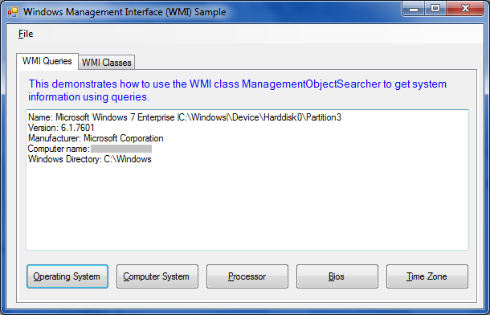

# Working with Windows Management Instrumentation (WMI)
## Requires
- Visual Studio 2010
## License
- Custom
## Technologies
- Windows Forms
- .NET Framework 4.0
## Topics
- System Information
- Windows Management Instrumentation
- BIOS
## Updated
- 06/07/2011
## Description

<h1>Introduction</h1>

Demonstrates how to use objects in the System.Management namespace to access Windows Management Instrumentation (WMI) and to query system information such as operating system name,
 version, manufacturer, and computer name.

<h1>Building the Sample</h1>

Press F5

<h1>Description<em></em></h1>

The two tabbed pages of the TabControl demonstrate two types of WMI tasks:

<ul>
<li>

Queries&nbsp;&nbsp;&nbsp;This one shows how to use the ManagementObjectSearcher object to query the following system information: Operating System Name, Version, Manufacturer, Computer name, and Windows Directory; Computer System
 Manufacturer, Model, System Type, and Total Physical Memory; Processor name; BIOS version; and Time zone. These queries are created by using the SelectQuery class.

</li><li>

Objects&nbsp;&nbsp;&nbsp;This one shows how to enumerate through the top-level WMI classes and all their data management objects using the ManagementClass and EnumerationOptions classes.

</li></ul>
<h1>Screenshot</h1>

<h1>Sample Code<em></em></h1>

Visual Basic

Edit|Remove

vb
<pre class="hidden">    ' This subroutine fills in the output text box with Operating System information
    ' from WMI
    Private Sub btnOperatingSytem_Click(ByVal sender As System.Object, ByVal e As System.EventArgs) Handles btnOperatingSytem.Click
        ' ManagementObjectSearcher retrieves a collection of WMI objects based on 
        ' the query.  In this case a string is used instead of a SelectQuery object.
        Dim search As New ManagementObjectSearcher(&quot;SELECT * FROM Win32_OperatingSystem&quot;)

        ' Display each entry for Win32_OperatingSystem
        Dim info As ManagementObject
        For Each info In search.Get()
            txtOutput.Text = &quot;Name: &quot; &amp; info(&quot;name&quot;).ToString() &amp; vbCrLf
            txtOutput.Text &amp;= &quot;Version: &quot; &amp; info(&quot;version&quot;).ToString() &amp; vbCrLf
            txtOutput.Text &amp;= &quot;Manufacturer: &quot; &amp; info(&quot;manufacturer&quot;).ToString() &amp; vbCrLf
            txtOutput.Text &amp;= &quot;Computer name: &quot; &amp; info(&quot;csname&quot;).ToString() &amp; vbCrLf
            txtOutput.Text &amp;= &quot;Windows Directory: &quot; &amp; _
                info(&quot;windowsdirectory&quot;).ToString() &amp; vbCrLf
        Next
    End Sub</pre>

<pre id="codePreview" class="vb">&nbsp;&nbsp;&nbsp;&nbsp;'&nbsp;This&nbsp;subroutine&nbsp;fills&nbsp;in&nbsp;the&nbsp;output&nbsp;text&nbsp;box&nbsp;with&nbsp;Operating&nbsp;System&nbsp;information&nbsp;
&nbsp;&nbsp;&nbsp;&nbsp;'&nbsp;from&nbsp;WMI&nbsp;
&nbsp;&nbsp;&nbsp;&nbsp;Private&nbsp;Sub&nbsp;btnOperatingSytem_Click(ByVal&nbsp;sender&nbsp;As&nbsp;System.Object,&nbsp;ByVal&nbsp;e&nbsp;As&nbsp;System.EventArgs)&nbsp;Handles&nbsp;btnOperatingSytem.Click&nbsp;
&nbsp;&nbsp;&nbsp;&nbsp;&nbsp;&nbsp;&nbsp;&nbsp;'&nbsp;ManagementObjectSearcher&nbsp;retrieves&nbsp;a&nbsp;collection&nbsp;of&nbsp;WMI&nbsp;objects&nbsp;based&nbsp;on&nbsp;&nbsp;
&nbsp;&nbsp;&nbsp;&nbsp;&nbsp;&nbsp;&nbsp;&nbsp;'&nbsp;the&nbsp;query.&nbsp;&nbsp;In&nbsp;this&nbsp;case&nbsp;a&nbsp;string&nbsp;is&nbsp;used&nbsp;instead&nbsp;of&nbsp;a&nbsp;SelectQuery&nbsp;object.&nbsp;
&nbsp;&nbsp;&nbsp;&nbsp;&nbsp;&nbsp;&nbsp;&nbsp;Dim&nbsp;search&nbsp;As&nbsp;New&nbsp;ManagementObjectSearcher(&quot;SELECT&nbsp;*&nbsp;FROM&nbsp;Win32_OperatingSystem&quot;)&nbsp;
&nbsp;
&nbsp;&nbsp;&nbsp;&nbsp;&nbsp;&nbsp;&nbsp;&nbsp;'&nbsp;Display&nbsp;each&nbsp;entry&nbsp;for&nbsp;Win32_OperatingSystem&nbsp;
&nbsp;&nbsp;&nbsp;&nbsp;&nbsp;&nbsp;&nbsp;&nbsp;Dim&nbsp;info&nbsp;As&nbsp;ManagementObject&nbsp;
&nbsp;&nbsp;&nbsp;&nbsp;&nbsp;&nbsp;&nbsp;&nbsp;For&nbsp;Each&nbsp;info&nbsp;In&nbsp;search.Get()&nbsp;
&nbsp;&nbsp;&nbsp;&nbsp;&nbsp;&nbsp;&nbsp;&nbsp;&nbsp;&nbsp;&nbsp;&nbsp;txtOutput.Text&nbsp;=&nbsp;&quot;Name:&nbsp;&quot;&nbsp;&amp;&nbsp;info(&quot;name&quot;).ToString()&nbsp;&amp;&nbsp;vbCrLf&nbsp;
&nbsp;&nbsp;&nbsp;&nbsp;&nbsp;&nbsp;&nbsp;&nbsp;&nbsp;&nbsp;&nbsp;&nbsp;txtOutput.Text&nbsp;&amp;=&nbsp;&quot;Version:&nbsp;&quot;&nbsp;&amp;&nbsp;info(&quot;version&quot;).ToString()&nbsp;&amp;&nbsp;vbCrLf&nbsp;
&nbsp;&nbsp;&nbsp;&nbsp;&nbsp;&nbsp;&nbsp;&nbsp;&nbsp;&nbsp;&nbsp;&nbsp;txtOutput.Text&nbsp;&amp;=&nbsp;&quot;Manufacturer:&nbsp;&quot;&nbsp;&amp;&nbsp;info(&quot;manufacturer&quot;).ToString()&nbsp;&amp;&nbsp;vbCrLf&nbsp;
&nbsp;&nbsp;&nbsp;&nbsp;&nbsp;&nbsp;&nbsp;&nbsp;&nbsp;&nbsp;&nbsp;&nbsp;txtOutput.Text&nbsp;&amp;=&nbsp;&quot;Computer&nbsp;name:&nbsp;&quot;&nbsp;&amp;&nbsp;info(&quot;csname&quot;).ToString()&nbsp;&amp;&nbsp;vbCrLf&nbsp;
&nbsp;&nbsp;&nbsp;&nbsp;&nbsp;&nbsp;&nbsp;&nbsp;&nbsp;&nbsp;&nbsp;&nbsp;txtOutput.Text&nbsp;&amp;=&nbsp;&quot;Windows&nbsp;Directory:&nbsp;&quot;&nbsp;&amp;&nbsp;_&nbsp;
&nbsp;&nbsp;&nbsp;&nbsp;&nbsp;&nbsp;&nbsp;&nbsp;&nbsp;&nbsp;&nbsp;&nbsp;&nbsp;&nbsp;&nbsp;&nbsp;info(&quot;windowsdirectory&quot;).ToString()&nbsp;&amp;&nbsp;vbCrLf&nbsp;
&nbsp;&nbsp;&nbsp;&nbsp;&nbsp;&nbsp;&nbsp;&nbsp;Next&nbsp;
&nbsp;&nbsp;&nbsp;&nbsp;End&nbsp;Sub</pre>

<h1>Source Code Files</h1>
<ul>
<li><a class="browseFile" href="sourcecode?fileId=23136&pathId=1459912393">MainForm.designer.vb</a>
</li><li><a class="browseFile" href="sourcecode?fileId=23136&pathId=164201288">MainForm.vb</a>
</li></ul>
<h1>More Information</h1>

For more information on Windows Management Insturmentation: <a href="http://msdn.microsoft.com/en-us/library/aa394582%28VS.85%29.aspx" target="_blank">
http://msdn.microsoft.com/en-us/library/aa394582%28VS.85%29.aspx</a>

