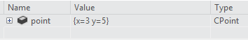
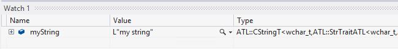
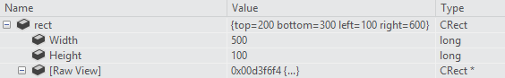
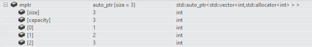

# Writing debugger type visualizers for C++ using .natvis files
## Requires
- Visual Studio 2012
## License
- MS-LPL
## Technologies
- Visual Studio Extensions
- Visual Studio 2012 RC
## Topics
- Debugger
- Debugger Extensibility
## Updated
- 07/09/2012
## Description

<h1>Introduction</h1>

Visual Studio 2012 introduces a new type visualization framework (natvis) for customizing the way C&#43;&#43; types are displayed in debugger variable windows (watch, locals, data tips etc.). It replaces the
<strong>autoexp.dat</strong> file that has been used in earlier versions of Visual Studio, and offers xml syntax, better diagnostics, versioning and multiple file support.&nbsp;You can use this framework to enhance debugger's view of your custom data types.&nbsp;This
 sample page contains syntax reference and examples for visualizer xml elements, instructions for turning on diagnostics, and a simple project that demonstrates VSIX deployment of type visualizers.

&nbsp;

<h1 style="text-align:justify">Building the Sample</h1>

You need to have Visual Studio 2012 RC SDK in order to open and build the project in this sample. You can download it from&nbsp;<a href="http://www.microsoft.com/en-us/download/details.aspx?id=29930">http://www.microsoft.com/en-us/download/details.aspx?id=29930</a>.
 Note that this is necessary only if you are interested in learning more about VSIX deployment of visualizers. You can always manually copy the visualizer files to your Visual Studio installation. This is explained further below.

&nbsp;

<h1 style="text-align:justify">Description</h1>
<h2>Natvis files</h2>

Type visualizers for C&#43;&#43; types are specified in .natvis files. A natvis file is simply an xml file (with a .natvis extension) with its schema defined in &lt;VSINSTALLDIR&gt;\Xml\Schemas\natvis.xsd. A natvis file contains visualization
 rules for one or more types.&nbsp;Visual Studio ships with a few natvis files in &lt;VSINSTALLDIR&gt;\Common7\Packages\Debugger\Visualizers folder. These files contain visualization rules for many common types and can serve as examples when writing visualizers
 for new types.

The basic structure of a natvis file is as follows, where each 'Type' element represents a visualizer entry for a type whose fully qualified name is specified in the 'Name' attribute.

XML

Edit|Remove

xml
<pre class="hidden">&lt;?xml version=&quot;1.0&quot; encoding=&quot;utf-8&quot;?&gt;
&lt;AutoVisualizer xmlns=&quot;http://schemas.microsoft.com/vstudio/debugger/natvis/2010&quot;&gt;
  &lt;Type Name=&quot;MyNamespace::CFoo&quot;&gt;
    ...
  &lt;/Type&gt;
  &lt;Type Name=&quot;...&quot;&gt;
    ...
  &lt;/Type&gt;
&lt;/AutoVisualizer&gt;</pre>

<pre class="xml">&lt;?xml&nbsp;version=&quot;1.0&quot;&nbsp;encoding=&quot;utf-8&quot;?&gt;&nbsp;
&lt;AutoVisualizer&nbsp;xmlns=&quot;http://schemas.microsoft.com/vstudio/debugger/natvis/2010&quot;&gt;&nbsp;
&nbsp;&nbsp;&lt;Type&nbsp;Name=&quot;MyNamespace::CFoo&quot;&gt;&nbsp;
&nbsp;&nbsp;&nbsp;&nbsp;...&nbsp;
&nbsp;&nbsp;&lt;/Type&gt;&nbsp;
&nbsp;&nbsp;&lt;Type&nbsp;Name=&quot;...&quot;&gt;&nbsp;
&nbsp;&nbsp;&nbsp;&nbsp;...&nbsp;
&nbsp;&nbsp;&lt;/Type&gt;&nbsp;
&lt;/AutoVisualizer&gt;</pre>

You can start writing a visualizer for your types by creating a natvis file having the above structure and dropping it into one of the locations below:

<ul>
<li>%VSINSTALLDIR%\Common7\Packages\Debugger\Visualizers (requires admin access) </li><li>%USERPROFILE%\My Documents\Visual Studio 2012\Visualizers\ </li><li>VS extension folders (explained further below) </li></ul>

At the start of each debugging session, Visual Studio will load and process every natvis file it can find in these locations (it is NOT necessary to restart Visual Studio). This makes writing new visualizers easy as you can stop
 debugging, make changes to your visualizer entries, save the natvis file and start debugging again to see the effects of your changes.

<h2>Natvis diagnostics</h2>

Natvis diagnostics is a very important tool that helps troubleshooting issues when writing new type visualizers. When the debugger encounters errors in a visualizer entry (e.g. xml schema errors, expression fails to parse), it
 will simply ignore it and display the type in its raw form or pick another suitable visualizer. To understand why a certain visualizer entry is ignored and to see what the underlying errors are, you can turn on visualization diagnostics which is controlled
 by the following registry value:

[HKEY_CURRENT_USER\Software\Microsoft\VisualStudio\11.0_Config\Debugger]

&quot;EnableNatvisDiagnostics&quot;=dword:00000001

When turned on, you will see diagnostic status messages (e.g. when a natvis file is parsed, an expression is successfully evaluated) and error messages (e.g. file parse errors, expression parse errors) in the output window in Visual
 Studio.

<h2>Syntax Reference</h2>

The structure of a basic visualizer entry looks like:

XML

Edit|Remove

xml
<pre class="hidden">&lt;Type Name=&quot;[fully qualified type name]&quot;&gt;
  &lt;DisplayString Condition=&quot;[Boolean expression]&quot;&gt;[Display value]&lt;/DisplayString&gt;
  &lt;Expand&gt;
    ...
  &lt;/Expand&gt;
&lt;/Type&gt;</pre>

<pre class="xml">&lt;Type&nbsp;Name=&quot;[fully&nbsp;qualified&nbsp;type&nbsp;name]&quot;&gt;&nbsp;
&nbsp;&nbsp;&lt;DisplayString&nbsp;Condition=&quot;[Boolean&nbsp;expression]&quot;&gt;[Display&nbsp;value]&lt;/DisplayString&gt;&nbsp;
&nbsp;&nbsp;&lt;Expand&gt;&nbsp;
&nbsp;&nbsp;&nbsp;&nbsp;...&nbsp;
&nbsp;&nbsp;&lt;/Expand&gt;&nbsp;
&lt;/Type&gt;</pre>

Most of the different xml elements that can be used to define type visualizers are explained in this section with examples.

<h3>Condition attribute</h3>

The optional condition attribute is available for many visualizer elements and specifies when a visualization rule should be used. If the expression inside the condition attribute is false, then the visualization rule specified
 by the element is not applied. If it&rsquo;s evaluated to true, or if there is no condition attribute then the visualization rule is applied to the type. You can use this attribute to have if-else logic in the visualization entries. For instance, the visualizer
 below defines two DisplayString elements for a smart pointer type:

XML

Edit|Remove

xml
<pre class="hidden">&lt;Type Name=&quot;std::auto_ptr&amp;lt;*&amp;gt;&quot;&gt;
  &lt;DisplayString Condition=&quot;_Myptr == 0&quot;&gt;empty&lt;/DisplayString&gt;
  &lt;DisplayString&gt;auto_ptr {*_Myptr}&lt;/DisplayString&gt;
  &lt;Expand&gt;
    &lt;ExpandedItem&gt;_Myptr&lt;/ExpandedItem&gt;
  &lt;/Expand&gt;
&lt;/Type&gt;</pre>

<pre class="xml">&lt;Type&nbsp;Name=&quot;std::auto_ptr&amp;lt;*&amp;gt;&quot;&gt;&nbsp;
&nbsp;&nbsp;&lt;DisplayString&nbsp;Condition=&quot;_Myptr&nbsp;==&nbsp;0&quot;&gt;empty&lt;/DisplayString&gt;&nbsp;
&nbsp;&nbsp;&lt;DisplayString&gt;auto_ptr&nbsp;{*_Myptr}&lt;/DisplayString&gt;&nbsp;
&nbsp;&nbsp;&lt;Expand&gt;&nbsp;
&nbsp;&nbsp;&nbsp;&nbsp;&lt;ExpandedItem&gt;_Myptr&lt;/ExpandedItem&gt;&nbsp;
&nbsp;&nbsp;&lt;/Expand&gt;&nbsp;
&lt;/Type&gt;</pre>

When _Myptr member is null, the condition of the first DisplayString element will be true, therefore that element takes effect. When the _Myptr member is not null, the condition evaluates to false and
 the second DisplayString element takes effect.

<h3>DisplayString</h3>

DisplayString node specifies the string to be shown as the value of the variable. It accepts arbitrary strings mixed with expressions. Everything inside curly braces is interpreted as an expression and gets evaluated. For instance:

XML

Edit|Remove

xml
<pre class="hidden">&lt;Type Name=&quot;CPoint&quot;&gt;
  &lt;DisplayString&gt;{{x={x} y={y}}}&lt;/DisplayString&gt;
&lt;/Type&gt;</pre>

<pre class="xml">&lt;Type&nbsp;Name=&quot;CPoint&quot;&gt;&nbsp;
&nbsp;&nbsp;&lt;DisplayString&gt;{{x={x}&nbsp;y={y}}}&lt;/DisplayString&gt;&nbsp;
&lt;/Type&gt;</pre>

&nbsp;will result in variables of type CPoint to look like:

Here, x and y, which are members of CPoint, are inside curly braces and their values are evaluated. Note that the example also shows you can escape a curly brace by using double curly braces (i.e. {{ or }}).

One important point to remember is DisplayString element is the only element that accepts arbitrary strings and the curly brace syntax. All other visualization elements accept only expressions that are evaluated by the debugger.

<h3>StringView</h3>

Adding a StringView element tells the debugger that this value can be viewed by a text visualizer:

XML

Edit|Remove

xml
<pre class="hidden">&lt;Type Name=&quot;ATL::CStringT&amp;lt;wchar_t,*&amp;gt;&quot;&gt;
  &lt;DisplayString&gt;{m_pszData,su}&lt;/DisplayString&gt;
  &lt;StringView&gt;m_pszData,su&lt;/StringView&gt;
&lt;/Type&gt;</pre>

<pre class="xml">&lt;Type&nbsp;Name=&quot;ATL::CStringT&amp;lt;wchar_t,*&amp;gt;&quot;&gt;&nbsp;
&nbsp;&nbsp;&lt;DisplayString&gt;{m_pszData,su}&lt;/DisplayString&gt;&nbsp;
&nbsp;&nbsp;&lt;StringView&gt;m_pszData,su&lt;/StringView&gt;&nbsp;
&lt;/Type&gt;</pre>

Notice the glass icon shown next to the value below. Clicking the icon will launch the text visualizer which will display the string that m_pszData points to.

<h3>Expand</h3>

Expand node is used to customize the children of the visualized type when the user expands it in the variable windows. It accepts a list of child nodes, which in turn define the child elements. It is important to know that Expand
 node is optional and if no Expand is specified in a visualizer entry, Visual Studio&rsquo;s default expansion rules will be used. If an expand node is specified with no child nodes under it, then the type won&rsquo;t be expandable in the debugger windows (i.e.
 no plus sign next to the variable name).

<h4>Item Expansion</h4>

The Item node, which is the most basic and most common node to be used under an Expand node, defines a single child element. For instance, if you have a CRect class with top, left, right, bottom as its fields and the following
 visualizer entry

XML

Edit|Remove

xml
<pre class="hidden">&lt;Type Name=&quot;CRect&quot;&gt;
  &lt;DisplayString&gt;{{top={top} bottom={bottom} left={left} right={right}}}&lt;/DisplayString&gt;
  &lt;Expand&gt;
    &lt;Item Name=&quot;Width&quot;&gt;right - left&lt;/Item&gt;
    &lt;Item Name=&quot;Height&quot;&gt;bottom - top&lt;/Item&gt;
  &lt;/Expand&gt;
&lt;/Type&gt;</pre>

<pre class="xml">&lt;Type&nbsp;Name=&quot;CRect&quot;&gt;&nbsp;
&nbsp;&nbsp;&lt;DisplayString&gt;{{top={top}&nbsp;bottom={bottom}&nbsp;left={left}&nbsp;right={right}}}&lt;/DisplayString&gt;&nbsp;
&nbsp;&nbsp;&lt;Expand&gt;&nbsp;
&nbsp;&nbsp;&nbsp;&nbsp;&lt;Item&nbsp;Name=&quot;Width&quot;&gt;right&nbsp;-&nbsp;left&lt;/Item&gt;&nbsp;
&nbsp;&nbsp;&nbsp;&nbsp;&lt;Item&nbsp;Name=&quot;Height&quot;&gt;bottom&nbsp;-&nbsp;top&lt;/Item&gt;&nbsp;
&nbsp;&nbsp;&lt;/Expand&gt;&nbsp;
&lt;/Type&gt;</pre>

then CRect type is going to look like below

The expressions specified in Width and Height elements are evaluated and shown in the value column.&nbsp;An additional point to remember is if the expression of the item element points to a complex type then the Item node itself
 will be expandable.

<h4>ArrayItems Expansion</h4>

ArrayItems node can be used to have the debugger interpret the type as an array and display its individual elements. The visualizer for std::vector is a good example using this node:

XML

Edit|Remove

xml
<pre class="hidden">&lt;Type Name=&quot;std::vector&amp;lt;*&amp;gt;&quot;&gt;
  &lt;DisplayString&gt;{{size = {_Mylast - _Myfirst}}}&lt;/DisplayString&gt;
  &lt;Expand&gt;
    &lt;Item Name=&quot;[size]&quot;&gt;_Mylast - _Myfirst&lt;/Item&gt;
    &lt;Item Name=&quot;[capacity]&quot;&gt;(_Myend - _Myfirst)&lt;/Item&gt;
    &lt;ArrayItems&gt;
      &lt;Size&gt;_Mylast - _Myfirst&lt;/Size&gt;
      &lt;ValuePointer&gt;_Myfirst&lt;/ValuePointer&gt;
    &lt;/ArrayItems&gt;
  &lt;/Expand&gt;
&lt;/Type&gt;</pre>

<pre class="xml">&lt;Type&nbsp;Name=&quot;std::vector&amp;lt;*&amp;gt;&quot;&gt;&nbsp;
&nbsp;&nbsp;&lt;DisplayString&gt;{{size&nbsp;=&nbsp;{_Mylast&nbsp;-&nbsp;_Myfirst}}}&lt;/DisplayString&gt;&nbsp;
&nbsp;&nbsp;&lt;Expand&gt;&nbsp;
&nbsp;&nbsp;&nbsp;&nbsp;&lt;Item&nbsp;Name=&quot;[size]&quot;&gt;_Mylast&nbsp;-&nbsp;_Myfirst&lt;/Item&gt;&nbsp;
&nbsp;&nbsp;&nbsp;&nbsp;&lt;Item&nbsp;Name=&quot;[capacity]&quot;&gt;(_Myend&nbsp;-&nbsp;_Myfirst)&lt;/Item&gt;&nbsp;
&nbsp;&nbsp;&nbsp;&nbsp;&lt;ArrayItems&gt;&nbsp;
&nbsp;&nbsp;&nbsp;&nbsp;&nbsp;&nbsp;&lt;Size&gt;_Mylast&nbsp;-&nbsp;_Myfirst&lt;/Size&gt;&nbsp;
&nbsp;&nbsp;&nbsp;&nbsp;&nbsp;&nbsp;&lt;ValuePointer&gt;_Myfirst&lt;/ValuePointer&gt;&nbsp;
&nbsp;&nbsp;&nbsp;&nbsp;&lt;/ArrayItems&gt;&nbsp;
&nbsp;&nbsp;&lt;/Expand&gt;&nbsp;
&lt;/Type&gt;</pre>

A std::vector shows its individual elements when expanded in the variable window:

At a minimum, the ArrayItems node must have the <strong>
'</strong>Size<strong>'</strong> expression (which must evaluate to an integer) for the debugger to understand the length of the array and the 'ValuePointer' expression that should point to the first element (which must be a pointer of the element type that
 is not void*). The array lower bound is assumed to be 0 which can be overridden by using 'LowerBound'&nbsp;node (examples of this can be found in the default natvis files shipped with Visual Studio).

Multi-dimensional arrays can also be specified. The debugger needs just a little bit more information to properly display child elements in that case:

XML

Edit|Remove

xml
<pre class="hidden">&lt;Type Name=&quot;Concurrency::array&amp;lt;*,*&amp;gt;&quot;&gt;
  &lt;DisplayString&gt;extent = {_M_extent}&lt;/DisplayString&gt;
  &lt;Expand&gt;
    &lt;Item Name=&quot;extent&quot;&gt;_M_extent&lt;/Item&gt;
    &lt;ArrayItems Condition=&quot;_M_buffer_descriptor._M_data_ptr != 0&quot;&gt;
      &lt;Direction&gt;Forward&lt;/Direction&gt;
      &lt;Rank&gt;$T2&lt;/Rank&gt;
      &lt;Size&gt;_M_extent._M_base[$i]&lt;/Size&gt;
      &lt;ValuePointer&gt;($T1*) _M_buffer_descriptor._M_data_ptr&lt;/ValuePointer&gt;
    &lt;/ArrayItems&gt;
  &lt;/Expand&gt;
&lt;/Type&gt;</pre>

<pre class="xml">&lt;Type&nbsp;Name=&quot;Concurrency::array&amp;lt;*,*&amp;gt;&quot;&gt;&nbsp;
&nbsp;&nbsp;&lt;DisplayString&gt;extent&nbsp;=&nbsp;{_M_extent}&lt;/DisplayString&gt;&nbsp;
&nbsp;&nbsp;&lt;Expand&gt;&nbsp;
&nbsp;&nbsp;&nbsp;&nbsp;&lt;Item&nbsp;Name=&quot;extent&quot;&gt;_M_extent&lt;/Item&gt;&nbsp;
&nbsp;&nbsp;&nbsp;&nbsp;&lt;ArrayItems&nbsp;Condition=&quot;_M_buffer_descriptor._M_data_ptr&nbsp;!=&nbsp;0&quot;&gt;&nbsp;
&nbsp;&nbsp;&nbsp;&nbsp;&nbsp;&nbsp;&lt;Direction&gt;Forward&lt;/Direction&gt;&nbsp;
&nbsp;&nbsp;&nbsp;&nbsp;&nbsp;&nbsp;&lt;Rank&gt;$T2&lt;/Rank&gt;&nbsp;
&nbsp;&nbsp;&nbsp;&nbsp;&nbsp;&nbsp;&lt;Size&gt;_M_extent._M_base[$i]&lt;/Size&gt;&nbsp;
&nbsp;&nbsp;&nbsp;&nbsp;&nbsp;&nbsp;&lt;ValuePointer&gt;($T1*)&nbsp;_M_buffer_descriptor._M_data_ptr&lt;/ValuePointer&gt;&nbsp;
&nbsp;&nbsp;&nbsp;&nbsp;&lt;/ArrayItems&gt;&nbsp;
&nbsp;&nbsp;&lt;/Expand&gt;&nbsp;
&lt;/Type&gt;</pre>

'Direction' specifies whether the array is row-major or column-major order. 'Rank'&nbsp;specifies the rank of the array. 'Size' element accepts the implicit '$i' parameter which it substitutes with dimension
 index to find the length of the array in that dimension. For instance, in the example above the expression _M_extent.M_base[0] should give the length of the 0th dimension, _M_extent._M_base[1] the 1st and so on.

<h4>IndexListItems Expansion</h4>

ArrayItems assume array elements are laid out contiguously in memory. Debugger gets to the next element by simply incrementing its pointer to the current element. To support cases where you need to manipulate the index to the value
 node, index list items can be used. Here&rsquo;s a visualizer using 'IndexListItems' node:

XML

Edit|Remove

xml
<pre class="hidden">&lt;Type Name=&quot;Concurrency::multi_link_registry&amp;lt;*&amp;gt;&quot;&gt;
  &lt;DisplayString&gt;{{size = {_M_vector._M_index}}}&lt;/DisplayString&gt;
  &lt;Expand&gt;
    &lt;Item Name=&quot;[size]&quot;&gt;_M_vector._M_index&lt;/Item&gt;
    &lt;IndexListItems&gt;
      &lt;Size&gt;_M_vector._M_index&lt;/Size&gt;
      &lt;ValueNode&gt;*(_M_vector._M_array[$i])&lt;/ValueNode&gt;
    &lt;/IndexListItems&gt;
  &lt;/Expand&gt;
&lt;/Type&gt;</pre>

<pre class="xml">&lt;Type&nbsp;Name=&quot;Concurrency::multi_link_registry&amp;lt;*&amp;gt;&quot;&gt;&nbsp;
&nbsp;&nbsp;&lt;DisplayString&gt;{{size&nbsp;=&nbsp;{_M_vector._M_index}}}&lt;/DisplayString&gt;&nbsp;
&nbsp;&nbsp;&lt;Expand&gt;&nbsp;
&nbsp;&nbsp;&nbsp;&nbsp;&lt;Item&nbsp;Name=&quot;[size]&quot;&gt;_M_vector._M_index&lt;/Item&gt;&nbsp;
&nbsp;&nbsp;&nbsp;&nbsp;&lt;IndexListItems&gt;&nbsp;
&nbsp;&nbsp;&nbsp;&nbsp;&nbsp;&nbsp;&lt;Size&gt;_M_vector._M_index&lt;/Size&gt;&nbsp;
&nbsp;&nbsp;&nbsp;&nbsp;&nbsp;&nbsp;&lt;ValueNode&gt;*(_M_vector._M_array[$i])&lt;/ValueNode&gt;&nbsp;
&nbsp;&nbsp;&nbsp;&nbsp;&lt;/IndexListItems&gt;&nbsp;
&nbsp;&nbsp;&lt;/Expand&gt;&nbsp;
&lt;/Type&gt;</pre>

The only difference between ArrayItems and IndexListItems is that the 'ValueNode' expects the full expression to the ith&nbsp; element with the implicit '$i' parameter.

<h4>LinkedListItems Expansion</h4>

If the visualized type represents a linked list, debugger can be instructed to display its children via 'LinkedListItems' node. Here&rsquo;s the visualizer for the CAtlList type using this node:

XML

Edit|Remove

xml
<pre class="hidden">&lt;Type Name=&quot;ATL::CAtlList&amp;lt;*,*&amp;gt;&quot;&gt;
  &lt;DisplayString&gt;{{Count = {m_nElements}}}&lt;/DisplayString&gt;
  &lt;Expand&gt;
    &lt;Item Name=&quot;Count&quot;&gt;m_nElements&lt;/Item&gt;
    &lt;LinkedListItems&gt;
      &lt;Size&gt;m_nElements&lt;/Size&gt;
      &lt;HeadPointer&gt;m_pHead&lt;/HeadPointer&gt;
      &lt;NextPointer&gt;m_pNext&lt;/NextPointer&gt;
      &lt;ValueNode&gt;m_element&lt;/ValueNode&gt;
    &lt;/LinkedListItems&gt;
  &lt;/Expand&gt;
&lt;/Type&gt;</pre>

<pre class="xml">&lt;Type&nbsp;Name=&quot;ATL::CAtlList&amp;lt;*,*&amp;gt;&quot;&gt;&nbsp;
&nbsp;&nbsp;&lt;DisplayString&gt;{{Count&nbsp;=&nbsp;{m_nElements}}}&lt;/DisplayString&gt;&nbsp;
&nbsp;&nbsp;&lt;Expand&gt;&nbsp;
&nbsp;&nbsp;&nbsp;&nbsp;&lt;Item&nbsp;Name=&quot;Count&quot;&gt;m_nElements&lt;/Item&gt;&nbsp;
&nbsp;&nbsp;&nbsp;&nbsp;&lt;LinkedListItems&gt;&nbsp;
&nbsp;&nbsp;&nbsp;&nbsp;&nbsp;&nbsp;&lt;Size&gt;m_nElements&lt;/Size&gt;&nbsp;
&nbsp;&nbsp;&nbsp;&nbsp;&nbsp;&nbsp;&lt;HeadPointer&gt;m_pHead&lt;/HeadPointer&gt;&nbsp;
&nbsp;&nbsp;&nbsp;&nbsp;&nbsp;&nbsp;&lt;NextPointer&gt;m_pNext&lt;/NextPointer&gt;&nbsp;
&nbsp;&nbsp;&nbsp;&nbsp;&nbsp;&nbsp;&lt;ValueNode&gt;m_element&lt;/ValueNode&gt;&nbsp;
&nbsp;&nbsp;&nbsp;&nbsp;&lt;/LinkedListItems&gt;&nbsp;
&nbsp;&nbsp;&lt;/Expand&gt;&nbsp;
&lt;/Type&gt;</pre>

'Size' expression refers to the length of the list, 'HeadPointer' points to the first element, 'NextPointer' refers to the next element, and 'ValueNode' refers to the value of the item. Two important points
 to remember with LinkedListItems node are:

<ol>
<li>'NextPointer' and 'ValueNode' expressions are evaluated under the context of the linked list node element and not the parent list type. In the example above, CAtlList has a CNode class (can be found in atlcoll.h) that represents a node of the linked list.
 m_pNext and m_element are fields of that CNode class and not of CAtlList class.&nbsp;
</li><li>'ValueNode' can be left empty or have 'this' to refer to the linked list node itself.
</li></ol>

<h4>TreeItems Expansion</h4>

If the visualized type represents a tree, debugger can walk the tree and display its children via 'TreeItems'&nbsp;node. Here&rsquo;s the visualizer for the std::map type using this expansion:

XML

Edit|Remove

xml
<pre class="hidden">&lt;Type Name=&quot;std::map&amp;lt;*&amp;gt;&quot;&gt;
  &lt;DisplayString&gt;{{size = {_Mysize}}}&lt;/DisplayString&gt;
  &lt;Expand&gt;
    &lt;Item Name=&quot;[size]&quot;&gt;_Mysize&lt;/Item&gt;
    &lt;Item Name=&quot;[comp]&quot;&gt;comp&lt;/Item&gt;
    &lt;TreeItems&gt;
      &lt;Size&gt;_Mysize&lt;/Size&gt;
      &lt;HeadPointer&gt;_Myhead-&amp;gt;_Parent&lt;/HeadPointer&gt;
      &lt;LeftPointer&gt;_Left&lt;/LeftPointer&gt;
      &lt;RightPointer&gt;_Right&lt;/RightPointer&gt;
      &lt;ValueNode Condition=&quot;!((bool)_Isnil)&quot;&gt;_Myval&lt;/ValueNode&gt;
    &lt;/TreeItems&gt;
  &lt;/Expand&gt;
&lt;/Type&gt;</pre>

<pre class="xml">&lt;Type&nbsp;Name=&quot;std::map&amp;lt;*&amp;gt;&quot;&gt;&nbsp;
&nbsp;&nbsp;&lt;DisplayString&gt;{{size&nbsp;=&nbsp;{_Mysize}}}&lt;/DisplayString&gt;&nbsp;
&nbsp;&nbsp;&lt;Expand&gt;&nbsp;
&nbsp;&nbsp;&nbsp;&nbsp;&lt;Item&nbsp;Name=&quot;[size]&quot;&gt;_Mysize&lt;/Item&gt;&nbsp;
&nbsp;&nbsp;&nbsp;&nbsp;&lt;Item&nbsp;Name=&quot;[comp]&quot;&gt;comp&lt;/Item&gt;&nbsp;
&nbsp;&nbsp;&nbsp;&nbsp;&lt;TreeItems&gt;&nbsp;
&nbsp;&nbsp;&nbsp;&nbsp;&nbsp;&nbsp;&lt;Size&gt;_Mysize&lt;/Size&gt;&nbsp;
&nbsp;&nbsp;&nbsp;&nbsp;&nbsp;&nbsp;&lt;HeadPointer&gt;_Myhead-&amp;gt;_Parent&lt;/HeadPointer&gt;&nbsp;
&nbsp;&nbsp;&nbsp;&nbsp;&nbsp;&nbsp;&lt;LeftPointer&gt;_Left&lt;/LeftPointer&gt;&nbsp;
&nbsp;&nbsp;&nbsp;&nbsp;&nbsp;&nbsp;&lt;RightPointer&gt;_Right&lt;/RightPointer&gt;&nbsp;
&nbsp;&nbsp;&nbsp;&nbsp;&nbsp;&nbsp;&lt;ValueNode&nbsp;Condition=&quot;!((bool)_Isnil)&quot;&gt;_Myval&lt;/ValueNode&gt;&nbsp;
&nbsp;&nbsp;&nbsp;&nbsp;&lt;/TreeItems&gt;&nbsp;
&nbsp;&nbsp;&lt;/Expand&gt;&nbsp;
&lt;/Type&gt;</pre>

The syntax is very similar to LinkedListItems node. 'LeftPointer', 'RightPointer', 'ValueNode' are evaluated under the context of the tree node class, and 'ValueNode' can be left empty or have &ldquo;this&rdquo;
 to refer to the tree node itself.

<h4>ExpandedItem Expansion</h4>

ExpandedItem can be used to generate an aggregated children view by having properties coming from base classes or data members displayed as if they were children of the visualized type. The specified expression is evaluated and
 the child nodes of the result are appended to the children list of the visualized type. For instance, suppose we have a smart pointer type auto_ptr&lt;vector&lt;int&gt;&gt; which will normally be displayed as:

To see the values of the vector, we need to drill down two levels in the variable window passing through _Myptr member. Adding a visualizer entry using ExpandedItem element:

XML

Edit|Remove

xml
<pre class="hidden">&lt;Type Name=&quot;std::auto_ptr&amp;lt;*&amp;gt;&quot;&gt;
  &lt;DisplayString&gt;auto_ptr {*_Myptr}&lt;/DisplayString&gt;
  &lt;Expand&gt;
    &lt;ExpandedItem&gt;_Myptr&lt;/ExpandedItem&gt;
  &lt;/Expand&gt;
&lt;/Type&gt;</pre>

<pre class="xml">&lt;Type&nbsp;Name=&quot;std::auto_ptr&amp;lt;*&amp;gt;&quot;&gt;&nbsp;
&nbsp;&nbsp;&lt;DisplayString&gt;auto_ptr&nbsp;{*_Myptr}&lt;/DisplayString&gt;&nbsp;
&nbsp;&nbsp;&lt;Expand&gt;&nbsp;
&nbsp;&nbsp;&nbsp;&nbsp;&lt;ExpandedItem&gt;_Myptr&lt;/ExpandedItem&gt;&nbsp;
&nbsp;&nbsp;&lt;/Expand&gt;&nbsp;
&lt;/Type&gt;</pre>

we can eliminate _Myptr variable from the hierarchy and directly view vector elements:

<h4>Synthetic Item Expansion</h4>

'Synthetic' node allows one to create an artificial child element (i.e. one that is not a result of an expression) which might contain children elements on its own. The example below shows two such nodes which is, it is used to
 create an artificial node:

XML

Edit|Remove

xml
<pre class="hidden">&lt;Type Name=&quot;Rectangle&quot;&gt; 
  &lt;Expand&gt; 
    &lt;Synthetic Name=&quot;Am I a square?&quot; Condition=&quot;height==width&quot;&gt; 
      &lt;DisplayString&gt;Yes I am. &lt;/DisplayString&gt;
    &lt;/Synthetic&gt; 
    &lt;Synthetic Name=&quot;Am I a square?&quot; Condition=&quot;height!=width&quot;&gt; 
      &lt;DisplayString&gt;No I am not.&lt;/DisplayString&gt;
    &lt;/Synthetic&gt; 
  &lt;/Expand&gt; 
&lt;/Type&gt; </pre>

<pre class="xml">&lt;Type&nbsp;Name=&quot;Rectangle&quot;&gt;&nbsp;&nbsp;
&nbsp;&nbsp;&lt;Expand&gt;&nbsp;&nbsp;
&nbsp;&nbsp;&nbsp;&nbsp;&lt;Synthetic&nbsp;Name=&quot;Am&nbsp;I&nbsp;a&nbsp;square?&quot;&nbsp;Condition=&quot;height==width&quot;&gt;&nbsp;&nbsp;
&nbsp;&nbsp;&nbsp;&nbsp;&nbsp;&nbsp;&lt;DisplayString&gt;Yes&nbsp;I&nbsp;am.&nbsp;&lt;/DisplayString&gt;&nbsp;
&nbsp;&nbsp;&nbsp;&nbsp;&lt;/Synthetic&gt;&nbsp;&nbsp;
&nbsp;&nbsp;&nbsp;&nbsp;&lt;Synthetic&nbsp;Name=&quot;Am&nbsp;I&nbsp;a&nbsp;square?&quot;&nbsp;Condition=&quot;height!=width&quot;&gt;&nbsp;&nbsp;
&nbsp;&nbsp;&nbsp;&nbsp;&nbsp;&nbsp;&lt;DisplayString&gt;No&nbsp;I&nbsp;am&nbsp;not.&lt;/DisplayString&gt;&nbsp;
&nbsp;&nbsp;&nbsp;&nbsp;&lt;/Synthetic&gt;&nbsp;&nbsp;
&nbsp;&nbsp;&lt;/Expand&gt;&nbsp;&nbsp;
&lt;/Type&gt;&nbsp;</pre>

<h2 class="endscriptcode">Visualizer &ndash; Type Matching</h2>

Here are the general rules governing how visualizers are matched with types to be viewed in the debugger windows:

<ul>
<li style="text-align:justify">A visualizer entry is applicable for the type specified in its name attribute AND for all the types that are derived from it. If there is a visualizer for both a base class and the derived class, the derived class visualizer takes
 precedence. </li><li style="text-align:justify">Name attribute of the Type element accepts &ldquo;*&rdquo; as a wildcard character that can be used for templated class names:

XML

Edit|Remove

xml
<pre class="hidden">&lt;Type Name=&quot;ATL::CAtlArray&amp;lt;*&amp;gt;&quot;&gt;
  &lt;DisplayString&gt;{{Count = {m_nSize}}}&lt;/DisplayString&gt;
&lt;/Type&gt;</pre>

<pre class="xml">&lt;Type&nbsp;Name=&quot;ATL::CAtlArray&amp;lt;*&amp;gt;&quot;&gt;&nbsp;
&nbsp;&nbsp;&lt;DisplayString&gt;{{Count&nbsp;=&nbsp;{m_nSize}}}&lt;/DisplayString&gt;&nbsp;
&lt;/Type&gt;</pre>

Here, the same visualizer will be used whether the object is a CAtlArray&lt;int&gt; or a CAtlArray&lt;float&gt;. If there is another visualizer entry for a &ldquo;CAtlArray&lt;float&gt;&rdquo; then it
 takes precedence over the generic one.&nbsp;

Note that template parameters can be referenced in the visualizer entry by using macros
<strong>$T1, $T2</strong>&hellip; Please see the visualizer files shipped with Visual Studio to find examples of these.

</li></ul>
<ul>
<li>If a visualizer entry fails to parse and validate then the next available visualizer is used.
</li></ul>
<h2>Versioning</h2>

Visualizers can be scoped to specific modules and their versions so that name collisions can be minimized and different visualizers can be used for different versions of the types. The optional version element is used to specify
 this. For instance:

XML

Edit|Remove

xml
<pre class="hidden">  &lt;Type Name=&quot;DirectUI::Border&quot;&gt;
    &lt;Version Name=&quot;Windows.UI.Xaml.dll&quot; Min=&quot;1.0&quot; Max=&quot;1.5&quot;/&gt;
    &lt;DisplayString&gt;{{Name = {*(m_pDO-&amp;gt;m_pstrName)}}}&lt;/DisplayString&gt;
    &lt;Expand&gt;
      &lt;ExpandedItem&gt;*(CBorder*)(m_pDO)&lt;/ExpandedItem&gt;    &lt;/Expand&gt;
  &lt;/Type&gt;</pre>

<pre class="xml">&nbsp;&nbsp;&lt;Type&nbsp;Name=&quot;DirectUI::Border&quot;&gt;&nbsp;
&nbsp;&nbsp;&nbsp;&nbsp;&lt;Version&nbsp;Name=&quot;Windows.UI.Xaml.dll&quot;&nbsp;Min=&quot;1.0&quot;&nbsp;Max=&quot;1.5&quot;/&gt;&nbsp;
&nbsp;&nbsp;&nbsp;&nbsp;&lt;DisplayString&gt;{{Name&nbsp;=&nbsp;{*(m_pDO-&amp;gt;m_pstrName)}}}&lt;/DisplayString&gt;&nbsp;
&nbsp;&nbsp;&nbsp;&nbsp;&lt;Expand&gt;&nbsp;
&nbsp;&nbsp;&nbsp;&nbsp;&nbsp;&nbsp;&lt;ExpandedItem&gt;*(CBorder*)(m_pDO)&lt;/ExpandedItem&gt;&nbsp;&nbsp;&nbsp;&nbsp;&lt;/Expand&gt;&nbsp;
&nbsp;&nbsp;&lt;/Type&gt;</pre>

Here, the visualizer is only applicable for the DirectUI::Border type found in the Windows.UI.Xaml.dll from version 1.0 to 1.5. Note that while adding version elements
 will scope visualizer entry to a particular module / version and reduce inadvertent matches, if a type is defined in a common header file that is used by different modules, it will prevent the visualizer from taking effect when the type is not in the specified
 module.

 

<h2 style="text-align:justify">VSIX deployment</h2>

You can always manually copy natvis files to one of the predetermined locations for the debugger to discover and load them but you can make it easier for the developers using your visualizers to deploy them via VSIX.&nbsp;

The attached sample project shows how you can do this which is actually pretty simple and straightforward. Once you create your natvis file and add it to your project, you need to

<ol>
<li>Include it in VSIX by going to the property tab for the natvis file and set 'Include in VSIX' attribute to 'True'.
</li><li>&nbsp;Declare it as a NativeVisualizer asset in the vsixmanifest: </li></ol>

XML

Edit|Remove

xml
<pre class="hidden">&lt;PackageManifest ...&gt;
  ...
  &lt;Assets&gt;
    &lt;Asset Type=&quot;NativeVisualizer&quot; Path=&quot;vector.natvis&quot;/&gt;
  &lt;/Assets&gt;
&lt;/PackageManifest&gt;</pre>

<pre class="xml">&lt;PackageManifest&nbsp;...&gt;&nbsp;
&nbsp;&nbsp;...&nbsp;
&nbsp;&nbsp;&lt;Assets&gt;&nbsp;
&nbsp;&nbsp;&nbsp;&nbsp;&lt;Asset&nbsp;Type=&quot;NativeVisualizer&quot;&nbsp;Path=&quot;vector.natvis&quot;/&gt;&nbsp;
&nbsp;&nbsp;&lt;/Assets&gt;&nbsp;
&lt;/PackageManifest&gt;</pre>

Once you build the attached project and install it, you can try viewing variables of type std::vector&lt;int&gt;. You should see 'CUSTOM VISUALIZER: ...' in the value column for them.

