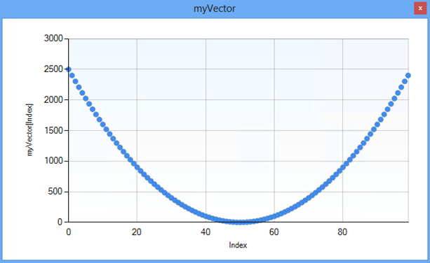

# Writing graphical debugger visualizers for C++
## Requires
- Visual Studio 2012
## License
- MS-LPL
## Technologies
- Visual Studio 2012
## Topics
- Debugger Extensibility
## Updated
- 02/07/2013
## Description

<h1>Introduction</h1>

Visual Studio 2012 introduces support for graphical debugger visualizer plugins for native types. These visualizers allow developers to view a variable or an object in a custom user interface that is appropriate for the data type.
 They complement the existing visualizers that have been used in Visual Studio debugger (e.g. built-in text, HTML, XML visualizers and the visualizers for .NET objects).

This sample project demonstrates how to create a simple native visualizer for std::vector&lt;int&gt; objects. The visualizer is packaged in a VSIX that can be easily deployed to a user&rsquo;s machine.&nbsp;

<h1>Building the Sample</h1>

You need to have Visual Studio 2012 SDK in order to open and build the project in this sample. You can download it from
<a href="http://www.microsoft.com/en-us/download/details.aspx?id=30668">http://www.microsoft.com/en-us/download/details.aspx?id=30668</a>.

<h1>Description</h1>

The following sections briefly explain the steps involved in creating a graphical debugger visualizer:

<h4>1.&nbsp;&nbsp;&nbsp;&nbsp;&nbsp; Create a VSPackage to host the visualizer service</h4>

The visualizer code must be contained in a package which will be loaded by the debugger when needed. You can create your visualizer project based on the &ldquo;Visual Studio Package&rdquo; template to help with this. Note that
 you can implement this VSPackage in different programming languages (this sample uses C#). You can just pick the language of your choice in Visual Studio Package Wizard when you are creating the project.

<h4>2.&nbsp;&nbsp;&nbsp;&nbsp;&nbsp; Declare the service to be consumed by the debugger</h4>

The created package must proffer a service to be consumed by the debugger. The relevant code that defines the service in the sample is in VectorVisualizerPackage.cs and shown below. The important point to note below is the GUID
 for the IVectorVisualizerService which will be used in the next step.

C#

Edit|Remove

csharp

<pre class="csharp">///&nbsp;&lt;summary&gt;&nbsp;
///&nbsp;Vector&nbsp;visualizer&nbsp;service&nbsp;exposed&nbsp;by&nbsp;the&nbsp;package&nbsp;
///&nbsp;&lt;/summary&gt;&nbsp;
[Guid(&quot;5452AFEA-3DF6-46BB-9177-C0B08F318025&quot;)]&nbsp;
public&nbsp;interface&nbsp;IVectorVisualizerService&nbsp;{&nbsp;}&nbsp;
&nbsp;
[PackageRegistration(UseManagedResourcesOnly&nbsp;=&nbsp;true)]&nbsp;
[ProvideService(typeof(IVectorVisualizerService),&nbsp;ServiceName&nbsp;=&nbsp;&quot;VectorVisualizerService&quot;)]&nbsp;
[InstalledProductRegistration(&quot;Vector&nbsp;Visualizer&nbsp;Sample&quot;,&nbsp;&quot;Vector&nbsp;Visualizer&nbsp;Sample&quot;,&nbsp;&quot;1.0&quot;)]&nbsp;
[Guid(&quot;C37A4CFC-670F-454A-B40E-AC08578ABABD&quot;)]&nbsp;
public&nbsp;sealed&nbsp;class&nbsp;VectorVisualizerPackage&nbsp;:&nbsp;Package&nbsp;
{&nbsp;
&nbsp;&nbsp;&nbsp;&nbsp;///&nbsp;&lt;summary&gt;&nbsp;
&nbsp;&nbsp;&nbsp;&nbsp;///&nbsp;Initialization&nbsp;of&nbsp;the&nbsp;package;&nbsp;register&nbsp;vector&nbsp;visualizer&nbsp;service&nbsp;
&nbsp;&nbsp;&nbsp;&nbsp;///&nbsp;&lt;/summary&gt;&nbsp;
&nbsp;&nbsp;&nbsp;&nbsp;protected&nbsp;override&nbsp;void&nbsp;Initialize()&nbsp;
&nbsp;&nbsp;&nbsp;&nbsp;{&nbsp;
&nbsp;&nbsp;&nbsp;&nbsp;&nbsp;&nbsp;&nbsp;&nbsp;base.Initialize();&nbsp;
&nbsp;
&nbsp;&nbsp;&nbsp;&nbsp;&nbsp;&nbsp;&nbsp;&nbsp;IServiceContainer&nbsp;serviceContainer&nbsp;=&nbsp;(IServiceContainer)this;&nbsp;
&nbsp;
&nbsp;&nbsp;&nbsp;&nbsp;&nbsp;&nbsp;&nbsp;&nbsp;if&nbsp;(serviceContainer&nbsp;!=&nbsp;null)&nbsp;
&nbsp;&nbsp;&nbsp;&nbsp;&nbsp;&nbsp;&nbsp;&nbsp;{&nbsp;
&nbsp;&nbsp;&nbsp;&nbsp;&nbsp;&nbsp;&nbsp;&nbsp;&nbsp;&nbsp;&nbsp;&nbsp;serviceContainer.AddService(typeof(IVectorVisualizerService),&nbsp;new&nbsp;VectorVisualizerService(),&nbsp;true);&nbsp;
&nbsp;&nbsp;&nbsp;&nbsp;&nbsp;&nbsp;&nbsp;&nbsp;}&nbsp;
&nbsp;&nbsp;&nbsp;&nbsp;}&nbsp;
}&nbsp;
</pre>

<h4>3.&nbsp;&nbsp;&nbsp;&nbsp;&nbsp; Define the visualizer and its applicable types in the natvis file</h4>

In order to register the visualizer with the debugger and to declare the types it can handle, a natvis file must be used (please see
<a href="http://code.msdn.microsoft.com/Writing-type-visualizers-2eae77a2">http://code.msdn.microsoft.com/Writing-type-visualizers-2eae77a2</a> for more information on natvis files). The debugger reads the entries in this file to match types viewed in the debugger
 with the registered visualizers. The following shows the natvis file used by the sample. Note that the guid of the service declared in the previous step is used here:

<h1>

XML

Edit|Remove

xml

<pre class="xml">&lt;?xmlversion=&quot;1.0&quot;encoding=&quot;utf-8&quot;?&gt;&lt;AutoVisualizerxmlns=&quot;http://schemas.microsoft.com/vstudio/debugger/natvis/2010&quot;&gt;&nbsp;
&lt;UIVisualizerServiceId=&quot;{5452AFEA-3DF6-46BB-9177-C0B08F318025}&quot;Id=&quot;1&quot;MenuName=&quot;Vector&nbsp;Visualizer&quot;/&gt;&lt;TypeName=&quot;std::vector&amp;lt;int,*&amp;gt;&quot;&gt;&nbsp;
&lt;UIVisualizerServiceId=&quot;{5452AFEA-3DF6-46BB-9177-C0B08F318025}&quot;Id=&quot;1&quot;/&gt;&lt;/Type&gt;&lt;/AutoVisualizer&gt;</pre>

</h1>

A <strong>UIVisualizer</strong> is identified by a <strong>
ServiceId</strong> - <strong>Id</strong> pair. <strong>ServiceId</strong> is the GUID of the service exposed by the visualizer package, Id is a unique identifier that can be used to differentiate visualizers if a service provides more than one visualizer.
<strong>MenuName</strong> attribute is what the users see as the name of the visualizer when they open the dropdown next to the magnifying glass icon in a debugger variable window.

Each type defined in the natvis file must explicitly list the visualizers that can display them. The debugger reads the visualizer references in the type entries to match types with the registered visualizers.

For VSIX deployment, a NativeVisualizer asset needs to be added to the project. This file should also be included in the extension manifest and the VSIX (i.e. set 'Build Action' to 'Content' and 'Include in VSIX' attribute to true).
 The following shows the related section in source.extension.vsixmanifest:

<h1>

XML

Edit|Remove

xml

<pre class="js">&lt;?xml&nbsp;version=&quot;1.0&quot;&nbsp;encoding=&quot;utf-8&quot;?&gt;&nbsp;
&lt;PackageManifest&nbsp;Version=&quot;2.0.0&quot;&nbsp;xmlns=&quot;http://schemas.microsoft.com/developer/vsx-schema/2011&quot;&nbsp;xmlns:d=&quot;http://schemas.microsoft.com/developer/vsx-schema-design/2011&quot;&gt;&nbsp;
&nbsp;&nbsp;.&nbsp;
&nbsp;&nbsp;.&nbsp;
&nbsp;&nbsp;.&nbsp;
&nbsp;&nbsp;&lt;Assets&gt;&nbsp;
&nbsp;&nbsp;&nbsp;&nbsp;&lt;Asset&nbsp;Type=&quot;NativeVisualizer&quot;&nbsp;Path=&quot;VectorVisualizer.xml&quot;/&gt;&nbsp;
&nbsp;&nbsp;&nbsp;&nbsp;&lt;Asset&nbsp;Type=&quot;Microsoft.VisualStudio.VsPackage&quot;&nbsp;d:Source=&quot;Project&quot;&nbsp;d:ProjectName=&quot;%CurrentProject%&quot;&nbsp;Path=&quot;|%CurrentProject%;PkgdefProjectOutputGroup|&quot;&nbsp;/&gt;&nbsp;
&nbsp;&nbsp;&lt;/Assets&gt;&nbsp;
&lt;/PackageManifest&gt;&nbsp;
</pre>

</h1>
<h4>4. &nbsp; &nbsp; &nbsp;Implement the visualizer service</h4>

The service object exposed by the package must implement IVsCppDebugUIVisualizer interface (defined in Microsoft.VisualStudio.Debugger.Interop.11.0) which will be called by the debugger when the user requests visualization on an
 object. This interface has one DisplayValue method that is implemented in VectorVisualizerService.cs:

<h1>

C#

Edit|Remove

csharp

<pre class="js">///&nbsp;&lt;summary&gt;&nbsp;
///&nbsp;Plots&nbsp;the&nbsp;given&nbsp;vector&nbsp;contents&nbsp;in&nbsp;a&nbsp;modal&nbsp;window&nbsp;
///&nbsp;&lt;/summary&gt;&nbsp;
///&nbsp;&lt;param&nbsp;name=&quot;ownerHwnd&quot;&gt;Parent&nbsp;window&nbsp;hwnd&lt;/param&gt;&nbsp;
///&nbsp;&lt;param&nbsp;name=&quot;visualizerId&quot;&gt;The&nbsp;visualizer&nbsp;id&nbsp;to&nbsp;use&lt;/param&gt;&nbsp;
///&nbsp;&lt;param&nbsp;name=&quot;debugProperty&quot;&gt;DebugProperty&nbsp;for&nbsp;a&nbsp;vector&nbsp;object&lt;/param&gt;&nbsp;
///&nbsp;&lt;returns&gt;An&nbsp;HRESULT&lt;/returns&gt;&nbsp;
public&nbsp;int&nbsp;DisplayValue(uint&nbsp;ownerHwnd,&nbsp;uint&nbsp;visualizerId,&nbsp;IDebugProperty3&nbsp;debugProperty)&nbsp;
</pre>

</h1>

The method is passed an <a href="http://msdn.microsoft.com/en-us/library/bb147018(v=vs.110).aspx">
IDebugProperty3</a> reference which represents the variable being visualized in the debugger variable windows.&nbsp; Using this interface you can get the property values, enumerate children properties shown in the debugger windows to help visualize the variable.
 For instance, the sample visualizer uses IDebugProperty3 methods to get the values of _Myfirst and _Mylast fields of the vector type. After that it uses IDebugMemoryContext2, IDebugMemoryBytes2 interface methods to read the debuggee memory pointed to by the
 _Myfirst field that contains the elements in the vector. Lastly, it display the values read using a chart control.

<h4>5. &nbsp; &nbsp; &nbsp;Test the visualizer</h4>

After you&rsquo;ve built the project, you can test it in the experimental instance of Visual Studio. Using the simple code snippet below, put a breakpoint on the return statement, and start debugging in the experimental instance.
 Launch the visualizer on myVector variable, and

C&#43;&#43;

Edit|Remove

cplusplus

<pre class="cplusplus">void&nbsp;main()&nbsp;
{&nbsp;
&nbsp;&nbsp;&nbsp;&nbsp;std::vector&lt;int&gt;&nbsp;myVector;&nbsp;
&nbsp;
&nbsp;&nbsp;&nbsp;&nbsp;for&nbsp;(int&nbsp;i&nbsp;=&nbsp;0;&nbsp;i&nbsp;&lt;&nbsp;100;&nbsp;i&#43;&#43;)&nbsp;
&nbsp;&nbsp;&nbsp;&nbsp;{&nbsp;
&nbsp;&nbsp;&nbsp;&nbsp;&nbsp;&nbsp;&nbsp;&nbsp;myVector.push_back(&nbsp;((i&nbsp;-&nbsp;50)&nbsp;*&nbsp;(i&nbsp;-&nbsp;50)));&nbsp;
&nbsp;&nbsp;&nbsp;&nbsp;}&nbsp;
&nbsp;
&nbsp;&nbsp;&nbsp;&nbsp;return;&nbsp;
}&nbsp;
</pre>

you should see the following chart that plots the values contained in the myVector variable:

