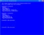

# XInput Win32 Samples
## Requires
- Visual Studio 2012
## License
- MIT
## Technologies
- Win32
- DirectX
- DirectX SDK
## Topics
- Games
## Updated
- 10/12/2015
## Description

The latest version of this sample is hosted on <a href="https://github.com/walbourn/directx-sdk-samples">
GitHub</a>.

This is a collection of the DirectX SDK's original XInput samples updated to use Visual Studio 2012 and the Windows SDK 8.0 without any dependencies on legacy DirectX SDK content. These samples are Win32 desktop applications for Windows 8, Windows 7, and
 Windows Vista.

<strong>This is based on the the legacy DirectX SDK (June 2010) Win32 desktop samples running on Windows Vista, Windows 7, and Windows 8.x. This is not intended for use with Windows Store apps or Windows RT, although the techniques are applicable.</strong>

<em>For Windows Store samples using XInput, see <a href="http://code.msdn.microsoft.com/windowsapps/Simple-XInput-Controller-77c4b8e5">
Game controller sample</a>.</em>

<h1>Description</h1>
<h2>SimpleController</h2>
<h2></h2>

This sample demonstrates XInput's most basic API, XInputGetState. This API is available in all versions of XInput.

<h2>RumbleController</h2>
<h2></h2>

This sample demonstrates XInput's force-feedback rumble API, XInputSetState. This API is available in all versions of XInput.

<h1>Dependancies</h1>

A build using the standard vcxproj files with VS 2012 or VS 2013 will make Win32 desktop applications that are compatible with Windows 8.x using XInput 1.4, as well as configurations that are compatible with Windows Vista, Windows 7, and Windows 8.x using
 XInput 9.1.0.&nbsp;There alternative project files included that will support Windows Vista and Windows 7 using XInput 1.3.

<h1>Building for&nbsp;Windows Vista / Windows 7</h1>

XInput 1.3&nbsp;supports Windows Vista, Windows 7, and Windows 8.x&nbsp;but requires the legacy DirectX SDK. These samples can build with VS 2012 or VS 2013 using the legacy DirectX SDK for down-level support. The *_DXSDK.vcxproj files are set up to include
 the needed references to DXSDK_DIR paths, and include setting the _WIN32_WINNT value to 0x0600 for down-level support.

Due to header-name collision, various #include statements will need to be updated to reflect the install path of the legacy DirectX SDK on your system.

<a href="http://blogs.msdn.com/b/chuckw/archive/2012/03/22/where-is-the-directx-sdk.aspx">Where is the DirectX SDK?</a>

<a href="http://blogs.msdn.com/b/chuckw/archive/2013/07/01/where-is-the-directx-sdk-2013-edition.aspx">Where is the DirectX SDK (2013 Edition)?</a>&nbsp;&nbsp;

<h1>Building with Visual Studio 2013</h1>

This sample can be modified to build with Visual Studio 2013 using the Windows 8.1 SDK.

You can allow VS 2013 to upgrade the projects in place to use Platform Toolset &quot;v120&quot;.

<h1>Version History</h1>
<ul>
<li>November 18, 2013 - Initial release </li></ul>
<h1>More Information</h1>

<a href="http://blogs.msdn.com/b/chuckw/archive/2012/04/26/xinput-and-windows-8-consumer-preview.aspx">XInput and Windows 8</a>

<a href="http://blogs.msdn.com/b/chuckw/archive/2012/05/03/xinput-and-xaudio2.aspx">XInput and XAudio2</a>

<a href="http://blogs.msdn.com/b/chuckw/">Games for Windows and DirectX SDK blog</a>

