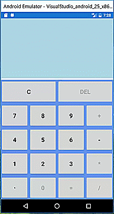
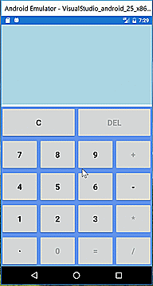
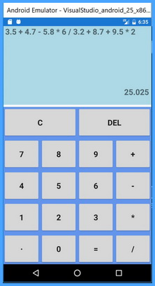
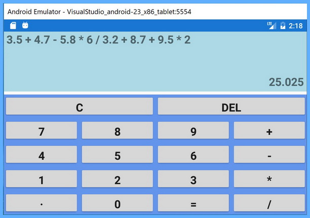

# Xamarin Forms Calculator Using Shunting Yard Algorithm
## Requires
- Visual Studio 2017
## License
- Apache License, Version 2.0
## Technologies
- Xamarin.Forms
- Shunting Yard Algorithm
## Topics
- Calculator Application
## Updated
- 08/01/2017
## Description

<h1>Introduction</h1>

This Xamarin.Forms project builds a native calculator app for Android, iOS and Windows(UWP). It shows how to

<ul>
<li>enable/disable keys according to the inputs so that the input expression will be valid
</li><li>handle operations (&#43;-*/) using shunting-yard algorithm to produce Reverse Polish notation (RPN) which leaves room for more advanced calculators
</li><li>display an expression and its result </li><li>save the entire state when the calculator is terminated, and restore it when the calculator starts up again
</li></ul>
<h1>Prerequirements</h1>
<ul>
<li>Visual Studio 2017 </li><li>Xamarin for Visual Studio </li><li>Google Android Emulator is highly recommended.&nbsp; </li><li>Mac with Xcode and&nbsp;OS X Sierra(10.12) and above on it </li></ul>

&nbsp;

<h1>Running the Sample</h1>
<h2></h2>

<h2>Android:</h2>

Make sure Build and Deploy Configurations for Android Project are checked in Solution -&gt; Properties -&gt; Configuration Properties

It's better to check if Android Virtual Device(AVD) works well in Android Virtual Device Manager ( Tools -&gt; Android ) before building the project.

Picture 1: Android Phone

&nbsp;

picture 2: Android Tablet

&nbsp;

<h2>Windows:</h2>

Make sure Build and Deploy Configurations for UWP Project are checked in Solution -&gt; Properties -&gt; Configuration Properties

picture 1: Local Machine

<h2>iOS:</h2>

Make sure Build and Deploy Configurations for iOS Project are checked in Solution -&gt; Properties -&gt; Configuration Properties

Connect to a Mac and let its Xcode compile the code.&nbsp;

 

<h1>Sample Codes</h1>

To display an expression and its result:

&nbsp;

XAML

Edit|Remove

xaml
<pre class="hidden">&lt;Grid Grid.Row=&quot;0&quot; Grid.Column=&quot;0&quot; x:Name=&quot;infoGrid&quot; BackgroundColor=&quot;LightBlue&quot;&gt;
       &lt;Grid.Resources&gt;
            &lt;ResourceDictionary&gt;
                &lt;Style TargetType=&quot;Label&quot;&gt;
                    &lt;Setter Property=&quot;FontSize&quot; Value=&quot;Large&quot; /&gt;
                    &lt;Setter Property=&quot;FontAttributes&quot; Value=&quot;Bold&quot;&gt;&lt;/Setter&gt;
                &lt;/Style&gt;
            &lt;/ResourceDictionary&gt;
        &lt;/Grid.Resources&gt;

            &lt;Grid.RowDefinitions&gt;
                &lt;RowDefinition Height=&quot;2*&quot; /&gt;
                &lt;RowDefinition Height=&quot;*&quot; /&gt;
            &lt;/Grid.RowDefinitions&gt;

            &lt;Grid.ColumnDefinitions&gt;
                &lt;ColumnDefinition Width=&quot;*&quot; /&gt;
                &lt;ColumnDefinition Width=&quot;0&quot; /&gt;
            &lt;/Grid.ColumnDefinitions&gt;

            &lt;ScrollView Padding=&quot;5, 0&quot; Grid.Row=&quot;0&quot; Grid.Column=&quot;0&quot;&gt;
                &lt;Label Text=&quot;{Binding HistoryString}&quot;/&gt;
            &lt;/ScrollView&gt;

            &lt;Label Text=&quot;{Binding ResultString}&quot;
                   Grid.Row=&quot;1&quot; Grid.Column=&quot;0&quot;
                   LineBreakMode=&quot;HeadTruncation&quot;
                   VerticalOptions=&quot;Center&quot;
                   HorizontalTextAlignment=&quot;End&quot;/&gt;
        &lt;/Grid&gt;</pre>

<pre class="xaml">&lt;Grid&nbsp;Grid.Row=&quot;0&quot;&nbsp;Grid.Column=&quot;0&quot;&nbsp;x:Name=&quot;infoGrid&quot;&nbsp;BackgroundColor=&quot;LightBlue&quot;&gt;&nbsp;
&nbsp;&nbsp;&nbsp;&nbsp;&nbsp;&nbsp;&nbsp;&lt;Grid.Resources&gt;&nbsp;
&nbsp;&nbsp;&nbsp;&nbsp;&nbsp;&nbsp;&nbsp;&nbsp;&nbsp;&nbsp;&nbsp;&nbsp;&lt;ResourceDictionary&gt;&nbsp;
&nbsp;&nbsp;&nbsp;&nbsp;&nbsp;&nbsp;&nbsp;&nbsp;&nbsp;&nbsp;&nbsp;&nbsp;&nbsp;&nbsp;&nbsp;&nbsp;&lt;Style&nbsp;TargetType=&quot;Label&quot;&gt;&nbsp;
&nbsp;&nbsp;&nbsp;&nbsp;&nbsp;&nbsp;&nbsp;&nbsp;&nbsp;&nbsp;&nbsp;&nbsp;&nbsp;&nbsp;&nbsp;&nbsp;&nbsp;&nbsp;&nbsp;&nbsp;&lt;Setter&nbsp;Property=&quot;FontSize&quot;&nbsp;Value=&quot;Large&quot;&nbsp;/&gt;&nbsp;
&nbsp;&nbsp;&nbsp;&nbsp;&nbsp;&nbsp;&nbsp;&nbsp;&nbsp;&nbsp;&nbsp;&nbsp;&nbsp;&nbsp;&nbsp;&nbsp;&nbsp;&nbsp;&nbsp;&nbsp;&lt;Setter&nbsp;Property=&quot;FontAttributes&quot;&nbsp;Value=&quot;Bold&quot;&gt;&lt;/Setter&gt;&nbsp;
&nbsp;&nbsp;&nbsp;&nbsp;&nbsp;&nbsp;&nbsp;&nbsp;&nbsp;&nbsp;&nbsp;&nbsp;&nbsp;&nbsp;&nbsp;&nbsp;&lt;/Style&gt;&nbsp;
&nbsp;&nbsp;&nbsp;&nbsp;&nbsp;&nbsp;&nbsp;&nbsp;&nbsp;&nbsp;&nbsp;&nbsp;&lt;/ResourceDictionary&gt;&nbsp;
&nbsp;&nbsp;&nbsp;&nbsp;&nbsp;&nbsp;&nbsp;&nbsp;&lt;/Grid.Resources&gt;&nbsp;
&nbsp;
&nbsp;&nbsp;&nbsp;&nbsp;&nbsp;&nbsp;&nbsp;&nbsp;&nbsp;&nbsp;&nbsp;&nbsp;&lt;Grid.RowDefinitions&gt;&nbsp;
&nbsp;&nbsp;&nbsp;&nbsp;&nbsp;&nbsp;&nbsp;&nbsp;&nbsp;&nbsp;&nbsp;&nbsp;&nbsp;&nbsp;&nbsp;&nbsp;&lt;RowDefinition&nbsp;Height=&quot;2*&quot;&nbsp;/&gt;&nbsp;
&nbsp;&nbsp;&nbsp;&nbsp;&nbsp;&nbsp;&nbsp;&nbsp;&nbsp;&nbsp;&nbsp;&nbsp;&nbsp;&nbsp;&nbsp;&nbsp;&lt;RowDefinition&nbsp;Height=&quot;*&quot;&nbsp;/&gt;&nbsp;
&nbsp;&nbsp;&nbsp;&nbsp;&nbsp;&nbsp;&nbsp;&nbsp;&nbsp;&nbsp;&nbsp;&nbsp;&lt;/Grid.RowDefinitions&gt;&nbsp;
&nbsp;
&nbsp;&nbsp;&nbsp;&nbsp;&nbsp;&nbsp;&nbsp;&nbsp;&nbsp;&nbsp;&nbsp;&nbsp;&lt;Grid.ColumnDefinitions&gt;&nbsp;
&nbsp;&nbsp;&nbsp;&nbsp;&nbsp;&nbsp;&nbsp;&nbsp;&nbsp;&nbsp;&nbsp;&nbsp;&nbsp;&nbsp;&nbsp;&nbsp;&lt;ColumnDefinition&nbsp;Width=&quot;*&quot;&nbsp;/&gt;&nbsp;
&nbsp;&nbsp;&nbsp;&nbsp;&nbsp;&nbsp;&nbsp;&nbsp;&nbsp;&nbsp;&nbsp;&nbsp;&nbsp;&nbsp;&nbsp;&nbsp;&lt;ColumnDefinition&nbsp;Width=&quot;0&quot;&nbsp;/&gt;&nbsp;
&nbsp;&nbsp;&nbsp;&nbsp;&nbsp;&nbsp;&nbsp;&nbsp;&nbsp;&nbsp;&nbsp;&nbsp;&lt;/Grid.ColumnDefinitions&gt;&nbsp;
&nbsp;
&nbsp;&nbsp;&nbsp;&nbsp;&nbsp;&nbsp;&nbsp;&nbsp;&nbsp;&nbsp;&nbsp;&nbsp;&lt;ScrollView&nbsp;Padding=&quot;5,&nbsp;0&quot;&nbsp;Grid.Row=&quot;0&quot;&nbsp;Grid.Column=&quot;0&quot;&gt;&nbsp;
&nbsp;&nbsp;&nbsp;&nbsp;&nbsp;&nbsp;&nbsp;&nbsp;&nbsp;&nbsp;&nbsp;&nbsp;&nbsp;&nbsp;&nbsp;&nbsp;&lt;Label&nbsp;Text=&quot;{Binding&nbsp;HistoryString}&quot;/&gt;&nbsp;
&nbsp;&nbsp;&nbsp;&nbsp;&nbsp;&nbsp;&nbsp;&nbsp;&nbsp;&nbsp;&nbsp;&nbsp;&lt;/ScrollView&gt;&nbsp;
&nbsp;
&nbsp;&nbsp;&nbsp;&nbsp;&nbsp;&nbsp;&nbsp;&nbsp;&nbsp;&nbsp;&nbsp;&nbsp;&lt;Label&nbsp;Text=&quot;{Binding&nbsp;ResultString}&quot;&nbsp;
&nbsp;&nbsp;&nbsp;&nbsp;&nbsp;&nbsp;&nbsp;&nbsp;&nbsp;&nbsp;&nbsp;&nbsp;&nbsp;&nbsp;&nbsp;&nbsp;&nbsp;&nbsp;&nbsp;Grid.Row=&quot;1&quot;&nbsp;Grid.Column=&quot;0&quot;&nbsp;
&nbsp;&nbsp;&nbsp;&nbsp;&nbsp;&nbsp;&nbsp;&nbsp;&nbsp;&nbsp;&nbsp;&nbsp;&nbsp;&nbsp;&nbsp;&nbsp;&nbsp;&nbsp;&nbsp;LineBreakMode=&quot;HeadTruncation&quot;&nbsp;
&nbsp;&nbsp;&nbsp;&nbsp;&nbsp;&nbsp;&nbsp;&nbsp;&nbsp;&nbsp;&nbsp;&nbsp;&nbsp;&nbsp;&nbsp;&nbsp;&nbsp;&nbsp;&nbsp;VerticalOptions=&quot;Center&quot;&nbsp;
&nbsp;&nbsp;&nbsp;&nbsp;&nbsp;&nbsp;&nbsp;&nbsp;&nbsp;&nbsp;&nbsp;&nbsp;&nbsp;&nbsp;&nbsp;&nbsp;&nbsp;&nbsp;&nbsp;HorizontalTextAlignment=&quot;End&quot;/&gt;&nbsp;
&nbsp;&nbsp;&nbsp;&nbsp;&nbsp;&nbsp;&nbsp;&nbsp;&lt;/Grid&gt;</pre>

To compute the RPN:

&nbsp;

C#

Edit|Remove

csharp
<pre class="hidden">double ComputeRpn(string[] rpn)
        {
            Stack&lt;double&gt; numbers = new Stack&lt;double&gt;();
            double operand1, operand2;

            foreach (string input in rpn)
            {
                if (IsOperator(input))
                {
                    operand2 = numbers.Pop();
                    operand1 = numbers.Pop();
                    numbers.Push(ComputeBasic(operand1, operand2, input));
                }
                else
                {
                    numbers.Push(double.Parse(input));
                }
            }

            if (numbers.Count == 1)
            {
                return numbers.Pop();
            }
            return -0.0000; // Error(s)
        }

double ComputeBasic( double operand1, double operand2, string operation)
        {
            switch (operation)
            {
                case &quot;&#43;&quot;:
                    return operand1 &#43; operand2;
                case &quot;-&quot;:
                    return operand1 - operand2;
                case &quot;*&quot;:
                    return operand1 * operand2;
                case &quot;/&quot;:
                    return operand1 / operand2;
                default:
                    return -0.0000; // error
            }
        }</pre>

<pre class="csharp">double&nbsp;ComputeRpn(string[]&nbsp;rpn)&nbsp;
&nbsp;&nbsp;&nbsp;&nbsp;&nbsp;&nbsp;&nbsp;&nbsp;{&nbsp;
&nbsp;&nbsp;&nbsp;&nbsp;&nbsp;&nbsp;&nbsp;&nbsp;&nbsp;&nbsp;&nbsp;&nbsp;Stack&lt;double&gt;&nbsp;numbers&nbsp;=&nbsp;new&nbsp;Stack&lt;double&gt;();&nbsp;
&nbsp;&nbsp;&nbsp;&nbsp;&nbsp;&nbsp;&nbsp;&nbsp;&nbsp;&nbsp;&nbsp;&nbsp;double&nbsp;operand1,&nbsp;operand2;&nbsp;
&nbsp;
&nbsp;&nbsp;&nbsp;&nbsp;&nbsp;&nbsp;&nbsp;&nbsp;&nbsp;&nbsp;&nbsp;&nbsp;foreach&nbsp;(string&nbsp;input&nbsp;in&nbsp;rpn)&nbsp;
&nbsp;&nbsp;&nbsp;&nbsp;&nbsp;&nbsp;&nbsp;&nbsp;&nbsp;&nbsp;&nbsp;&nbsp;{&nbsp;
&nbsp;&nbsp;&nbsp;&nbsp;&nbsp;&nbsp;&nbsp;&nbsp;&nbsp;&nbsp;&nbsp;&nbsp;&nbsp;&nbsp;&nbsp;&nbsp;if&nbsp;(IsOperator(input))&nbsp;
&nbsp;&nbsp;&nbsp;&nbsp;&nbsp;&nbsp;&nbsp;&nbsp;&nbsp;&nbsp;&nbsp;&nbsp;&nbsp;&nbsp;&nbsp;&nbsp;{&nbsp;
&nbsp;&nbsp;&nbsp;&nbsp;&nbsp;&nbsp;&nbsp;&nbsp;&nbsp;&nbsp;&nbsp;&nbsp;&nbsp;&nbsp;&nbsp;&nbsp;&nbsp;&nbsp;&nbsp;&nbsp;operand2&nbsp;=&nbsp;numbers.Pop();&nbsp;
&nbsp;&nbsp;&nbsp;&nbsp;&nbsp;&nbsp;&nbsp;&nbsp;&nbsp;&nbsp;&nbsp;&nbsp;&nbsp;&nbsp;&nbsp;&nbsp;&nbsp;&nbsp;&nbsp;&nbsp;operand1&nbsp;=&nbsp;numbers.Pop();&nbsp;
&nbsp;&nbsp;&nbsp;&nbsp;&nbsp;&nbsp;&nbsp;&nbsp;&nbsp;&nbsp;&nbsp;&nbsp;&nbsp;&nbsp;&nbsp;&nbsp;&nbsp;&nbsp;&nbsp;&nbsp;numbers.Push(ComputeBasic(operand1,&nbsp;operand2,&nbsp;input));&nbsp;
&nbsp;&nbsp;&nbsp;&nbsp;&nbsp;&nbsp;&nbsp;&nbsp;&nbsp;&nbsp;&nbsp;&nbsp;&nbsp;&nbsp;&nbsp;&nbsp;}&nbsp;
&nbsp;&nbsp;&nbsp;&nbsp;&nbsp;&nbsp;&nbsp;&nbsp;&nbsp;&nbsp;&nbsp;&nbsp;&nbsp;&nbsp;&nbsp;&nbsp;else&nbsp;
&nbsp;&nbsp;&nbsp;&nbsp;&nbsp;&nbsp;&nbsp;&nbsp;&nbsp;&nbsp;&nbsp;&nbsp;&nbsp;&nbsp;&nbsp;&nbsp;{&nbsp;
&nbsp;&nbsp;&nbsp;&nbsp;&nbsp;&nbsp;&nbsp;&nbsp;&nbsp;&nbsp;&nbsp;&nbsp;&nbsp;&nbsp;&nbsp;&nbsp;&nbsp;&nbsp;&nbsp;&nbsp;numbers.Push(double.Parse(input));&nbsp;
&nbsp;&nbsp;&nbsp;&nbsp;&nbsp;&nbsp;&nbsp;&nbsp;&nbsp;&nbsp;&nbsp;&nbsp;&nbsp;&nbsp;&nbsp;&nbsp;}&nbsp;
&nbsp;&nbsp;&nbsp;&nbsp;&nbsp;&nbsp;&nbsp;&nbsp;&nbsp;&nbsp;&nbsp;&nbsp;}&nbsp;
&nbsp;
&nbsp;&nbsp;&nbsp;&nbsp;&nbsp;&nbsp;&nbsp;&nbsp;&nbsp;&nbsp;&nbsp;&nbsp;if&nbsp;(numbers.Count&nbsp;==&nbsp;1)&nbsp;
&nbsp;&nbsp;&nbsp;&nbsp;&nbsp;&nbsp;&nbsp;&nbsp;&nbsp;&nbsp;&nbsp;&nbsp;{&nbsp;
&nbsp;&nbsp;&nbsp;&nbsp;&nbsp;&nbsp;&nbsp;&nbsp;&nbsp;&nbsp;&nbsp;&nbsp;&nbsp;&nbsp;&nbsp;&nbsp;return&nbsp;numbers.Pop();&nbsp;
&nbsp;&nbsp;&nbsp;&nbsp;&nbsp;&nbsp;&nbsp;&nbsp;&nbsp;&nbsp;&nbsp;&nbsp;}&nbsp;
&nbsp;&nbsp;&nbsp;&nbsp;&nbsp;&nbsp;&nbsp;&nbsp;&nbsp;&nbsp;&nbsp;&nbsp;return&nbsp;-0.0000;&nbsp;//&nbsp;Error(s)&nbsp;
&nbsp;&nbsp;&nbsp;&nbsp;&nbsp;&nbsp;&nbsp;&nbsp;}&nbsp;
&nbsp;
double&nbsp;ComputeBasic(&nbsp;double&nbsp;operand1,&nbsp;double&nbsp;operand2,&nbsp;string&nbsp;operation)&nbsp;
&nbsp;&nbsp;&nbsp;&nbsp;&nbsp;&nbsp;&nbsp;&nbsp;{&nbsp;
&nbsp;&nbsp;&nbsp;&nbsp;&nbsp;&nbsp;&nbsp;&nbsp;&nbsp;&nbsp;&nbsp;&nbsp;switch&nbsp;(operation)&nbsp;
&nbsp;&nbsp;&nbsp;&nbsp;&nbsp;&nbsp;&nbsp;&nbsp;&nbsp;&nbsp;&nbsp;&nbsp;{&nbsp;
&nbsp;&nbsp;&nbsp;&nbsp;&nbsp;&nbsp;&nbsp;&nbsp;&nbsp;&nbsp;&nbsp;&nbsp;&nbsp;&nbsp;&nbsp;&nbsp;case&nbsp;&quot;&#43;&quot;:&nbsp;
&nbsp;&nbsp;&nbsp;&nbsp;&nbsp;&nbsp;&nbsp;&nbsp;&nbsp;&nbsp;&nbsp;&nbsp;&nbsp;&nbsp;&nbsp;&nbsp;&nbsp;&nbsp;&nbsp;&nbsp;return&nbsp;operand1&nbsp;&#43;&nbsp;operand2;&nbsp;
&nbsp;&nbsp;&nbsp;&nbsp;&nbsp;&nbsp;&nbsp;&nbsp;&nbsp;&nbsp;&nbsp;&nbsp;&nbsp;&nbsp;&nbsp;&nbsp;case&nbsp;&quot;-&quot;:&nbsp;
&nbsp;&nbsp;&nbsp;&nbsp;&nbsp;&nbsp;&nbsp;&nbsp;&nbsp;&nbsp;&nbsp;&nbsp;&nbsp;&nbsp;&nbsp;&nbsp;&nbsp;&nbsp;&nbsp;&nbsp;return&nbsp;operand1&nbsp;-&nbsp;operand2;&nbsp;
&nbsp;&nbsp;&nbsp;&nbsp;&nbsp;&nbsp;&nbsp;&nbsp;&nbsp;&nbsp;&nbsp;&nbsp;&nbsp;&nbsp;&nbsp;&nbsp;case&nbsp;&quot;*&quot;:&nbsp;
&nbsp;&nbsp;&nbsp;&nbsp;&nbsp;&nbsp;&nbsp;&nbsp;&nbsp;&nbsp;&nbsp;&nbsp;&nbsp;&nbsp;&nbsp;&nbsp;&nbsp;&nbsp;&nbsp;&nbsp;return&nbsp;operand1&nbsp;*&nbsp;operand2;&nbsp;
&nbsp;&nbsp;&nbsp;&nbsp;&nbsp;&nbsp;&nbsp;&nbsp;&nbsp;&nbsp;&nbsp;&nbsp;&nbsp;&nbsp;&nbsp;&nbsp;case&nbsp;&quot;/&quot;:&nbsp;
&nbsp;&nbsp;&nbsp;&nbsp;&nbsp;&nbsp;&nbsp;&nbsp;&nbsp;&nbsp;&nbsp;&nbsp;&nbsp;&nbsp;&nbsp;&nbsp;&nbsp;&nbsp;&nbsp;&nbsp;return&nbsp;operand1&nbsp;/&nbsp;operand2;&nbsp;
&nbsp;&nbsp;&nbsp;&nbsp;&nbsp;&nbsp;&nbsp;&nbsp;&nbsp;&nbsp;&nbsp;&nbsp;&nbsp;&nbsp;&nbsp;&nbsp;default:&nbsp;
&nbsp;&nbsp;&nbsp;&nbsp;&nbsp;&nbsp;&nbsp;&nbsp;&nbsp;&nbsp;&nbsp;&nbsp;&nbsp;&nbsp;&nbsp;&nbsp;&nbsp;&nbsp;&nbsp;&nbsp;return&nbsp;-0.0000;&nbsp;//&nbsp;error&nbsp;
&nbsp;&nbsp;&nbsp;&nbsp;&nbsp;&nbsp;&nbsp;&nbsp;&nbsp;&nbsp;&nbsp;&nbsp;}&nbsp;
&nbsp;&nbsp;&nbsp;&nbsp;&nbsp;&nbsp;&nbsp;&nbsp;}</pre>

&nbsp;

&nbsp;

&nbsp;

