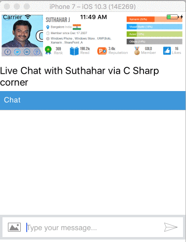

# Xamarin Forms ChatBot using the Microsoft Bot Framework
## Requires
- Visual Studio 2017
## License
- MIT
## Technologies
- Xamarin.Android
- Xamarin.iOS
- Xamarin.Forms
- UWP
- Microsoft Bot Framework
- Bots
## Topics
- Xamarin.Forms
- Microsoft Bot Framework
## Updated
- 06/10/2017
## Description

&nbsp;

<h1 dir="ltr">Introduction:</h1>

The Bots Framework that run inside skype ,web chat , Facebook ,Message ,etc. Users can interact with bots by sending them messages, commands and&nbsp;inline requests. You control your bots using HTTPS requests to our&nbsp;bot
 API.

In this article, how you can integrate a bot right into your Xamarin.Forms application via the Microsoft Bot Framework Web bots.

 

<h1 dir="ltr">Create new bot Application:</h1>

You can read my previous article for Getting Started with Bots Using Visual Studio 2017 from following URL&nbsp;

<a href="https://code.msdn.microsoft.com/Getting-Started-with-4ae6fdb0?redir=0">1.Getting Started with Building Bots using Visual Studio 2017</a>

<h1 dir="ltr">Publish Bot Application to Azure:</h1>

You can read my previous articles for publish bot application to azure from following URL&nbsp;

<a href="https://code.msdn.microsoft.com/Getting-Started-Deploy-a-cfc825ad?redir=0">1.Getting Started Deploy a bot to Azure using Visual studio 2017</a>

&nbsp;

<h1 dir="ltr">Generate Web Chat Code:</h1>

After publish you bots into azure, you can generate web Chat html code from bots portal as per below

<strong>Step 1</strong> 
Sign in to the Bot framework Portal - https://dev.botframework.com/

<strong>Step 2</strong> 
Click My Bots 

<strong>Step 3</strong> 
Select your bot that you want to generate code

<strong>Step 4:</strong>

Click on Get bot embed Codes &gt; Click on Web Chat icon &gt; Click on (Click here to open Web Chat configuration page)

<strong>Step 5:</strong>

It will navigate to new web page for configuration and click on &#43; Add New Site &gt; Provide site or application name &gt; Click on Done

<strong>Step 6:</strong>

You can copy your secret keys and embed code for integrate to xamarin forms application

<h1 dir="ltr"><strong>Create new Xamarin .Forms Application :</strong></h1>

Go to Run (Windows key &#43;R) &gt; type Devenv.exe or select from Windows Application list and select New project from File menu &gt; New Project (ctrl &#43;Shift&#43;N) or click More project template from VS Start screen.

New Project &gt;select Cross -Platform from Template &gt; Cross platform App(Xamarin.Forms or native). It will show the screen, as shown below.

You can find above screen only on VS 2017. Select Blank apps &gt; select Xamarin.Forms &nbsp;&gt; Select PCL and click on Ok .it will generate all the mobile platform project with PC

Open your MainPage.xaml file add webview control with following code for web chat enable

&nbsp;

XAML

Edit|Remove

xaml
<pre class="hidden">  &lt;StackLayout WidthRequest=&quot;300&quot; HeightRequest=&quot;500&quot; &gt;

       &lt;Image Source=&quot;profile.png&quot; WidthRequest=&quot;200&quot; HeightRequest=&quot;200&quot;&gt;&lt;/Image&gt;

       &lt;Label Text=&quot;Live Chat with Suthahar via C Sharp corner&quot; FontSize=&quot;20&quot; &gt;&lt;/Label&gt;

       &lt;WebView x:Name=&quot;webview&quot; Source=&quot;https://webchat.botframework.com/embed/DevEnvExeBot?s=8XGcUROXkAA.cwA.pZo.8pJ-6oQ3sJRpxq0tqIo9uLPji4oxBQuz2pW5qWobw2c&quot;

                WidthRequest=&quot;300&quot; HeightRequest=&quot; 300&quot;&gt;&lt;/WebView&gt;

   &lt;/StackLayout&gt;</pre>

<pre class="xaml">&nbsp;&nbsp;&lt;StackLayout&nbsp;WidthRequest=&quot;300&quot;&nbsp;HeightRequest=&quot;500&quot;&nbsp;&gt;&nbsp;
&nbsp;
&nbsp;&nbsp;&nbsp;&nbsp;&nbsp;&nbsp;&nbsp;&lt;Image&nbsp;Source=&quot;profile.png&quot;&nbsp;WidthRequest=&quot;200&quot;&nbsp;HeightRequest=&quot;200&quot;&gt;&lt;/Image&gt;&nbsp;
&nbsp;
&nbsp;&nbsp;&nbsp;&nbsp;&nbsp;&nbsp;&nbsp;&lt;Label&nbsp;Text=&quot;Live&nbsp;Chat&nbsp;with&nbsp;Suthahar&nbsp;via&nbsp;C&nbsp;Sharp&nbsp;corner&quot;&nbsp;FontSize=&quot;20&quot;&nbsp;&gt;&lt;/Label&gt;&nbsp;
&nbsp;
&nbsp;&nbsp;&nbsp;&nbsp;&nbsp;&nbsp;&nbsp;&lt;WebView&nbsp;x:Name=&quot;webview&quot;&nbsp;Source=&quot;https://webchat.botframework.com/embed/DevEnvExeBot?s=8XGcUROXkAA.cwA.pZo.8pJ-6oQ3sJRpxq0tqIo9uLPji4oxBQuz2pW5qWobw2c&quot;&nbsp;
&nbsp;
&nbsp;&nbsp;&nbsp;&nbsp;&nbsp;&nbsp;&nbsp;&nbsp;&nbsp;&nbsp;&nbsp;&nbsp;&nbsp;&nbsp;&nbsp;&nbsp;WidthRequest=&quot;300&quot;&nbsp;HeightRequest=&quot;&nbsp;300&quot;&gt;&lt;/WebView&gt;&nbsp;
&nbsp;
&nbsp;&nbsp;&nbsp;&lt;/StackLayout&gt;</pre>

&nbsp;

Now you can run the application in windows ,Android and iOS

&nbsp;

<h1 dir="ltr">Summary</h1>

In this article, your learned how to create a Bot application, publish Bot to Azure and bot implementation to Xamarin Forms using Visual Studio 2017. If you have any questions/ feedback/ issues, please write in the
 comment box.

&nbsp;

&nbsp;

&nbsp;

