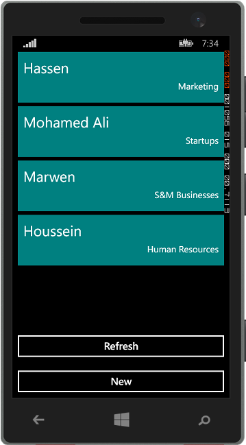

# Xamarin Forms Http clients
## Requires
- Visual Studio 2013
## License
- Apache License, Version 2.0
## Technologies
- Android
- iOS
- PCL
- Xamarin
- Xamarin.Forms
## Topics
- Web Services
- Mobile
- cross platform
- Native apps
## Updated
- 03/05/2015
## Description

<h1>Introduction</h1>

<em>What problem does the sample solve?</em>

<em>Xamarin.Forms is a great technology for building native cross platform applications. It uses C# and Visual Studio, that .NET developers already know to deliver apps for iOS, Android and Windows Phone based on one shared code base for both business logic
 and views. In addition to that, it uses almost the 'same' technology as XAML, that means making MVVM apps even easier.</em>

<em>This sample will show you how to leverage the strengthness of this technology to build mobile apps that connects to HTTP web services (<a href="http://intilaqemployees.azurewebsites.net/api/employeesapi" target="_blank">http://intilaqemployees.azurewebsites.net/api/employeesapi</a>)
 to perform CRUD operations.</em>

<h1>Building the Sample</h1>

<em>Are there special requirements or instructions for building the sample?</em>

<em>This application requires Visual Studio 2013.</em>

<em>You can download it from&nbsp;<a href="http://www.visualstudio.com/downloads/download-visual-studio-vs">http://www.visualstudio.com/downloads/download-visual-studio-vs</a>.</em>

<em>And Xamarin platform:&nbsp;<a href="http://xamarin.com/platform" target="_blank">http://xamarin.com/platform</a>.</em>

Description

<em>The following picture shows the application running on Windows Phone Emulator listing all data from the web service.</em>

<em> 
</em>

&nbsp;

The following image shows the page dedicated for adding, editing and removing data from the web services.

&nbsp;

&nbsp;

C#

Edit|Remove

csharp

<pre class="csharp">&nbsp;public&nbsp;class&nbsp;DataServices&nbsp;
&nbsp;&nbsp;&nbsp;&nbsp;{&nbsp;
&nbsp;
&nbsp;&nbsp;&nbsp;&nbsp;&nbsp;&nbsp;&nbsp;&nbsp;private&nbsp;const&nbsp;string&nbsp;BaseUrl&nbsp;=&nbsp;&quot;http://intilaqemployees.azurewebsites.net/api/employeesapi/&quot;;&nbsp;
&nbsp;&nbsp;&nbsp;&nbsp;&nbsp;
&nbsp;&nbsp;&nbsp;&nbsp;&nbsp;&nbsp;&nbsp;&nbsp;public&nbsp;async&nbsp;Task&lt;List&lt;Employee&gt;&gt;&nbsp;GetEmployeesAsync()&nbsp;
&nbsp;&nbsp;&nbsp;&nbsp;&nbsp;&nbsp;&nbsp;&nbsp;{&nbsp;
&nbsp;&nbsp;&nbsp;&nbsp;&nbsp;&nbsp;&nbsp;&nbsp;&nbsp;&nbsp;&nbsp;&nbsp;var&nbsp;httpClient&nbsp;=&nbsp;new&nbsp;HttpClient();&nbsp;
&nbsp;
&nbsp;&nbsp;&nbsp;&nbsp;&nbsp;&nbsp;&nbsp;&nbsp;&nbsp;&nbsp;&nbsp;&nbsp;try&nbsp;
&nbsp;&nbsp;&nbsp;&nbsp;&nbsp;&nbsp;&nbsp;&nbsp;&nbsp;&nbsp;&nbsp;&nbsp;{&nbsp;
&nbsp;&nbsp;&nbsp;&nbsp;&nbsp;&nbsp;&nbsp;&nbsp;&nbsp;&nbsp;&nbsp;&nbsp;&nbsp;&nbsp;&nbsp;&nbsp;var&nbsp;jsonResponse&nbsp;=&nbsp;await&nbsp;httpClient.GetStringAsync(BaseUrl);&nbsp;
&nbsp;
&nbsp;&nbsp;&nbsp;&nbsp;&nbsp;&nbsp;&nbsp;&nbsp;&nbsp;&nbsp;&nbsp;&nbsp;&nbsp;&nbsp;&nbsp;&nbsp;var&nbsp;employeesList&nbsp;=&nbsp;await&nbsp;JsonConvert.DeserializeObjectAsync&lt;List&lt;Employee&gt;&gt;(jsonResponse);&nbsp;
&nbsp;
&nbsp;&nbsp;&nbsp;&nbsp;&nbsp;&nbsp;&nbsp;&nbsp;&nbsp;&nbsp;&nbsp;&nbsp;&nbsp;&nbsp;&nbsp;&nbsp;return&nbsp;employeesList;&nbsp;&nbsp;&nbsp;
&nbsp;&nbsp;&nbsp;&nbsp;&nbsp;&nbsp;&nbsp;&nbsp;&nbsp;&nbsp;&nbsp;&nbsp;}&nbsp;
&nbsp;&nbsp;&nbsp;&nbsp;&nbsp;&nbsp;&nbsp;&nbsp;&nbsp;&nbsp;&nbsp;&nbsp;catch(Exception&nbsp;exc)&nbsp;
&nbsp;&nbsp;&nbsp;&nbsp;&nbsp;&nbsp;&nbsp;&nbsp;&nbsp;&nbsp;&nbsp;&nbsp;{&nbsp;
&nbsp;&nbsp;&nbsp;&nbsp;&nbsp;&nbsp;&nbsp;&nbsp;&nbsp;&nbsp;&nbsp;&nbsp;}&nbsp;
&nbsp;
&nbsp;&nbsp;&nbsp;&nbsp;&nbsp;&nbsp;&nbsp;&nbsp;&nbsp;&nbsp;&nbsp;&nbsp;return&nbsp;null;&nbsp;
&nbsp;&nbsp;&nbsp;&nbsp;&nbsp;&nbsp;&nbsp;&nbsp;}&nbsp;
&nbsp;
&nbsp;&nbsp;&nbsp;&nbsp;&nbsp;&nbsp;&nbsp;&nbsp;public&nbsp;async&nbsp;Task&nbsp;AddEmployeeAsync(Employee&nbsp;employee)&nbsp;
&nbsp;&nbsp;&nbsp;&nbsp;&nbsp;&nbsp;&nbsp;&nbsp;{&nbsp;
&nbsp;&nbsp;&nbsp;&nbsp;&nbsp;&nbsp;&nbsp;&nbsp;&nbsp;&nbsp;&nbsp;&nbsp;var&nbsp;httpClient&nbsp;=&nbsp;new&nbsp;HttpClient();&nbsp;
&nbsp;
&nbsp;&nbsp;&nbsp;&nbsp;&nbsp;&nbsp;&nbsp;&nbsp;&nbsp;&nbsp;&nbsp;&nbsp;var&nbsp;jsonEmployee&nbsp;=&nbsp;await&nbsp;JsonConvert.SerializeObjectAsync(employee);&nbsp;
&nbsp;
&nbsp;&nbsp;&nbsp;&nbsp;&nbsp;&nbsp;&nbsp;&nbsp;&nbsp;&nbsp;&nbsp;&nbsp;HttpContent&nbsp;httpContent&nbsp;=&nbsp;new&nbsp;StringContent(jsonEmployee);&nbsp;
&nbsp;
&nbsp;&nbsp;&nbsp;&nbsp;&nbsp;&nbsp;&nbsp;&nbsp;&nbsp;&nbsp;&nbsp;&nbsp;httpContent.Headers.ContentType&nbsp;=&nbsp;new&nbsp;MediaTypeHeaderValue(&quot;application/json&quot;);&nbsp;
&nbsp;
&nbsp;&nbsp;&nbsp;&nbsp;&nbsp;&nbsp;&nbsp;&nbsp;&nbsp;&nbsp;&nbsp;&nbsp;httpClient.DefaultRequestHeaders.Accept&nbsp;
&nbsp;&nbsp;&nbsp;&nbsp;&nbsp;&nbsp;&nbsp;&nbsp;&nbsp;&nbsp;&nbsp;&nbsp;&nbsp;&nbsp;&nbsp;&nbsp;&nbsp;&nbsp;&nbsp;&nbsp;&nbsp;&nbsp;.Add(new&nbsp;MediaTypeWithQualityHeaderValue(&quot;application/json&quot;));&nbsp;
&nbsp;
&nbsp;&nbsp;&nbsp;&nbsp;&nbsp;&nbsp;&nbsp;&nbsp;&nbsp;&nbsp;&nbsp;&nbsp;var&nbsp;response&nbsp;=&nbsp;await&nbsp;httpClient.PostAsync(new&nbsp;Uri(BaseUrl),&nbsp;httpContent);&nbsp;
&nbsp;&nbsp;&nbsp;&nbsp;&nbsp;&nbsp;&nbsp;&nbsp;}&nbsp;
&nbsp;
&nbsp;&nbsp;&nbsp;&nbsp;&nbsp;&nbsp;&nbsp;&nbsp;public&nbsp;async&nbsp;Task&nbsp;DeleteEmmployeeAsync(Employee&nbsp;employee)&nbsp;
&nbsp;&nbsp;&nbsp;&nbsp;&nbsp;&nbsp;&nbsp;&nbsp;{&nbsp;
&nbsp;&nbsp;&nbsp;&nbsp;&nbsp;&nbsp;&nbsp;&nbsp;&nbsp;&nbsp;&nbsp;&nbsp;var&nbsp;httpClient&nbsp;=&nbsp;new&nbsp;HttpClient();&nbsp;
&nbsp;
&nbsp;&nbsp;&nbsp;&nbsp;&nbsp;&nbsp;&nbsp;&nbsp;&nbsp;&nbsp;&nbsp;&nbsp;var&nbsp;response&nbsp;=&nbsp;await&nbsp;httpClient.DeleteAsync(BaseUrl&nbsp;&#43;&nbsp;employee.Id);&nbsp;
&nbsp;&nbsp;&nbsp;&nbsp;&nbsp;&nbsp;&nbsp;&nbsp;}&nbsp;
&nbsp;
&nbsp;&nbsp;&nbsp;&nbsp;&nbsp;&nbsp;&nbsp;&nbsp;public&nbsp;async&nbsp;Task&nbsp;EditEmployeeAsync(Employee&nbsp;employee)&nbsp;
&nbsp;&nbsp;&nbsp;&nbsp;&nbsp;&nbsp;&nbsp;&nbsp;{&nbsp;
&nbsp;&nbsp;&nbsp;&nbsp;&nbsp;&nbsp;&nbsp;&nbsp;&nbsp;&nbsp;&nbsp;&nbsp;var&nbsp;httpClient&nbsp;=&nbsp;new&nbsp;HttpClient();&nbsp;
&nbsp;&nbsp;&nbsp;&nbsp;&nbsp;&nbsp;&nbsp;&nbsp;&nbsp;&nbsp;&nbsp;&nbsp;&nbsp;
&nbsp;&nbsp;&nbsp;&nbsp;&nbsp;&nbsp;&nbsp;&nbsp;&nbsp;&nbsp;&nbsp;&nbsp;var&nbsp;jsonEmployee&nbsp;=&nbsp;await&nbsp;JsonConvert.SerializeObjectAsync(employee);&nbsp;
&nbsp;
&nbsp;&nbsp;&nbsp;&nbsp;&nbsp;&nbsp;&nbsp;&nbsp;&nbsp;&nbsp;&nbsp;&nbsp;var&nbsp;httpContent&nbsp;=&nbsp;new&nbsp;StringContent(jsonEmployee);&nbsp;
&nbsp;
&nbsp;&nbsp;&nbsp;&nbsp;&nbsp;&nbsp;&nbsp;&nbsp;&nbsp;&nbsp;&nbsp;&nbsp;httpContent.Headers.ContentType&nbsp;=&nbsp;new&nbsp;MediaTypeHeaderValue(&quot;application/json&quot;);&nbsp;
&nbsp;
&nbsp;&nbsp;&nbsp;&nbsp;&nbsp;&nbsp;&nbsp;&nbsp;&nbsp;&nbsp;&nbsp;&nbsp;httpClient.DefaultRequestHeaders.Accept&nbsp;
&nbsp;&nbsp;&nbsp;&nbsp;&nbsp;&nbsp;&nbsp;&nbsp;&nbsp;&nbsp;&nbsp;&nbsp;&nbsp;&nbsp;&nbsp;&nbsp;&nbsp;&nbsp;&nbsp;&nbsp;&nbsp;&nbsp;.Add(new&nbsp;MediaTypeWithQualityHeaderValue(&quot;application/json&quot;));&nbsp;
&nbsp;
&nbsp;&nbsp;&nbsp;&nbsp;&nbsp;&nbsp;&nbsp;&nbsp;&nbsp;&nbsp;&nbsp;&nbsp;var&nbsp;response&nbsp;=&nbsp;await&nbsp;httpClient.PutAsync(BaseUrl&nbsp;&#43;&nbsp;employee.Id,&nbsp;httpContent);&nbsp;
&nbsp;&nbsp;&nbsp;&nbsp;&nbsp;&nbsp;&nbsp;&nbsp;}&nbsp;
&nbsp;&nbsp;&nbsp;&nbsp;}</pre>

<ul>
</ul>
<h1>More Information</h1>

<em>For more information on X, see ...?</em>

<em>You may find an updated version on Github:&nbsp;<a href="https://github.com/HoussemDellai/RestfulApplicationXamarinForms" target="_blank">https://github.com/HoussemDellai/RestfulApplicationXamarinForms</a>.</em>

<em>For more information, y<em>ou can post on the Q&amp;A area or contact me on: houssem.dellai@live.com.</em></em>

<address>Please don't forget to rate my sample and to&nbsp;<a href="http://code.msdn.microsoft.com/site/search?f%5B0%5D.Type=User&f%5B0%5D.Value=Houssem%20Dellai" target="_blank">see my other samples here</a>.</address>

<em> 
</em>

