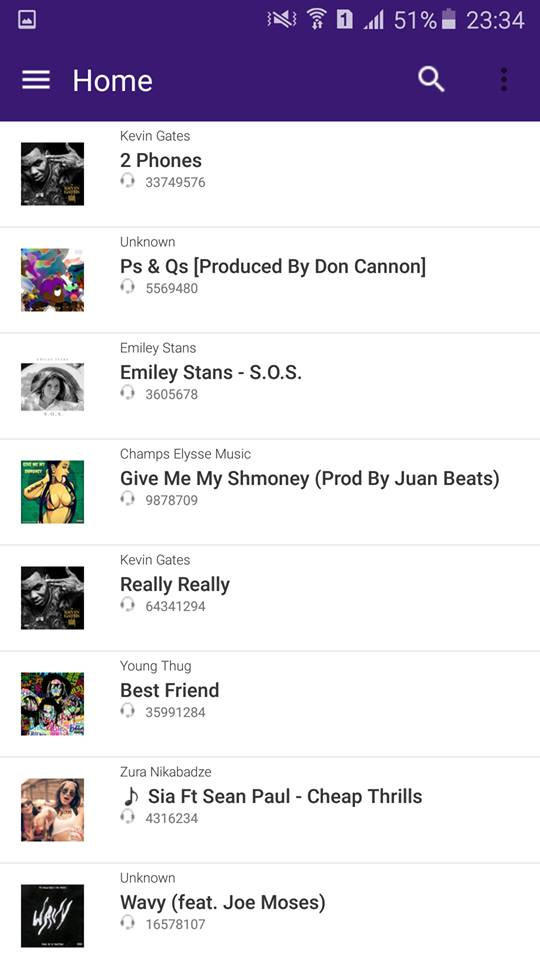

# Xamarin.Android: SoundCloud Application
## Requires
- Visual Studio 2015
## License
- MIT
## Technologies
- C#
- ASP.NET
- Windows Forms
- WPF
- Microsoft Azure
- XAML
- .NET Framework
- .NET Framework 4.0
- Windows Phone
- C# Language
- Visual C#
## Topics
- C#
- JSON
- Windows Forms
- Architecture and Design
- Microsoft Azure
- Data Access
- XAML
- SharePoint
- MVVM
- Image
- C# Language Features
- Sharepoint 2010 101 code samples
- Audio and video
- Windows web services
- User Experience
- Windows Store app
- data and storage
- universal app
- Xamarin/Android
## Updated
- 06/02/2016
## Description

<h1 id="about-soundcloud" class="staticContent">I have tested on samsung galaxy a6</h1>
<h1 class="staticContent">About SoundCloud</h1>

SoundCloud is the world&rsquo;s leading social sound platform where anyone can create sounds and share them everywhere.

Recording and uploading sounds to SoundCloud lets people easily share them privately with their friends or publicly to blogs, sites and social networks.

It takes just a click to share sounds to Twitter, Tumblr, Facebook and Foursquare.

SoundCloud can be accessed anywhere using the official iPhone and Android apps, as well as hundreds of creation and sharing apps built on the SoundCloud platform.

Don't have a free account yet?

<a class="sc-button x_x_x_sc-button-large x_x_x_sc-button-cta x_x_x_staticContent" href="https://soundcloud.com/signup">Create Account</a>

<h3 id="connect-with-us" class="staticContent">Connect With Us</h3>

For the latest news, follow us on:

<ul class="staticContent x_x_x_sc-list-bullet">
<li class="staticContent"><a class="staticContent" href="http://www.facebook.com/soundcloud">Facebook</a>
</li><li class="staticContent"><a class="staticContent" href="http://twitter.com/soundcloud">Twitter</a>
</li><li class="staticContent"><a class="staticContent" href="http://soundcloud.tumblr.com/">Tumblr</a>
</li></ul>

<h3 id="community-guidelines" class="staticContent">Community Guidelines</h3>

Guidelines for our community of original sound creators.

<ul class="staticContent x_x_x_sc-list-bullet">
<li class="staticContent"><a class="staticContent" href="https://soundcloud.com/community-guidelines">Community Guidelines</a>
</li></ul>

<h3 id="contact" class="staticContent">Contact</h3>

Visit our&nbsp;<a class="staticContent" href="http://help.soundcloud.com/">help pages</a>&nbsp;for support and answers to sales &amp; billing questions.

Use the email links below to contact us for related enquiries.

<ul class="staticContent x_x_x_sc-list-bullet">
<li class="staticContent"><a class="staticContent" href="http://developers.soundcloud.com/discussion">API &amp; Partnership</a>
</li><li class="staticContent"><a class="staticContent" href="mailto:contact@soundcloud.com">General Inquiries</a>
</li><li class="staticContent"><a class="staticContent" href="http://soundcloud.com/press">Press Inquiries</a>
</li></ul>

<h3 id="jobs" class="staticContent">Jobs</h3>

Join a team of people who are passionate about sharing sounds.

<ul class="staticContent x_x_x_sc-list-bullet">
<li class="staticContent"><a class="staticContent" href="http://soundcloud.com/jobs">Current Openings</a>
</li></ul>
<h2 class="blue caps-label">XAMARIN</h2>
<h1 class="asphalt-dark2">Deliver native Android, iOS, and Windows apps, using existing skills, teams, and code.</h1>

Build native apps for multiple platforms on a shared C# codebase. Use the same IDE, language, and APIs everywhere.

<ul class="checks">
<li>Native UI, native API access, and native performance </li><li>Anything you can do in Objective-C, Swift, or Java you can do in C# with Xamarin
</li><li>Ship cutting-edge apps with same-day support for new OS releases </li></ul>

&nbsp;

<ul class="staticContent x_x_x_sc-list-bullet">
</ul>

