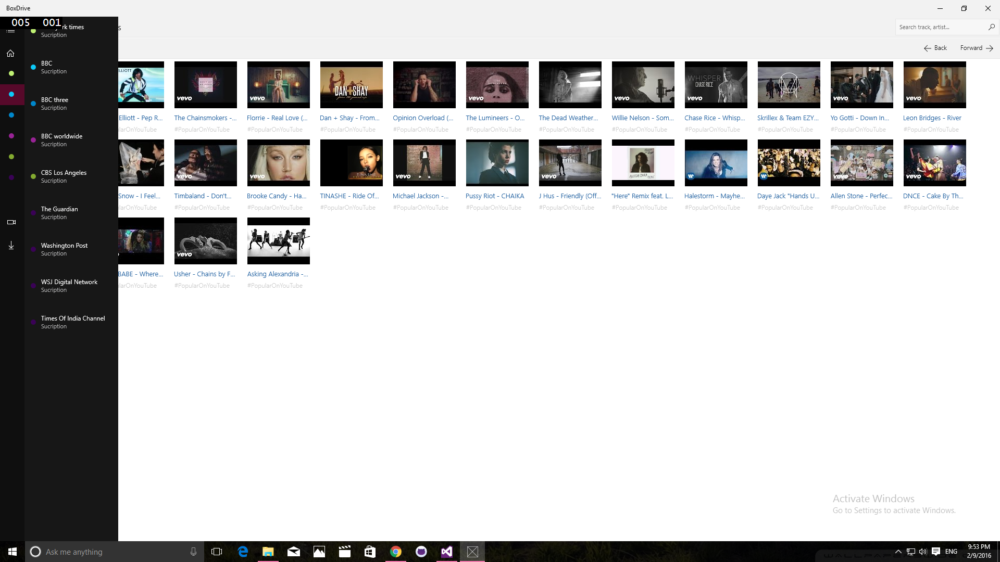

# Youtube Universal app
## Requires
- Visual Studio 2015
## License
- MIT
## Technologies
- C#
- Silverlight
- Visual Studio 2008
- LINQ
- Windows Forms
- WPF
- Microsoft Azure
- XAML
- Windows SDK
- .NET Framework
- .NET Framework 4.0
- Windows General
- Windows Phone
- Windows Runtime
- Windows 8
- Visual C#
- SharePoint Foundation 2013
- Windows Phone 8
- Windows Store app
- Windows 8.1
## Topics
- Controls
- Graphics
- C#
- Data Binding
- Asynchronous Programming
- ASP.NET
- User Interface
- Windows Forms
- WPF
- Microsoft Azure
- Data Access
- XAML
- SharePoint
- Images
- Performance
- Image manipulation
- MVVM
- Bing Maps
- Windows Phone
- Image
- .NET 4
- How to
- Numerical Computing
- Office 2010 101 code samples
- C# Language Features
- Language Samples
- Sharepoint 2010 101 code samples
- Audio and video
- Windows Store app
- universal app
## Updated
- 02/09/2016
## Description

&nbsp;

<strong>YouTube</strong>&nbsp;is a&nbsp;<a title="Video hosting service" href="https://en.wikipedia.org/wiki/Video_hosting_service">video-sharing</a>&nbsp;<a title="Website" href="https://en.wikipedia.org/wiki/Website">website</a>&nbsp;headquartered in&nbsp;<a title="San Bruno, California" href="https://en.wikipedia.org/wiki/San_Bruno,_California">San
 Bruno, California</a>, United States. The service was created by three former&nbsp;<a title="PayPal" href="https://en.wikipedia.org/wiki/PayPal">PayPal</a>&nbsp;employees in February 2005. In November 2006, it was bought by&nbsp;<a title="Google" href="https://en.wikipedia.org/wiki/Google">Google</a>for
 US$1.65 billion.<a href="https://en.wikipedia.org/wiki/YouTube#cite_note-4">[4]</a>&nbsp;YouTube now operates as one of Google's&nbsp;<a title="Subsidiary" href="https://en.wikipedia.org/wiki/Subsidiary">subsidiaries</a>.<a href="https://en.wikipedia.org/wiki/YouTube#cite_note-5">[5]</a>&nbsp;The
 site allows users to upload, view, rate, share and comment on videos, and it makes use of&nbsp;<a title="WebM" href="https://en.wikipedia.org/wiki/WebM">WebM</a>,&nbsp;<a title="H.264/MPEG-4 AVC" href="https://en.wikipedia.org/wiki/H.264/MPEG-4_AVC">H.264/MPEG-4
 AVC</a>, and&nbsp;<a title="Adobe Systems" href="https://en.wikipedia.org/wiki/Adobe_Systems">Adobe</a><a title="Flash Video" href="https://en.wikipedia.org/wiki/Flash_Video">Flash Video</a>&nbsp;technology to display a wide variety of&nbsp;<a title="User-generated content" href="https://en.wikipedia.org/wiki/User-generated_content">user-generated</a>&nbsp;and&nbsp;<a title="Corporate media" href="https://en.wikipedia.org/wiki/Corporate_media">corporate
 media</a>&nbsp;video. Available content includes&nbsp;<a title="Video clip" href="https://en.wikipedia.org/wiki/Video_clip">video clips</a>, TV clips,&nbsp;<a title="Music video" href="https://en.wikipedia.org/wiki/Music_video">music videos</a>,&nbsp;<a title="Trailer (promotion)" href="https://en.wikipedia.org/wiki/Trailer_(promotion)">movie
 trailers</a>&nbsp;and other content such as&nbsp;<a title="Video blog" href="https://en.wikipedia.org/wiki/Video_blog">video blogging</a>, short original videos, and educational videos.

Most of the content on YouTube has been uploaded by individuals, but media corporations including&nbsp;<a title="CBS" href="https://en.wikipedia.org/wiki/CBS">CBS</a>, the&nbsp;<a title="BBC" href="https://en.wikipedia.org/wiki/BBC">BBC</a>,&nbsp;<a title="Vevo" href="https://en.wikipedia.org/wiki/Vevo">Vevo</a>,&nbsp;<a title="Hulu" href="https://en.wikipedia.org/wiki/Hulu">Hulu</a>,
 and other organizations offer some of their material via YouTube, as part of the YouTube partnership program.<a href="https://en.wikipedia.org/wiki/YouTube#cite_note-6">[6]</a>&nbsp;Unregistered users can watch
 videos, and registered users can upload videos to their channels. Videos considered to contain potentially offensive content are available only to registered users affirming themselves to be at least 18 years old.

<h1></h1>

YouTube was founded by&nbsp;<a title="Chad Hurley" href="https://en.wikipedia.org/wiki/Chad_Hurley">Chad Hurley</a>,&nbsp;<a title="Steve Chen" href="https://en.wikipedia.org/wiki/Steve_Chen">Steve Chen</a>, and&nbsp;<a title="Jawed Karim" href="https://en.wikipedia.org/wiki/Jawed_Karim">Jawed
 Karim</a>, who were all early employees of&nbsp;<a title="PayPal" href="https://en.wikipedia.org/wiki/PayPal">PayPal</a>.<a href="https://en.wikipedia.org/wiki/YouTube#cite_note-usatoday-7">[7]</a>&nbsp;Hurley
 had studied design at&nbsp;<a title="Indiana University of Pennsylvania" href="https://en.wikipedia.org/wiki/Indiana_University_of_Pennsylvania">Indiana University of Pennsylvania</a>, and Chen and Karim studied<a title="Computer science" href="https://en.wikipedia.org/wiki/Computer_science">computer
 science</a>&nbsp;together at the&nbsp;<a class="mw-redirect" title="University of Illinois at Urbana-Champaign" href="https://en.wikipedia.org/wiki/University_of_Illinois_at_Urbana-Champaign">University of Illinois at Urbana-Champaign</a>.<a href="https://en.wikipedia.org/wiki/YouTube#cite_note-8">[8]</a>

According to a story that has often been repeated in the media, Hurley and Chen developed the idea for YouTube during the early months of 2005, after they had experienced difficulty sharing videos that had been shot at a dinner party at Chen's apartment
 in San Francisco. Karim did not attend the party and denied that it had occurred, but Chen commented that the idea that YouTube was founded after a dinner party &quot;was probably very strengthened by marketing ideas around creating a story that was very digestible&quot;.<a href="https://en.wikipedia.org/wiki/YouTube#cite_note-time-9">[9]</a>

Karim said the inspiration for YouTube first came from&nbsp;<a title="Janet Jackson" href="https://en.wikipedia.org/wiki/Janet_Jackson">Janet Jackson</a>'s role in the 2004&nbsp;<a title="Super Bowl XXXVIII halftime show controversy" href="https://en.wikipedia.org/wiki/Super_Bowl_XXXVIII_halftime_show_controversy">Super
 Bowl incident</a>, when her breast was exposed during her performance, and later from the&nbsp;<a title="2004 Indian Ocean earthquake and tsunami" href="https://en.wikipedia.org/wiki/2004_Indian_Ocean_earthquake_and_tsunami">2004 Indian Ocean tsunami</a>.
 Karim could not easily find video clips of either event online, which led to the idea of a video sharing site.<a href="https://en.wikipedia.org/wiki/YouTube#cite_note-10">[10]</a>&nbsp;Hurley and Chen said
 that the original idea for YouTube was a video version of an&nbsp;<a title="Online dating service" href="https://en.wikipedia.org/wiki/Online_dating_service">online dating service</a>, and had been influenced by the website&nbsp;<a title="Hot or Not" href="https://en.wikipedia.org/wiki/Hot_or_Not">Hot
 or Not</a>.<a href="https://en.wikipedia.org/wiki/YouTube#cite_note-11">[11]</a><a href="https://en.wikipedia.org/wiki/YouTube#cite_note-12">[12]</a>

YouTube began as a venture-funded technology startup, primarily from a $11.5 million investment by&nbsp;<a title="Sequoia Capital" href="https://en.wikipedia.org/wiki/Sequoia_Capital">Sequoia Capital</a>&nbsp;between November 2005 and April 2006.<a href="https://en.wikipedia.org/wiki/YouTube#cite_note-13">[13]</a>&nbsp;YouTube's
 early headquarters were situated above a pizzeria and Japanese restaurant in&nbsp;<a title="San Mateo, California" href="https://en.wikipedia.org/wiki/San_Mateo,_California">San Mateo, California</a>.<a href="https://en.wikipedia.org/wiki/YouTube#cite_note-14">[14]</a>&nbsp;The&nbsp;<a title="Domain name" href="https://en.wikipedia.org/wiki/Domain_name">domain
 name</a>&nbsp;<code>www.youtube.com</code>&nbsp;was activated on February 15, 2005, and the website was developed over the subsequent months.<a href="https://en.wikipedia.org/wiki/YouTube#cite_note-15">[15]</a>

The first YouTube video, titled&nbsp;<em><a title="Me at the zoo" href="https://en.wikipedia.org/wiki/Me_at_the_zoo">Me at the zoo</a></em>, shows co-founder Jawed Karim at the&nbsp;<a title="San Diego Zoo" href="https://en.wikipedia.org/wiki/San_Diego_Zoo">San
 Diego Zoo</a>.<a href="https://en.wikipedia.org/wiki/YouTube#cite_note-16">[16]</a>&nbsp;The video was uploaded on April 23, 2005, and can still be viewed on the site.<a href="https://en.wikipedia.org/wiki/YouTube#cite_note-17">[17]</a>

YouTube offered the public a&nbsp;<a class="mw-redirect" title="Beta test" href="https://en.wikipedia.org/wiki/Beta_test">beta test</a>&nbsp;of the site in May 2005. The first video to reach one million views was a&nbsp;<a title="Nike, Inc." href="https://en.wikipedia.org/wiki/Nike,_Inc.">Nike</a>&nbsp;advertisement
 featuring&nbsp;<a title="Ronaldinho" href="https://en.wikipedia.org/wiki/Ronaldinho">Ronaldinho</a>&nbsp;in September 2005. Following a $3.5 million investment from&nbsp;<a title="Sequoia Capital" href="https://en.wikipedia.org/wiki/Sequoia_Capital">Sequoia
 Capital</a>&nbsp;in November, the site launched officially on December 15, 2005, by which time the site was receiving 8 million views a day.<a href="https://en.wikipedia.org/wiki/YouTube#cite_note-18">[18]</a><a href="https://en.wikipedia.org/wiki/YouTube#cite_note-19">[19]</a>&nbsp;The
 site grew rapidly, and in July 2006 the company announced that more than 65,000 new videos were being uploaded every day, and that the site was receiving 100 million video views per day.<a href="https://en.wikipedia.org/wiki/YouTube#cite_note-20">[20]</a>&nbsp;According
 to data published by&nbsp;<a title="Market research" href="https://en.wikipedia.org/wiki/Market_research">market research</a>&nbsp;company&nbsp;<a title="ComScore" href="https://en.wikipedia.org/wiki/ComScore">comScore</a>, YouTube is the dominant provider
 of online video in the United States, with a&nbsp;<a title="Market share" href="https://en.wikipedia.org/wiki/Market_share">market share</a>&nbsp;of around 43% and more than 14 billion views of videos in May 2010.<a href="https://en.wikipedia.org/wiki/YouTube#cite_note-21">[21]</a>

In 2014 YouTube said that 300 hours of new videos were uploaded to the site every minute,<a href="https://en.wikipedia.org/wiki/YouTube#cite_note-22">[22]</a>&nbsp;three times more than one year earlier<a href="https://en.wikipedia.org/wiki/YouTube#cite_note-23">[23]</a>&nbsp;and
 that around three quarters of the material comes from outside the U.S.<a href="https://en.wikipedia.org/wiki/YouTube#cite_note-60_hours-24">[24]</a><a href="https://en.wikipedia.org/wiki/YouTube#cite_note-48_hours-25">[25]</a><a href="https://en.wikipedia.org/wiki/YouTube#cite_note-26">[26]</a>&nbsp;The
 site has 800 million unique users a month.<a href="https://en.wikipedia.org/wiki/YouTube#cite_note-seabrook20120116-27">[27]</a>&nbsp;It is estimated that in 2007 YouTube consumed as much&nbsp;<a title="Bandwidth (computing)" href="https://en.wikipedia.org/wiki/Bandwidth_(computing)">bandwidth</a>&nbsp;as
 the entire&nbsp;<a title="Internet" href="https://en.wikipedia.org/wiki/Internet">Internet</a>&nbsp;in 2000.<a href="https://en.wikipedia.org/wiki/YouTube#cite_note-28">[28]</a>&nbsp;According to third-party&nbsp;<a title="Web analytics" href="https://en.wikipedia.org/wiki/Web_analytics">web
 analytics</a>&nbsp;providers,&nbsp;<a title="Alexa Internet" href="https://en.wikipedia.org/wiki/Alexa_Internet">Alexa</a>&nbsp;and&nbsp;<a title="SimilarWeb" href="https://en.wikipedia.org/wiki/SimilarWeb">SimilarWeb</a>, YouTube is the third most visited
 website in the world, as of June 2015; SimilarWeb also lists YouTube as the top TV and video website globally, attracting more than 15 billion visitors per month.<a href="https://en.wikipedia.org/wiki/YouTube#cite_note-alexa-3">[3]</a><a href="https://en.wikipedia.org/wiki/YouTube#cite_note-similar-29">[29]</a><a href="https://en.wikipedia.org/wiki/YouTube#cite_note-30">[30]</a>

The choice of the name&nbsp;<code>www.youtube.com</code>&nbsp;led to problems for a similarly named website,&nbsp;<code>www.utube.com</code>. The site's owner,&nbsp;<a title="Universal Tube & Rollform Equipment" href="https://en.wikipedia.org/wiki/Universal_Tube_%26_Rollform_Equipment">Universal
 Tube &amp; Rollform Equipment</a>, filed a lawsuit against YouTube in November 2006 after being regularly overloaded by people looking for YouTube. Universal Tube has since changed the name of its website to&nbsp;<code>www.utubeonline.com</code>.<a href="https://en.wikipedia.org/wiki/YouTube#cite_note-31">[31]</a><a href="https://en.wikipedia.org/wiki/YouTube#cite_note-32">[32]</a>

In October 2006,&nbsp;<a title="Google" href="https://en.wikipedia.org/wiki/Google">Google Inc.</a>&nbsp;announced that it had acquired YouTube for $1.65 billion in Google&nbsp;<a title="Stock" href="https://en.wikipedia.org/wiki/Stock">stock</a>, and the
 deal was finalized on November 13, 2006.<a href="https://en.wikipedia.org/wiki/YouTube#cite_note-33">[33]</a>

Google does not provide detailed figures for YouTube's running costs, and YouTube's revenues in 2007 were noted as &quot;<a title="Materiality (auditing)" href="https://en.wikipedia.org/wiki/Materiality_(auditing)">not material</a>&quot; in a regulatory filing.<a href="https://en.wikipedia.org/wiki/YouTube#cite_note-Moneyclip-34">[34]</a>&nbsp;In
 June 2008, a&nbsp;<em><a title="Forbes" href="https://en.wikipedia.org/wiki/Forbes">Forbes</a></em>&nbsp;magazine article projected the 2008 revenue at $200 million, noting progress in advertising sales.<a href="https://en.wikipedia.org/wiki/YouTube#cite_note-Forbes08-35">[35]</a>&nbsp;In
 January 2012, it was estimated that visitors to YouTube spent an average of 15 minutes a day on the site, in contrast to the four or five hours a day spent by a typical U.S. citizen watching television.<a href="https://en.wikipedia.org/wiki/YouTube#cite_note-seabrook20120116-27">[27]</a>

YouTube entered into a marketing and advertising partnership with&nbsp;<a title="NBC" href="https://en.wikipedia.org/wiki/NBC">NBC</a>&nbsp;in June 2006.<a href="https://en.wikipedia.org/wiki/YouTube#cite_note-36">[36]</a>&nbsp;In
 November 2008, YouTube reached an agreement with&nbsp;<a title="Metro-Goldwyn-Mayer" href="https://en.wikipedia.org/wiki/Metro-Goldwyn-Mayer">MGM</a>,&nbsp;<a title="Lions Gate Entertainment" href="https://en.wikipedia.org/wiki/Lions_Gate_Entertainment">Lions
 Gate Entertainment</a>, and&nbsp;<a title="CBS" href="https://en.wikipedia.org/wiki/CBS">CBS</a>, allowing the companies to post full-length films and television episodes on the site, accompanied by advertisements in a section for US viewers called &quot;Shows&quot;.
 The move was intended to create competition with websites such as&nbsp;<a title="Hulu" href="https://en.wikipedia.org/wiki/Hulu">Hulu</a>, which features material from&nbsp;<a title="NBC" href="https://en.wikipedia.org/wiki/NBC">NBC</a>,&nbsp;<a title="Fox Broadcasting Company" href="https://en.wikipedia.org/wiki/Fox_Broadcasting_Company">Fox</a>,
 and&nbsp;<a title="Walt Disney Studios Motion Pictures" href="https://en.wikipedia.org/wiki/Walt_Disney_Studios_Motion_Pictures">Disney</a>.<a href="https://en.wikipedia.org/wiki/YouTube#cite_note-37">[37]</a><a href="https://en.wikipedia.org/wiki/YouTube#cite_note-38">[38]</a>&nbsp;In
 November 2009, YouTube launched a version of &quot;Shows&quot; available to UK viewers, offering around 4,000 full-length shows from more than 60 partners.<a href="https://en.wikipedia.org/wiki/YouTube#cite_note-39">[39]</a>&nbsp;In
 January 2010, YouTube introduced an online film rentals service,<a href="https://en.wikipedia.org/wiki/YouTube#cite_note-40">[40]</a>&nbsp;which is available only to users in the US, Canada and the UK as of
 2010.<a href="https://en.wikipedia.org/wiki/YouTube#cite_note-41">[41]</a><a href="https://en.wikipedia.org/wiki/YouTube#cite_note-42">[42]</a>&nbsp;The service
 offers over 6,000 films.<a href="https://en.wikipedia.org/wiki/YouTube#cite_note-43">[43]</a>

YouTube's headquarters as of 2010 in<a title="San Bruno, California" href="https://en.wikipedia.org/wiki/San_Bruno,_California">San Bruno</a>, California.

In March 2010, YouTube began free streaming of certain content, including 60 cricket matches of the&nbsp;<a title="Indian Premier League" href="https://en.wikipedia.org/wiki/Indian_Premier_League">Indian Premier League</a>. According to YouTube, this was
 the first worldwide free online broadcast of a major sporting event.<a href="https://en.wikipedia.org/wiki/YouTube#cite_note-44">[44]</a>

On March 31, 2010, the YouTube website launched a new design, with the aim of simplifying the interface and increasing the time users spend on the site. Google product manager Shiva Rajaraman commented: &quot;We really felt like we needed to step back and remove
 the clutter.&quot;<a href="https://en.wikipedia.org/wiki/YouTube#cite_note-45">[45]</a>&nbsp;In May 2010, it was reported that YouTube was serving more than two billion videos a day, which it described as &quot;nearly
 double the prime-time audience of all three major US television networks combined&quot;.<a href="https://en.wikipedia.org/wiki/YouTube#cite_note-46">[46]</a>&nbsp;In May 2011, YouTube reported in its company blog
 that the site was receiving more than three billion views per day.<a href="https://en.wikipedia.org/wiki/YouTube#cite_note-48_hours-25">[25]</a>&nbsp;In January 2012, YouTube stated that the figure
 had increased to four billion videos streamed per day.<a href="https://en.wikipedia.org/wiki/YouTube#cite_note-60_hours-24">[24]</a>

In October 2010, Hurley announced that he would be stepping down as chief executive officer of YouTube to take an advisory role, and that&nbsp;<a title="Salar Kamangar" href="https://en.wikipedia.org/wiki/Salar_Kamangar">Salar Kamangar</a>&nbsp;would take
 over as head of the company.<a href="https://en.wikipedia.org/wiki/YouTube#cite_note-47">[47]</a>

In April 2011, James Zern, a YouTube software engineer, revealed that 30% of videos accounted for 99% of views on the site.<a href="https://en.wikipedia.org/wiki/YouTube#cite_note-48">[48]</a>

In November 2011, the&nbsp;<a title="Google&#43;" href="https://en.wikipedia.org/wiki/Google%2B">Google&#43;</a>&nbsp;social networking site was integrated directly with YouTube and the&nbsp;<a title="Google Chrome" href="https://en.wikipedia.org/wiki/Google_Chrome">Chrome</a>&nbsp;web
 browser, allowing YouTube videos to be viewed from within the Google&#43; interface.<a href="https://en.wikipedia.org/wiki/YouTube#cite_note-49">[49]</a>

In December 2011, YouTube launched a new version of the site interface, with the video channels displayed in a central column on the home page, similar to the news feeds of&nbsp;<a class="mw-redirect" title="Social networking" href="https://en.wikipedia.org/wiki/Social_networking">social
 networking</a>&nbsp;sites.<a href="https://en.wikipedia.org/wiki/YouTube#cite_note-50">[50]</a>&nbsp;At the same time, a new version of the YouTube logo was introduced with a darker shade of red, the first
 change in design since October 2006.<a href="https://en.wikipedia.org/wiki/YouTube#cite_note-51">[51]</a>

In May 2013, YouTube launched a pilot program to begin offering some content providers the ability to charge $0.99 per month or more for certain channels, but the vast majority of its videos would remain free to view.<a href="https://en.wikipedia.org/wiki/YouTube#cite_note-subscription-52">[52]</a><a href="https://en.wikipedia.org/wiki/YouTube#cite_note-53">[53]</a>

In February 2015, YouTube announced the launch of a new app specifically for use by children visiting the site, called YouTube Kids. It allows parental controls and restrictions on who can upload content, and is available for both&nbsp;<a title="Android (operating system)" href="https://en.wikipedia.org/wiki/Android_(operating_system)">Android</a>&nbsp;and&nbsp;<a title="IOS" href="https://en.wikipedia.org/wiki/IOS">iOS</a>&nbsp;devices.<a href="https://en.wikipedia.org/wiki/YouTube#cite_note-54">[54]</a>&nbsp;Later
 on August 26, 2015, YouTube Gaming was launched, a platform for&nbsp;<a title="Video game" href="https://en.wikipedia.org/wiki/Video_game">video gaming</a>&nbsp;enthusiasts intended to compete with&nbsp;<a title="Twitch.tv" href="https://en.wikipedia.org/wiki/Twitch.tv">Twitch.tv</a>.<a href="https://en.wikipedia.org/wiki/YouTube#cite_note-55">[55]</a>&nbsp;2015
 also saw the announcement of a premium YouTube service titled YouTube Red, which provides users with both ad-free content as well as the ability to download videos among other features.<a href="https://en.wikipedia.org/wiki/YouTube#cite_note-Youtubered-56">[56]</a>

On August 10, 2015, Google announced that it was creating a new company,&nbsp;<a title="Alphabet Inc." href="https://en.wikipedia.org/wiki/Alphabet_Inc.">Alphabet</a>, to act as the&nbsp;<a title="Holding company" href="https://en.wikipedia.org/wiki/Holding_company">holding
 company</a>&nbsp;for Google, with the change in financial reporting to begin in the fourth quarter of 2015. YouTube remains as a subsidiary of Google.<a href="https://en.wikipedia.org/wiki/YouTube#cite_note-57">[57]</a>

In January 2016, YouTube expanded its headquarters in San Bruno by purchasing an office park for $215 million. The complex has 554,000 square feet of space and can house up to 2,800 employees.<a href="https://en.wikipedia.org/wiki/YouTube#cite_note-office_park-58">[58]</a>

<h2>Features</h2>
