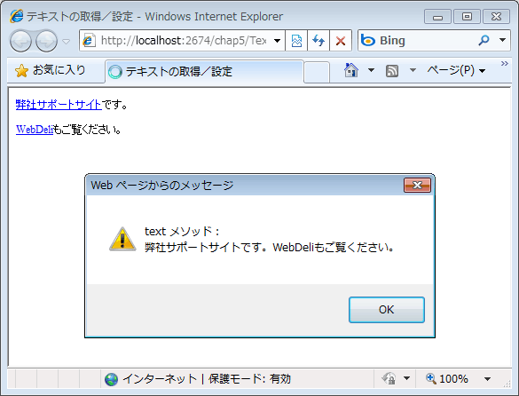
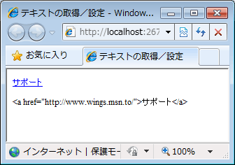

# text メソッドと html メソッドを使って要素配下のテキストを取得/設定する
## Requires
- 
## License
- Apache License, Version 2.0
## Technologies
- Visual Studio 2010
- jQuery 1.4.4
## Topics
- 逆引きサンプル コード
- jQuery
## Updated
- 02/06/2011
## Description

執筆者: <a href="http://msdn.microsoft.com/ja-jp/gg585574#yamada" target="_blank">
有限会社 WINGS プロジェクト 山田 祥寛</a>

動作確認環境: Visual Studio 2010、jQuery 1.4.4

要素配下のテキストを取得/設定するためのメソッドとして、jQuery には text、html という 2 つのメソッドが用意されています。これらのメソッドは一見&#20284;ていますが、いくつかの違いがあります。以下では、具体的なサンプルを通じて、両メソッドの用法と共に、両者の挙動の違いを確認します。

HTML

Edit Script

html
<pre class="hidden">&lt;div id=&quot;article&quot;&gt;
  &lt;p&gt;&lt;a href=&quot;http://www.wings.msn.to/&quot;&gt;弊社サポートサイト&lt;/a&gt;です。&lt;/p&gt;
  &lt;p&gt;&lt;a href=&quot;http://www.web-deli.com/&quot;&gt;WebDeli&lt;/a&gt;もご覧ください。&lt;/p&gt;
&lt;/div&gt;

&lt;script src=&quot;../Scripts/jquery-1.4.4.min.js&quot; type=&quot;text/javascript&quot;&gt;&lt;/script&gt;
&lt;script type=&quot;text/javascript&quot;&gt;
 // id 属性が &quot;article&quot; である要素の配下にある &lt;p&gt; 要素のテキストを取得
window.alert('html メソッド：\r' &#43; $('#article p').html());
window.alert('text メソッド：\r' &#43; $('#article p').text());
&lt;/script&gt;</pre>
<pre id="codePreview" class="xml">&lt;div&nbsp;id=&quot;article&quot;&gt;&nbsp;
&nbsp;&nbsp;&lt;p&gt;&lt;a&nbsp;href=&quot;http://www.wings.msn.to/&quot;&gt;弊社サポートサイト&lt;/a&gt;です。&lt;/p&gt;&nbsp;
&nbsp;&nbsp;&lt;p&gt;&lt;a&nbsp;href=&quot;http://www.web-deli.com/&quot;&gt;WebDeli&lt;/a&gt;もご覧ください。&lt;/p&gt;&nbsp;
&lt;/div&gt;&nbsp;
&nbsp;
&lt;script&nbsp;src=&quot;../Scripts/jquery-1.4.4.min.js&quot;&nbsp;type=&quot;text/javascript&quot;&gt;&lt;/script&gt;&nbsp;
&lt;script&nbsp;type=&quot;text/javascript&quot;&gt;&nbsp;
&nbsp;//&nbsp;id&nbsp;属性が&nbsp;&quot;article&quot;&nbsp;である要素の配下にある&nbsp;&lt;p&gt;&nbsp;要素のテキストを取得&nbsp;
window.alert('html&nbsp;メソッド：\r'&nbsp;&#43;&nbsp;$('#article&nbsp;p').html());&nbsp;
window.alert('text&nbsp;メソッド：\r'&nbsp;&#43;&nbsp;$('#article&nbsp;p').text());&nbsp;
&lt;/script&gt;&nbsp;
&nbsp;
</pre>

上の結果を見ても分かるように、

<ul style="margin-top:0">
<li>html メソッドでは複数の要素にマッチしても最初の 1 つしか返さないが、text メソッドはすべてのテキストを結合したものを返す </li><li>html メソッドは HTML 文字列を返すが、text メソッドはテキスト部分のみを取得する </li></ul>

などの違いがあります (*)。

*) 本稿では扱っていませんが、その他、text メソッドは HTML/XML 文書を処理できるのに対して、html メソッドでは HTML (XHTML 文書を含む) しか処理できないという違いもあります。 
 
続いて、html/text メソッドでテキストを設定してみましょう。

HTML

{#scriptcode_dlg.edit_script}

html
<pre class="hidden">&lt;div id=&quot;article&quot;&gt;
  &lt;p&gt;&lt;/p&gt;
  &lt;p&gt;&lt;/p&gt;
&lt;/div&gt;

&lt;script src=&quot;../Scripts/jquery-1.4.4.min.js&quot; type=&quot;text/javascript&quot;&gt;&lt;/script&gt;
&lt;script type=&quot;text/javascript&quot;&gt;
// &lt;p&gt; 要素に対して、それぞれ html、text メソッドで HTML 文字列を設定
$('#article p:first').html('&lt;a href=&quot;http://www.wings.msn.to/&quot;&gt;サポート&lt;/a&gt;');
$('#article p:last').text('&lt;a href=&quot;http://www.wings.msn.to/&quot;&gt;サポート&lt;/a&gt;');
&lt;/script&gt;</pre>
<pre id="codePreview" class="html">&lt;div&nbsp;id=&quot;article&quot;&gt;&nbsp; &nbsp;&nbsp;&lt;p&gt;&lt;/p&gt;&nbsp; &nbsp;&nbsp;&lt;p&gt;&lt;/p&gt;&nbsp; &lt;/div&gt;&nbsp; &nbsp; &lt;script&nbsp;src=&quot;../Scripts/jquery-1.4.4.min.js&quot;&nbsp;type=&quot;text/javascript&quot;&gt;&lt;/script&gt;&nbsp; &lt;script&nbsp;type=&quot;text/javascript&quot;&gt;&nbsp; //&nbsp;&lt;p&gt;&nbsp;要素に対して、それぞれ&nbsp;html、text&nbsp;メソッドで&nbsp;HTML&nbsp;文字列を設定&nbsp; $('#article&nbsp;p:first').html('&lt;a&nbsp;href=&quot;http://www.wings.msn.to/&quot;&gt;サポート&lt;/a&gt;');&nbsp; $('#article&nbsp;p:last').text('&lt;a&nbsp;href=&quot;http://www.wings.msn.to/&quot;&gt;サポート&lt;/a&gt;');&nbsp; &lt;/script&gt;&nbsp; &nbsp; </pre>

html メソッドが HTML 文字列をそのままセットしているのに対して、text メソッドでは HTML 文字列をエスケープ処理したものをセットしています (その結果、タグがそのまま表示されています)。 
 
なお、テキストの取得時には text/html メソッドですべての要素を取得するか、最初の要素のみを取得するかという違いがありましたが、設定時にはこうした違いはありません。いずれも合致するすべての要素に対してテキストを設定します。

<table>
<tbody>
<tr>
<td></td>
<td></td>
<td>
<ul>
<li>もっと他のコンテンツを見る &gt;&gt; <a href="http://msdn.microsoft.com/ja-jp/ff363212">逆引きサンプル コード一覧へ</a>
</li><li>もっと他のレシピを見る &gt;&gt; <a href="http://msdn.microsoft.com/ja-jp/samplecode.recipe">
Code Recipe へ</a> </li><li>もっと ASP.Net の情報を見る &gt;&gt; <a href="http://msdn.microsoft.com/ja-jp/asp.net">
ASP.Net デベロッパーセンターへ</a> </li></ul>
</td>
</tr>
</tbody>
</table>

<a href="#top">ページのトップへ</a>

